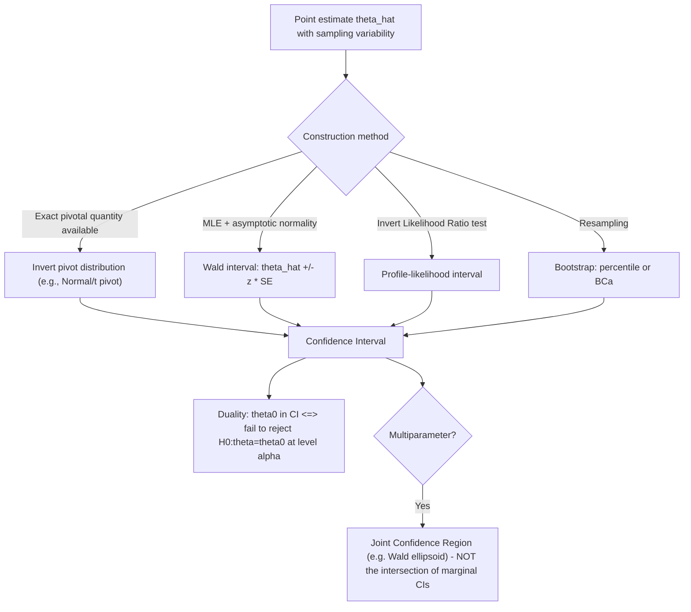

## Confidence intervals and confidence sets

### Overview

A confidence interval (or, for multiparameter settings, a confidence set) is a data-derived range of plausible values for an unknown parameter, constructed so that a specified proportion of such intervals — computed the same way across hypothetical repeated sampling — would contain the true parameter value. Confidence intervals complement point estimates by directly conveying estimation uncertainty and are duality-linked to hypothesis testing: every confidence set corresponds to a family of hypothesis tests, and vice versa.

### Formal Definition

A $100(1-\alpha)\%$ **confidence interval** for $\theta$ is a random interval $[L(X), U(X)]$, constructed as a function of the data, satisfying:

$$P_\theta\big(L(X) \leq \theta \leq U(X)\big) = 1-\alpha \quad \text{for all } \theta$$

**The critical frequentist interpretation**: The probability statement refers to the **randomness of the interval endpoints** $L(X)$ and $U(X)$ across hypothetical repeated sampling, **not** to the fixed, non-random true parameter $\theta$. Once data are observed and a specific numerical interval, say $[3.2, 5.8]$, is computed, it is **incorrect** to say "there is a 95% probability that $\theta$ lies in $[3.2,5.8]$" — the realized interval either does or does not contain the (fixed) true $\theta$, with no residual probability once the data are fixed. The correct interpretation is: "if this procedure were repeated across many independent samples, approximately 95% of the resulting intervals would contain the true $\theta$."

### Constructing Confidence Intervals: The Pivotal Quantity Method

A **pivotal quantity** is a function of both the data and the parameter, $Q(X,\theta)$, whose sampling distribution does **not depend on** $\theta$ (or any other unknown parameter). Given a pivot, an interval is constructed by inverting a probability statement about $Q$.

**Worked Example: Normal mean, $\sigma^2$ known**

For $X_1,\dots,X_n \overset{iid}{\sim} N(\mu,\sigma^2)$, the standardized quantity

$$Z = \frac{\bar X - \mu}{\sigma/\sqrt n} \sim N(0,1)$$

is pivotal (its distribution doesn't depend on $\mu$). Since $P(-z_{\alpha/2} \leq Z \leq z_{\alpha/2}) = 1-\alpha$, substituting and rearranging the inequality to isolate $\mu$ gives:

$$\bar X - z_{\alpha/2}\frac{\sigma}{\sqrt n} \leq \mu \leq \bar X + z_{\alpha/2}\frac{\sigma}{\sqrt n}$$

yielding the familiar interval $\bar X \pm z_{\alpha/2}\cdot\sigma/\sqrt n$.

**Normal mean, $\sigma^2$ unknown**: Replacing $\sigma$ with the sample standard deviation $S$ changes the pivot's distribution from Normal to Student's $t$ with $n-1$ degrees of freedom: $T = \frac{\bar X-\mu}{S/\sqrt n} \sim t_{n-1}$, yielding $\bar X \pm t_{\alpha/2,n-1}\cdot S/\sqrt n$ — wider than the known-variance interval to account for the additional uncertainty from estimating $\sigma$.

### The Duality with Hypothesis Testing

A fundamental theorem connects confidence sets and hypothesis tests: a $100(1-\alpha)\%$ confidence set for $\theta$ can be constructed as **the set of all values $\theta_0$ that would NOT be rejected** by a level-$\alpha$ test of $H_0:\theta=\theta_0$:

$$CI(1-\alpha) = \{\theta_0 : \text{a level-}\alpha \text{ test of } H_0:\theta=\theta_0 \text{ fails to reject}\}$$

This duality means: (1) any valid level-$\alpha$ testing procedure automatically generates a valid $100(1-\alpha)\%$ confidence set by inversion, and (2) checking whether a hypothesized value $\theta_0$ falls inside a $100(1-\alpha)\%$ confidence interval is equivalent to testing $H_0:\theta=\theta_0$ at level $\alpha$ (fail to reject if $\theta_0$ is inside the interval; reject if outside).

### Asymptotic (Wald-Type) Confidence Intervals

For a general MLE $\hat\theta$ with estimated standard error $\widehat{\text{SE}}(\hat\theta)$ derived from the (inverse) Fisher information, the asymptotic normality of MLE justifies the general-purpose **Wald confidence interval**:

$$\hat\theta \pm z_{\alpha/2}\cdot \widehat{\text{SE}}(\hat\theta)$$

This construction is extremely widely used because it requires only the point estimate and its standard error, both routinely produced by standard estimation software, but it can perform poorly (having actual coverage that deviates from the nominal $1-\alpha$) in finite samples, particularly for parameters with skewed or bounded sampling distributions (e.g., variance components, or probabilities near 0 or 1).

### Profile-Likelihood-Based Confidence Intervals

As introduced under Profile and concentrated likelihood, an alternative construction inverts the Likelihood Ratio test rather than the Wald test:

$$CI = \left\{\theta_0 : 2\left[\ell(\hat\theta) - \ell_p(\theta_0)\right] \leq \chi^2_{1,1-\alpha}\right\}$$

These profile-likelihood intervals need not be symmetric around $\hat\theta$ and often exhibit better finite-sample coverage than the Wald interval, particularly when the log-likelihood is notably asymmetric around its maximum.

### Bootstrap Confidence Intervals

When the sampling distribution of $\hat\theta$ is analytically intractable or the asymptotic normal approximation is judged unreliable in finite samples, **bootstrap confidence intervals** approximate the sampling distribution of $\hat\theta$ by resampling (with replacement) from the observed data:

- **Percentile method**: Use the $\alpha/2$ and $1-\alpha/2$ empirical quantiles of the bootstrap replications $\hat\theta^{*(1)},\dots,\hat\theta^{*(B)}$ directly as the interval endpoints
- **Bias-corrected and accelerated (BCa)**: Adjusts the percentile method for bias and skewness in the bootstrap distribution, generally improving finite-sample coverage accuracy over the basic percentile method

### Multiparameter Confidence Sets

For a vector parameter $\theta \in \mathbb{R}^k$, the natural generalization of an interval is a **confidence region** (often an ellipsoid under asymptotic normality), for example based on the Wald statistic:

$$CR = \left\{\theta_0 : (\hat\theta-\theta_0)^\top \left[\widehat{\text{Var}}(\hat\theta)\right]^{-1}(\hat\theta-\theta_0) \leq \chi^2_{k,1-\alpha}\right\}$$

A common pitfall: constructing a joint confidence region for $k$ parameters by simply intersecting $k$ separate marginal (one-at-a-time) confidence intervals **does not** generally achieve the nominal $1-\alpha$ joint coverage — this is a manifestation of the multiple testing problem (see Multiple testing corrections), and simultaneous confidence regions require explicit joint construction (e.g., via the Wald ellipsoid above, or Bonferroni-adjusted marginal intervals) to achieve correct simultaneous coverage.

### Diagram: Confidence Interval Construction Approaches

### Relevance to Econometrics

Confidence intervals are routinely reported alongside (or increasingly, in place of) p-values and significance stars in applied econometric research, precisely because they directly convey the magnitude and precision of an estimated effect (e.g., a treatment effect or elasticity) rather than a binary significance decision — addressing some of the practical-versus-statistical-significance concerns discussed under p-values. Bootstrap confidence intervals, especially the wild bootstrap, are widely used in applied panel/clustered-data settings with a small number of clusters, where standard asymptotic Wald intervals based on cluster-robust standard errors can have poor finite-sample coverage.

**Related Topics**

- The Neyman-Pearson framework and the testing/confidence-set duality
- Likelihood Ratio, Wald, and Lagrange Multiplier tests
- Profile and concentrated likelihood
- Bootstrap methods and resampling-based inference
- p-values and statistical significance
- Multiple testing corrections and simultaneous confidence regions