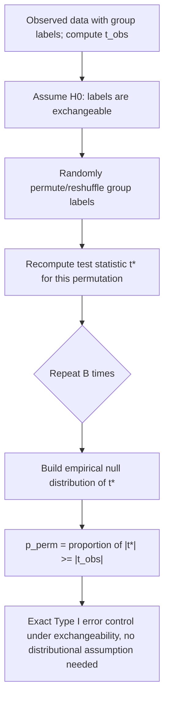

## Nonparametric and permutation tests

### Overview

Nonparametric and permutation tests provide hypothesis-testing procedures that do not rely on the sample data following a specific parametric distribution (such as Normality), instead deriving their reference (null) distribution either from the ranks of the data or from the combinatorial structure of the data itself under resampling without replacement. These methods trade some efficiency relative to correctly specified parametric tests for substantially greater robustness to distributional misspecification.

### Motivation: When Parametric Assumptions Fail

Classical parametric tests (t-tests, F-tests, z-tests) derive their exact or asymptotic null distributions from specific distributional assumptions (typically Normality of the underlying data or of the estimator via the CLT). When sample sizes are small and the underlying distribution is markedly non-Normal, heavily skewed, or contains outliers, these parametric tests can have actual Type I error rates that deviate substantially from the nominal level, and can lose considerable power relative to appropriately chosen nonparametric alternatives.

### Rank-Based (Distribution-Free) Tests

**Wilcoxon Signed-Rank Test**: A nonparametric alternative to the one-sample (or paired) t-test, testing whether the median of a distribution equals a hypothesized value (or whether paired differences have median zero). Procedure: compute the differences, rank their absolute values, sum the ranks corresponding to positive differences ($W^+$) and negative differences ($W^-$), and use $\min(W^+,W^-)$ (or a Normal approximation for larger $n$) as the test statistic. Requires only that the distribution of differences be symmetric, not Normal.

**Mann–Whitney U Test (Wilcoxon Rank-Sum Test)**: The nonparametric analogue of the independent-samples t-test, testing whether two independent samples come from the same distribution (or, under an additional shift assumption, comparing their medians/locations). Procedure: pool and rank all observations from both groups; the test statistic $U$ is based on the sum of ranks in one group relative to what would be expected under the null of no difference between groups.

**Kruskal–Wallis Test**: The nonparametric generalization of the Mann–Whitney test to more than two independent groups (analogous to a nonparametric one-way ANOVA), based on the ranks of the pooled observations across all groups.

**Spearman's Rank Correlation ($\rho$)**: A nonparametric measure of monotonic (not necessarily linear) association between two variables, computed as the Pearson correlation of the ranks rather than the raw values — robust to outliers and to nonlinear (but monotonic) relationships that would understate a Pearson correlation coefficient.

### Permutation (Randomization) Tests

**Core logic**: Under the null hypothesis of no association or no group difference, the group labels (or treatment assignments) attached to observations are, by assumption, **exchangeable** — arbitrarily reassignable without changing the joint distribution of the data. A permutation test exploits this by directly computing the test statistic's exact distribution under $H_0$ by enumerating (or randomly sampling) all possible relabelings of the data.

**Procedure** (two-sample mean-difference example):

1. Compute the observed test statistic $t_{obs}$ (e.g., the difference in group means) on the actual data
2. Randomly (or exhaustively) permute the group labels across all observations, recomputing the test statistic for each permutation
3. Repeat for a large number $B$ of permutations (or all $\binom{n}{n_1}$ possible relabelings, if computationally feasible) to build up the permutation ("null") distribution
4. The permutation p-value is the proportion of permuted statistics at least as extreme as $t_{obs}$:

$$p_{perm} = \frac{1}{B}\sum_{b=1}^B \mathbb{1}\left[\lvert t^{(b)} \rvert \geq \lvert t_{obs}\rvert\right]$$

**Key properties**: Permutation tests are **exact** (achieving precisely the nominal Type I error rate, not merely asymptotically) under the null hypothesis of exchangeability, without requiring any distributional assumption on the underlying data — the validity comes entirely from the combinatorial randomization argument, not from an assumed parametric family or asymptotic approximation.

**Fisher's Exact Test**: A classical special case of the permutation testing logic applied to $2\times 2$ contingency tables, computing the exact hypergeometric probability of observing a table at least as extreme as the observed one, conditional on the fixed marginal totals — used especially with small cell counts where the chi-squared approximation to independence testing is unreliable.

### The Bootstrap vs. the Permutation Test: A Key Distinction

Both are resampling methods, but serve different purposes and resample differently:

|  | Permutation test | Bootstrap |
| --- | --- | --- |
| Resampling scheme | Without replacement (relabeling) | With replacement |
| Primary purpose | Hypothesis testing under an exact exchangeability null | Estimating sampling distribution / constructing confidence intervals |
| Validity | Exact under $H_0$ (exchangeability) | Generally asymptotic (relies on the bootstrap principle) |
| Typical use | Testing whether two groups differ (assuming exchangeability under $H_0$) | Standard error / confidence interval estimation for a general statistic |

### Efficiency Trade-off: Asymptotic Relative Efficiency (ARE)

When the parametric assumption (e.g., Normality) actually holds, nonparametric tests are somewhat **less powerful** than their parametric counterparts (e.g., the Wilcoxon rank-sum test has an asymptotic relative efficiency of approximately $3/\pi \approx 0.955$ relative to the t-test under exact Normality — a modest efficiency loss). However, under departures from Normality (heavy tails, contamination, skewness), nonparametric tests can have **substantially higher power** than the parametric alternative, sometimes dramatically so under heavy contamination — this efficiency comparison is the standard justification for treating rank-based methods as a "robustness insurance policy" against distributional misspecification, at a typically small efficiency cost when the parametric assumption happens to be correct.

### Diagram: Permutation Test Logic

### Relevance to Econometrics

Permutation and randomization inference have become increasingly prominent in applied microeconometrics, particularly in the analysis of randomized controlled trials (RCTs) and field experiments, where the random assignment mechanism itself provides a natural, design-based justification for the exchangeability assumption underlying permutation-based (randomization) inference — an approach sometimes called "randomization inference" in this literature and viewed as requiring fewer modeling assumptions than model-based standard errors. Rank-based nonparametric tests and permutation-based inference are also commonly used as robustness checks alongside standard parametric regression results, particularly with small sample sizes (e.g., a small number of treated clusters or geographic units) where asymptotic normal-approximation-based inference is less trustworthy. [Inference] The choice between reporting permutation-based p-values versus standard cluster-robust or heteroskedasticity-robust p-values in applied experimental economics often depends on the sample size and the number of independent randomization units available, though there is no universally agreed-upon threshold in the literature for when one approach is clearly preferable to the other.

**Related Topics**

- The Neyman-Pearson framework and Type I/Type II errors
- Bootstrap methods and resampling-based confidence intervals
- Randomization inference in randomized controlled trials (RCTs)
- Cluster-robust standard errors and the wild cluster bootstrap
- Robust estimation and influence functions
- Multiple testing corrections and false discovery rate