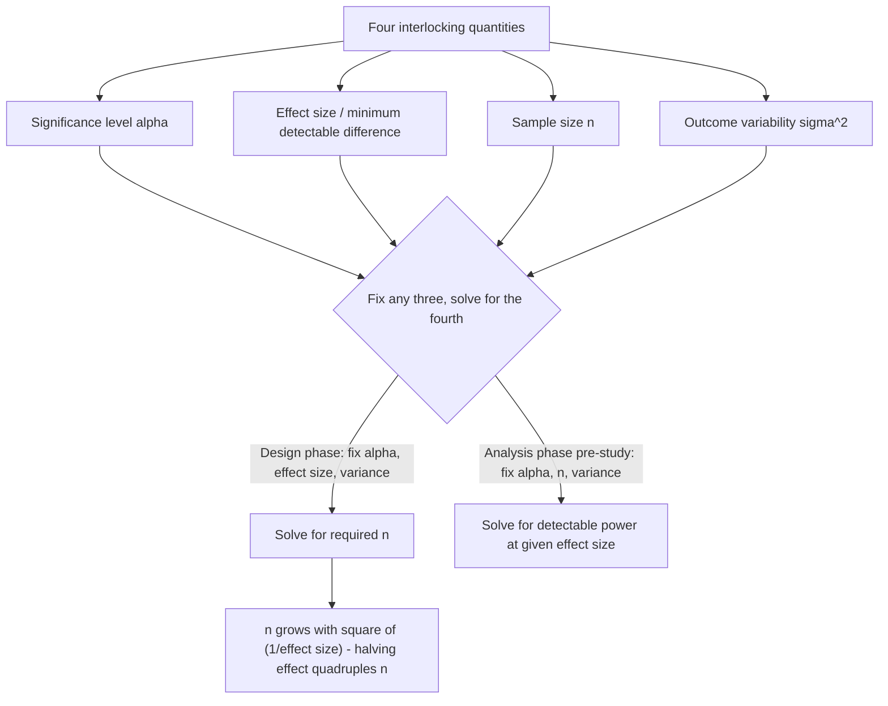

## Power analysis and sample size determination

### Overview

Power analysis quantifies a hypothesis test's ability to correctly detect a true effect when one genuinely exists, and sample size determination uses this framework prospectively (before data collection) to choose a sample size that achieves a desired probability of detecting an effect of a specified magnitude. Together these form the standard toolkit for study design in experimental and observational research, connecting directly back to the Type I/Type II error framework of the Neyman-Pearson approach.

### Statistical Power

Recall the error framework: **Type I error** ($\alpha$) is rejecting a true $H_0$; **Type II error** ($\beta$) is failing to reject a false $H_0$. **Power** is defined as:

$$\text{Power} = 1-\beta = P(\text{reject } H_0 \mid H_1 \text{ true})$$

Power depends jointly on four interrelated quantities, and any one can be solved for given the other three:

1. **Significance level** ($\alpha$): the fixed Type I error tolerance (conventionally 0.05)
2. **Effect size**: the magnitude of the true difference/association the test is designed to detect
3. **Sample size** ($n$): the number of observations
4. **Variability**: the underlying variance/standard deviation of the outcome (or, in regression, the variance of the residual and of the regressor)

### Effect Size

Effect size standardizes the magnitude of interest onto a scale independent of the units of measurement, enabling comparison and generalization across studies and outcome variables.

**Cohen's $d$** (standardized mean difference, two-sample comparison):

$$d = \frac{\mu_1-\mu_2}{\sigma}$$

Conventional (though context-dependent and much-debated) benchmarks: $d=0.2$ (small), $d=0.5$ (medium), $d=0.8$ (large) — Cohen himself cautioned these were only rough conventions for fields lacking other guidance, not universal standards.

**Correlation coefficient** ($r$) and its transformations, and **Cohen's $f^2$** for regression/ANOVA settings, serve analogous standardizing roles for association and variance-explained effect sizes respectively.

### Worked Example: Two-Sample Mean Comparison

For a two-sided test comparing two independent group means (equal variances $\sigma^2$, equal group sizes $n$ per group), the required sample size per group to achieve power $1-\beta$ at significance level $\alpha$ is approximately:

$$n = \frac{2\sigma^2\left(z_{\alpha/2}+z_\beta\right)^2}{\Delta^2}$$

where $\Delta = \mu_1-\mu_2$ is the minimum detectable difference of substantive interest, and $z_{\alpha/2}$, $z_\beta$ are the corresponding standard Normal quantiles (e.g., $z_{0.025}=1.96$ for $\alpha=0.05$ two-sided, $z_\beta = 0.84$ for 80% power).

**Interpretation of the formula's structure**: Required sample size increases with the square of the desired precision-to-effect-size ratio — halving the minimum detectable effect $\Delta$ requires **quadrupling** the sample size, a nonlinear relationship with substantial practical consequences for study budgeting and feasibility.

### The Power Function

More generally, the **power function** $\pi(\theta) = P_\theta(\text{reject } H_0)$ traces power as a function of the true parameter value $\theta$ across the entire alternative parameter space (not just a single point alternative), useful for characterizing a test's overall discriminating ability. Key properties: $\pi(\theta_0) = \alpha$ (the significance level is the power evaluated exactly at the null value), and $\pi(\theta)$ increases as $\theta$ moves further from $\theta_0$ (for well-behaved, unbiased tests) — a test is more likely to detect larger, more discrepant true effects.

### Determinants of Power: Comparative Statics

| Factor | Effect on power (holding other factors fixed) |
| --- | --- |
| Larger sample size $n$ | Increases power |
| Larger true effect size | Increases power |
| Larger significance level $\alpha$ (less stringent) | Increases power (but increases Type I error risk) |
| Smaller outcome variance $\sigma^2$ | Increases power |
| One-sided vs. two-sided test (same $\alpha$) | One-sided test has higher power against the specified-direction alternative |

This table formalizes the recognized tradeoff between $\alpha$ and $\beta$: for fixed $n$ and effect size, decreasing $\alpha$ (stricter significance threshold) necessarily increases $\beta$ (reduces power), all else equal — the two error rates cannot be simultaneously reduced without other changes (larger $n$, larger effect, or reduced variance).

### Power Analysis in Regression: The F-test and Multiple Regression

For testing a set of $r$ linear restrictions in a multiple regression with $n$ observations and $k$ total regressors, power depends on the noncentrality parameter of the (noncentral) F-distribution under the alternative, which is itself a function of $n$, the effect size (Cohen's $f^2 = R^2_{full}$ increment attributable to the tested variables), and the number of restrictions $r$ — power calculations for multiple regression are typically performed via specialized software or simulation rather than a simple closed-form formula, owing to this more complex noncentral distributional structure.

### Post-Hoc (Retrospective) Power: A Common Misuse

[Unverified] Computing "observed" or "post-hoc" power using the estimated effect size **after** a non-significant result has been obtained is widely regarded by methodologists as statistically uninformative and potentially misleading — because observed power is a deterministic (one-to-one) function of the observed p-value itself, it conveys no additional information beyond the p-value already reported, and a non-significant result will mechanically tend to produce a low computed "observed power" regardless of the true underlying effect. Prospective (a priori) power analysis, conducted before data collection using a hypothesized (not the eventually-observed) effect size, is the methodologically appropriate use of power calculations.

### Diagram: Power Analysis Relationships

### Relevance to Econometrics

Power analysis and sample size determination are central to the design of randomized controlled trials (RCTs) and field experiments in development and labor economics, where researchers must justify, often to funders or pre-registration reviewers, that a proposed sample size is adequate to detect a policy-relevant minimum effect size given anticipated variance in the outcome and the planned randomization design (including cluster-randomized designs, where the design effect from intra-cluster correlation substantially increases the required sample size relative to a simple individual-level randomization). [Inference] In applied economics, minimum detectable effect (MDE) calculations — a direct application of the sample-size formula solved for $\Delta$ given fixed $n$, $\alpha$, and power — are increasingly required components of pre-analysis plans submitted to registries such as the AEA RCT Registry, though the specific power target (commonly 80%, sometimes 90%) and the treatment of clustering/multiple-outcome corrections in these calculations vary across studies and funding requirements.

**Related Topics**

- The Neyman-Pearson framework and Type I/Type II errors
- Effect sizes and practical vs. statistical significance
- Cluster-randomized experimental design and intra-cluster correlation
- Multiple testing corrections in pre-registered RCTs
- Minimum detectable effect (MDE) calculations
- p-values and statistical significance