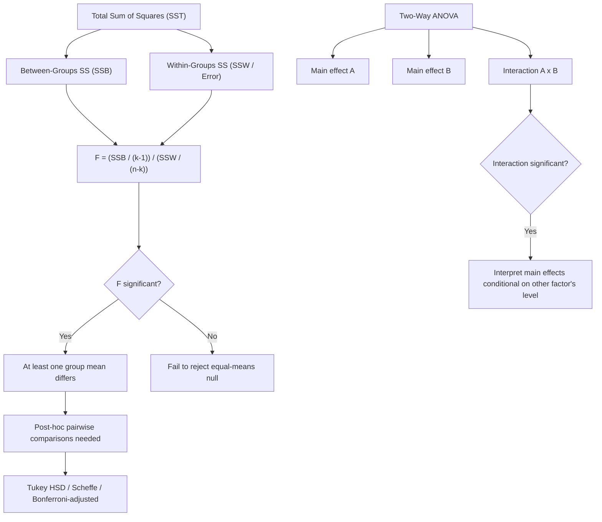

## Analysis of variance and experimental design

### Overview

Analysis of Variance (ANOVA) is a hypothesis-testing framework for comparing means across three or more groups (or, more generally, for partitioning total outcome variability into components attributable to different sources), extending the two-sample t-test to multiple groups and multiple factors. Experimental design principles — randomization, blocking, and factorial structure — determine how data are collected so that ANOVA's variance decomposition cleanly attributes variability to the factors of substantive interest.

### One-Way ANOVA

**Setup**: Compare means across $k$ independent groups, $Y_{ij} = \mu_j + \varepsilon_{ij}$, $\varepsilon_{ij} \overset{iid}{\sim} N(0,\sigma^2)$, for $j=1,\dots,k$ groups and $i=1,\dots,n_j$ observations per group.

**Hypotheses**: $H_0: \mu_1=\mu_2=\dots=\mu_k$ vs. $H_1:$ at least one $\mu_j$ differs.

**The Sum-of-Squares Decomposition**: Total variability in the outcome is partitioned into a between-groups component and a within-groups component:

$$SST = SSB + SSW$$

$$\underbrace{\sum_{j}\sum_i (y_{ij}-\bar y)^2}_{\text{Total SS}} = \underbrace{\sum_j n_j(\bar y_j - \bar y)^2}_{\text{Between-groups SS}} + \underbrace{\sum_j\sum_i (y_{ij}-\bar y_j)^2}_{\text{Within-groups SS}}$$

where $\bar y_j$ is the group $j$ mean and $\bar y$ is the grand (overall) mean.

**The F-statistic**:

$$F = \frac{SSB/(k-1)}{SSW/(n-k)} = \frac{MSB}{MSW}$$

Under $H_0$, $F \sim F_{k-1,\,n-k}$ (the F-distribution with $k-1$ numerator and $n-k$ denominator degrees of freedom). A large $F$ (between-group variability large relative to within-group variability) provides evidence against $H_0$.

### ANOVA as a Special Case of Linear Regression

One-way ANOVA is algebraically **identical** to a linear regression of the outcome on a set of $(k-1)$ group-indicator (dummy) variables — the ANOVA F-test for equality of group means is exactly the overall F-test for joint significance of the dummy-variable coefficients in that regression, connecting this section directly to the general Likelihood Ratio/Wald testing framework already covered under Likelihood Ratio, Wald, and Lagrange Multiplier tests (in fact, the classical ANOVA F-test is itself a special case of the Wald/LR testing logic for linear restrictions under Normal errors).

### Two-Way and Factorial ANOVA

**Two-way ANOVA** extends the framework to two categorical factors (say Factor A with $a$ levels, Factor B with $b$ levels), decomposing variability into main effects and an **interaction effect**:

$$Y_{ijk} = \mu + \alpha_i + \beta_j + (\alpha\beta)_{ij} + \varepsilon_{ijk}$$

- $\alpha_i$: main effect of Factor A
- $\beta_j$: main effect of Factor B
- $(\alpha\beta)_{ij}$: interaction effect — captures whether the effect of Factor A depends on the level of Factor B (and vice versa)

**Interaction interpretation**: A significant interaction term means the two factors do not act additively — the simple main effects become difficult to interpret in isolation, and effects should instead be described and reported conditional on the level of the other factor.

**Full factorial designs**: All combinations of factor levels are observed (each cell of the $a \times b$ design has at least one observation), enabling estimation of all main effects and the interaction; **fractional factorial designs** observe only a carefully chosen subset of combinations (common in engineering/quality-control contexts with many factors) to reduce the number of required experimental runs, at the cost of confounding some higher-order interaction effects with main effects or lower-order interactions.

### Repeated-Measures / Randomized Block Designs

When the same experimental units are measured under multiple conditions (repeated measures), or when a nuisance source of variability (a "blocking" factor, e.g., different experimental sites, different subject cohorts) is explicitly incorporated into the design to be removed from the error term:

$$Y_{ij} = \mu + \tau_i + \beta_j + \varepsilon_{ij}$$

where $\tau_i$ is the treatment effect of interest and $\beta_j$ is the block effect (accounted for and removed, but not itself of primary interest). **Randomized Complete Block Design (RCBD)**: each block contains exactly one observation of every treatment level, randomly assigned within the block — reducing the residual error variance (by removing block-to-block variability from the error term) and thereby increasing the power to detect treatment effects relative to a design that ignores the blocking structure entirely.

### Key Principles of Experimental Design (Fisher's Framework)

Ronald A. Fisher's foundational principles of experimental design, developed alongside his early work on ANOVA:

1. **Randomization**: Random assignment of experimental units to treatment conditions, breaking any systematic association between treatment assignment and confounding factors (observed or unobserved) — the design-based justification for causal interpretation of the estimated treatment effect, and the foundation for randomization-based (permutation) inference discussed under Nonparametric and permutation tests
2. **Replication**: Multiple independent observations per treatment condition, enabling estimation of the within-group (error) variance used in the denominator of the F-statistic
3. **Blocking (local control)**: Grouping experimental units into more homogeneous blocks to remove a known nuisance source of variability from the error term, increasing precision without requiring a larger total sample size

### Post-Hoc Multiple Comparisons

A significant overall ANOVA F-test indicates that *at least one* group mean differs, but does not by itself identify *which* pairs of groups differ — subsequent pairwise comparisons require a **multiple testing correction** (directly connecting to Multiple testing corrections and false discovery rate) to control the inflated Type I error rate from conducting many pairwise tests:

- **Tukey's Honestly Significant Difference (HSD)**: Controls the family-wise error rate specifically for all pairwise comparisons among $k$ group means, using the studentized range distribution
- **Scheffé's method**: More conservative, but valid for arbitrary (not just pairwise) linear contrasts among the group means, including contrasts suggested by inspection of the data after the fact
- **Bonferroni-adjusted pairwise t-tests**: A simpler, more conservative general-purpose alternative

### Diagram: ANOVA Variance Decomposition

### Relevance to Econometrics

ANOVA's variance-decomposition and F-testing logic underlies the standard overall F-test for joint significance of a group of regression coefficients (e.g., testing whether a full set of industry or region fixed effects is jointly significant), and factorial experimental design principles are directly applied in field-experiment economics when researchers cross multiple treatment arms (e.g., testing an information intervention and a cash-transfer intervention both separately and in combination) to estimate main effects and interaction effects of each treatment component. [Inference] Applied economists increasingly favor regression-based presentation of ANOVA-type comparisons (reporting coefficients on treatment-group dummies with cluster-robust standard errors) over classical ANOVA tables, in part because the regression framing more naturally accommodates covariate adjustment and the sandwich/cluster-robust standard error corrections standard in applied microeconometrics, though the underlying statistical content is equivalent and the specific presentation convention varies by field and journal.

**Related Topics**

- Likelihood Ratio, Wald, and Lagrange Multiplier tests
- Fixed effects and dummy variable regression
- Multiple testing corrections and false discovery rate
- Randomization inference and field experiment design
- Nonparametric and permutation tests (Kruskal-Wallis as ANOVA analogue)
- Factorial experimental designs in program evaluation