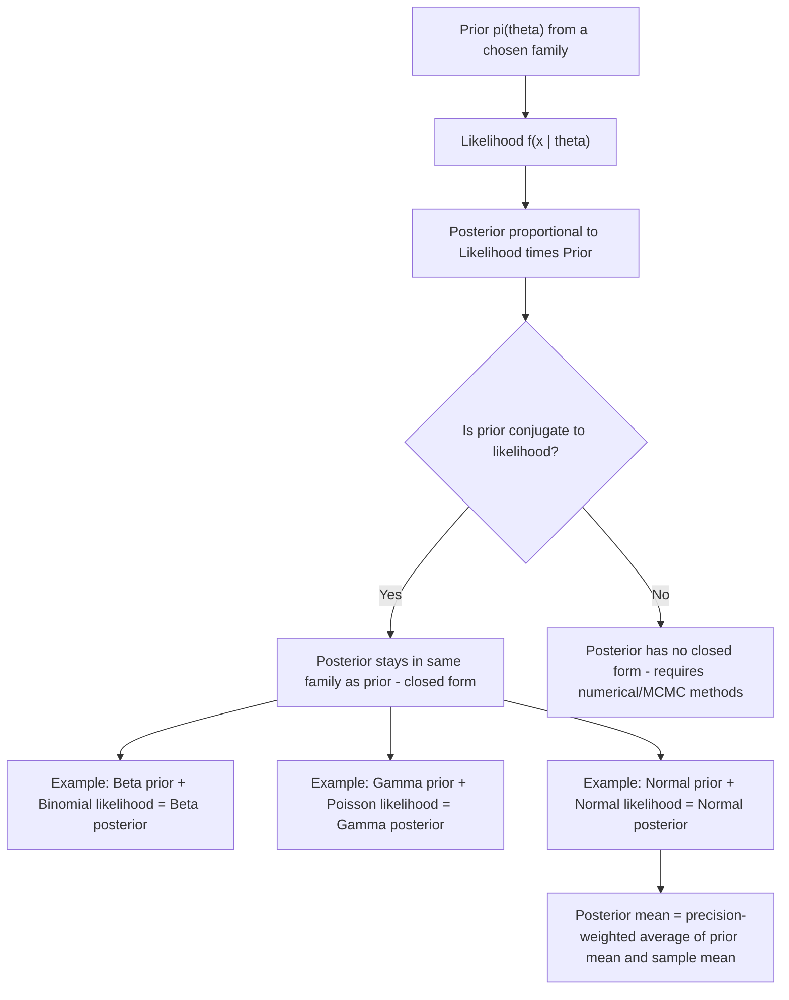

## Prior distributions and conjugate families

### Overview

Prior distributions formalize the Bayesian analyst's beliefs about an unknown parameter before observing data, and are updated via Bayes' theorem into a posterior distribution once data are incorporated. Conjugate families are pairs of prior and likelihood distributions chosen so that the resulting posterior remains within the same distributional family as the prior, yielding closed-form posterior updates and making conjugacy foundational to both analytical tractability and intuition-building in Bayesian inference.

### Bayes' Theorem for Parameters

For a parameter $\theta$ with prior density $\pi(\theta)$ and data $x$ with likelihood $f(x\mid\theta)$, the posterior density is:

$$\pi(\theta \mid x) = \frac{f(x\mid\theta)\,\pi(\theta)}{\int f(x\mid\theta)\,\pi(\theta)\,d\theta} \propto f(x\mid\theta)\,\pi(\theta)$$

The denominator, $\int f(x\mid\theta)\pi(\theta)\,d\theta = m(x)$, is the **marginal likelihood** (or "evidence") — a normalizing constant not depending on $\theta$, often the most computationally demanding quantity to obtain in non-conjugate settings.

**Core proportionality relationship**:

$$\text{Posterior} \propto \text{Likelihood} \times \text{Prior}$$

is the working relationship used throughout Bayesian analysis: since the normalizing constant does not depend on $\theta$, it is frequently sufficient to identify the *functional form* of $\theta$ in the product $f(x\mid\theta)\pi(\theta)$ and recognize which known distributional family that functional form corresponds to.

### Types of Prior Distributions

**Informative priors**: Encode substantial prior knowledge or belief about $\theta$ (e.g., from previous studies, expert elicitation, or physical constraints), concentrating probability mass in a specific region of the parameter space.

**Non-informative (diffuse) priors**: Intended to have minimal influence on the posterior relative to the likelihood, letting the data "speak for itself" as much as possible. A **flat (uniform) prior** $\pi(\theta) \propto 1$ is the simplest example, though it is **improper** (does not integrate to a finite value) over an unbounded parameter space, and it is not invariant to reparameterization (a flat prior on $\theta$ does not correspond to a flat prior on, say, $\log\theta$) — a well-known limitation motivating alternative "objective" prior formulations.

**Jeffreys prior**: A specific non-informative prior constructed to be invariant under reparameterization, defined as proportional to the square root of the determinant of the Fisher information matrix:

$$\pi_J(\theta) \propto \sqrt{\det I(\theta)}$$

This invariance property means the Jeffreys prior for a transformed parameter $\phi=g(\theta)$, derived via the standard change-of-variables formula, coincides with the Jeffreys prior computed directly from $\phi$'s own likelihood — a self-consistency property that ordinary flat priors lack.

### Conjugate Priors: General Concept

A prior $\pi(\theta)$ is **conjugate** to a likelihood $f(x\mid\theta)$ if the resulting posterior $\pi(\theta\mid x)$ belongs to the same parametric family as $\pi(\theta)$. Conjugacy is a property of the pairing of a specific likelihood with a specific prior family, not an intrinsic property of a distribution alone. As discussed under Exponential family distributions, every member of the exponential family admits a natural conjugate prior, constructed directly from the exponential-family functional form.

### Worked Example 1: Beta–Binomial Conjugacy

**Likelihood**: $X \mid p \sim \text{Binomial}(n,p)$, so $f(x\mid p) \propto p^x(1-p)^{n-x}$

**Prior**: $p \sim \text{Beta}(\alpha,\beta)$, so $\pi(p) \propto p^{\alpha-1}(1-p)^{\beta-1}$

**Posterior**:

$$\pi(p\mid x) \propto p^x(1-p)^{n-x}\cdot p^{\alpha-1}(1-p)^{\beta-1} = p^{x+\alpha-1}(1-p)^{n-x+\beta-1}$$

recognized (by its functional form in $p$) as $\text{Beta}(\alpha+x,\;\beta+n-x)$ — the posterior remains in the Beta family, with parameters updated by simply adding the observed successes/failures to the prior parameters.

**Interpretation of $\alpha,\beta$ as "pseudo-observations"**: The Beta$(\alpha,\beta)$ prior can be interpreted as encoding the equivalent of $\alpha$ prior "successes" and $\beta$ prior "failures" from an imaginary prior sample — the posterior mean is a precision-weighted average of the prior mean and the sample proportion:

$$E[p\mid x] = \frac{\alpha+x}{\alpha+\beta+n}$$

### Worked Example 2: Normal–Normal Conjugacy (Known Variance)

**Likelihood**: $X_1,\dots,X_n \overset{iid}{\sim} N(\mu,\sigma^2)$, $\sigma^2$ known

**Prior**: $\mu \sim N(\mu_0,\tau_0^2)$

**Posterior**: $\mu \mid x \sim N(\mu_1,\tau_1^2)$, where

$$\mu_1 = \frac{\frac{\mu_0}{\tau_0^2}+\frac{n\bar x}{\sigma^2}}{\frac{1}{\tau_0^2}+\frac{n}{\sigma^2}}, \qquad \frac{1}{\tau_1^2} = \frac{1}{\tau_0^2}+\frac{n}{\sigma^2}$$

**Precision-weighting interpretation**: The posterior mean $\mu_1$ is a weighted average of the prior mean $\mu_0$ and the sample mean $\bar x$, with weights proportional to their respective **precisions** (inverse variances) — as $n \to \infty$, the data's precision $n/\sigma^2$ dominates the fixed prior precision $1/\tau_0^2$, and $\mu_1 \to \bar x$, the posterior converging to the MLE regardless of the specific prior chosen — a general phenomenon (prior "washing out" asymptotically) that holds broadly across regular Bayesian models as $n\to\infty$.

### Worked Example 3: Gamma–Poisson Conjugacy

**Likelihood**: $X_i \overset{iid}{\sim} \text{Poisson}(\lambda)$

**Prior**: $\lambda \sim \text{Gamma}(\alpha,\beta)$ (shape $\alpha$, rate $\beta$)

**Posterior**: $\lambda \mid x \sim \text{Gamma}\left(\alpha+\sum_i x_i,\;\; \beta+n\right)$ — again, an additive update: the sum of observed counts adds to the shape parameter, and the number of observations adds to the rate parameter.

### Table of Standard Conjugate Pairs

| Likelihood | Conjugate Prior | Posterior |
| --- | --- | --- |
| Bernoulli/Binomial($p$) | Beta($\alpha,\beta$) | Beta($\alpha+x$, $\beta+n-x$) |
| Poisson($\lambda$) | Gamma($\alpha,\beta$) | Gamma($\alpha+\sum x_i$, $\beta+n$) |
| Normal($\mu$, $\sigma^2$ known) | Normal($\mu_0,\tau_0^2$) | Normal (precision-weighted update) |
| Normal($\mu$ known, $\sigma^2$) | Inverse-Gamma | Inverse-Gamma |
| Exponential($\lambda$) | Gamma($\alpha,\beta$) | Gamma($\alpha+n$, $\beta+\sum x_i$) |
| Multinomial | Dirichlet | Dirichlet (additive update) |

### Limitations of Conjugacy and Modern Practice

Conjugate priors offer closed-form tractability, but the requirement that a specific mathematical form yield a specific posterior family can constrain the prior to a shape that does not fully reflect the analyst's actual prior beliefs. [Inference] The rise of Markov Chain Monte Carlo (MCMC) computational methods since the late 1980s/1990s has substantially reduced the practical necessity of restricting attention to conjugate priors, since posteriors under arbitrary (non-conjugate) prior specifications can now be approximated numerically via simulation rather than requiring closed-form derivation, though conjugate priors remain widely used within larger hierarchical models (e.g., as the prior at one level of a hierarchy) for computational efficiency even in an MCMC context.

### Diagram: Conjugate Updating Logic

### Relevance to Econometrics

Conjugate priors underlie the tractability of many empirical Bayes and hierarchical Bayesian econometric models — for instance, Bayesian VAR (vector autoregression) models commonly use a Normal-Inverse-Wishart conjugate prior structure (the multivariate generalization of the Normal/Inverse-Gamma conjugate pair) to enable computationally efficient estimation of high-dimensional macroeconomic forecasting models, and the well-known "Minnesota prior" for Bayesian VARs is itself a specific conjugate Normal prior specification designed to shrink coefficients toward a random-walk benchmark. The James-Stein shrinkage estimator discussed under Shrinkage estimation has a direct empirical Bayes interpretation using exactly the Normal-Normal conjugate structure introduced here.

**Related Topics**

- Exponential family distributions and natural conjugate priors
- Posterior distributions and credible intervals
- Bayesian vs. frequentist inference paradigms
- Shrinkage estimation and empirical Bayes methods
- Markov Chain Monte Carlo (MCMC) methods
- Bayesian VAR models and the Minnesota prior