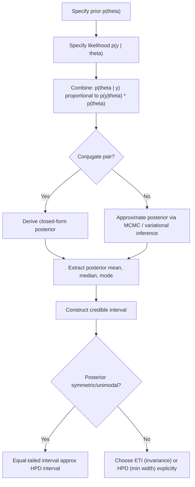

## Posterior Distributions and Credible Intervals

### Conceptual Foundation

Bayesian inference treats unknown parameters as random variables with probability distributions rather than fixed unknown constants. The **posterior distribution** represents updated beliefs about a parameter after observing data, combining prior beliefs with the likelihood of the observed data.

The relationship is governed by Bayes' theorem:

$$p(\theta \mid y) = \frac{p(y \mid \theta) \, p(\theta)}{p(y)}$$

where:

- $p(\theta)$ is the **prior distribution** — beliefs about $\theta$ before observing data
- $p(y \mid \theta)$ is the **likelihood** — probability of observing data $y$ given parameter $\theta$
- $p(y)$ is the **marginal likelihood** (evidence) — a normalizing constant
- $p(\theta \mid y)$ is the **posterior distribution** — updated beliefs about $\theta$ after observing data

Since $p(y)$ does not depend on $\theta$, the posterior is often expressed proportionally:

$$p(\theta \mid y) \propto p(y \mid \theta) \, p(\theta)$$

This proportionality is the computational core of Bayesian inference — the posterior shape is fully determined by the product of likelihood and prior, and the normalizing constant only rescales it to integrate to 1.

### The Marginal Likelihood

The denominator is obtained by integrating (or summing, for discrete parameters) over the entire parameter space:

$$p(y) = \int p(y \mid \theta) \, p(\theta) \, d\theta$$

This integral is often analytically intractable for anything beyond simple conjugate models, which motivates simulation-based methods (Markov Chain Monte Carlo, variational inference) covered elsewhere in this chapter. For conjugate prior-likelihood pairs, however, the posterior has a closed form.

### Conjugate Example: Beta-Binomial Model

**Setup**: Suppose $y$ successes are observed in $n$ Bernoulli trials with unknown success probability $\theta$, and a $\text{Beta}(\alpha, \beta)$ prior is placed on $\theta$.

- Prior: $p(\theta) \propto \theta^{\alpha - 1}(1-\theta)^{\beta - 1}$
- Likelihood: $p(y \mid \theta) \propto \theta^{y}(1-\theta)^{n-y}$
- Posterior: $p(\theta \mid y) \propto \theta^{y + \alpha - 1}(1-\theta)^{n - y + \beta - 1}$

This is recognizable as another Beta distribution:

$$\theta \mid y \sim \text{Beta}(\alpha + y, \, \beta + n - y)$$

**Interpretation**: The prior parameters $\alpha$ and $\beta$ act as "pseudo-counts" of prior successes and failures, which are simply added to the observed counts. This additive updating is a defining feature of conjugacy.

**Numerical Example**: With a $\text{Beta}(2, 2)$ prior (a mildly informative prior centered at 0.5) and data of $y = 15$ successes in $n = 20$ trials:

$$\theta \mid y \sim \text{Beta}(2 + 15, \, 2 + 5) = \text{Beta}(17, 7)$$

The posterior mean is:

$$E[\theta \mid y] = \frac{17}{17+7} = \frac{17}{24} \approx 0.708$$

Compare this to the maximum likelihood estimate $\hat{\theta}_{MLE} = 15/20 = 0.75$ — the posterior mean is pulled slightly toward the prior mean of 0.5, illustrating **shrinkage**, a hallmark of Bayesian estimation.

### Conjugate Example: Normal-Normal Model

For data $y_i \sim N(\theta, \sigma^2)$ with known $\sigma^2$, and prior $\theta \sim N(\mu_0, \tau_0^2)$, the posterior is also Normal:

$$\theta \mid y \sim N(\mu_n, \tau_n^2)$$

where

$$\mu_n = \frac{\frac{1}{\tau_0^2}\mu_0 + \frac{n}{\sigma^2}\bar{y}}{\frac{1}{\tau_0^2} + \frac{n}{\sigma^2}}, \qquad \tau_n^2 = \left(\frac{1}{\tau_0^2} + \frac{n}{\sigma^2}\right)^{-1}$$

The posterior mean $\mu_n$ is a **precision-weighted average** of the prior mean and the sample mean, where precision is the inverse of variance ($1/\tau_0^2$ and $n/\sigma^2$ respectively). As $n \to \infty$, the data dominate and $\mu_n \to \bar{y}$, regardless of the prior — this is a form of Bayesian consistency.

### Point and Interval Summaries of the Posterior

Once the full posterior distribution is obtained (analytically or via simulation), several summaries are typically reported:

- **Posterior mean**: $E[\theta \mid y]$ — minimizes expected squared-error loss
- **Posterior median**: minimizes expected absolute-error loss
- **Posterior mode** (Maximum A Posteriori, MAP): the value maximizing $p(\theta \mid y)$
- **Posterior variance/standard deviation**: quantifies uncertainty, analogous to a standard error

For skewed posteriors (common with variance parameters, odds ratios, etc.), the mean, median, and mode diverge, and reporting only one can be misleading — visualizing or at minimum reporting multiple summaries is standard practice.

### Credible Intervals

A **credible interval** is the Bayesian analogue of a confidence interval, but with a fundamentally different interpretation. A $100(1-\alpha)\%$ credible interval $[L, U]$ satisfies:

$$P(L \leq \theta \leq U \mid y) = 1 - \alpha$$

This is a direct probability statement about the parameter given the observed data — something a frequentist confidence interval cannot claim, since in the frequentist framework $\theta$ is fixed and it is the interval (across repeated sampling) that is random.

#### Types of Credible Intervals

**1. Equal-Tailed Interval (ETI)**

Constructed by taking the $\alpha/2$ and $1 - \alpha/2$ quantiles of the posterior:

$$L = F^{-1}_{\theta \mid y}(\alpha/2), \qquad U = F^{-1}_{\theta \mid y}(1 - \alpha/2)$$

For the Beta(17, 7) example above, the 95% equal-tailed interval is computed from the 2.5th and 97.5th percentiles of that Beta distribution. Equal-tailed intervals are simple to compute and are invariant to monotonic transformations of $\theta$ (e.g., the ETI for $\log(\theta)$ is just the log of the ETI bounds for $\theta$).

**2. Highest Posterior Density (HPD) Interval**

The HPD interval is the *narrowest* interval containing $1-\alpha$ posterior probability. Formally, it is the set $\{\theta : p(\theta \mid y) \geq k\}$ for the largest $k$ such that the set has probability $1 - \alpha$.

**Key properties**:

- For unimodal, symmetric posteriors, the HPD interval coincides with the equal-tailed interval
- For **skewed** or **multimodal** posteriors, the HPD interval is shorter than the ETI and better reflects regions of genuinely high plausibility
- HPD intervals are **not** invariant to reparameterization — the HPD interval for $\log(\theta)$ is not simply the transform of the HPD interval for $\theta$
- For multimodal posteriors, the HPD region may be **disjoint** (multiple separate intervals)

**Comparative Example**: For a strongly right-skewed posterior (e.g., a Beta(1, 10)), the equal-tailed 95% interval will include a longer right tail with low density, while the HPD interval shifts left and is narrower, excluding low-density regions on the right while including slightly more on the low-density left tail near zero to preserve minimal width.

### Visualizing the Distinction

<svg xmlns="http://www.w3.org/2000/svg" viewBox="0 0 700 380">
<text x="350" y="25" font-size="16" font-weight="bold" text-anchor="middle" fill="#222">Equal-Tailed vs HPD Interval on a Skewed Posterior (svg_diagram)</text>

<line x1="60" y1="320" x2="650" y2="320" stroke="#333" stroke-width="1.5" />
<line x1="60" y1="320" x2="60" y2="60" stroke="#333" stroke-width="1.5" />
<text x="355" y="355" font-size="13" text-anchor="middle" fill="#333">theta</text>
<text x="30" y="190" font-size="13" text-anchor="middle" fill="#333" transform="rotate(-90 30 190)">Density</text>


<path d="M 60 320 C 100 100, 130 70, 160 75 C 220 90, 300 180, 400 250 C 480 290, 560 310, 650 318" fill="none" stroke="`#2b6cb0`" stroke-width="2.5" />


<path d="M 150 320 C 155 200, 160 90, 165 75 C 220 90, 300 180, 400 250 C 460 285, 500 300, 520 310 L 520 320 Z" fill="`#63b3ed`" opacity="0.35" />

<line x1="150" y1="320" x2="150" y2="200" stroke="`#2b6cb0`" stroke-width="1.5" stroke-dasharray="4,3" />

<line x1="520" y1="320" x2="520" y2="308" stroke="`#2b6cb0`" stroke-width="1.5" stroke-dasharray="4,3" />

<text x="335" y="345" font-size="12" text-anchor="middle" fill="`#2b6cb0`">Equal-Tailed 95% Interval (wider)</text>


<path d="M 120 320 C 125 220, 140 95, 165 75 C 210 88, 270 150, 330 210 L 330 320 Z" fill="`#f6ad55`" opacity="0.45" />

<line x1="120" y1="320" x2="120" y2="230" stroke="`#c05621`" stroke-width="1.5" stroke-dasharray="4,3" />

<line x1="330" y1="320" x2="330" y2="210" stroke="`#c05621`" stroke-width="1.5" stroke-dasharray="4,3" />

<text x="225" y="65" font-size="12" text-anchor="middle" fill="`#c05621`">HPD 95% Interval (narrower)</text>


<line x1="165" y1="75" x2="165" y2="320" stroke="#555" stroke-width="1" stroke-dasharray="2,2" />
<text x="165" y="335" font-size="11" text-anchor="middle" fill="#555">mode</text>

<rect x="480" y="60" width="14" height="14" fill="#63b3ed" opacity="0.5" />
<text x="500" y="71" font-size="11" fill="#333">Equal-tailed region</text>
<rect x="480" y="82" width="14" height="14" fill="#f6ad55" opacity="0.6" />
<text x="500" y="93" font-size="11" fill="#333">HPD region</text>
</svg>

### Bayesian Workflow for Deriving a Posterior



### Credible Intervals vs. Confidence Intervals

| Aspect | Credible Interval (Bayesian) | Confidence Interval (Frequentist) |
| --- | --- | --- |
| Interpretation | Direct probability that $\theta$ lies in $[L,U]$ given the data | Long-run proportion of intervals (across repeated samples) that would contain the true fixed $\theta$ |
| Conditioning | Conditional on the *observed* data | Based on the sampling distribution over *hypothetical repeated* data |
| Requires a prior | Yes | No |
| Numerically | Can coincide with CIs under flat/non-informative priors and large $n$ | — |
| Interval type flexibility | Multiple valid constructions (ETI, HPD) | Typically one standard construction per method |

[Inference] With diffuse (weakly informative or flat) priors and large sample sizes, credible intervals and confidence intervals often converge numerically due to the Bernstein–von Mises theorem, though their interpretations remain fundamentally distinct even when the numbers coincide.

### Computing Credible Intervals via Simulation

When no closed-form posterior exists, credible intervals are obtained from posterior samples (e.g., generated via MCMC). Given $S$ posterior draws $\theta^{(1)}, \ldots, \theta^{(S)}$:

- **Equal-tailed interval**: sort the draws and take the empirical $\alpha/2$ and $1-\alpha/2$ quantiles
- **HPD interval**: sort the draws, then find the shortest contiguous window containing $(1-\alpha) \times S$ of the sorted draws — implemented by sliding a window of that count across the sorted sample and selecting the one with minimum width

**Illustrative pseudocode**:

```python
import numpy as np

def hpd_interval(samples, cred_mass=0.95):
    sorted_samples = np.sort(samples)
    n = len(sorted_samples)
    interval_idx_inc = int(np.floor(cred_mass * n))
    n_intervals = n - interval_idx_inc
    interval_widths = sorted_samples[interval_idx_inc:] - sorted_samples[:n_intervals]
    min_idx = np.argmin(interval_widths)
    hpd_lower = sorted_samples[min_idx]
    hpd_upper = sorted_samples[min_idx + interval_idx_inc]
    return hpd_lower, hpd_upper
```

This approach makes no distributional assumptions beyond having representative posterior draws, which is why it generalizes across arbitrary posterior shapes obtained from MCMC output.

### Effect of Prior Choice on the Posterior and Interval Width

- **Informative priors** shrink the posterior toward prior beliefs and typically narrow the credible interval when the prior and data are consistent, but can bias results if the prior conflicts with the data and sample size is small
- **Weakly informative priors** exert minimal influence except to stabilize estimation (e.g., in cases of separation in logistic regression or small samples)
- **Flat/non-informative priors** let the likelihood dominate; the posterior then resembles the (normalized) likelihood function, and credible intervals often closely track confidence intervals numerically
- As $n \to \infty$, the influence of any fixed proper prior vanishes and the posterior concentrates around the true parameter value (**posterior consistency**), assuming standard regularity conditions

### Common Pitfalls

- **Misinterpreting credible intervals as identical in meaning to confidence intervals** — the probability statement direction differs fundamentally
- **Reporting only equal-tailed intervals for highly skewed posteriors** without checking whether an HPD interval would better represent the region of high plausibility
- **Ignoring prior sensitivity** — failing to check how robust the posterior and credible interval are to reasonable alternative prior specifications
- **Using flat priors on variance or scale parameters** without realizing that "non-informative" is parameterization-dependent; a flat prior on $\sigma$ is not flat on $\sigma^2$ or $\log(\sigma)$
- **Treating MCMC output as exact** when using simulation-based credible intervals — Monte Carlo error, insufficient sample size, or poor chain mixing/convergence can distort empirical quantile estimates [Unverified — degree of distortion is diagnostic- and implementation-dependent]

### Related Topics

- Markov Chain Monte Carlo (Metropolis-Hastings, Gibbs sampling, Hamiltonian Monte Carlo)
- Conjugate prior families and exponential family distributions
- Bayesian hypothesis testing and Bayes factors
- Posterior predictive distributions and predictive checks
- Prior elicitation and sensitivity analysis
- Bernstein–von Mises theorem and Bayesian asymptotics
- Hierarchical/multilevel Bayesian models and partial pooling
- Convergence diagnostics ($\hat{R}$, effective sample size, trace plots)