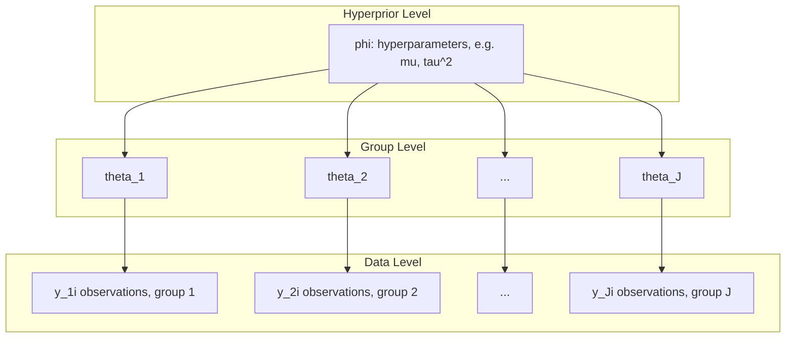
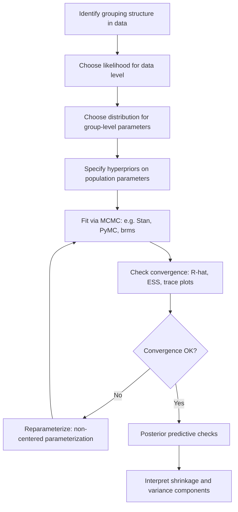

## Hierarchical and Multilevel Bayesian Models

### Conceptual Foundation

Hierarchical (multilevel) Bayesian models extend standard Bayesian inference to data with **nested or grouped structure** — students within schools, patients within hospitals, repeated measures within individuals, firms within industries. Rather than treating each group as either completely separate (no pooling) or identical (complete pooling), hierarchical models allow **partial pooling**: group-level parameters are drawn from a shared population distribution whose own parameters are estimated from the data.

This is achieved by placing priors on parameters that are themselves governed by **hyperpriors**, creating multiple levels of the model:

$$y_{ij} \mid \theta_j \sim p(y_{ij} \mid \theta_j) \quad \text{(data level, observation } i \text{ in group } j\text{)}$$

$$\theta_j \mid \phi \sim p(\theta_j \mid \phi) \quad \text{(group level)}$$

$$\phi \sim p(\phi) \quad \text{(hyperprior on population-level parameters)}$$

The joint posterior over all unknowns is:

$$p(\theta_1, \ldots, \theta_J, \phi \mid y) \propto \left[\prod_{j=1}^{J} \prod_{i=1}^{n_j} p(y_{ij} \mid \theta_j)\right] \left[\prod_{j=1}^{J} p(\theta_j \mid \phi)\right] p(\phi)$$

### The Pooling Spectrum

Three approaches represent different assumptions about how much groups share information:

| Approach | Assumption | Behavior |
| --- | --- | --- |
| **No pooling** | Each group $j$ has an entirely independent $\theta_j$, estimated only from its own data | High variance for small groups; ignores similarity across groups |
| **Complete pooling** | All groups share a single $\theta$ | Ignores genuine between-group heterogeneity; biased for atypical groups |
| **Partial pooling (hierarchical)** | $\theta_j$ drawn from a common distribution $p(\theta_j \mid \phi)$, with $\phi$ estimated from all groups jointly | Borrows strength across groups; shrinks noisy/small-sample estimates toward the population mean |

Partial pooling is the defining feature of hierarchical Bayesian modeling — it is a principled compromise that adapts the degree of shrinkage to the amount of data available in each group and the estimated between-group variance.

### Canonical Example: Hierarchical Normal Model

**Setup**: Group $j$ has observations $y_{ij} \sim N(\theta_j, \sigma^2)$ for $i = 1, \ldots, n_j$, with group means themselves drawn from a population distribution:

$$\theta_j \sim N(\mu, \tau^2)$$

$$\mu \sim N(\mu_0, \sigma_0^2), \qquad \tau^2 \sim \text{Inverse-Gamma}(a, b)$$

Here $\mu$ is the population mean, $\tau^2$ is the **between-group variance** (how much group means vary around $\mu$), and $\sigma^2$ is the **within-group variance** (observation noise around each $\theta_j$).

**Posterior mean for group $j$** (in the case of known variances, via conjugate normal-normal updating):

$$E[\theta_j \mid y] = \lambda_j \bar{y}_j + (1 - \lambda_j)\mu$$

where the shrinkage weight is:

$$\lambda_j = \frac{n_j / \sigma^2}{n_j/\sigma^2 + 1/\tau^2}$$

**Interpretation**: $\lambda_j$ is the fraction of weight given to the group's own sample mean $\bar{y}_j$ versus the population mean $\mu$.

- As $n_j \to \infty$ (large group sample), $\lambda_j \to 1$ — the group's own data dominate
- As $n_j \to 0$ or $\tau^2 \to 0$ (small group, or little true between-group variation), $\lambda_j \to 0$ — the estimate shrinks toward $\mu$
- This is precisely the **James-Stein shrinkage estimator** phenomenon, derived here from a fully Bayesian generative model rather than as an ad hoc empirical correction

### Numerical Example

Suppose 8 schools report average test-score gains from a coaching program (a classic example from Rubin's "eight schools" study). Some schools have small sample sizes (large standard errors), others larger. A hierarchical model treats each school's true effect $\theta_j$ as drawn from a common population distribution $N(\mu, \tau^2)$.

- A school with a *large* observed effect but a *small* sample size (large $\sigma_j$) gets pulled substantially toward the grand mean $\mu$, since $\lambda_j$ is small
- A school with a *large* sample size gets minimal shrinkage — its posterior mean stays close to its own observed average
- The estimated $\tau$ quantifies genuine heterogeneity across schools; if $\tau$ is estimated near zero, the data are consistent with all schools having the same true effect (favoring complete pooling); if $\tau$ is large relative to within-school standard errors, schools are genuinely different (favoring no pooling)

[Inference] The exact posterior shrinkage factors in the eight-schools example depend on the specific observed standard errors per school and the estimated $\tau$, which requires numerical integration or MCMC since $\tau$ is not known in advance — closed-form results only hold conditional on a fixed $\tau$.

### Hierarchical Model Structure Diagram

### Regression Extension: Hierarchical (Multilevel) Linear Models

Hierarchical structure extends naturally to regression, allowing coefficients to vary by group — this is the Bayesian formulation of what frequentist literature calls **mixed-effects** or **random-effects models**.

**Varying-intercept model**:

$$y_{ij} = \alpha_j + \beta x_{ij} + \epsilon_{ij}, \qquad \epsilon_{ij} \sim N(0, \sigma^2)$$

$$\alpha_j \sim N(\mu_\alpha, \tau_\alpha^2)$$

**Varying-intercept, varying-slope model**:

$$y_{ij} = \alpha_j + \beta_j x_{ij} + \epsilon_{ij}$$

$$\begin{pmatrix} \alpha_j \\ \beta_j \end{pmatrix} \sim N\left(\begin{pmatrix} \mu_\alpha \\ \mu_\beta \end{pmatrix}, \Sigma\right)$$

Modeling $\Sigma$ as a full covariance matrix (rather than assuming independence between $\alpha_j$ and $\beta_j$) allows the model to capture, for example, a tendency for groups with higher intercepts to also have shallower slopes — a correlation frequently observed in real panel/longitudinal data.

**Priors on $\Sigma$**: A common and numerically stable choice decomposes the covariance matrix into a scale vector and a correlation matrix, placing an LKJ prior on the correlation matrix:

$$\Sigma = \text{diag}(\tau_\alpha, \tau_\beta) \, \Omega \, \text{diag}(\tau_\alpha, \tau_\beta), \qquad \Omega \sim \text{LKJ}(\eta)$$

This parameterization is standard in modern probabilistic programming frameworks (e.g., Stan, PyMC) because it separates scale and correlation, improving sampler efficiency and prior interpretability.

### Random Effects vs. Fixed Effects (Terminology Bridge)

| Frequentist Term | Bayesian Hierarchical Analogue |
| --- | --- |
| Fixed effects | Population-level (hyper)parameters, e.g., $\mu_\alpha, \beta$ |
| Random effects | Group-level parameters $\theta_j$, treated as draws from a distribution rather than fixed unknowns |
| Variance components | Hyperparameters $\tau^2$ governing between-group variance |
| BLUP (Best Linear Unbiased Predictor) | Posterior mean of $\theta_j$ under the hierarchical model |

[Inference] Under certain simplifying assumptions (e.g., normal likelihoods, normal random effects, flat hyperpriors), Bayesian hierarchical posterior means for group effects coincide numerically with frequentist BLUP/REML estimates from mixed-effects models, though the two frameworks differ in how uncertainty in $\tau^2$ itself is propagated — Bayesian models fully integrate over hyperparameter uncertainty, while classical REML approaches typically condition on point estimates of variance components.

### Model Specification Workflow

### The Non-Centered Parameterization

A well-known computational issue in hierarchical models is poor sampler geometry when group-level variance $\tau$ is small — the **centered parameterization** ($\theta_j \sim N(\mu, \tau^2)$ directly) creates a "funnel" shape in the posterior that gradient-based samplers like Hamiltonian Monte Carlo struggle to explore efficiently.

**Centered parameterization**:

$$\theta_j \sim N(\mu, \tau^2)$$

**Non-centered parameterization** (reparameterized to separate location/scale from the raw random variable):

$$\tilde{\theta}_j \sim N(0, 1), \qquad \theta_j = \mu + \tau \, \tilde{\theta}_j$$

This reformulation is mathematically equivalent but dramatically improves sampling efficiency when $\tau$ is small or the data are sparse per group, because it decouples $\tilde\theta_j$ from $\tau$ in the sampler's parameter space. This is a standard, well-documented technique in Stan/PyMC hierarchical modeling workflows.

### Model Comparison and Variance Decomposition

A useful diagnostic in hierarchical models is the **intraclass correlation coefficient (ICC)**, quantifying what fraction of total variance is attributable to between-group differences:

\text{ICC} = \frac{\tau^2}{\tau^2 + \sigma^2}$}

- ICC near 0: groups are nearly identical; complete pooling would lose little information
- ICC near 1: groups are highly distinct; pooling would badly distort group-specific inference

Posterior draws of $\tau^2$ and $\sigma^2$ from the fitted model allow this ratio to be computed as a full posterior distribution, not just a point estimate — a distinctly Bayesian advantage over classical variance-component estimation.

### Common Applications

- **Education research**: student outcomes nested in classrooms nested in schools
- **Meta-analysis**: study-level effect sizes as group-level parameters, shrinking noisy studies toward a pooled effect
- **Panel/longitudinal econometrics**: individual-specific intercepts/slopes over repeated time observations
- **Small-area estimation**: borrowing strength across geographic regions with sparse local data
- **A/B testing at scale**: shrinking noisy per-variant or per-segment treatment effect estimates toward a global effect

### Common Pitfalls

- **Ignoring divergent transitions** in HMC/NUTS samplers, which frequently signal funnel geometry from a centered parameterization on small $\tau$
- **Treating group-level estimates as independent** post-hoc, after fitting a hierarchical model — this discards the very shrinkage/covariance information the model was built to capture
- **Using too few groups** ($J$ small, e.g., under 5–8) to reliably estimate the population-level variance $\tau^2$, leading to a weakly identified hyperparameter and posterior sensitivity to the hyperprior choice
- **Overlooking correlation between varying intercepts and slopes**, which if ignored (by assuming independence) can bias downstream inference and understate uncertainty in combined effects
- **Misinterpreting shrinkage as bias** rather than a variance-reduction trade-off that improves overall (population) estimation accuracy under a mean-squared-error criterion

### Related Topics

- Empirical Bayes methods and James-Stein estimation
- Markov Chain Monte Carlo diagnostics (R-hat, effective sample size, divergences)
- Non-centered reparameterization and funnel geometry
- Meta-analysis and random-effects models
- Mixed-effects models (frequentist REML/ML estimation) as a comparison framework
- Probabilistic programming languages: Stan, PyMC, brms
- Prior specification for variance components (half-Cauchy, half-normal, LKJ priors)
- Posterior predictive checks in multilevel settings