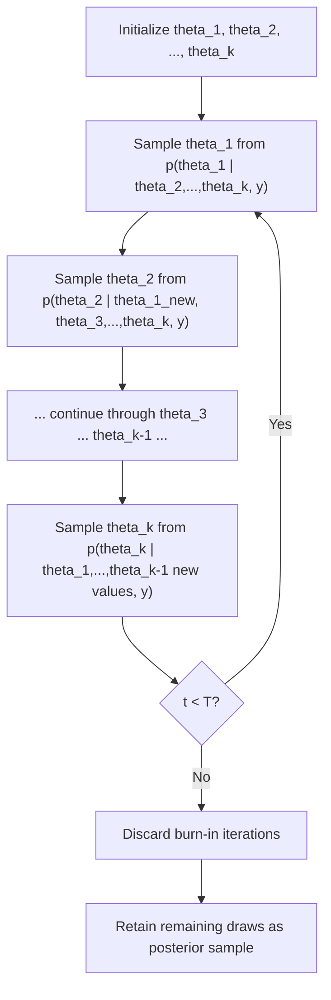

## Gibbs Sampling

### Conceptual Foundation

Gibbs sampling is a Markov Chain Monte Carlo (MCMC) algorithm used to draw samples from a joint posterior distribution $p(\theta_1, \ldots, \theta_k \mid y)$ when that joint distribution is difficult to sample from directly, but each parameter's **full conditional distribution** — its distribution given all other parameters and the data — is tractable and easy to sample from.

Rather than sampling all parameters simultaneously, Gibbs sampling cycles through each parameter one at a time, sampling it from its conditional distribution given the current values of all other parameters:

$$\theta_j^{(t+1)} \sim p\left(\theta_j \mid \theta_1^{(t+1)}, \ldots, \theta_{j-1}^{(t+1)}, \theta_{j+1}^{(t)}, \ldots, \theta_k^{(t)}, y\right)$$

This sequential updating constructs a Markov chain whose stationary distribution is the target joint posterior — a result guaranteed by the theory of Markov chains under standard regularity conditions (irreducibility and aperiodicity of the resulting chain).

### Why Gibbs Sampling Works

Gibbs sampling is a special case of the **Metropolis-Hastings algorithm** where the proposal distribution for each parameter is exactly its full conditional distribution. Because the proposal matches the target conditional exactly, the Metropolis-Hastings acceptance probability is always 1 — every proposed value is accepted, which is what distinguishes Gibbs sampling from more general Metropolis-Hastings schemes that require an accept/reject step.

**Formal justification**: If the chain has reached the joint stationary distribution $p(\theta_1, \ldots, \theta_k \mid y)$, then updating any single $\theta_j$ by drawing from its conditional distribution given the current values of the others leaves the joint distribution invariant — this is a direct consequence of how conditional and joint distributions relate via the chain rule of probability.

### The Basic Algorithm

**Setup**: Parameters $\theta_1, \theta_2, \ldots, \theta_k$; full conditional distributions $p(\theta_j \mid \theta_{-j}, y)$ available in closed form for each $j$ (where $\theta_{-j}$ denotes all parameters except $\theta_j$).

**Steps**:

1. Initialize $\theta_1^{(0)}, \theta_2^{(0)}, \ldots, \theta_k^{(0)}$ (starting values)
2. For iteration $t = 1, 2, \ldots, T$:
   - Sample $\theta_1^{(t)} \sim p(\theta_1 \mid \theta_2^{(t-1)}, \ldots, \theta_k^{(t-1)}, y)$
   - Sample $\theta_2^{(t)} \sim p(\theta_2 \mid \theta_1^{(t)}, \theta_3^{(t-1)}, \ldots, \theta_k^{(t-1)}, y)$
   - Continue sequentially through all $k$ parameters, always conditioning on the most recently updated values
   - Sample $\theta_k^{(t)} \sim p(\theta_k \mid \theta_1^{(t)}, \ldots, \theta_{k-1}^{(t)}, y)$
3. Discard an initial **burn-in** period of early iterations (to reduce dependence on starting values)
4. Retain the remaining draws as (correlated) samples from the joint posterior



### Canonical Example: Bivariate Normal-Inverse-Gamma Model

**Setup**: Data $y_i \sim N(\mu, \sigma^2)$, $i = 1, \ldots, n$, with priors:

$$\mu \sim N(\mu_0, \tau_0^2), \qquad \sigma^2 \sim \text{Inverse-Gamma}(a_0, b_0)$$

The joint posterior $p(\mu, \sigma^2 \mid y)$ has no simple closed form, but both full conditionals do:

**Conditional for $\mu$** (given current $\sigma^2$) — this is a standard conjugate normal-normal update:

$$\mu \mid \sigma^2, y \sim N\left(\frac{\frac{\mu_0}{\tau_0^2} + \frac{n\bar{y}}{\sigma^2}}{\frac{1}{\tau_0^2} + \frac{n}{\sigma^2}}, \; \left(\frac{1}{\tau_0^2} + \frac{n}{\sigma^2}\right)^{-1}\right)$$

**Conditional for $\sigma^2$** (given current $\mu$) — conjugate normal-inverse-gamma update:

$$\sigma^2 \mid \mu, y \sim \text{Inverse-Gamma}\left(a_0 + \frac{n}{2}, \; b_0 + \frac{1}{2}\sum_{i=1}^n (y_i - \mu)^2\right)$$

**Gibbs procedure**: Starting from an initial $\sigma^{2(0)}$, alternately draw $\mu^{(t)}$ from its conditional (using $\sigma^{2(t-1)}$), then draw $\sigma^{2(t)}$ from its conditional (using $\mu^{(t)}$), repeating for many iterations. The resulting sequence of $(\mu^{(t)}, \sigma^{2(t)})$ pairs converges in distribution to the joint posterior $p(\mu, \sigma^2 \mid y)$, even though that joint posterior was never derived in closed form directly.

### Illustrative Pseudocode

```python
import numpy as np

def gibbs_normal_model(y, mu0, tau0_sq, a0, b0, n_iter=5000, burn_in=1000):
    n = len(y)
    y_bar = np.mean(y)
    
    # Initialize
    sigma_sq = np.var(y)
    mu_samples = np.zeros(n_iter)
    sigma_sq_samples = np.zeros(n_iter)
    
    for t in range(n_iter):
        # Sample mu | sigma^2, y
        post_var_mu = 1.0 / (1.0/tau0_sq + n/sigma_sq)
        post_mean_mu = post_var_mu * (mu0/tau0_sq + n*y_bar/sigma_sq)
        mu = np.random.normal(post_mean_mu, np.sqrt(post_var_mu))
        
        # Sample sigma^2 | mu, y
        a_n = a0 + n/2.0
        b_n = b0 + 0.5 * np.sum((y - mu)**2)
        sigma_sq = 1.0 / np.random.gamma(a_n, 1.0/b_n)  # inverse-gamma via gamma
        
        mu_samples[t] = mu
        sigma_sq_samples[t] = sigma_sq
    
    return mu_samples[burn_in:], sigma_sq_samples[burn_in:]
```

This pattern — alternating conjugate conditional draws — generalizes directly to hierarchical models, mixture models, and many other structured Bayesian models where conditional conjugacy holds even though joint conjugacy does not.

### When Gibbs Sampling Is Applicable

Gibbs sampling is most naturally suited to models exhibiting **conditional conjugacy** — situations where, although the full joint posterior is intractable, each parameter's conditional distribution (holding all others fixed) belongs to a recognizable, easily sampled family. Common cases include:

- **Hierarchical normal models** (group means and variances, as in the eight-schools-style structure)
- **Mixture models**, where a latent indicator variable for component membership has a straightforward categorical conditional, and each component's parameters have conjugate conditionals given the current cluster assignments
- **Latent variable models** more broadly (e.g., probit regression via data augmentation, where latent continuous variables have tractable conditionals given the observed binary outcomes)
- **Linear regression with conjugate normal-inverse-gamma priors** on coefficients and residual variance

### Gibbs Sampling for Mixture Models (Data Augmentation)

A widely used extension introduces **latent allocation variables** $z_i \in \{1, \ldots, K\}$ indicating which of $K$ mixture components generated observation $i$. The Gibbs sampler alternates between:

1. **Sampling latent assignments**: for each $i$, sample $z_i$ from a categorical distribution over components, with probabilities proportional to each component's likelihood contribution weighted by its current mixing probability
2. **Sampling component parameters**: given the current assignments $z_i$, update each component's mean/variance parameters using standard conjugate updates restricted to the observations currently assigned to that component
3. **Sampling mixing proportions**: update the Dirichlet-distributed mixing weights given the current counts of observations assigned to each component

This is a canonical example of **data augmentation** — introducing auxiliary latent variables purely to make all conditional distributions tractable, even though those latent variables are not directly observed or ultimately of primary inferential interest.

### Convergence Diagnostics

Because Gibbs sampling produces a Markov chain (not independent draws), several diagnostics are standard practice before treating the output as a valid posterior sample:

- **Trace plots**: visual inspection of parameter values across iterations, checking for stable mixing rather than trending or sticking behavior
- **$\hat{R}$ (Gelman-Rubin statistic)**: compares within-chain and between-chain variance across multiple independently initialized chains; values close to 1.0 (conventionally $\hat{R} < 1.01$ or $< 1.1$ depending on the source) suggest convergence
- **Effective sample size (ESS)**: accounts for autocorrelation in the chain, since successive Gibbs draws are correlated and thus contain less independent information than the same number of i.i.d. draws
- **Autocorrelation plots**: reveal how quickly the chain "forgets" its past, informing decisions about thinning (though thinning is not always necessary or recommended for downstream summary quality)

[Inference] The specific $\hat{R}$ threshold treated as acceptable varies by field convention and software default; some modern guidance recommends the stricter $\hat{R} < 1.01$ threshold rather than the older $1.1$ rule of thumb.

### Limitations and Practical Considerations

- **High autocorrelation / slow mixing**: when parameters are highly correlated with each other in the joint posterior, Gibbs sampling can move through the parameter space very slowly, since each univariate conditional update only shifts along one coordinate direction at a time
- **Requires tractable conditionals**: Gibbs sampling is inapplicable, or requires substantial reformulation (e.g., via auxiliary variables), when full conditional distributions lack closed forms
- **Blocking/grouping parameters**: updating correlated parameters jointly (block Gibbs sampling) rather than one at a time can substantially improve mixing when their joint conditional is tractable
- **Comparison to Hamiltonian Monte Carlo**: for continuous parameter spaces with complex correlation structure, gradient-based samplers (HMC, NUTS) often mix more efficiently than component-wise Gibbs updates, which is part of why general-purpose modern tools (Stan) favor HMC/NUTS over Gibbs sampling as a default, reserving Gibbs-style updates for specific conjugate sub-structures (as in some hybrid samplers)

### Gibbs Sampling vs. Other MCMC Methods

| Method | Requires | Acceptance Step | Typical Use Case |
| --- | --- | --- | --- |
| **Gibbs sampling** | Tractable full conditionals | None (always accept) | Conditionally conjugate hierarchical/mixture models |
| **Metropolis-Hastings** | Any proposal distribution + target density (up to constant) | Yes (accept/reject) | General-purpose, when conditionals are intractable |
| **Hamiltonian Monte Carlo / NUTS** | Differentiable log-posterior | Yes (via leapfrog + Metropolis correction) | Continuous, high-dimensional, correlated posteriors |
| **Metropolis-within-Gibbs** | Tractable conditionals for some parameters, intractable for others | Yes, for the intractable subset | Mixed models where only some conditionals are conjugate |

### Common Pitfalls

- **Insufficient burn-in**, leading to posterior summaries still influenced by arbitrary starting values
- **Treating correlated Gibbs draws as independent** when computing posterior standard errors — effective sample size, not raw iteration count, should inform precision claims
- **Label switching in mixture models**, where component labels ($z_i = 1$ vs. $z_i = 2$) are arbitrary and can flip between iterations, corrupting naive posterior summaries of component-specific parameters unless post-processed (e.g., via relabeling algorithms)
- **Assuming convergence from a single chain's trace plot** — multiple chains from dispersed starting points provide a much stronger convergence check via $\hat{R}$
- **Applying Gibbs sampling to strongly correlated parameters without blocking**, resulting in impractically slow mixing that may be mistaken for a bug rather than a structural sampling inefficiency [Unverified — the practical severity depends heavily on the specific correlation structure and parameterization of the model at hand]

### Related Topics

- Metropolis-Hastings algorithm and general MCMC theory
- Hamiltonian Monte Carlo and the No-U-Turn Sampler (NUTS)
- Data augmentation techniques (e.g., probit/logit augmentation, mixture model latent variables)
- Convergence diagnostics: Gelman-Rubin statistic, effective sample size
- Hierarchical and multilevel Bayesian models
- Conjugate prior families and exponential family distributions
- Label switching and post-processing in mixture model inference
- Block/collapsed Gibbs sampling variants