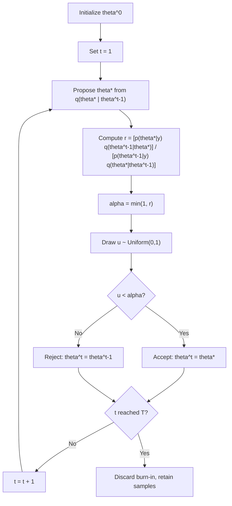

## Metropolis-Hastings Algorithms

### Conceptual Foundation

The Metropolis-Hastings (M-H) algorithm is a general-purpose Markov Chain Monte Carlo (MCMC) method for drawing samples from a target distribution — typically a Bayesian posterior $p(\theta \mid y)$ — when that distribution is known only up to a normalizing constant and cannot be sampled from directly. Unlike Gibbs sampling, which requires known full conditional distributions, Metropolis-Hastings requires only the ability to evaluate the target density (up to proportionality) at any point, making it far more broadly applicable.

The algorithm constructs a Markov chain whose stationary distribution is the target posterior by proposing candidate moves from a **proposal distribution** and accepting or rejecting them according to a carefully designed acceptance probability that guarantees the chain converges to the correct target distribution.

### Algorithm

Given a target density $p(\theta \mid y) \propto p(y \mid \theta)p(\theta)$ and a proposal distribution $q(\theta' \mid \theta)$:

1. Initialize $\theta^{(0)}$ at some starting value
2. For iteration $t = 1, 2, \ldots, T$:
   - Propose a candidate $\theta^* \sim q(\theta^* \mid \theta^{(t-1)})$
   - Compute the acceptance ratio:

$$r = \frac{p(\theta^* \mid y) \, q(\theta^{(t-1)} \mid \theta^*)}{p(\theta^{(t-1)} \mid y) \, q(\theta^* \mid \theta^{(t-1)})}$$

- Set acceptance probability $\alpha = \min(1, r)$
- With probability $\alpha$, accept: $\theta^{(t)} = \theta^*$
- Otherwise, reject: $\theta^{(t)} = \theta^{(t-1)}$ (the chain stays at its current value)

3. Discard burn-in iterations; retain the remainder as posterior samples

Since $p(\theta \mid y)$ is used only as a ratio $p(\theta^* \mid y)/p(\theta^{(t-1)} \mid y)$, the unknown normalizing constant $p(y)$ cancels out entirely — this is the key computational advantage that makes M-H usable even when the marginal likelihood is intractable.

### Random-Walk Metropolis-Hastings

The most common variant uses a **symmetric proposal distribution**, typically:

$$\theta^* = \theta^{(t-1)} + \epsilon, \qquad \epsilon \sim N(0, s^2)$$

Because $q(\theta' \mid \theta) = q(\theta \mid \theta')$ under a symmetric proposal (the probability of proposing from $\theta$ to $\theta'$ equals the probability of proposing from $\theta'$ to $\theta$), the proposal density terms cancel, simplifying the acceptance ratio to:

$$r = \frac{p(\theta^* \mid y)}{p(\theta^{(t-1)} \mid y)}$$

This special case is the original **Metropolis algorithm** (1953); Hastings' 1970 generalization allows asymmetric proposals, requiring the full ratio with proposal densities included.

### Worked Example: Sampling a Posterior with No Closed Form

**Setup**: Suppose data $y_i \sim \text{Cauchy}(\theta, 1)$ (a heavy-tailed likelihood with no conjugate prior), and a prior $\theta \sim N(0, 10)$. The posterior:

$$p(\theta \mid y) \propto N(\theta; 0, 10) \times \prod_{i=1}^{n} \frac{1}{\pi(1 + (y_i - \theta)^2)}$$

has no standard closed form because the Cauchy likelihood is not conjugate to a normal prior.

**M-H procedure**:

1. Start at $\theta^{(0)} = 0$
2. Propose $\theta^* \sim N(\theta^{(t-1)}, s^2)$ with, e.g., $s = 0.5$
3. Compute $r = p(\theta^* \mid y) / p(\theta^{(t-1)} \mid y)$ by directly evaluating the (unnormalized) posterior density at both points
4. Accept $\theta^*$ with probability $\min(1, r)$; otherwise retain $\theta^{(t-1)}$

**Numerical illustration**: If $\theta^{(t-1)} = 1.2$ and the proposal draws $\theta^* = 1.65$, with computed unnormalized posterior densities $p(\theta^* \mid y) = 0.0034$ and $p(\theta^{(t-1)} \mid y) = 0.0041$:

$$r = \frac{0.0034}{0.0041} \approx 0.829$$

Since $r < 1$, the proposal is accepted with probability $0.829$ rather than automatically — a uniform random draw $u \sim U(0,1)$ is generated, and the move is accepted if $u < 0.829$.

### Metropolis-Hastings Iteration Flow

### Choice of Proposal Distribution and Step Size

The proposal distribution's scale parameter $s$ critically affects sampling efficiency:

- **Too small a step size**: nearly every proposal is accepted, but the chain moves very slowly through the parameter space, producing highly autocorrelated samples and slow exploration of the full posterior
- **Too large a step size**: proposals frequently land in low-density regions and are rejected, so the chain gets "stuck" at the same value for many iterations, again producing high autocorrelation
- **Well-tuned step size**: balances exploration and acceptance, typically targeting an acceptance rate around **20–50%** for random-walk proposals in multivariate settings, with the often-cited theoretical optimal rate near 23.4% for high-dimensional random-walk Metropolis under specific idealized conditions [Unverified — the precise optimal rate depends on target distribution shape and dimensionality; the ~23% figure derives from asymptotic theory under specific regularity assumptions and should be treated as a general guideline rather than a universal target]

### Acceptance Rate vs. Step Size Relationship

<svg xmlns="http://www.w3.org/2000/svg" viewBox="0 0 650 380">
<text x="325" y="25" font-size="16" font-weight="bold" text-anchor="middle" fill="#222">Step Size vs Acceptance Rate and Mixing Efficiency (svg_diagram)</text>
<line x1="70" y1="320" x2="600" y2="320" stroke="#333" stroke-width="1.5" />
<line x1="70" y1="320" x2="70" y2="60" stroke="#333" stroke-width="1.5" />
<text x="335" y="355" font-size="13" text-anchor="middle" fill="#333">Proposal Step Size (s)</text>
<text x="35" y="190" font-size="13" text-anchor="middle" fill="#333" transform="rotate(-90 35 190)">Acceptance Rate</text>

<path d="M 90 75 C 200 90, 300 150, 400 230 C 470 280, 540 305, 580 315" fill="none" stroke="`#2b6cb0`" stroke-width="2.5" />

<text x="480" y="240" font-size="11" fill="`#2b6cb0`">Acceptance rate (decreasing)</text>

<path d="M 90 300 C 160 220, 230 140, 300 130 C 370 140, 440 220, 510 290 C 540 305, 560 312, 580 316" fill="none" stroke="`#c05621`" stroke-width="2.5" stroke-dasharray="6,3" />

<text x="230" y="115" font-size="11" fill="`#c05621`">Mixing efficiency (inverted-U)</text>

<line x1="280" y1="320" x2="280" y2="60" stroke="#555" stroke-width="1" stroke-dasharray="3,3" />
<line x1="340" y1="320" x2="340" y2="60" stroke="#555" stroke-width="1" stroke-dasharray="3,3" />
<rect x="280" y="60" width="60" height="260" fill="#68d391" opacity="0.15" />
<text x="310" y="55" font-size="11" text-anchor="middle" fill="#2f855a">Well-tuned zone</text>

<text x="100" y="335" font-size="10" fill="#555">small s</text>

<text x="540" y="335" font-size="10" fill="#555">large s</text>

</svg>

### Multivariate and Blocked Updates

For a parameter vector $\theta \in \mathbb{R}^p$, Metropolis-Hastings can update:

- **All components jointly** in a single multivariate proposal (e.g., $\theta^* \sim N(\theta^{(t-1)}, S)$ for some covariance matrix $S$)
- **One component at a time** (analogous to single-parameter Gibbs updates, but using an M-H accept/reject step for each), useful when full conditionals lack closed form

**Adaptive Metropolis**: modern implementations often adapt the proposal covariance matrix $S$ during an initial tuning phase based on the empirical covariance of prior draws, improving efficiency in correlated, high-dimensional posteriors without requiring manual tuning of each parameter's step size.

### Metropolis-Within-Gibbs

When a hierarchical or otherwise multi-parameter model has some full conditionals that are standard (conjugate) and others that are not, a **hybrid sampler** applies Gibbs updates where conjugacy holds and Metropolis-Hastings steps (embedded within the same overall iteration) where it doesn't. This combines the efficiency of exact conjugate draws with the flexibility of M-H for non-conjugate components, and is extremely common in applied hierarchical Bayesian modeling.

### Metropolis-Hastings vs. Gibbs Sampling vs. Hamiltonian Monte Carlo

| Method | Requires proposal tuning | Requires known conditionals | Gradient information used | Typical high-dimensional efficiency |
| --- | --- | --- | --- | --- |
| Metropolis-Hastings | Yes (step size / covariance) | No | No | Can degrade substantially as dimensionality increases |
| Gibbs sampling | Minimal (for conjugate steps) | Yes | No | Efficient if conjugate; slow if parameters highly correlated |
| Hamiltonian Monte Carlo / NUTS | Minimal (often auto-tuned) | No | Yes (uses posterior gradient) | Generally more efficient in high dimensions |

[Inference] These are general tendencies documented widely in the MCMC literature; actual relative performance depends on the specific target distribution's shape, dimensionality, and correlation structure, so results can vary by application.

### Convergence Diagnostics

As with all MCMC methods, standard diagnostics are essential:

- **Trace plots** to visually assess stabilization and absence of trends or stuck periods
- **$\hat{R}$ (Gelman-Rubin statistic)** across multiple independently initialized chains
- **Effective sample size (ESS)**, particularly important for M-H since random-walk proposals often produce more autocorrelated chains than Gibbs sampling or HMC
- **Acceptance rate monitoring** as a proposal-tuning diagnostic specific to M-H (not applicable to Gibbs, since Gibbs acceptance is always 1)

### Common Pitfalls

- **Poorly tuned proposal step size**, leading to either near-total rejection (chain frozen) or near-total acceptance (inefficient small steps) — both produce misleadingly "smooth-looking" but slowly-mixing chains
- **Insufficient burn-in**, retaining samples still influenced by an arbitrary starting point
- **Ignoring the proposal density ratio** when using an asymmetric proposal distribution — omitting the $q(\theta^{(t-1)} \mid \theta^*) / q(\theta^* \mid \theta^{(t-1)})$ correction term breaks detailed balance and yields draws from the wrong target distribution
- **Assuming a single chain's trace plot is sufficient evidence of convergence** — multiple chains from dispersed starting points are the standard way to detect multimodality or slow mixing that a single chain might mask
- **Fixed (non-adaptive) proposal scale in high dimensions**, which becomes increasingly inefficient as the number of parameters grows, motivating adaptive or gradient-based alternatives

### Related Topics

- Gibbs sampling and Metropolis-within-Gibbs hybrids
- Hamiltonian Monte Carlo and the No-U-Turn Sampler (NUTS)
- Detailed balance and Markov chain stationary distributions
- Adaptive MCMC methods (adaptive proposal covariance)
- MCMC convergence diagnostics (R-hat, effective sample size, trace plots)
- Simulated annealing and optimization analogues of M-H
- Reversible-jump MCMC for variable-dimension model spaces
- Probabilistic programming implementations (Stan, PyMC, BUGS, JAGS)