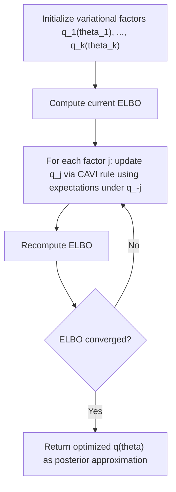

## Variational Inference

### Conceptual Foundation

Variational inference (VI) is an approximate Bayesian inference technique that reframes posterior computation as an **optimization problem** rather than a sampling problem. Instead of drawing samples from the posterior $p(\theta \mid y)$ (as MCMC does), VI selects the closest distribution $q(\theta)$ to $p(\theta \mid y)$ from a tractable family of distributions $\mathcal{Q}$, where "closest" is measured using Kullback-Leibler (KL) divergence.

This reframing trades exactness for speed: VI typically converges far faster than MCMC on large datasets or high-dimensional models, at the cost of producing an approximation rather than asymptotically exact posterior samples.

### The Optimization Objective

The goal is to find:

$$q^*(\theta) = \arg\min_{q \in \mathcal{Q}} \text{KL}(q(\theta) \, \| \, p(\theta \mid y))$$

where the KL divergence is defined as:

$$\text{KL}(q \, \| \, p) = \int q(\theta) \log \frac{q(\theta)}{p(\theta \mid y)} \, d\theta = E_q\left[\log \frac{q(\theta)}{p(\theta \mid y)}\right]$$

Directly minimizing this is intractable because $p(\theta \mid y)$ itself contains the unknown normalizing constant $p(y)$. The key algebraic trick is to expand the KL divergence and isolate a computable quantity:

$$\log p(y) = \text{ELBO}(q) + \text{KL}(q(\theta) \, \| \, p(\theta \mid y))$$

Since $\log p(y)$ is a fixed (though unknown) constant with respect to $q$, and KL divergence is always non-negative, **maximizing the Evidence Lower Bound (ELBO)** is equivalent to minimizing the KL divergence to the true posterior.

### The Evidence Lower Bound (ELBO)

The ELBO is defined as:

$$\text{ELBO}(q) = E_q[\log p(y, \theta)] - E_q[\log q(\theta)]$$

which can equivalently be decomposed as:

$$\text{ELBO}(q) = E_q[\log p(y \mid \theta)] - \text{KL}(q(\theta) \, \| \, p(\theta))$$

This decomposition has an intuitive interpretation:

- The first term, $E_q[\log p(y \mid \theta)]$, rewards $q$ for placing mass on parameter values that explain the observed data well (**expected log-likelihood**)
- The second term, $-\text{KL}(q(\theta) \| p(\theta))$, penalizes $q$ for straying too far from the prior (**regularization toward the prior**)

Because $\text{ELBO}(q) \leq \log p(y)$ always holds (it is a *lower bound* on the log marginal likelihood, hence the name), the ELBO also serves as a useful quantity for model comparison and convergence monitoring during optimization.

### Mean-Field Variational Inference

The most common simplifying assumption is the **mean-field approximation**, which factorizes $q$ across parameter blocks, assuming posterior independence between them:

$$q(\theta) = \prod_{j=1}^{k} q_j(\theta_j)$$

This assumption is almost always false for the true posterior (parameters are typically correlated), but it makes the optimization tractable by allowing each factor $q_j$ to be optimized while holding the others fixed, in a coordinate-ascent procedure analogous in structure to Gibbs sampling but optimizing rather than sampling.

**Coordinate Ascent Variational Inference (CAVI) update rule**: for each factor, the optimal form given the others fixed is:

$$q_j^*(\theta_j) \propto \exp\left(E_{q_{-j}}[\log p(\theta, y)]\right)$$

where $q_{-j}$ denotes the product of all factors except $j$. This is iterated until the ELBO converges.

### Worked Example: Mean-Field VI for a Gaussian Mixture-Free Normal Model

**Setup**: Data $y_i \sim N(\mu, \tau^{-1})$ (using precision $\tau = 1/\sigma^2$ for conjugate convenience), with priors $\mu \sim N(\mu_0, \lambda_0^{-1})$ and $\tau \sim \text{Gamma}(a_0, b_0)$.

Mean-field assumption: $q(\mu, \tau) = q_\mu(\mu) \, q_\tau(\tau)$

**CAVI updates** (derived by taking expectations of the log joint density with respect to the other factor):

$$q_\mu(\mu) = N(\mu_n, \lambda_n^{-1}), \qquad \lambda_n = \lambda_0 + n E_q[\tau]$$

$$q_\tau(\tau) = \text{Gamma}(a_n, b_n), \qquad a_n = a_0 + \frac{n}{2}$$

The update for $\mu_n$ and $b_n$ depend on $E_q[\tau]$ and $E_q[\mu], E_q[\mu^2]$ respectively, creating a **coupled fixed-point iteration**: each factor's parameters depend on expectations taken under the current estimate of the other factor, so the algorithm alternates between updating $q_\mu$ and $q_\tau$ until the ELBO stabilizes.

**Numerical intuition**: Starting from an initial guess (e.g., $E_q[\tau]^{(0)} = 1$), the $\mu$ factor is updated, its new expected value and variance are computed, then plugged into the $\tau$ update, and the cycle repeats — conceptually parallel to Gibbs sampling's alternating conditional draws, but each step computes an optimal distributional *update* rather than drawing a *random sample*.

### CAVI Iteration Flow

### Variational Inference vs. MCMC

| Aspect | Variational Inference | MCMC (Gibbs, M-H, HMC) |
| --- | --- | --- |
| Nature of result | Deterministic optimization to an approximate distribution | Stochastic samples that are asymptotically exact |
| Speed | Generally much faster, especially on large datasets | Typically slower, especially for large $n$ or high dimensions |
| Accuracy | Approximate; underestimates posterior variance under mean-field assumptions | Asymptotically exact given sufficient iterations |
| Convergence assessment | Monitor ELBO for convergence to a local optimum | R-hat, effective sample size, trace plots |
| Uncertainty quantification | Can be systematically too narrow (especially under mean-field) | Reflects true posterior spread given enough samples |
| Scalability | Well-suited to stochastic optimization on mini-batches for large data | Full-data likelihood evaluation typically needed per iteration |

[Inference] The relative speed advantage of VI over MCMC is well documented in the literature for large-scale and high-dimensional problems, though the magnitude of the speed-accuracy trade-off is model- and implementation-dependent, so specific runtime comparisons should be benchmarked per application rather than assumed universally.

### Known Limitation: Variance Underestimation

A well-documented property of mean-field variational inference is that it tends to **underestimate posterior variance and correlation structure**, because minimizing $\text{KL}(q \| p)$ (rather than $\text{KL}(p \| q)$) penalizes $q$ heavily for placing mass where $p$ has low density, which drives $q$ to concentrate tightly around a single mode of $p$ rather than spreading to cover its full support. This asymmetric behavior of the "reverse KL" objective is a structural property of the optimization criterion, not merely an implementation artifact.

**Illustration**: For a posterior with strong correlation between two parameters (e.g., an elongated, tilted elliptical contour), a mean-field factorized approximation $q(\theta_1)q(\theta_2)$ can only represent axis-aligned uncertainty, and will typically fit an ellipse inscribed within the true posterior's contours rather than matching its full extent — understating marginal variances and entirely missing the correlation.

### Extensions Beyond Mean-Field

- **Structured variational inference**: allows $q$ to retain some dependency structure between parameter blocks (e.g., factorizing by group in hierarchical models while preserving within-group correlations), improving approximation quality at some cost to tractability
- **Automatic Differentiation Variational Inference (ADVI)**: transforms constrained parameters to an unconstrained space, assumes a (typically full-rank or mean-field) Gaussian variational family in that unconstrained space, and optimizes the ELBO via stochastic gradient ascent using automatic differentiation — this is the approach implemented in Stan's variational inference mode and similar probabilistic programming tools, removing the need to hand-derive CAVI update equations for each new model
- **Normalizing flows**: compose a sequence of invertible, learnable transformations applied to a simple base distribution (e.g., standard normal) to construct highly flexible variational families capable of capturing multimodality and complex correlation structure beyond what mean-field or simple parametric families allow
- **Stochastic Variational Inference (SVI)**: applies stochastic gradient ascent on the ELBO using mini-batches of data, enabling VI to scale to datasets too large for full-batch computation at each iteration — this is the standard approach for VI in large-scale machine learning contexts

### Black-Box / Gradient-Based Variational Inference

Modern VI implementations avoid model-specific hand-derivation of CAVI updates by instead using **stochastic gradient ascent directly on the ELBO**, using Monte Carlo estimates of the ELBO's gradient with respect to variational parameters. The **reparameterization trick** is central to this: rather than sampling $\theta \sim q_\phi(\theta)$ directly (which is not differentiable with respect to $\phi$), a base random variable $\epsilon$ is sampled from a fixed, parameter-free distribution, and $\theta$ is expressed as a differentiable deterministic transformation $\theta = g_\phi(\epsilon)$ — for example, $\theta = \mu + \sigma \epsilon$ with $\epsilon \sim N(0,1)$ for a Gaussian variational family. This allows gradients of the ELBO with respect to $\phi = (\mu, \sigma)$ to be computed via standard backpropagation.

### Model Comparison Using the ELBO

Because the ELBO lower-bounds $\log p(y)$, differences in the optimized ELBO across competing models are sometimes used as an approximate (and computationally cheap) substitute for comparing marginal likelihoods directly — though this comparison inherits whatever approximation error the variational family introduces, and a tighter-fitting variational family for one model but not another can distort such comparisons. [Inference] The reliability of ELBO-based model comparison depends heavily on how comparably tight the variational approximation is across the competing models, which is not guaranteed and should be interpreted cautiously rather than treated as equivalent to comparing true marginal likelihoods.

### Common Pitfalls

- **Interpreting variational posterior variances at face value** without accounting for the well-known tendency of mean-field VI toward variance underestimation
- **Convergence to a local optimum of the ELBO** rather than the global optimum, since the ELBO surface is generally non-convex for most non-trivial models — multiple random restarts or careful initialization are standard mitigation strategies
- **Ignoring parameter correlations** entirely under a mean-field assumption when the true posterior has strong dependencies, leading to systematically misleading marginal credible intervals
- **Treating ELBO convergence as equivalent to posterior accuracy** — a converged ELBO indicates the optimization has found a stable point within the chosen variational family, not that the family itself is a good approximation to the true posterior
- **Using VI outputs directly for decisions requiring accurate tail probabilities** (e.g., rare-event risk assessment), where variance underestimation can be particularly consequential

### Related Topics

- Kullback-Leibler divergence and information-theoretic foundations
- Markov Chain Monte Carlo methods (Gibbs sampling, Metropolis-Hastings, Hamiltonian Monte Carlo) as exact alternatives
- Automatic Differentiation Variational Inference (ADVI) in Stan and PyMC
- Normalizing flows for flexible variational families
- Stochastic gradient optimization and the reparameterization trick
- Expectation-Maximization (EM) algorithm as a related optimization-based inference technique
- Bayesian model comparison and marginal likelihood estimation
- Variational autoencoders as a machine learning application of VI principles