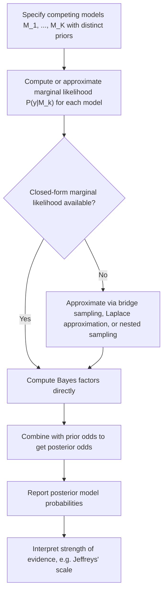

## Bayesian Model Comparison and Bayes Factors

### Conceptual Foundation

Bayesian model comparison evaluates competing statistical models by their relative support from observed data, integrating over parameter uncertainty within each model rather than relying on point estimates. The central tool for this comparison is the **Bayes factor**, which quantifies the relative evidence the data provide for one model over another.

Given two competing models $M_1$ and $M_2$, each with its own parameters and priors, Bayesian model comparison starts from the posterior odds:

$$\frac{P(M_1 \mid y)}{P(M_2 \mid y)} = \frac{P(y \mid M_1)}{P(y \mid M_2)} \times \frac{P(M_1)}{P(M_2)}$$

This decomposes posterior odds into the **Bayes factor** $BF_{12} = P(y \mid M_1)/P(y \mid M_2)$ multiplied by the **prior odds** $P(M_1)/P(M_2)$. The Bayes factor is precisely the factor by which prior odds are updated in light of the data — it isolates the evidential contribution of the data itself, independent of prior model preferences.

### The Marginal Likelihood

Each model's contribution to the Bayes factor is its **marginal likelihood** (also called model evidence), obtained by integrating the likelihood over the prior for that model's parameters:

$$P(y \mid M_k) = \int p(y \mid \theta_k, M_k) \, p(\theta_k \mid M_k) \, d\theta_k$$

This integral automatically penalizes model complexity: a model with a diffuse prior spread over a wide parameter range that includes many values inconsistent with the data will have a lower marginal likelihood than a more parsimonious model whose prior mass concentrates near parameter values the data actually support. This built-in complexity penalty is often referred to as an automatic **Occam's razor** effect in Bayesian model comparison — more flexible models are not automatically favored, unlike likelihood-ratio comparisons based on maximized likelihood alone.

### Bayes Factor Definition and Interpretation

$$BF_{12} = \frac{P(y \mid M_1)}{P(y \mid M_2)}$$

- $BF_{12} > 1$: data favor $M_1$ over $M_2$
- $BF_{12} < 1$: data favor $M_2$ over $M_1$
- $BF_{12} = 1$: data provide no discriminating evidence between the models

**Jeffreys' scale** (a commonly cited, though informal, interpretive guideline):

| $BF_{12}$ | Strength of evidence for $M_1$ |
| --- | --- |
| 1 to 3 | Barely worth mentioning |
| 3 to 10 | Substantial |
| 10 to 30 | Strong |
| 30 to 100 | Very strong |
| > 100 | Decisive |

[Unverified — this scale is a widely cited heuristic convention originating from Harold Jeffreys, but it is an informal guideline rather than a derived statistical threshold, and different sources present slightly varying category boundaries and labels]

### Worked Example: Comparing Two Nested Models

**Setup**: Suppose $y_i \sim N(\theta, 1)$ for $i = 1, \ldots, n$, and two competing hypotheses:

- $M_1$: $\theta = 0$ (a fixed point-null model)
- $M_2$: $\theta \sim N(0, \tau^2)$ (a diffuse alternative with $\tau^2 = 4$)

**Marginal likelihood under $M_1$** (no free parameters, likelihood evaluated directly at $\theta = 0$):

$$P(y \mid M_1) = \prod_{i=1}^{n} \frac{1}{\sqrt{2\pi}} \exp\left(-\frac{y_i^2}{2}\right)$$

**Marginal likelihood under $M_2$** (integrating over the prior on $\theta$, which for a normal-normal setup has a closed form):

$$P(y \mid M_2) = \int N(\bar{y}; \theta, 1/n) \, N(\theta; 0, \tau^2) \, d\theta = N\left(\bar{y}; 0, \tau^2 + \frac{1}{n}\right) \text{(evaluated appropriately over the joint likelihood)}$$

**Numerical illustration**: With $n = 20$ observations and $\bar{y} = 0.3$, both marginal likelihoods can be computed directly, and their ratio gives $BF_{12}$. If $\bar{y}$ is close to 0 (consistent with the null), $BF_{12} > 1$, favoring the simpler point-null model; if $\bar{y}$ is far from 0, $BF_{12} < 1$, favoring the diffuse alternative that can accommodate larger effect sizes.

[Inference] The precise numeric value of $BF_{12}$ in this example depends on the exact observed data and specific prior variance chosen for $M_2$; the qualitative direction of evidence (favoring the null when data are near zero, favoring the alternative when data are far from zero) follows from the general behavior of this class of models, but exact magnitudes require the specific computation.

### Bayes Factors vs. Posterior Model Probabilities

Given a Bayes factor and prior odds, posterior model probabilities can be directly recovered. For $K$ competing models with prior probabilities $P(M_k)$:

$$P(M_k \mid y) = \frac{P(y \mid M_k) \, P(M_k)}{\sum_{j=1}^{K} P(y \mid M_j) \, P(M_j)}$$

With equal prior probabilities across models ($P(M_k) = 1/K$ for all $k$), posterior model probabilities reduce to normalized marginal likelihoods — the Bayes factor comparison directly determines relative posterior support.

### Model Comparison Workflow

### Computational Challenges

Unlike posterior sampling for a single model (where the normalizing constant cancels in Metropolis-Hastings ratios), computing the marginal likelihood itself requires evaluating the full integral $\int p(y \mid \theta)p(\theta)d\theta$, which is typically intractable except in conjugate settings. Standard MCMC posterior samples from a single model do **not** directly provide this integral, motivating specialized techniques:

- **Laplace approximation**: approximates the posterior as Gaussian around its mode and uses the resulting analytic Gaussian integral to approximate the marginal likelihood — computationally cheap but can be inaccurate for skewed or multimodal posteriors
- **Bridge sampling**: uses posterior samples from one or more models along with an auxiliary "bridge" distribution to estimate ratios of normalizing constants, offering substantially improved accuracy over naive Monte Carlo estimators of the marginal likelihood
- **Nested sampling**: a specialized sampling algorithm that directly targets estimation of the marginal likelihood by exploring nested contours of increasing likelihood, simultaneously producing posterior samples as a byproduct
- **Savage-Dickey density ratio**: for nested models (where $M_1$ is a special case of $M_2$ with a parameter fixed at a specific value), the Bayes factor can be computed as the ratio of the posterior to prior density of $M_2$ evaluated at that fixed value — a substantial computational shortcut avoiding full marginal likelihood integration
- **Harmonic mean estimator**: an older, simple approach using posterior samples, now largely discouraged in practice due to well-documented numerical instability and potentially infinite variance in the estimator [Unverified — while instability of this estimator is widely discussed in the methodological literature, the severity in any specific application depends on the particular posterior geometry]

### Bayes Factors vs. Information Criteria (AIC/BIC/WAIC)

| Method | Basis | Complexity penalty | Requires marginal likelihood |
| --- | --- | --- | --- |
| Bayes factor | Full marginal likelihood ratio | Automatic (via prior integration) | Yes |
| BIC (Bayesian Information Criterion) | Asymptotic approximation to $-2\log(\text{marginal likelihood})$ | Approximate, based on parameter count and $n$ | No (large-sample approximation) |
| AIC (Akaike Information Criterion) | Expected out-of-sample predictive accuracy | Fixed penalty per parameter | No |
| WAIC / LOO-CV | Estimated out-of-sample predictive accuracy using full posterior | Effective number of parameters, estimated from posterior variance | No (uses posterior samples directly) |

BIC is sometimes described as an asymptotic approximation to $-2$ times the log Bayes factor under certain regularity conditions and specific "unit information" prior assumptions, though this approximation can be poor for small samples or models where those regularity conditions do not hold. [Inference] The quality of BIC as a Bayes factor proxy depends on how closely the actual analysis matches the assumptions under which the approximation was derived (e.g., large $n$ relative to the number of parameters), and should not be treated as interchangeable with an exact Bayes factor in all settings.

### Sensitivity to Prior Specification

A well-documented feature (and frequent criticism) of Bayes factors is their **sensitivity to prior choice**, especially for diffuse or improper priors on parameters unique to one model (not shared with the other). This is sometimes called the **Jeffreys-Lindley paradox**: as a prior on an alternative model's parameter becomes increasingly diffuse, the Bayes factor can shift arbitrarily far in favor of the simpler (null) model, even as that same diffuse prior might seem "non-informative" or innocuous from a purely predictive standpoint. This stands in contrast to posterior parameter estimation *within* a single model, which is typically much less sensitive to prior diffuseness as sample size grows.

**Practical implication**: unlike within-model posterior inference, Bayes factors cannot generally be computed using improper (non-normalizable) priors, since the marginal likelihood integral may not converge or may depend arbitrarily on how an improper prior is truncated or normalized.

### Common Pitfalls

- **Using diffuse or default priors without checking sensitivity**, given the well-documented Jeffreys-Lindley paradox — Bayes factor conclusions should generally be checked across a reasonable range of alternative prior specifications
- **Conflating Bayes factors with posterior model probabilities** — a Bayes factor alone does not determine posterior model probability without specifying prior model odds
- **Applying naive Monte Carlo or harmonic-mean estimators** to posterior samples for marginal likelihood estimation, given their well-known potential for high variance and numerical instability
- **Treating BIC differences as exact Bayes factor equivalents** without verifying that the large-sample approximation conditions underlying BIC are reasonably satisfied for the models and sample size at hand
- **Ignoring model complexity differences when interpreting Jeffreys' scale**, since the scale describes strength of evidence for the data at hand, not overall model adequacy — a model can "win" a Bayes factor comparison against a poor alternative while still fitting the data badly in absolute terms

### Related Topics

- Marginal likelihood estimation techniques (bridge sampling, nested sampling, Laplace approximation)
- Posterior predictive checks and absolute model fit assessment
- Widely Applicable Information Criterion (WAIC) and leave-one-out cross-validation (LOO-CV)
- Savage-Dickey density ratio for nested model comparison
- Jeffreys-Lindley paradox and prior sensitivity in hypothesis testing
- Bayesian hypothesis testing frameworks (point-null vs. diffuse alternative formulations)
- Bayesian model averaging across multiple candidate models
- Reversible-jump MCMC for joint sampling across model spaces