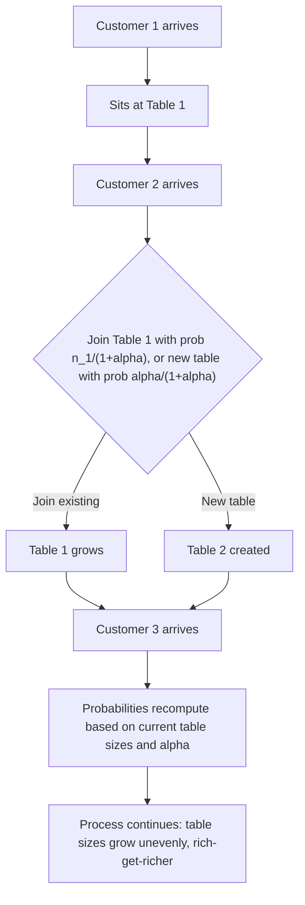

## Bayesian Nonparametric Methods

### Conceptual Foundation

Bayesian nonparametric (BNP) methods place priors over **infinite-dimensional spaces** — spaces of functions, distributions, or partitions — rather than over a fixed, finite set of parameters. This allows model complexity to grow adaptively with the data, rather than being fixed in advance (as in a standard parametric model with a predetermined number of parameters or clusters).

The term "nonparametric" is somewhat misleading: these models still involve parameters, but the *effective number* of parameters is not fixed a priori and can grow as more data are observed. This makes BNP methods particularly suited to problems where the "correct" model complexity (number of clusters, number of mixture components, shape of a regression function) is itself unknown and should be learned from the data.

### Core Motivation: The Problem of Fixed Model Complexity

In a standard finite mixture model, the number of components $K$ must be specified in advance or selected via model comparison (e.g., using Bayes factors or information criteria across several fixed-$K$ models). Bayesian nonparametric approaches instead place a prior directly over the **space of all possible partitions or component counts**, allowing the number of active components supported by the posterior to be inferred jointly with all other parameters, and to grow with sample size as needed.

### The Dirichlet Process

The **Dirichlet Process (DP)** is the foundational building block of BNP for clustering and mixture modeling. A Dirichlet Process $DP(\alpha, G_0)$ is a distribution over probability distributions, parameterized by:

- A **base distribution** $G_0$ (specifying where probability mass tends to concentrate on average)
- A **concentration parameter** $\alpha > 0$ (controlling how similar draws from the DP are to $G_0$ — larger $\alpha$ produces distributions closer to $G_0$ itself; smaller $\alpha$ produces distributions concentrated on fewer distinct values)

A draw $G \sim DP(\alpha, G_0)$ is almost surely a **discrete distribution**, even when $G_0$ is continuous — this is a defining and somewhat counterintuitive property that makes the DP naturally suited to clustering: draws from $G$ take only a countable set of distinct values, each with some probability mass, effectively partitioning observations into an unbounded number of potential groups.

### Stick-Breaking Construction

One explicit constructive representation of a DP draw is the **stick-breaking process**:

$$\pi_k = \beta_k \prod_{l=1}^{k-1}(1 - \beta_l), \qquad \beta_k \sim \text{Beta}(1, \alpha)$$

$$\theta_k \sim G_0, \qquad G = \sum_{k=1}^{\infty} \pi_k \, \delta_{\theta_k}$$

**Interpretation**: imagine breaking a unit-length "stick" repeatedly — at each step, break off a $\beta_k$ fraction of what remains, assign that piece as the weight $\pi_k$ for a newly drawn "location" $\theta_k \sim G_0$, then continue breaking the remaining stick for subsequent weights. This produces an infinite sequence of weights $\pi_k$ that sum to 1, paired with an infinite sequence of atom locations $\theta_k$, together defining a discrete distribution $G$.

### Chinese Restaurant Process

An equivalent representation, more directly useful for Gibbs-sampling-based inference, is the **Chinese Restaurant Process (CRP)** — a sequential description of how data points get assigned to clusters:

- Customer 1 sits at the first table
- Customer $n+1$, given $n$ customers already seated at $K$ occupied tables with $n_k$ customers at table $k$, either:
  - Joins table $k$ with probability $\frac{n_k}{n + \alpha}$
  - Starts a new table with probability $\frac{\alpha}{n + \alpha}$

This "rich-get-richer" dynamic (larger existing tables are more likely to attract new customers) produces a natural, adaptive clustering structure, with the number of occupied tables (clusters) growing roughly logarithmically with $n$ — the *expected* number of clusters under a CRP grows as $O(\alpha \log n)$ [Unverified — this asymptotic growth rate is a standard theoretical result under specific CRP formulations, though exact behavior can depend on implementation details and finite-sample effects].

### Chinese Restaurant Process Illustration

### Dirichlet Process Mixture Models

The DP becomes practically useful for clustering when used as a **prior over mixture component parameters** in a Dirichlet Process Mixture Model (DPMM):

$$y_i \mid \theta_i \sim p(y_i \mid \theta_i), \qquad \theta_i \sim G, \qquad G \sim DP(\alpha, G_0)$$

Because $G$ is discrete, multiple observations $\theta_i$ will share identical values with positive probability, naturally inducing a clustering of observations into groups sharing the same underlying parameter — this is the mechanism by which DPMMs perform **model-based clustering with an unbounded, data-determined number of clusters**, in contrast to a finite mixture model requiring $K$ to be fixed in advance.

**Practical example**: In customer segmentation, rather than pre-specifying "5 customer segments," a DPMM allows the data to determine whether 3, 7, or 15 segments best explain the observed purchasing behavior, with the concentration parameter $\alpha$ controlling the prior tendency toward more or fewer segments.

### Inference for Dirichlet Process Mixtures

Because the DP has infinitely many potential components, direct enumeration is impossible; practical inference relies on:

- **Marginal (collapsed) Gibbs samplers**: using the CRP representation directly, sampling cluster assignments for each observation conditional on all others, integrating out the infinite-dimensional $G$ analytically via conjugacy between $G_0$ and the observation-level likelihood
- **Slice sampling / retrospective sampling**: truncates or dynamically manages the infinite sum in the stick-breaking representation to make direct sampling of $G$ tractable
- **Variational inference for DPMMs**: truncates the stick-breaking representation to a finite (but generously large) number of components and applies mean-field variational updates, trading some accuracy for substantially faster convergence than MCMC
- **Blocked Gibbs samplers with truncation**: approximate the infinite mixture with a large but finite number of components (a "truncated DP"), simplifying implementation while remaining a close approximation when the truncation level is set generously higher than the expected number of active clusters

### Related Bayesian Nonparametric Priors

- **Pitman-Yor Process**: a two-parameter generalization of the DP ($\alpha$ and a discount parameter $d$) that produces power-law tail behavior in cluster size distributions, often better matching empirically observed cluster-size patterns (e.g., word frequency distributions in natural language) than the DP's implied cluster-size behavior
- **Hierarchical Dirichlet Process (HDP)**: extends the DP to hierarchical/grouped data settings (e.g., topic modeling across multiple documents), allowing groups to share an underlying set of clusters/topics while having group-specific mixing proportions over those shared clusters
- **Gaussian Process (GP)**: a BNP prior over **functions** rather than partitions, used extensively in Bayesian nonparametric regression; any finite collection of function evaluations under a GP prior follows a multivariate normal distribution, with a covariance (kernel) function encoding smoothness assumptions
- **Indian Buffet Process (IBP)**: a nonparametric prior over binary feature-allocation matrices, used for latent feature models where each observation can possess an unbounded, data-determined number of latent binary features (rather than belonging to exactly one cluster, as in DPMMs)
- **Polya trees and Dirichlet process priors for density estimation**: used to place flexible nonparametric priors directly on unknown density functions themselves, rather than on discrete partition structure

### Gaussian Processes for Nonparametric Regression

**Setup**: For regression function $f(x)$, a GP prior specifies:

$$f(x) \sim GP(m(x), k(x, x'))$$

where $m(x)$ is a mean function (often set to 0) and $k(x, x')$ is a covariance kernel (e.g., the squared-exponential kernel $k(x,x') = \sigma^2 \exp(-\|x-x'\|^2 / (2\ell^2))$, with $\ell$ controlling smoothness/length-scale).

Given observed data with Gaussian noise, the **posterior predictive distribution** at new input points is available in closed form (a defining computational advantage of GP regression over most other BNP models):

$$f(x_*) \mid y \sim N(\mu_*(x_*), \sigma_*^2(x_*))$$

with $\mu_*$ and $\sigma_*^2$ computed via standard multivariate normal conditioning formulas applied to the joint GP covariance over observed and new points. This closed-form posterior predictive is a significant practical advantage relative to DPMMs and other BNP models requiring MCMC or variational approximation.

**Computational limitation**: exact GP inference requires inverting an $n \times n$ covariance matrix, an $O(n^3)$ operation that becomes prohibitive for large datasets, motivating a substantial literature on sparse GP approximations, inducing-point methods, and structured kernel approximations. [Inference] The specific scalability threshold at which exact GP inference becomes impractical depends on available computational resources and implementation, but $O(n^3)$ scaling is a well-documented structural property of the exact method.

### Bayesian Nonparametric Model Comparison Table

| Model | Space of the prior | Typical use case | Key parameter(s) |
| --- | --- | --- | --- |
| Dirichlet Process | Distributions (discrete, infinite support) | Clustering, mixture modeling | Concentration $\alpha$, base distribution $G_0$ |
| Pitman-Yor Process | Distributions with power-law tails | Clustering with heavy-tailed cluster sizes (e.g., linguistic data) | Concentration $\alpha$, discount $d$ |
| Hierarchical DP | Grouped/hierarchical distributions | Topic modeling, shared clustering across groups | Group-level and shared concentration parameters |
| Gaussian Process | Functions | Nonparametric regression, spatial/temporal modeling | Kernel hyperparameters (length-scale, variance) |
| Indian Buffet Process | Binary feature matrices | Latent feature discovery | Concentration parameter |

### Common Pitfalls

- **Misinterpreting "nonparametric" as "assumption-free"** — BNP models still encode strong structural assumptions (e.g., exchangeability, specific kernel choices, DP's implied cluster-size growth rate) that meaningfully shape inference
- **Overlooking sensitivity to the concentration parameter $\alpha$** in DP-based models — the prior on the number of clusters is directly controlled by $\alpha$, and posterior cluster counts can be sensitive to this choice, particularly with limited data
- **Assuming DP-based clustering always recovers the "true" number of clusters** — the DP's implied prior on cluster-size distribution (with its particular growth rate and size distribution) may not match the true underlying data-generating process, motivating alternatives like the Pitman-Yor process when heavier-tailed cluster sizes are expected
- **Applying exact Gaussian Process inference to large datasets** without considering the $O(n^3)$ computational cost, leading to impractical runtimes without sparse or approximate methods
- **Treating truncated stick-breaking approximations as exact** — truncation-based inference methods introduce approximation error that should be checked against the truncation level chosen (e.g., by verifying that the truncation level is comfortably larger than the number of clusters with non-negligible posterior mass)

### Related Topics

- Finite mixture models and model selection over the number of components
- Chinese Restaurant Process and exchangeable partition structures
- Gaussian Process regression and kernel methods
- Hierarchical Dirichlet Processes for topic modeling (e.g., latent Dirichlet allocation extensions)
- Sparse and scalable Gaussian Process approximations (inducing points, variational GPs)
- Indian Buffet Process and latent feature allocation models
- MCMC and variational inference methods for infinite mixture models
- Exchangeability and de Finetti's representation theorem as theoretical foundations