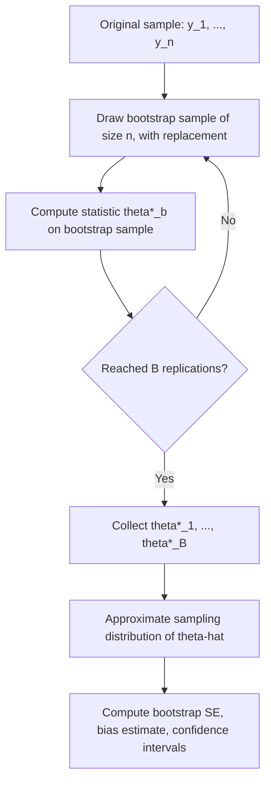

## Nonparametric Bootstrap

### Conceptual Foundation

The nonparametric bootstrap is a resampling technique for estimating the sampling distribution of a statistic without relying on distributional assumptions about the underlying population. Introduced by Bradley Efron in 1979, it approximates the unknown population distribution $F$ with the **empirical distribution function** $\hat{F}_n$ constructed directly from the observed sample, then repeatedly resamples from $\hat{F}_n$ to characterize the variability of a statistic of interest.

The core insight is the **plug-in principle**: since the true population distribution $F$ is unknown, the observed sample itself serves as the best available proxy for $F$, and resampling from the sample (with replacement) mimics the process of drawing new samples from the population.

### Algorithm

Given an observed sample $y_1, \ldots, y_n$ and a statistic of interest $\hat{\theta} = s(y_1, \ldots, y_n)$ (e.g., a mean, median, regression coefficient, correlation):

1. Draw a **bootstrap sample** $y_1^*, \ldots, y_n^*$ of size $n$ by sampling **with replacement** from the observed data $\{y_1, \ldots, y_n\}$
2. Compute the statistic on this resampled data: $\hat{\theta}^* = s(y_1^*, \ldots, y_n^*)$
3. Repeat steps 1–2 a large number of times ($B$ bootstrap replications, commonly $B = 1000$ to $10000$)
4. Use the resulting empirical distribution of $\hat{\theta}^{*(1)}, \ldots, \hat{\theta}^{*(B)}$ to approximate the sampling distribution of $\hat{\theta}$

Because sampling is with replacement, a given bootstrap sample will typically include some original observations multiple times and omit others entirely — on average, approximately $1 - 1/e \approx 63.2\%$ of the original $n$ observations appear at least once in any given bootstrap sample, with the remainder repeated or absent.

### Bootstrap Resampling Flow



### Estimating Standard Errors

The bootstrap standard error of $\hat{\theta}$ is simply the sample standard deviation of the bootstrap replicates:

$$\widehat{SE}_{boot}(\hat{\theta}) = \sqrt{\frac{1}{B-1}\sum_{b=1}^{B}\left(\hat{\theta}^{*(b)} - \bar{\theta}^*\right)^2}, \qquad \bar{\theta}^* = \frac{1}{B}\sum_{b=1}^{B}\hat{\theta}^{*(b)}$$

This works for essentially **any** statistic, including ones for which no analytic standard error formula exists or is tractable — for example, the standard error of a sample median, a trimmed mean, a correlation coefficient, or a ratio of two estimated parameters.

### Worked Numerical Example

**Setup**: Sample of $n = 10$ household incomes (in thousands): $\{32, 45, 38, 120, 41, 55, 48, 39, 62, 44\}$. The sample median is $\hat{\theta} = 43$ (average of the two middle values when sorted: 41 and 44, but with this specific data the exact median depends on precise sorting — illustrative purposes only).

**Bootstrap procedure**:

1. Draw a resample of size 10 with replacement, e.g.: $\{45, 32, 120, 45, 38, 41, 62, 39, 44, 32\}$ — note 45 and 32 appear twice, while 48 and 55 are absent from this particular draw
2. Compute the median of this resample
3. Repeat for $B = 2000$ resamples
4. The standard deviation of the 2000 computed medians is the bootstrap estimate of the standard error of the median

**Why this matters**: no simple closed-form formula for the standard error of a sample median exists (unlike the well-known $\sigma/\sqrt{n}$ formula for the mean), making the bootstrap a practical necessity here rather than a mere convenience.

### Bootstrap Bias Estimation

The bootstrap also provides an estimate of the bias of $\hat{\theta}$ as an estimator, without requiring an analytic bias formula:

$$\widehat{\text{Bias}}(\hat{\theta}) = \bar{\theta}^* - \hat{\theta}$$

where $\bar{\theta}^*$ is the mean of the bootstrap replicates and $\hat{\theta}$ is the statistic computed on the original sample. A **bias-corrected estimate** can then be formed as $\hat{\theta} - \widehat{\text{Bias}}(\hat{\theta}) = 2\hat{\theta} - \bar{\theta}^*$, though bias correction can increase variance and is not universally recommended without checking the specific application.

### Bootstrap Confidence Intervals

Several methods construct confidence intervals from bootstrap replicates, differing in accuracy and assumptions:

**1. Normal-approximation interval**: assumes $\hat{\theta}^*$ is approximately normally distributed:

$$\hat{\theta} \pm z_{1-\alpha/2} \cdot \widehat{SE}_{boot}$$

Simple but relies on approximate normality, which may fail for skewed statistics or small samples.

**2. Percentile interval**: uses the empirical quantiles of the bootstrap distribution directly:

$$\left[\hat{\theta}^{*}_{(\alpha/2)}, \; \hat{\theta}^{*}_{(1-\alpha/2)}\right]$$

where these are the $\alpha/2$ and $1-\alpha/2$ percentiles of the sorted bootstrap replicates. Makes no normality assumption but can be inaccurate when the bootstrap distribution itself is biased or skewed relative to the true sampling distribution.

**3. Bias-Corrected and accelerated (BCa) interval**: adjusts the percentile interval for both bias and skewness using a bias-correction factor $\hat{z}_0$ and an acceleration factor $\hat{a}$ (estimated via jackknife), producing more accurate coverage in many settings than the basic percentile method, particularly for skewed statistics [Inference] — the degree of improvement depends on the specific statistic and underlying distribution shape, and while BCa is widely regarded as more accurate than basic percentile intervals in the methodological literature, no single method guarantees correct coverage in all finite-sample scenarios.

**4. Basic (pivotal) bootstrap interval**: reflects the bootstrap distribution around the original estimate:

$$\left[2\hat{\theta} - \hat{\theta}^{*}_{(1-\alpha/2)}, \; 2\hat{\theta} - \hat{\theta}^{*}_{(\alpha/2)}\right]$$

### Comparison of Bootstrap CI Methods

| Method | Assumes normality | Corrects for bias/skew | Typical use case |
| --- | --- | --- | --- |
| Normal-approximation | Yes | No | Quick approximation when bootstrap distribution looks roughly symmetric |
| Percentile | No | No | Simple, widely used default; can be biased for skewed statistics |
| Basic (pivotal) | No | No | Alternative simple method, reflects around observed estimate |
| BCa | No | Yes | Generally preferred default in modern practice for improved accuracy |

### Bootstrapping Regression Models

Two distinct strategies exist for bootstrapping regression:

**Case resampling (pairs bootstrap)**: resample entire $(x_i, y_i)$ pairs with replacement, then refit the regression model on each resample. This approach makes no assumption about the correctness of the regression model's error structure and is robust to heteroskedasticity, but treats the predictor values themselves as random.

**Residual resampling**: fit the model once on the original data to obtain residuals $\hat{\epsilon}_i = y_i - \hat{y}_i$, then generate bootstrap samples as $y_i^* = \hat{y}_i + \hat{\epsilon}_{\pi(i)}^*$ (resampling residuals with replacement and adding them back to fitted values), keeping predictor values $x_i$ fixed across resamples. This approach assumes the fitted model's mean structure is correct and that errors are exchangeable (e.g., approximately homoskedastic), which is a stronger assumption than case resampling requires.

### Bootstrap for Hypothesis Testing

The bootstrap can also approximate p-values by simulating the sampling distribution of a test statistic under a null hypothesis, typically via resampling schemes that enforce the null condition (e.g., pooling two samples before resampling separately into two groups to simulate the null of no group difference), rather than the standard unconditional resampling used for standard error/CI estimation.

### Conditions and Limitations

The nonparametric bootstrap relies on the sample being a reasonably representative draw from the population and generally performs well for smooth, well-behaved statistics (e.g., means, regression coefficients) with moderate-to-large sample sizes. It is known to perform **poorly** in several documented settings:

- **Extreme value statistics** (e.g., the sample maximum or minimum), where the bootstrap distribution can fail to approximate the true sampling distribution's tail behavior correctly
- **Very small sample sizes**, where the empirical distribution $\hat{F}_n$ is a poor approximation to the true $F$, and resampling from a sparse set of unique values limits the diversity of possible bootstrap samples
- **Dependent data** (time series, clustered/panel data, spatial data), where naive case resampling breaks the dependence structure present in the original data — specialized variants (block bootstrap, moving block bootstrap) are required to preserve serial dependence
- **Statistics with non-smooth behavior** at the true parameter value (e.g., certain boundary-constrained parameters), where standard bootstrap theory's consistency guarantees may not hold [Unverified — specific failure modes are well documented in the bootstrap methodology literature, but the precise conditions under which bootstrap consistency breaks down are technical and statistic-specific]

### Computational Implementation Considerations

```python
import numpy as np

def bootstrap_statistic(data, stat_func, n_boot=2000, seed=None):
    rng = np.random.default_rng(seed)
    n = len(data)
    boot_stats = np.empty(n_boot)
    for b in range(n_boot):
        resample = rng.choice(data, size=n, replace=True)
        boot_stats[b] = stat_func(resample)
    return boot_stats

# Example: bootstrap SE of the median
data = np.array([32, 45, 38, 120, 41, 55, 48, 39, 62, 44])
boot_medians = bootstrap_statistic(data, np.median, n_boot=2000, seed=42)
se_boot = np.std(boot_medians, ddof=1)
ci_percentile = np.percentile(boot_medians, [2.5, 97.5])
```

This vectorized-per-replicate structure (looping over $B$ resamples, each of size $n$) is the standard implementation pattern; for large $n$ and $B$, vectorized array operations or parallelization across replicates are common performance optimizations.

### Common Pitfalls

- **Using too few bootstrap replications** — $B$ in the low hundreds can produce unstable standard error and confidence interval estimates; thousands of replications are standard for stable percentile-based intervals
- **Applying naive case resampling to dependent data** (time series, panel data) without switching to block bootstrap or other dependence-aware variants, which silently breaks the very dependence structure the analysis may depend on
- **Defaulting to percentile intervals without checking distributional skewness** of the bootstrap replicates, when BCa or other corrected methods would provide better coverage
- **Bootstrapping a statistic that is not asymptotically normal or smooth** (e.g., extreme order statistics) and interpreting the resulting intervals with the same confidence as for well-behaved statistics like means
- **Confusing the nonparametric bootstrap with the parametric bootstrap** — the nonparametric version resamples directly from the empirical data, while the parametric bootstrap simulates from a fitted parametric distribution, and the two rely on different assumptions and are appropriate in different settings

### Related Topics

- Parametric bootstrap and model-based resampling
- Block bootstrap and moving block bootstrap for dependent/time-series data
- Jackknife resampling and its relationship to the BCa bootstrap correction
- Permutation tests and randomization-based inference
- Bootstrap methods for regression (case resampling vs. residual resampling)
- Cross-validation as a related resampling-based model assessment technique
- Bag of Little Bootstraps and other scalable bootstrap variants for large datasets
- Asymptotic theory underlying bootstrap consistency (Efron's original results, Edgeworth expansions)