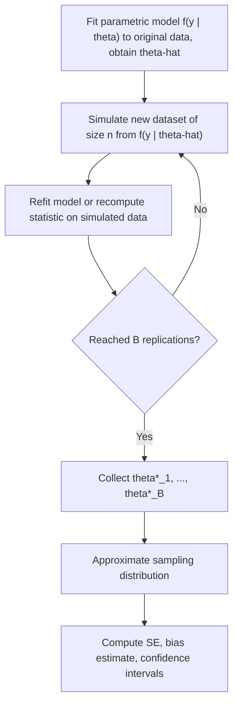

## Parametric Bootstrap

### Conceptual Foundation

The parametric bootstrap is a resampling technique for approximating the sampling distribution of a statistic by simulating new datasets from a **fitted parametric model**, rather than resampling directly from the observed data (as the nonparametric bootstrap does). It assumes the analyst has specified and fitted a parametric distribution $F_{\hat{\theta}}$ (e.g., Normal, Poisson, Gamma, a fitted regression model) to the data, and treats this fitted model as the working proxy for the true data-generating process.

Where the nonparametric bootstrap makes the empirical distribution $\hat{F}_n$ stand in for the unknown population distribution, the parametric bootstrap instead relies on the **plug-in principle applied to a parametric model**: the estimated parameters $\hat{\theta}$ from the original data define a specific distribution from which entirely new synthetic datasets are simulated.

### Algorithm

Given observed data $y_1, \ldots, y_n$, a parametric model $f(y \mid \theta)$, and a fitted estimate $\hat{\theta}$ (via maximum likelihood, method of moments, or other estimation approach):

1. Simulate a **bootstrap sample** $y_1^*, \ldots, y_n^*$ of size $n$ by drawing i.i.d. observations from the fitted distribution $f(y \mid \hat{\theta})$
2. Refit the model (or recompute the statistic of interest) on this simulated dataset, obtaining $\hat{\theta}^*$ or $\hat{s}^* = s(y_1^*, \ldots, y_n^*)$
3. Repeat steps 1–2 for $B$ replications (commonly 1000–10000)
4. Use the empirical distribution of the $B$ replicated values to approximate the sampling distribution of the original estimator

The critical distinction from the nonparametric bootstrap is in step 1: new data are **simulated from an assumed distributional form** rather than resampled with replacement from the observed values.

### Parametric Bootstrap Flow



### Worked Example: Parametric Bootstrap for an Exponential Rate Parameter

**Setup**: Suppose $n = 25$ observed waiting times are assumed to follow $y_i \sim \text{Exponential}(\lambda)$, with maximum likelihood estimate $\hat{\lambda} = 1/\bar{y}$. Suppose the sample mean is $\bar{y} = 4.2$, giving $\hat{\lambda} = 1/4.2 \approx 0.238$.

**Parametric bootstrap procedure**:

1. Simulate 25 new observations $y_1^*, \ldots, y_{25}^*$ directly from $\text{Exponential}(0.238)$ — not by resampling the original 25 values, but by generating entirely new random draws from this fitted exponential distribution
2. Compute $\hat{\lambda}^* = 1/\bar{y}^*$ on this simulated sample
3. Repeat for $B = 5000$ simulated datasets
4. The standard deviation of the 5000 values of $\hat{\lambda}^*$ estimates the standard error of $\hat{\lambda}$; percentiles of this distribution provide confidence intervals

**Comparison to the closed-form result**: for the exponential distribution, the asymptotic standard error of the MLE is known analytically as $\hat{\lambda}/\sqrt{n}$. The parametric bootstrap should produce an estimate reasonably close to this closed-form value for moderate-to-large $n$, providing a useful sanity check on the bootstrap procedure itself. [Inference] The degree of agreement between the bootstrap estimate and the analytic asymptotic formula in any specific finite sample depends on how well the asymptotic approximation itself holds at that sample size, and exact numerical agreement should not be expected in every replication.

### When the Parametric Bootstrap Is Preferred

The parametric bootstrap is particularly valuable in settings where:

- **A well-justified parametric model is available** and the primary interest is in the sampling variability of derived statistics or estimated parameters under that assumed model
- **Sample sizes are small**, where the nonparametric bootstrap's reliance on the empirical distribution $\hat{F}_n$ becomes an increasingly poor proxy for the true population distribution, while a correctly specified parametric model can still provide reasonable approximations by leveraging distributional structure beyond what the raw empirical distribution reflects
- **Testing goodness-of-fit**, where the null hypothesis explicitly specifies a parametric family, and simulating data under that null is a natural way to obtain a reference distribution for a test statistic
- **Complex derived quantities** for which the sampling distribution has no simple closed form, but simulation from the fitted parametric model is straightforward (e.g., ratios of estimated parameters, functions of multiple fitted coefficients)

### Parametric Bootstrap for Regression Models

For a fitted regression model $y_i = X_i\hat{\beta} + \hat{\epsilon}_i$ with an assumed error distribution (e.g., $\epsilon_i \sim N(0, \hat{\sigma}^2)$):

1. Fix the predictor matrix $X$ at its observed values
2. Simulate new response values: $y_i^* = X_i\hat{\beta} + \epsilon_i^*$, where $\epsilon_i^* \sim N(0, \hat{\sigma}^2)$ (drawn fresh from the assumed error distribution, not resampled from observed residuals)
3. Refit the regression model on $(X, y^*)$ to obtain $\hat{\beta}^*$
4. Repeat across $B$ replications to characterize the sampling distribution of $\hat{\beta}$

This differs from **residual resampling** (a nonparametric regression bootstrap variant) in that new errors are generated from the assumed parametric error distribution rather than resampled from the empirical residuals — making the parametric regression bootstrap fully dependent on the correctness of the assumed error distribution (e.g., normality), while residual resampling only assumes exchangeability of the actual observed residuals.

### Goodness-of-Fit Testing via Parametric Bootstrap

A common and powerful application is testing whether a fitted parametric model adequately describes the data, particularly when the reference (asymptotic) distribution of a goodness-of-fit statistic is unknown or unreliable in finite samples:

1. Fit the candidate parametric model to the observed data, obtaining $\hat{\theta}$ and a goodness-of-fit statistic $T_{obs}$ (e.g., a chi-square statistic, Kolmogorov-Smirnov statistic, or likelihood-ratio statistic)
2. Simulate many datasets from the fitted model $f(y \mid \hat{\theta})$
3. Refit the model to each simulated dataset and recompute the goodness-of-fit statistic $T^{*(b)}$
4. Compare $T_{obs}$ to the empirical distribution of $\{T^{*(b)}\}$ to obtain a bootstrap p-value: the proportion of simulated statistics as extreme as or more extreme than $T_{obs}$

This approach is especially useful when standard asymptotic reference distributions (e.g., chi-square approximations) are known to be unreliable for the sample size or model structure at hand, since the simulated reference distribution directly reflects the finite-sample behavior of the statistic under the fitted null model.

### Parametric vs. Nonparametric Bootstrap Comparison

| Aspect | Parametric Bootstrap | Nonparametric Bootstrap |
| --- | --- | --- |
| Data source for resampling | Simulated from fitted parametric model $f(y \mid \hat\theta)$ | Resampled with replacement from observed data |
| Key assumption | Parametric model is correctly specified | Sample is representative of the population; minimal distributional assumptions |
| Performance with small $n$ | Can perform well if model is correctly specified | Can perform poorly since $\hat{F}_n$ is a coarse approximation to $F$ |
| Sensitivity to model misspecification | High — biased if the assumed distribution is wrong | Low — makes no parametric distributional assumption |
| Typical use cases | Goodness-of-fit testing, small samples with strong theoretical justification for a model | General-purpose SE/CI estimation with minimal assumptions |

### Risk of Model Misspecification

The central risk specific to the parametric bootstrap is that **all simulated datasets inherit any misspecification in the assumed parametric model**. If the true data-generating process differs meaningfully from the fitted parametric family, the entire bootstrap distribution will be systematically biased, since every simulated dataset is generated under the (possibly wrong) assumed model rather than reflecting the actual empirical variability present in the observed data. This is the core trade-off against the nonparametric bootstrap, which sacrifices the potential efficiency gains of a correctly specified parametric model in exchange for robustness to this kind of misspecification.

### Computational Implementation Considerations

```python
import numpy as np
from scipy import stats

def parametric_bootstrap_exponential(n, lambda_hat, stat_func, n_boot=5000, seed=None):
    rng = np.random.default_rng(seed)
    boot_stats = np.empty(n_boot)
    for b in range(n_boot):
        sim_data = rng.exponential(scale=1/lambda_hat, size=n)
        boot_stats[b] = stat_func(sim_data)
    return boot_stats

# Example: bootstrap distribution of the rate MLE
n = 25
lambda_hat = 0.238
mle_func = lambda data: 1 / np.mean(data)
boot_lambdas = parametric_bootstrap_exponential(n, lambda_hat, mle_func, seed=123)
se_boot = np.std(boot_lambdas, ddof=1)
ci_percentile = np.percentile(boot_lambdas, [2.5, 97.5])
```

The key structural difference from a nonparametric bootstrap implementation is the data-generation step: `rng.exponential(...)` simulates fresh data from the fitted distribution, rather than `rng.choice(data, replace=True)` resampling from observed values.

### Common Pitfalls

- **Applying the parametric bootstrap with a poorly justified or unchecked distributional assumption**, propagating model misspecification into every simulated replicate and producing systematically misleading standard errors or confidence intervals
- **Failing to refit the model on each simulated dataset** when the goal is to capture estimation uncertainty (rather than only simulating hypothetical outcomes under a fixed, known parameter) — the refitting step is essential to properly reflect sampling variability in $\hat{\theta}$ itself
- **Confusing parametric bootstrap goodness-of-fit p-values with exact p-values** — the bootstrap p-value approximates the true p-value using a finite number of replications, subject to Monte Carlo error that decreases as $B$ increases
- **Using the parametric bootstrap when the nonparametric bootstrap would be more appropriate**, particularly when there is genuine uncertainty about the correct parametric family and no strong theoretical justification for the specific assumed model
- **Overlooking the difference between simulating from a fixed vs. refitted parameter** at each bootstrap replication, which affects whether the resulting distribution reflects only "aleatoric" simulation variability or the full sampling variability of the estimator

### Related Topics

- Nonparametric bootstrap and the empirical distribution plug-in principle
- Maximum likelihood estimation and asymptotic standard errors
- Goodness-of-fit testing (chi-square tests, Kolmogorov-Smirnov tests)
- Monte Carlo simulation methods for statistical inference
- Bootstrap methods for regression models (residual resampling vs. parametric simulation)
- Likelihood ratio tests and simulation-based reference distributions
- Model misspecification diagnostics and robustness checks
- Semi-parametric bootstrap approaches combining parametric and empirical elements