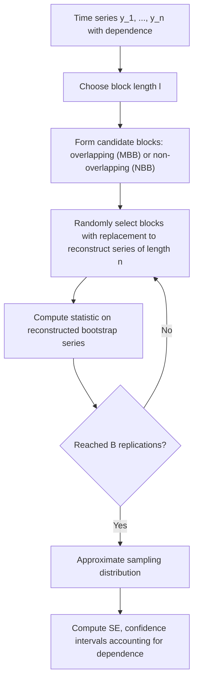

## Block Bootstrap for Dependent Data

### Conceptual Foundation

The block bootstrap is a resampling technique designed to extend bootstrap methodology to **dependent data** — time series, spatial data, panel/longitudinal data, or any setting where the standard i.i.d. assumption underlying the ordinary nonparametric bootstrap fails. Because case resampling with replacement treats every observation as exchangeable, applying the standard bootstrap directly to serially dependent data destroys the very autocorrelation or dependence structure that characterizes the data-generating process, producing bootstrap replicates that misrepresent the true sampling variability.

The block bootstrap resolves this by resampling **contiguous blocks** of consecutive observations rather than individual observations, preserving the local dependence structure within each block while still introducing the randomization needed for resampling-based inference.

### Why Standard Bootstrap Fails for Dependent Data

For a stationary time series $y_1, \ldots, y_n$ with autocorrelation, resampling individual observations with replacement (as in the standard nonparametric bootstrap) produces a bootstrap sample $y_1^*, \ldots, y_n^*$ that is **i.i.d. by construction**, regardless of how strongly autocorrelated the original series was. Any bootstrap standard error or confidence interval computed from such resamples would fail to reflect the true sampling variability of statistics like the sample mean, whose variance formula for dependent data must account for autocovariances:

$$\text{Var}(\bar{y}) = \frac{\sigma^2}{n}\left(1 + 2\sum_{k=1}^{n-1}\left(1 - \frac{k}{n}\right)\rho_k\right)$$

where $\rho_k$ is the lag-$k$ autocorrelation. Naive case resampling implicitly assumes all $\rho_k = 0$, typically leading to **understated standard errors** when the true data exhibit positive autocorrelation (the common case in most economic and financial time series).

### Non-Overlapping Block Bootstrap (NBB)

**Setup**: Divide the time series of length $n$ into $k = n/l$ non-overlapping contiguous blocks, each of length $l$:

$$B_1 = (y_1, \ldots, y_l), \quad B_2 = (y_{l+1}, \ldots, y_{2l}), \quad \ldots, \quad B_k = (y_{n-l+1}, \ldots, y_n)$$

**Resampling procedure**:

1. Randomly select $k$ blocks **with replacement** from the $k$ available non-overlapping blocks
2. Concatenate the selected blocks in the order drawn to form a bootstrap series of length $n$ (or approximately $n$, if $n$ is not exactly divisible by $l$)
3. Compute the statistic of interest on this reconstructed series
4. Repeat for $B$ replications

Within each block, the original temporal ordering and local dependence structure are preserved; dependence *between* blocks is broken (since blocks are selected independently), which is an approximation that becomes more accurate as block length $l$ grows relative to the range of meaningful autocorrelation in the series.

### Moving Block Bootstrap (MBB)

The **moving block bootstrap** (Künsch, 1989) improves on the non-overlapping variant by allowing blocks to **overlap**, generating a much richer set of $n - l + 1$ possible blocks rather than only $k = n/l$ fixed non-overlapping ones:

$$B_i = (y_i, y_{i+1}, \ldots, y_{i+l-1}), \qquad i = 1, \ldots, n-l+1$$

**Resampling procedure**:

1. Randomly select $\lceil n/l \rceil$ blocks with replacement from the $n-l+1$ overlapping candidate blocks
2. Concatenate to form a bootstrap series of length approximately $n$
3. Compute the statistic; repeat for $B$ replications

Because overlapping blocks provide many more distinct starting points, the MBB typically produces a richer, more stable bootstrap distribution than the non-overlapping variant for the same effective block length, particularly in finite samples.

### Block Bootstrap Resampling Flow



### Worked Illustration: Block Bootstrap SE of a Sample Mean

**Setup**: Suppose a stationary AR(1) time series of length $n = 200$ has sample mean $\bar{y} = 3.4$, with known positive autocorrelation ($\rho_1 \approx 0.6$). Applying the standard i.i.d. bootstrap SE formula would substantially underestimate the true standard error of $\bar{y}$, because the effective sample size for estimating a mean under positive autocorrelation is smaller than $n$ due to redundant information carried by correlated observations.

**Block bootstrap procedure with $l = 10$**:

1. Form 20 non-overlapping blocks (or 191 overlapping blocks for MBB) of length 10
2. Resample 20 blocks with replacement (NBB) or an appropriate number of overlapping blocks (MBB) to reconstruct a series of length 200
3. Compute the mean of the reconstructed series
4. Repeat for $B = 2000$ replications
5. The standard deviation of the 2000 bootstrap means estimates $\widehat{SE}_{block}(\bar{y})$

[Inference] The specific numeric standard error obtained depends on the chosen block length, the true autocorrelation structure of the series, and the number of bootstrap replications; qualitatively, the block bootstrap SE should be larger than a naive i.i.d. bootstrap SE when genuine positive autocorrelation is present, but the exact magnitude of this difference requires the specific computation.

### Block Length Selection

Block length $l$ is the central tuning parameter, and its choice involves a well-documented **bias-variance trade-off**:

- **Too short a block length**: fails to capture longer-range dependence, since correlations spanning beyond the block length are broken at every block boundary — this understates the true variability of statistics sensitive to that longer-range dependence, similar to (though less extreme than) the standard i.i.d. bootstrap's complete failure to capture any dependence
- **Too long a block length**: reduces the effective number of available blocks (fewer non-overlapping blocks, or less diversity among overlapping blocks), increasing the variance of the resulting bootstrap estimate and making the reconstructed series less representative of genuine resampling variability
- **Common practical guidance**: block length is often chosen to scale with $n^{1/3}$ for many standard block bootstrap variants, a rate that balances the asymptotic bias and variance trade-offs identified in the theoretical bootstrap literature [Unverified — this specific asymptotic rate is a commonly cited theoretical guideline under certain regularity conditions in the time-series bootstrap literature; optimal block length in practice depends on the specific dependence structure and statistic, and various data-driven block length selection procedures exist as more empirically grounded alternatives to a fixed theoretical rate]

### Circular Block Bootstrap

A refinement of the moving block bootstrap that treats the time series as **circular** (wrapping the end of the series back to the beginning), ensuring that every observation has an equal probability of appearing in a given position within a selected block, rather than the standard MBB's tendency for observations near the start and end of the series to be included in fewer possible blocks than observations in the middle. This adjustment reduces edge-effect bias inherent in the standard moving block bootstrap.

### Stationary Bootstrap

Rather than using a single fixed block length, the **stationary bootstrap** (Politis and Romano, 1994) draws block lengths **randomly** from a geometric distribution with a specified mean block length, then samples starting points for each block similarly to the circular block bootstrap. This produces a resampled series that is itself stationary (matching a key theoretical property of the original series more closely than fixed-block-length methods), and avoids the need to commit to a single deterministic block length choice, instead requiring only the specification of the geometric distribution's mean parameter.

### Comparison of Block Bootstrap Variants

| Variant | Block length | Overlapping blocks | Key advantage |
| --- | --- | --- | --- |
| Non-overlapping (NBB) | Fixed | No | Simplest to implement and understand |
| Moving block (MBB) | Fixed | Yes | Richer set of candidate blocks; typically more stable |
| Circular block | Fixed | Yes (with wraparound) | Reduces edge-effect bias at series boundaries |
| Stationary bootstrap | Random (geometric) | Yes (with wraparound) | Resampled series itself stationary; avoids fixed-length commitment |

### Block Bootstrap for Regression with Dependent Errors

For time-series regression models where errors exhibit serial correlation, the block bootstrap can be applied to **residuals** rather than raw data: fit the model once to obtain residuals $\hat{\epsilon}_t$, apply block resampling to the residual series (preserving their dependence structure), add the resampled residuals back to fitted values to form bootstrap response series, and refit the model on each reconstructed series. This block-residual approach parallels ordinary residual bootstrap for regression but respects serial dependence in the errors rather than assuming exchangeability.

### Computational Implementation Considerations

```python
import numpy as np

def moving_block_bootstrap(data, block_length, n_boot=2000, stat_func=np.mean, seed=None):
    rng = np.random.default_rng(seed)
    n = len(data)
    n_blocks_needed = int(np.ceil(n / block_length))
    max_start = n - block_length + 1  # overlapping candidate block starting points
    boot_stats = np.empty(n_boot)

    for b in range(n_boot):
        starts = rng.integers(0, max_start, size=n_blocks_needed)
        reconstructed = np.concatenate([data[s:s+block_length] for s in starts])[:n]
        boot_stats[b] = stat_func(reconstructed)

    return boot_stats

# Example: block bootstrap SE of the mean for an autocorrelated series
series = np.array([...])  # observed dependent time series
boot_means = moving_block_bootstrap(series, block_length=10, n_boot=2000, seed=7)
se_block = np.std(boot_means, ddof=1)
```

### Common Pitfalls

- **Applying the standard i.i.d. bootstrap to time series or panel data without recognizing the dependence structure**, silently producing understated (or occasionally overstated) standard errors depending on the sign and strength of the autocorrelation present
- **Choosing block length arbitrarily without considering the dependence range** in the data — block lengths shorter than the effective range of serial correlation systematically understate variability
- **Ignoring edge effects** in non-overlapping or standard moving block bootstrap, where observations near series boundaries have unequal representation across possible blocks — circular or stationary bootstrap variants directly address this
- **Applying block resampling to non-stationary series without first differencing or otherwise stabilizing the series**, since block bootstrap methods generally assume approximate stationarity for the theoretical justification of the approach to hold
- **Assuming a fixed theoretical block-length formula (e.g., $n^{1/3}$ scaling) is universally optimal** without considering data-driven block length selection methods or sensitivity analysis across a range of plausible block lengths

### Related Topics

- Nonparametric bootstrap and its i.i.d. assumptions
- Stationary bootstrap and geometric block-length randomization
- Time series autocorrelation and effective sample size
- HAC (heteroskedasticity and autocorrelation consistent) standard errors as an alternative, non-resampling approach
- Circular block bootstrap and edge-effect correction
- Panel data bootstrap methods (cluster bootstrap, block bootstrap by unit)
- Residual-based bootstrap for time-series regression models
- Subsampling methods as a related but distinct resampling approach for dependent data