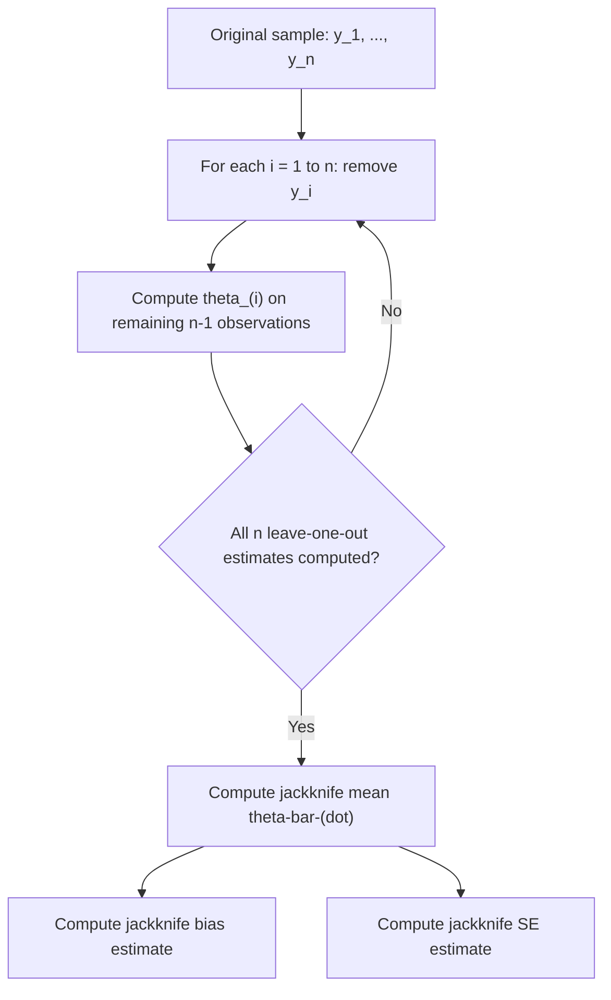

## Jackknife Estimation

### Conceptual Foundation

The jackknife is a resampling technique for estimating the bias and standard error of a statistic by systematically **leaving out one observation at a time** from the dataset and recomputing the statistic on each reduced sample. Introduced by Maurice Quenouille (1949) and further developed by John Tukey (1958, who coined the term "jackknife" for its versatility as a general-purpose statistical tool), it predates the bootstrap and remains widely used both as a standalone method and as a component within bootstrap bias-correction procedures (notably the BCa confidence interval).

Unlike the bootstrap's random resampling with replacement, the jackknife is **deterministic**: given a sample of size $n$, there are exactly $n$ possible leave-one-out subsamples, each obtained by removing precisely one observation. This makes the jackknife fully reproducible without any random number generation, in contrast to bootstrap methods.

### Algorithm

Given a sample $y_1, \ldots, y_n$ and a statistic $\hat{\theta} = s(y_1, \ldots, y_n)$:

1. For each $i = 1, \ldots, n$, remove observation $y_i$ and compute the statistic on the remaining $n-1$ observations:

$$\hat{\theta}_{(i)} = s(y_1, \ldots, y_{i-1}, y_{i+1}, \ldots, y_n)$$

2. Compute the **jackknife mean**:

$$\bar{\theta}_{(\cdot)} = \frac{1}{n}\sum_{i=1}^{n}\hat{\theta}_{(i)}$$

3. Use the $n$ leave-one-out estimates $\hat{\theta}_{(1)}, \ldots, \hat{\theta}_{(n)}$ to estimate bias and standard error of $\hat{\theta}$

### Jackknife Procedure Flow



### Jackknife Bias Estimation

The jackknife bias estimate exploits the systematic relationship between leave-one-out estimates and the bias of $\hat{\theta}$ as an estimator of the true parameter $\theta$:

$$\widehat{\text{Bias}}_{jack}(\hat{\theta}) = (n-1)\left(\bar{\theta}_{(\cdot)} - \hat{\theta}\right)$$

The **bias-corrected jackknife estimator** is then:

$$\hat{\theta}_{jack} = \hat{\theta} - \widehat{\text{Bias}}_{jack}(\hat{\theta}) = n\hat{\theta} - (n-1)\bar{\theta}_{(\cdot)}$$

This construction is specifically designed to remove bias terms of order $O(1/n)$ in the statistic's expansion, which is why the jackknife is particularly effective at correcting bias for estimators whose bias has this specific leading-order form (a large and practically important class, including many standard estimators such as the sample variance's small-sample bias correction context, ratio estimators, and correlation coefficients).

### Jackknife Standard Error Estimation

The jackknife standard error formula uses a specific scaling factor reflecting the reduced variability among leave-one-out estimates relative to the full-sample variability:

$$\widehat{SE}_{jack}(\hat{\theta}) = \sqrt{\frac{n-1}{n}\sum_{i=1}^{n}\left(\hat{\theta}_{(i)} - \bar{\theta}_{(\cdot)}\right)^2}$$

The $(n-1)/n$ scaling factor (rather than the more familiar $1/(n-1)$ used in an ordinary sample variance) reflects the fact that leave-one-out estimates are much less variable than independent replicate estimates would be — since any two leave-one-out samples share $n-2$ observations in common, their variability must be inflated by this specific factor to correctly approximate the sampling variance of $\hat{\theta}$ itself.

### Worked Numerical Example

**Setup**: Sample of $n = 6$ values: $\{4, 7, 5, 9, 6, 8\}$. Statistic of interest: the sample mean, $\hat{\theta} = \bar{y} = 6.5$.

**Leave-one-out estimates**:

| Removed observation | Remaining sample | $\hat{\theta}_{(i)}$ (mean of remaining 5) |
| --- | --- | --- |
| 4 | {7,5,9,6,8} | 7.00 |
| 7 | {4,5,9,6,8} | 6.40 |
| 5 | {4,7,9,6,8} | 6.80 |
| 9 | {4,7,5,6,8} | 6.00 |
| 6 | {4,7,5,9,8} | 6.60 |
| 8 | {4,7,5,9,6} | 6.20 |

**Jackknife mean**: $\bar{\theta}_{(\cdot)} = (7.00+6.40+6.80+6.00+6.60+6.20)/6 = 39.00/6 = 6.50$

Since the jackknife mean exactly equals $\hat{\theta} = 6.5$ for the sample mean statistic, the jackknife bias estimate is exactly zero — consistent with the well-known fact that the sample mean is an unbiased estimator of the population mean, so there is no bias for the jackknife to detect or correct.

**Jackknife SE**: Using the deviations $(0.50, -0.10, 0.30, -0.50, 0.10, -0.30)$ from $\bar{\theta}_{(\cdot)} = 6.5$:

$$\widehat{SE}_{jack} = \sqrt{\frac{5}{6}\left[(0.5)^2+(-0.1)^2+(0.3)^2+(-0.5)^2+(0.1)^2+(-0.3)^2\right]} = \sqrt{\frac{5}{6}(0.69)} = \sqrt{0.575} \approx 0.758$$

This can be compared to the standard formula for the SE of a sample mean, $s/\sqrt{n}$, as a sanity check — for statistics as simple as the mean, jackknife SE and the classical formula should give comparable results, illustrating the jackknife's function as a general-purpose approximation that recovers familiar results in well-understood special cases.

### Jackknife for Nonlinear Statistics: Why It's Useful

For simple linear statistics like the mean, closed-form SE formulas already exist, making the jackknife somewhat redundant (though useful as a validation check). The jackknife's practical value emerges for statistics **without simple closed-form variance formulas** — for example, the sample correlation coefficient, ratio estimators, or trimmed means — where computing $n$ leave-one-out values and applying the standard jackknife SE formula provides a general-purpose approximation without needing to derive statistic-specific asymptotic variance expressions.

### The Delete-d Jackknife

The standard jackknife deletes exactly one observation at a time (the "delete-1" jackknife). For certain statistics — particularly those whose asymptotic behavior is not smooth enough for delete-1 jackknife consistency to hold, such as the sample median or other quantile-based statistics — a **delete-d jackknife** deletes $d > 1$ observations per subsample, which can restore consistency of the resulting variance estimator in cases where the delete-1 version is known to fail. [Unverified — the specific conditions under which delete-1 jackknife inconsistency occurs, and the appropriate choice of $d$ to restore consistency, are technical results from the jackknife theoretical literature and depend on the specific statistic under consideration]

### Jackknife Applications Beyond Bias/SE Estimation

- **Jackknife-after-bootstrap**: uses jackknife-style leave-one-out procedures on top of bootstrap replicates to assess the influence of individual observations on bootstrap-based standard errors, useful for diagnosing overly influential data points
- **BCa bootstrap confidence intervals**: the acceleration parameter $\hat{a}$ in the BCa method (covered in nonparametric bootstrap methodology) is estimated using jackknife leave-one-out values of the statistic, directly incorporating jackknife machinery into the improved bootstrap confidence interval construction
- **Cross-validation connections**: leave-one-out cross-validation (LOOCV) in predictive modeling shares the same "leave-one-out" computational structure as the jackknife, though LOOCV targets predictive performance assessment rather than bias/variance estimation of a parameter

### Jackknife vs. Bootstrap Comparison

| Aspect | Jackknife | Bootstrap |
| --- | --- | --- |
| Number of resamples | Exactly $n$ (deterministic) | $B$ (chosen by analyst, typically 1000+) |
| Randomness | None — fully deterministic given the data | Random resampling with replacement |
| Computational cost | Fixed at $n$ recomputations of the statistic | Scales with chosen $B$, independent of $n$ (though larger $n$ increases per-replicate cost) |
| Effectiveness for non-smooth statistics | Can fail for statistics like the median (delete-1 case) | Generally more robust across a wider range of statistic types |
| Primary use today | Bias correction, BCa acceleration parameter, historical/pedagogical importance | General-purpose standard error and CI estimation, now the dominant resampling method in practice |

[Inference] The bootstrap has largely superseded the jackknife as the default general-purpose resampling tool in modern applied statistics, though the jackknife remains standard within specific bootstrap refinements (such as BCa) and retains pedagogical value for illustrating leave-one-out resampling logic; this represents a description of common current practice rather than a claim that the jackknife is obsolete or inferior in all contexts.

### Computational Implementation Considerations

```python
import numpy as np

def jackknife_estimates(data, stat_func):
    n = len(data)
    theta_hat = stat_func(data)
    loo_estimates = np.empty(n)
    for i in range(n):
        loo_sample = np.delete(data, i)
        loo_estimates[i] = stat_func(loo_sample)
    jack_mean = np.mean(loo_estimates)
    bias_jack = (n - 1) * (jack_mean - theta_hat)
    se_jack = np.sqrt((n - 1) / n * np.sum((loo_estimates - jack_mean) ** 2))
    theta_jack_corrected = theta_hat - bias_jack
    return {
        "theta_hat": theta_hat,
        "jackknife_mean": jack_mean,
        "bias_estimate": bias_jack,
        "se_estimate": se_jack,
        "bias_corrected_estimate": theta_jack_corrected
    }

data = np.array([4, 7, 5, 9, 6, 8])
result = jackknife_estimates(data, np.mean)
```

### Common Pitfalls

- **Applying the standard delete-1 jackknife to non-smooth statistics** (e.g., the sample median or other order statistics), where the jackknife variance estimator is known to be inconsistent — a delete-d jackknife or bootstrap alternative should be used instead
- **Confusing jackknife bias correction with a general-purpose cure for all forms of bias** — the jackknife specifically targets bias of order $O(1/n)$, and provides no guarantee of correcting bias arising from other sources such as model misspecification
- **Applying jackknife methods to dependent data without modification** — the standard jackknife, like the ordinary bootstrap, assumes exchangeability and requires adaptation (e.g., block-based deletion schemes) for time series or clustered data
- **Interpreting jackknife pseudo-values as literal repeated-sampling estimates** — leave-one-out estimates are highly correlated with each other by construction (sharing $n-2$ of $n-1$ observations pairwise), which is precisely why the specific $(n-1)/n$ scaling factor in the SE formula is necessary rather than optional
- **Overlooking computational cost for expensive-to-compute statistics on large $n$** — since the jackknife requires exactly $n$ recomputations of the statistic, this can become a meaningful computational burden for large datasets or computationally intensive statistics, unlike the bootstrap where $B$ can be chosen independently of $n$

### Related Topics

- Nonparametric bootstrap and its relationship to jackknife resampling
- BCa (bias-corrected and accelerated) bootstrap confidence intervals
- Delete-d jackknife and consistency conditions for non-smooth statistics
- Leave-one-out cross-validation in predictive model assessment
- Bias correction techniques for finite-sample estimators
- Pseudo-value methods and their use in survival analysis and other specialized applications
- Influence functions and robust statistics
- Jackknife-after-bootstrap for assessing observation-level influence on bootstrap estimates