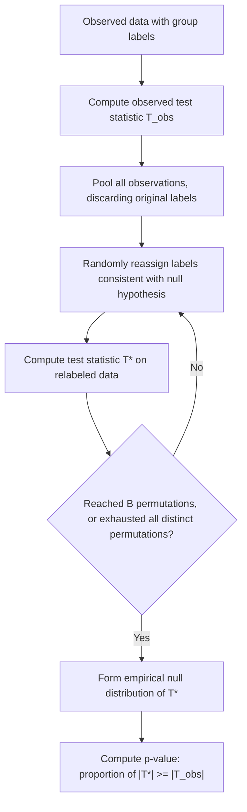

## Permutation and Randomization Inference

### Conceptual Foundation

Permutation and randomization inference construct hypothesis tests by directly simulating the distribution of a test statistic **under a null hypothesis**, using the observed data itself rather than relying on parametric distributional assumptions (such as normality) or asymptotic approximations. The core idea is that, under a null hypothesis of no effect or no association, the labels or group assignments in the data are **exchangeable** — meaning any relabeling or reassignment consistent with the null is equally likely to have occurred, so the actual observed test statistic can be directly compared to the full distribution of statistics obtained by considering all (or many) such relabelings.

This approach traces to Ronald Fisher's exact tests and R.A. Fisher's and E.J.G. Pitman's early 20th century work on randomization-based inference, predating both the bootstrap and modern computational statistics, but has become vastly more practical with modern computing power to evaluate large numbers of permutations.

### Core Logic: Exchangeability Under the Null

Consider testing whether two groups have the same underlying distribution (a null hypothesis of no group difference). Under this null, group labels convey no real information distinguishing the two groups — so if the labels were randomly reassigned among the same set of observed values, the resulting test statistic (e.g., a difference in group means) should look statistically indistinguishable from the test statistic computed on the actual, correctly labeled data.

**Permutation testing** formalizes this: enumerate or sample many alternative label assignments, compute the test statistic under each, and see where the actual observed statistic falls within this null distribution.

### Algorithm: Two-Sample Permutation Test

Given two samples $x_1, \ldots, x_{n_1}$ and $y_1, \ldots, y_{n_2}$, and an observed test statistic $T_{obs}$ (e.g., $\bar{x} - \bar{y}$):

1. Pool all $n = n_1 + n_2$ observations into a single combined dataset
2. Randomly partition the pooled data into two groups of sizes $n_1$ and $n_2$ (a random relabeling consistent with the null of no group difference)
3. Compute the test statistic $T^{*(b)}$ on this relabeled partition
4. Repeat steps 2–3 for $B$ permutations (or, for small samples, enumerate **all** possible distinct partitions exactly)
5. Compute the permutation p-value as the proportion of permuted statistics as extreme as or more extreme than $T_{obs}$:

$$p_{perm} = \frac{1}{B}\sum_{b=1}^{B} \mathbb{1}\left(|T^{*(b)}| \geq |T_{obs}|\right)$$

(the exact form of the indicator depends on whether a one-sided or two-sided test is intended)

### Permutation Test Flow



### Worked Numerical Example

**Setup**: Group A (treatment): $\{23, 27, 25, 30\}$; Group B (control): $\{18, 20, 22, 19\}$. Observed difference in means: $T_{obs} = \bar{x}_A - \bar{x}_B = 26.25 - 19.75 = 6.5$.

**Exact permutation approach** (small samples permit full enumeration): with $n_1 = n_2 = 4$ and $n = 8$ total observations, there are $\binom{8}{4} = 70$ distinct ways to partition the pooled 8 values into two groups of 4. For each of the 70 partitions, the difference in group means is computed, producing an exact null distribution of 70 possible values of the test statistic.

**P-value computation**: If, say, only 2 of the 70 possible partitions produce a difference in means with absolute value $\geq 6.5$ (including the observed partition itself), the exact two-sided permutation p-value would be $2/70 \approx 0.029$.

[Inference] The specific count of extreme partitions depends on the exact numeric values in the dataset and must be computed directly by enumerating or simulating partitions; the number given here is illustrative of the *type* of calculation performed, not a claim about the specific numeric outcome for this dataset without actually running the enumeration.

### Monte Carlo Approximation for Larger Samples

When the total number of possible distinct permutations becomes computationally prohibitive to enumerate exhaustively (which happens quickly as sample sizes grow — even moderate $n_1, n_2$ around 15–20 each produce combinatorial counts in the billions), a **Monte Carlo permutation test** samples a large but manageable number $B$ (e.g., 10,000) of random relabelings rather than exhaustively enumerating all of them, approximating the exact permutation p-value:

$$\hat{p}_{perm} = \frac{1 + \sum_{b=1}^{B}\mathbb{1}(|T^{*(b)}| \geq |T_{obs}|)}{B+1}$$

The "+1" adjustments in both numerator and denominator (a common convention) account for the observed statistic itself as one valid member of the null reference distribution, ensuring the p-value is never reported as exactly zero even when no simulated permutation is as extreme as the observed statistic.

### Permutation Tests for Correlation and Regression

**Testing independence between two variables**: under the null of no association, the pairing between $x_i$ and $y_i$ values is arbitrary. A permutation test for correlation randomly permutes the $y$ values while holding $x$ fixed (breaking any true pairing), recomputes the correlation coefficient on each permuted pairing, and compares the observed correlation to this null distribution.

**Testing a regression coefficient**: permutation tests for regression coefficients typically permute either the response variable or the residuals from a reduced model (one excluding the predictor of interest), refitting the full model on each permutation to generate a null distribution for the coefficient or an associated F-statistic, avoiding reliance on normality assumptions about the error distribution needed for standard t-tests and F-tests.

### Permutation Tests vs. Parametric Tests

| Aspect | Permutation Test | Parametric Test (e.g., t-test) |
| --- | --- | --- |
| Distributional assumptions | Minimal — relies on exchangeability under the null | Requires specific distributional form (e.g., normality) for exact validity |
| Validity in small samples | Exact (when fully enumerated), regardless of underlying distribution | Depends on how well the assumed distribution approximates the true one |
| Computational cost | Can be substantial for large samples (requiring Monte Carlo approximation) | Typically closed-form, computationally trivial |
| Type of null hypothesis addressed | Naturally suited to sharp/exact null hypotheses (e.g., no effect whatsoever) | Suited to null hypotheses about specific parameters (e.g., a population mean) |
| Asymptotic behavior | Often converges to the same conclusions as parametric tests as $n$ grows, under many standard conditions | Serves as the large-sample benchmark permutation tests are often compared against |

[Inference] Under many standard regularity conditions, permutation tests and their parametric analogues (e.g., the permutation test for two-sample mean difference and the standard t-test) tend to produce similar conclusions in large samples, though this convergence is a general tendency documented in the methodological literature rather than a guarantee for every specific dataset or test statistic.

### Fisher's Exact Test as a Permutation Test

Fisher's exact test for 2×2 contingency tables is a specific, well-known instance of exact permutation/randomization inference: conditional on the observed row and column marginal totals, the null distribution of cell counts follows a hypergeometric distribution, and the exact p-value is computed by summing hypergeometric probabilities over all tables as extreme as or more extreme than the observed table — this is mathematically equivalent to considering all relevant permutations of group labels consistent with the observed marginal totals.

### Randomization Inference in Experimental Design

Randomization inference has particular theoretical appeal in the context of **randomized experiments**, where the random assignment mechanism used to allocate units to treatment and control groups is exactly known and directly justifies the permutation testing framework — the null hypothesis of no treatment effect implies that observed outcomes would have been identical under any other treatment assignment that could have occurred given the same randomization procedure. This makes randomization-based inference a natural and theoretically well-grounded default in the analysis of randomized controlled trials and designed experiments, sometimes referred to as **Fisherian randomization inference** in the causal inference literature, distinguishing it from population-based sampling inference frameworks (e.g., Neyman's potential outcomes framework with superpopulation sampling assumptions).

### Choice of Test Statistic

Permutation tests are notably flexible regarding the choice of test statistic — any statistic that meaningfully captures the effect or association of interest can be used, including non-standard statistics for which no parametric reference distribution exists (e.g., a trimmed mean difference, a rank-based statistic, or a maximum absolute difference across multiple subgroups). This flexibility is a key practical advantage: the exchangeability logic underlying the permutation null distribution applies regardless of which specific statistic is chosen, as long as that statistic's null distribution is legitimately generated by the same relabeling scheme.

### Computational Implementation Considerations

```python
import numpy as np

def permutation_test_mean_diff(group_a, group_b, n_perm=10000, seed=None):
    rng = np.random.default_rng(seed)
    pooled = np.concatenate([group_a, group_b])
    n1 = len(group_a)
    n = len(pooled)
    obs_stat = np.mean(group_a) - np.mean(group_b)

    perm_stats = np.empty(n_perm)
    for b in range(n_perm):
        shuffled = rng.permutation(pooled)
        perm_a, perm_b = shuffled[:n1], shuffled[n1:]
        perm_stats[b] = np.mean(perm_a) - np.mean(perm_b)

    p_value = (1 + np.sum(np.abs(perm_stats) >= np.abs(obs_stat))) / (n_perm + 1)
    return obs_stat, p_value, perm_stats

group_a = np.array([23, 27, 25, 30])
group_b = np.array([18, 20, 22, 19])
obs_diff, p_val, null_dist = permutation_test_mean_diff(group_a, group_b, seed=42)
```

### Common Pitfalls

- **Confusing permutation testing with the bootstrap** — permutation tests simulate a null distribution by relabeling under an assumed null hypothesis, while the bootstrap resamples to approximate the sampling distribution of an estimator, generally without conditioning on a null hypothesis; the two serve related but distinct inferential purposes
- **Applying permutation tests to dependent or non-exchangeable data** without modification — the exchangeability assumption underlying valid permutation inference can fail for time series, clustered, or spatially correlated data, requiring restricted or stratified permutation schemes that respect the dependence structure
- **Using too few Monte Carlo permutations**, producing an unstable approximate p-value with substantial Monte Carlo error, particularly problematic near common significance thresholds (e.g., 0.05)
- **Misinterpreting a permutation p-value as testing a broader null hypothesis than it actually addresses** — for example, a permutation test for equal means under exchangeability tests a specific sharp null (identical distributions, not merely identical means) unless the test statistic and permutation scheme are specifically constructed to isolate a difference in means alone
- **Overlooking the "+1" adjustment convention in Monte Carlo p-value calculation**, which prevents reporting an implausible p-value of exactly zero and reflects the fact that the observed data represent one valid draw from the assumed null-consistent process

### Related Topics

- Fisher's exact test and hypergeometric distribution-based inference
- Nonparametric bootstrap and its relationship to randomization-based methods
- Randomized controlled trials and Fisherian vs. Neyman inferential frameworks
- Rank-based nonparametric tests (Mann-Whitney U, Wilcoxon signed-rank) as related exchangeability-based methods
- Multiple testing corrections in the context of many permutation-based tests
- Stratified and restricted permutation schemes for structured or dependent data
- Monte Carlo methods and simulation-based statistical inference
- Causal inference frameworks: potential outcomes and randomization inference