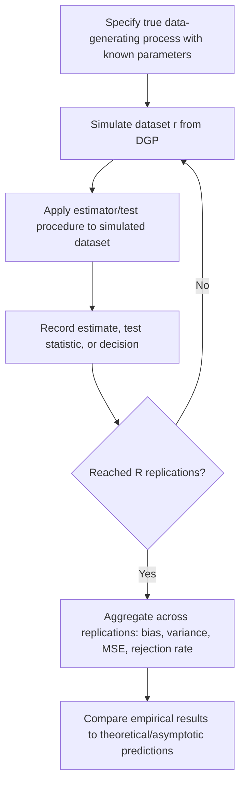

## Monte Carlo Experiment Design


### Conceptual Foundation

Monte Carlo experiments are simulation studies used to evaluate the **finite-sample properties of statistical estimators and procedures** under known, controlled data-generating processes. Because the true population parameters are set by the researcher rather than unknown, Monte Carlo experiments allow direct assessment of properties like bias, variance, mean squared error, and test size/power — quantities that are often only known asymptotically or under idealized theoretical conditions, but whose actual finite-sample behavior may differ meaningfully from asymptotic theory.

This distinguishes Monte Carlo experimentation from the bootstrap and other resampling methods applied to *real, observed* data: a Monte Carlo experiment generates entirely **synthetic data from a known, fully specified model**, making it a tool for studying the properties of a *method* itself, rather than a tool for quantifying uncertainty about a specific dataset's parameters.

### Core Workflow

1. **Specify the data-generating process (DGP)**: define the true model, including functional form, parameter values, error distribution, and sample size
2. **Simulate many independent datasets** from this DGP (e.g., $R = 1000$ to $10000$ replications)
3. **Apply the estimator or procedure under study** to each simulated dataset, recording the resulting estimate, test statistic, or decision (reject/fail to reject) each time
4. **Aggregate results across replications** to estimate properties such as bias, variance, coverage rate, or rejection rate
5. **Compare empirical results to theoretical predictions** (e.g., asymptotic bias of zero, nominal 95% coverage, nominal 5% test size) to assess whether theory provides an adequate approximation at the sample sizes and conditions studied

### Monte Carlo Experiment Flow



### Estimating Bias, Variance, and MSE via Monte Carlo

Given $R$ replications producing estimates $\hat{\theta}^{(1)}, \ldots, \hat{\theta}^{(R)}$ of a known true parameter $\theta_0$:

**Monte Carlo bias**:

$$\widehat{\text{Bias}}_{MC}(\hat{\theta}) = \frac{1}{R}\sum_{r=1}^{R}\hat{\theta}^{(r)} - \theta_0$$

**Monte Carlo variance**:

$$\widehat{\text{Var}}_{MC}(\hat{\theta}) = \frac{1}{R-1}\sum_{r=1}^{R}\left(\hat{\theta}^{(r)} - \bar{\theta}^{(\cdot)}\right)^2, \qquad \bar{\theta}^{(\cdot)} = \frac{1}{R}\sum_{r=1}^{R}\hat{\theta}^{(r)}$$

**Monte Carlo mean squared error**:

$$\widehat{\text{MSE}}_{MC}(\hat{\theta}) = \frac{1}{R}\sum_{r=1}^{R}\left(\hat{\theta}^{(r)} - \theta_0\right)^2 = \left[\widehat{\text{Bias}}_{MC}(\hat{\theta})\right]^2 + \widehat{\text{Var}}_{MC}(\hat{\theta})$$

This decomposition — that MSE equals squared bias plus variance — is the classical bias-variance decomposition, and Monte Carlo experiments allow both components to be estimated directly, even for estimators whose analytic bias or variance formulas are unavailable or hold only asymptotically.

### Worked Example: Assessing OLS Bias Under Measurement Error

**Setup**: Suppose interest lies in whether ordinary least squares (OLS) remains unbiased when a predictor variable is measured with error — a scenario known theoretically to induce **attenuation bias**, but whose magnitude for specific sample sizes and error variances benefits from direct simulation.

**DGP specification**:

$$y_i = \beta_0 + \beta_1 x_i^{true} + \epsilon_i, \qquad \epsilon_i \sim N(0, \sigma^2)$$


$$x_i^{observed} = x_i^{true} + u_i, \qquad u_i \sim N(0, \sigma_u^2)$$

with known true values, e.g., $\beta_0 = 2$, $\beta_1 = 3$, $\sigma^2 = 1$, and measurement error variance $\sigma_u^2$ varied across experimental conditions (e.g., $\sigma_u^2 \in \{0, 0.5, 1, 2\}$) to study how bias severity scales with measurement error magnitude.

**Simulation procedure**: for each level of $\sigma_u^2$, generate $R = 5000$ datasets of a chosen sample size $n$, regress $y$ on $x^{observed}$ (the mismeasured predictor) in each replication, and record $\hat{\beta}_1^{(r)}$. The Monte Carlo bias of $\hat{\beta}_1$ across replications directly quantifies the attenuation bias induced by measurement error at each simulated noise level, and can be compared to the known theoretical attenuation factor $\beta_1 \cdot \frac{\sigma_x^2}{\sigma_x^2 + \sigma_u^2}$ for this classical errors-in-variables setup.

[Inference] The specific numeric bias observed in any particular simulation run depends on the exact parameter values, sample size, and number of replications chosen; the qualitative pattern — increasing attenuation bias as $\sigma_u^2$ increases — is a well-established theoretical result for this class of measurement error models, but precise finite-sample magnitudes require running the specified simulation.

### Assessing Test Size and Power

Monte Carlo experiments are widely used to evaluate whether a hypothesis test achieves its **nominal size** (Type I error rate) in finite samples, and to compare the **power** of competing test procedures:

**Size assessment**: simulate data under the null hypothesis being tested (e.g., $\beta_1 = 0$), apply the test procedure across $R$ replications, and compute the empirical rejection rate at a chosen nominal significance level (e.g., $\alpha = 0.05$). A well-calibrated test should reject the null in approximately 5% of replications when the null is true; substantial deviation from this nominal rate signals size distortion in finite samples.

**Power assessment**: simulate data under a specific alternative hypothesis (e.g., $\beta_1 = 0.5$), apply the same test procedure, and compute the empirical rejection rate — this estimates the test's power to detect that specific alternative at that specific sample size, and is often repeated across a grid of alternative effect sizes to trace out a full power curve.

### Power Curve Illustration

<svg xmlns="http://www.w3.org/2000/svg" viewBox="0 0 650 380">
<text x="325" y="25" font-size="16" font-weight="bold" text-anchor="middle" fill="#222">Monte Carlo Power Curve Across Effect Sizes (svg_diagram)</text>
<line x1="70" y1="320" x2="600" y2="320" stroke="#333" stroke-width="1.5" />
<line x1="70" y1="320" x2="70" y2="60" stroke="#333" stroke-width="1.5" />
<text x="335" y="355" font-size="13" text-anchor="middle" fill="#333">True Effect Size</text>
<text x="35" y="190" font-size="13" text-anchor="middle" fill="#333" transform="rotate(-90 35 190)">Empirical Power</text>


<path d="M 90 300 C 150 295, 200 280, 250 240 C 300 190, 340 130, 390 95 C 440 75, 500 65, 580 62" fill="none" stroke="`#2b6cb0`" stroke-width="2.5" />


<line x1="70" y1="300" x2="600" y2="300" stroke="#c05621" stroke-width="1.5" stroke-dasharray="4,3" />
<text x="500" y="295" font-size="11" fill="#c05621">Nominal alpha = 0.05 (power at null)</text>

<line x1="70" y1="125" x2="600" y2="125" stroke="#68d391" stroke-width="1" stroke-dasharray="3,3" />
<text x="90" y="118" font-size="11" fill="#2f855a">80% power reference</text>

<text x="90" y="335" font-size="10" fill="#555">0 (null)</text>

<text x="560" y="335" font-size="10" fill="#555">large effect</text>

</svg>

### Design Considerations: Choosing Simulation Parameters

**Number of replications ($R$)**: larger $R$ reduces Monte Carlo simulation error in the estimated bias, variance, or rejection rate. Since the Monte Carlo estimate of a rejection rate is itself a sample proportion, its own standard error is approximately $\sqrt{p(1-p)/R}$ — for a true rejection rate near 0.05, roughly $R = 10000$ replications yields a Monte Carlo standard error on the estimated rejection rate of about 0.0022, providing a practical basis for setting $R$ large enough to distinguish nominal size from plausible size distortions.

**Sample size grid**: experiments are typically run across multiple sample sizes (e.g., $n = 25, 50, 100, 500, 1000$) to study how an estimator's or test's finite-sample properties evolve toward asymptotic behavior, revealing whether asymptotic approximations are adequate at empirically relevant sample sizes for the application of interest.

**Parameter grid**: beyond sample size, experiments often vary other DGP characteristics relevant to robustness questions — error distribution shape (normal vs. heavy-tailed), degree of heteroskedasticity, strength of correlation between regressors, or magnitude of a nuisance parameter — to assess whether conclusions about an estimator's performance are sensitive to these design choices.

**Random seed management**: setting and recording random seeds ensures full reproducibility of simulation results, an important methodological practice particularly when reporting Monte Carlo findings for publication or peer review.

### Factorial Monte Carlo Designs

Many Monte Carlo studies in econometrics and statistics employ a **factorial design**, systematically crossing multiple DGP factors (e.g., sample size × error distribution × degree of endogeneity) to assess both main effects and interactions in how estimator performance depends on these conditions, rather than varying only one factor at a time. This mirrors experimental design principles from the broader design-of-experiments literature, applied here to simulation studies rather than physical experiments.

### Common Monte Carlo Study Objectives

| Objective | What is measured | Typical output |
| --- | --- | --- |
| Bias assessment | Difference between average estimate and true parameter | Bias as a function of $n$, DGP conditions |
| Efficiency comparison | Relative variance of competing unbiased (or comparably biased) estimators | Relative efficiency ratios |
| Test size evaluation | Empirical rejection rate under the null | Comparison to nominal $\alpha$ |
| Test power comparison | Empirical rejection rate under various alternatives | Power curves across effect sizes |
| Robustness to misspecification | Estimator/test performance when true DGP deviates from assumed model | Degradation patterns across misspecification severity |
| Confidence interval coverage | Proportion of intervals containing the true parameter | Coverage rate vs. nominal confidence level |

### Reporting Monte Carlo Simulation Error

Because Monte Carlo results are themselves estimates subject to sampling variability (from the finite number of replications $R$), rigorous reporting includes **Monte Carlo standard errors** on the reported bias, rejection rate, or other summary statistics — distinguishing genuine differences in estimator performance from noise attributable to a finite number of simulation replications. This is analogous to reporting standard errors for any other estimated quantity, applied here to the simulation study's own summary statistics.

### Computational Implementation Considerations

```python
import numpy as np
from scipy import stats

def monte_carlo_ols_bias(n, beta1_true, sigma_u, R=5000, seed=None):
    rng = np.random.default_rng(seed)
    beta1_estimates = np.empty(R)

    for r in range(R):
        x_true = rng.normal(0, 1, size=n)
        epsilon = rng.normal(0, 1, size=n)
        y = 2 + beta1_true * x_true + epsilon
        x_observed = x_true + rng.normal(0, sigma_u, size=n)

        X = np.column_stack([np.ones(n), x_observed])
        beta_hat = np.linalg.lstsq(X, y, rcond=None)[0]
        beta1_estimates[r] = beta_hat[1]

    bias = np.mean(beta1_estimates) - beta1_true
    mc_se_bias = np.std(beta1_estimates, ddof=1) / np.sqrt(R)
    return bias, mc_se_bias, beta1_estimates

bias, mc_se, estimates = monte_carlo_ols_bias(n=100, beta1_true=3, sigma_u=1.0, seed=42)
```

### Common Pitfalls

- **Using too few replications**, producing Monte Carlo estimates of bias, size, or power that are themselves noisy enough to obscure the true pattern being studied — always accompanying results with Monte Carlo standard errors clarifies whether observed differences are meaningful
- **Failing to vary sample size systematically**, missing the opportunity to observe how quickly (or slowly) an estimator or test approaches its asymptotic behavior, which is often the central question motivating the simulation study in the first place
- **Conflating Monte Carlo experimentation with the bootstrap** — Monte Carlo experiments simulate from a fully known DGP to study estimator/test properties in general, while the bootstrap resamples from or simulates around a *specific observed dataset* to quantify uncertainty about that dataset's own estimates; the two serve fundamentally different purposes despite superficially similar computational machinery
- **Neglecting reproducibility practices** — failing to set and document random seeds undermines the ability of others (or oneself, later) to exactly reproduce reported simulation results
- **Over-generalizing from a narrow simulation design** — conclusions about an estimator's bias or a test's power drawn from a single, narrow set of DGP conditions may not generalize to other plausible real-world data-generating processes; broader parameter grids and robustness checks across multiple DGP specifications strengthen the generalizability of simulation-based conclusions

### Related Topics

- Bias-variance decomposition and mean squared error
- Hypothesis testing: Type I/II error, statistical power, and size distortion
- Bootstrap and jackknife resampling as related but distinct simulation-based methods
- Asymptotic theory and finite-sample approximation quality
- Measurement error models and attenuation bias
- Design of experiments principles applied to simulation studies (factorial designs)
- Random number generation and pseudorandom seed management for reproducibility
- Simulation-based power analysis for study design and sample size planning