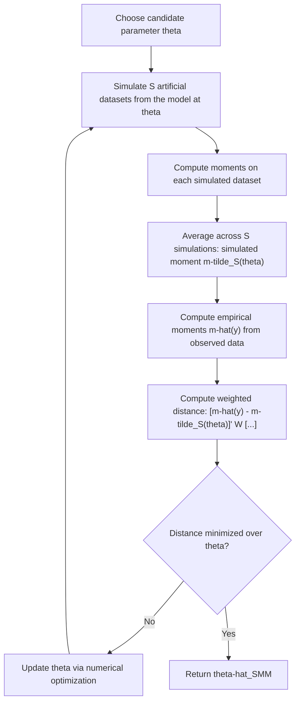

## Simulated Method of Moments

### Conceptual Foundation

Simulated Method of Moments (SMM) is an estimation technique for models in which the theoretical moments implied by the model **cannot be computed analytically in closed form**, but the model can nonetheless be **simulated** given a candidate set of parameter values. SMM extends the classical Method of Moments (and Generalized Method of Moments, GMM) by replacing analytically computed model-implied moments with **simulated moments** — averages computed over many simulated draws from the model at each candidate parameter value — matched against corresponding empirical moments from the observed data.

This makes SMM particularly valuable in structural econometric models (e.g., dynamic stochastic general equilibrium models, discrete choice models with complex random utility structures, or models with latent variables and complicated integrals) where the likelihood or moment conditions involve high-dimensional integrals that are analytically intractable but straightforward to approximate via simulation.

### Core Logic: From GMM to SMM

**Standard GMM** minimizes a weighted distance between empirical moments $\hat{m}(y)$ computed from data and theoretical moments $m(\theta)$ implied by the model at parameter value $\theta$:

$$\hat{\theta}_{GMM} = \arg\min_{\theta} \left[\hat{m}(y) - m(\theta)\right]' W \left[\hat{m}(y) - m(\theta)\right]$$

**SMM's key modification**: when $m(\theta)$ has no closed form, it is replaced by a **simulated approximation** $\tilde{m}_S(\theta)$, obtained by simulating $S$ artificial datasets from the model at parameter value $\theta$ and averaging the resulting moments across simulations:

$$\tilde{m}_S(\theta) = \frac{1}{S}\sum_{s=1}^{S} m\left(y^{*(s)}(\theta)\right)$$


$$\hat{\theta}_{SMM} = \arg\min_{\theta} \left[\hat{m}(y) - \tilde{m}_S(\theta)\right]' W \left[\hat{m}(y) - \tilde{m}_S(\theta)\right]$$

As the number of simulations $S \to \infty$, $\tilde{m}_S(\theta)$ converges to the true (unknown, intractable) theoretical moment $m(\theta)$, and SMM's asymptotic properties approach those of standard GMM — but with an additional source of estimation noise from finite $S$ that must be accounted for.

### SMM Estimation Flow



### Worked Example: SMM for a Structural Model with Latent Heterogeneity

**Setup**: Suppose a labor supply model specifies that observed hours worked $h_i$ depend on a wage $w_i$, observable characteristics $x_i$, and an unobserved individual-level random utility parameter $\eta_i$ drawn from some distribution (e.g., $\eta_i \sim N(0, \sigma_\eta^2)$), where the mapping from $(w_i, x_i, \eta_i, \theta)$ to observed hours $h_i$ involves solving a utility-maximization problem with no closed-form solution due to nonlinearities in preferences or budget constraints (e.g., from tax schedules).

**Why SMM is needed**: the theoretical moment $E[h_i \mid w_i, x_i; \theta]$ requires integrating over the distribution of $\eta_i$, an integral with no closed form given the nonlinear utility-maximization step embedded in the model.

**SMM procedure**:

1. For a candidate parameter vector $\theta$ (governing preferences, e.g., risk aversion or labor supply elasticity, and $\sigma_\eta$), simulate $S$ draws of $\eta_i$ for each observed individual $i$
2. For each simulated $\eta_i^{(s)}$, solve the individual's utility-maximization problem to obtain simulated hours $h_i^{*(s)}(\theta)$
3. Average across $S$ simulations per individual to obtain $\tilde{h}_i(\theta) = \frac{1}{S}\sum_s h_i^{*(s)}(\theta)$
4. Compute simulated moments (e.g., mean hours, variance of hours, covariance of hours with wage) from $\{\tilde{h}_i(\theta)\}$ and compare to corresponding empirical moments from observed $\{h_i\}$
5. Search over $\theta$ to minimize the weighted distance between simulated and empirical moments

[Inference] The specific moments chosen (mean, variance, covariance with wage, etc.) and the specific functional form of the utility-maximization problem are illustrative of a common labor-supply structural estimation approach; actual applied implementations vary considerably in model specifics, and this example is meant to convey the general SMM logic rather than a specific published model's exact specification.

### Choosing Moments to Match

Unlike maximum likelihood, which uses the full likelihood function, SMM (like GMM) requires the researcher to **select a specific finite set of moments** to match. Common considerations:

- **Identification**: the chosen moments must be sufficient to identify all structural parameters — the number of moments must be at least as large as the number of parameters (for exact identification or overidentification), and the moments must vary meaningfully with each parameter
- **Informativeness**: moments that are highly sensitive to the parameters of interest provide more precise estimates than moments that vary little as parameters change
- **Computational tractability**: since each candidate parameter vector requires re-simulating the model, computationally cheap-to-compute moments are practically preferable, especially within an iterative optimization routine that evaluates many candidate parameter vectors

### The Weighting Matrix

As in standard GMM, the choice of weighting matrix $W$ affects estimator efficiency. The **efficient SMM weighting matrix** is the inverse of the asymptotic variance-covariance matrix of the moment differences, analogous to efficient GMM weighting, though estimating this variance itself typically requires an initial consistent (if inefficient) SMM estimate — motivating a common **two-step procedure**:

1. **First step**: estimate $\theta$ using an arbitrary (e.g., identity) weighting matrix, obtaining a consistent but inefficient estimate $\hat{\theta}^{(1)}$
2. **Second step**: use $\hat{\theta}^{(1)}$ to estimate the optimal weighting matrix, then re-estimate $\theta$ using this improved weighting matrix to obtain the efficient SMM estimator $\hat{\theta}^{(2)}$

### Simulation Noise and the Role of $S$

A defining feature distinguishing SMM from standard GMM is the additional variance contributed by using a **finite number of simulations** $S$ rather than the exact theoretical moment. This introduces an extra term in the asymptotic variance of $\hat{\theta}_{SMM}$ relative to what would be obtained with the true (infeasible) theoretical moments:

$$\text{Avar}(\hat{\theta}_{SMM}) \approx \left(1 + \frac{1}{S}\right) \times \text{Avar}(\hat{\theta}_{GMM,\text{infeasible}})$$

This well-known result (from McFadden's and Pakes and Pollard's foundational SMM papers) implies that simulation noise inflates estimator variance by a factor that shrinks as $S$ grows, and becomes negligible once $S$ is large relative to the sample size $n$ — providing clear practical guidance that **larger $S$ improves precision**, with diminishing returns as $S$ increases further. [Unverified — the precise form of this variance inflation factor derives from specific theoretical papers under particular regularity conditions; the qualitative implication that increasing $S$ reduces simulation-induced variance is well established, though the exact $(1+1/S)$ multiplicative form applies under the specific assumptions of the originating theoretical framework]

### Common Random Numbers Across Parameter Evaluations

A crucial practical implementation detail: to ensure the SMM objective function behaves smoothly as $\theta$ is varied during optimization (avoiding spurious "simulation noise" that could be mistaken for genuine changes in the objective function), the **same underlying random draws** (e.g., the same set of standard normal shocks) should be used across different candidate values of $\theta$ evaluated during optimization, simply transformed appropriately as $\theta$ changes. This technique — sometimes called the use of **common random numbers** — helps ensure the simulated objective function is smooth and well-behaved for numerical optimization, rather than exhibiting spurious local minima or discontinuities purely as artifacts of using fresh random draws at each evaluated parameter value.

### SMM vs. Other Simulation-Based Estimation Methods

| Method | What is matched | Typical use case |
| --- | --- | --- |
| Simulated Method of Moments (SMM) | Simulated moments vs. empirical moments | Structural models with intractable moment conditions |
| Simulated Maximum Likelihood (SML) | Simulated likelihood approximation, maximized directly | Models with intractable likelihood integrals (e.g., multinomial probit) |
| Indirect Inference | Parameters of an auxiliary (simpler) model, fit to both simulated and real data | Models where even moments are hard to define but an auxiliary model can be fit to both real and simulated data |
| Approximate Bayesian Computation (ABC) | Simulated summary statistics vs. observed summary statistics, within a Bayesian framework | Bayesian inference for models with intractable likelihoods |

### Indirect Inference as a Generalization

**Indirect inference** generalizes the SMM logic by matching parameters of a tractable **auxiliary model** (rather than raw moments) estimated on both the real data and on data simulated from the structural model of interest. The structural parameters are chosen so that the auxiliary model's estimated parameters, when applied to simulated data, closely match the auxiliary model's parameters estimated on the real data. This can be viewed as a strict generalization of SMM, since matching sample moments is itself a special case of matching auxiliary model parameters (using the moments themselves as the "auxiliary parameters").

### Computational Implementation Considerations

```python
import numpy as np
from scipy.optimize import minimize

def simulate_model_moments(theta, x_data, S=200, seed=None):
    rng = np.random.default_rng(seed)
    n = len(x_data)
    sim_moments = np.empty((S, 2))  # e.g., mean and variance of simulated outcome
    for s in range(S):
        eta = rng.normal(0, theta[1], size=n)  # theta[1] = sigma_eta
        y_sim = theta[0] * x_data + eta  # simplified illustrative structural relationship
        sim_moments[s] = [np.mean(y_sim), np.var(y_sim)]
    return sim_moments.mean(axis=0)

def smm_objective(theta, x_data, empirical_moments, W, S=200, seed=42):
    sim_moments = simulate_model_moments(theta, x_data, S=S, seed=seed)
    diff = empirical_moments - sim_moments
    return diff @ W @ diff

# Illustrative call (identity weighting matrix, first-step SMM)
x_data = np.random.default_rng(0).normal(0, 1, size=500)
empirical_moments = np.array([1.5, 2.0])  # observed mean, variance from real data
W = np.eye(2)
result = minimize(smm_objective, x0=[1.0, 1.0], args=(x_data, empirical_moments, W))
```

Note: fixing the `seed` parameter across all objective function evaluations during optimization implements the common random numbers principle described above, ensuring the same underlying simulated shocks are reused (appropriately transformed) as $\theta$ varies during the search.

### Common Pitfalls

- **Using too few simulations ($S$)**, inflating estimator variance unnecessarily beyond what the observed sample size alone would imply, and potentially producing a noisy, hard-to-optimize objective function
- **Failing to use common random numbers across parameter evaluations**, introducing spurious noise into the objective surface that can mislead numerical optimizers into false local minima or convergence failures
- **Choosing uninformative or poorly identified moments**, which can leave some structural parameters weakly identified even when the total number of moments technically exceeds the number of parameters
- **Confusing SMM with the bootstrap or Monte Carlo experimentation** — SMM uses simulation as an integral part of the *estimation* procedure itself (approximating otherwise intractable moments), whereas the bootstrap and Monte Carlo experiments use simulation to assess uncertainty or properties of already-defined estimators, a related but distinct purpose
- **Neglecting to adjust standard errors for simulation noise** — properly computed SMM standard errors must account for the additional variance contributed by finite $S$, not just the variance that would apply under standard (infeasible) GMM with exact theoretical moments

### Related Topics

- Generalized Method of Moments (GMM) and optimal weighting matrices
- Indirect inference and auxiliary model-based estimation
- Simulated Maximum Likelihood (SML) for intractable likelihood models
- Approximate Bayesian Computation (ABC) as a Bayesian analogue
- Structural econometric models (discrete choice, dynamic programming, general equilibrium)
- Common random numbers and variance reduction in simulation-based optimization
- Identification conditions in moment-based estimation
- Monte Carlo experiment design for evaluating SMM estimator properties