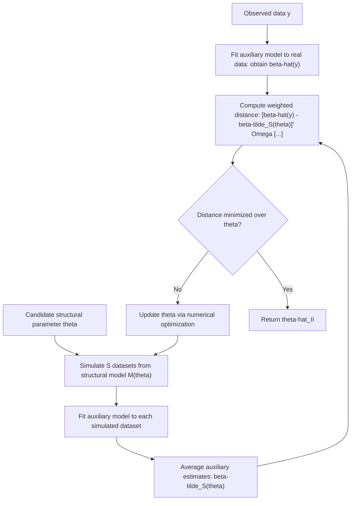

## Indirect Inference

### Conceptual Foundation

Indirect inference is a simulation-based estimation method for structural models whose likelihood function is analytically or computationally intractable, but which can be **simulated** given a candidate set of parameters. Rather than matching simulated moments directly to empirical moments (as in Simulated Method of Moments), indirect inference matches the **estimated parameters of a tractable auxiliary model**, fit separately to the real data and to data simulated from the structural model of interest. The structural parameters are chosen so that simulating from the structural model and then fitting the auxiliary model to that simulated data reproduces the auxiliary parameter estimates obtained from the real data as closely as possible.

Developed principally by Gouriéroux, Monfort, and Renault (1993) and independently related to work by Smith (1993) under the related name "efficient method of moments" in some contexts, indirect inference is especially valued in structural macroeconomics, finance, and industrial organization, where structural models (e.g., dynamic stochastic general equilibrium models, structural auction models, agent-based models) are often easy to simulate but have no tractable likelihood.

### Core Logic: The Auxiliary Model as a Bridge

The **auxiliary model** need not be correctly specified relative to the true structural model — its role is purely instrumental, serving as a computationally convenient and sufficiently informative summary of the data's key features, against which both real and simulated data can be compared on equal footing. Because the auxiliary model is applied identically to real data and to simulated data generated at each candidate structural parameter value, any misspecification in the auxiliary model affects both applications symmetrically, which is the key theoretical property (a form of "binding function" invariance) that allows indirect inference to recover consistent estimates of the true structural parameters despite the auxiliary model itself being an approximation.

### Algorithm

Given observed data $y$, a structural model $M(\theta)$ from which data can be simulated, and a tractable auxiliary model with likelihood or moment structure characterized by auxiliary parameter $\beta$:

1. **Estimate the auxiliary model on real data**: fit the auxiliary model to observed data $y$, obtaining $\hat{\beta}(y)$
2. **Simulate from the structural model**: for a candidate structural parameter $\theta$, simulate $S$ artificial datasets $y^{*(1)}(\theta), \ldots, y^{*(S)}(\theta)$ from the structural model
3. **Estimate the auxiliary model on simulated data**: fit the same auxiliary model to each simulated dataset, obtaining $\hat{\beta}^{*(s)}(\theta)$ for $s = 1, \ldots, S$, and average: $\tilde{\beta}_S(\theta) = \frac{1}{S}\sum_s \hat{\beta}^{*(s)}(\theta)$
4. **Minimize the distance** between real-data and simulated-data auxiliary parameter estimates over $\theta$:

$$\hat{\theta}_{II} = \arg\min_{\theta} \left[\hat{\beta}(y) - \tilde{\beta}_S(\theta)\right]' \Omega \left[\hat{\beta}(y) - \tilde{\beta}_S(\theta)\right]$$

where $\Omega$ is a chosen weighting matrix (with the efficient choice being the inverse of the asymptotic variance of $\hat{\beta}(y)$).

### Indirect Inference Estimation Flow



### Worked Example: Indirect Inference for a Stochastic Volatility Model

**Setup**: A stochastic volatility model for asset returns specifies:

$$r_t = \sigma_t \epsilon_t, \qquad \log(\sigma_t^2) = \omega + \phi\log(\sigma_{t-1}^2) + \eta_t$$

with $\epsilon_t \sim N(0,1)$ and $\eta_t \sim N(0, \sigma_\eta^2)$, and structural parameters $\theta = (\omega, \phi, \sigma_\eta^2)$. The exact likelihood of this model involves integrating out the entire latent volatility path $\{\sigma_t^2\}$, an integral with no closed form due to the nonlinear, dynamic latent structure.

**Auxiliary model choice**: a natural, tractable auxiliary model is a **GARCH(1,1) model** fit by (quasi-)maximum likelihood, since GARCH models are computationally straightforward to estimate and are known to capture similar volatility-clustering features as stochastic volatility models, even though GARCH is not the "true" data-generating process assumed.

**Indirect inference procedure**:

1. Fit a GARCH(1,1) model to the observed return series, obtaining auxiliary parameter estimates $\hat{\beta}(y)$ (e.g., GARCH persistence and volatility-of-volatility parameters)
2. For a candidate $\theta = (\omega, \phi, \sigma_\eta^2)$, simulate return series from the stochastic volatility model
3. Fit the same GARCH(1,1) model to each simulated series, average the resulting GARCH parameter estimates across simulations
4. Adjust $\theta$ to minimize the distance between the real-data GARCH estimates and the simulated-data GARCH estimates
5. The resulting $\hat{\theta}_{II}$ is the indirect inference estimate of the stochastic volatility model's structural parameters

[Inference] This example reflects a standard and widely documented application pattern of indirect inference in financial econometrics (using GARCH as an auxiliary model for stochastic volatility estimation); specific published implementations vary in exact auxiliary model specification and estimation details, and this description is illustrative of the general approach rather than a specific paper's exact procedure.

### Choice of Auxiliary Model

Selecting a suitable auxiliary model involves balancing several considerations:

- **Tractability**: the auxiliary model must be quick and reliable to estimate, since it will be re-estimated on every simulated dataset generated during the optimization search over $\theta$
- **Informativeness (encompassing)**: the auxiliary model's parameters should be sensitive to variation in the structural parameters of interest — an auxiliary model that captures too little of the data's relevant features will yield weakly identified or imprecise structural parameter estimates
- **Dimension matching**: for exact identification, the number of auxiliary parameters should at least equal the number of structural parameters being estimated (analogous to the moment-counting identification condition in GMM/SMM); using more auxiliary parameters than structural parameters yields an overidentified indirect inference estimator, which additionally permits an overidentification test of the structural model's validity

### Efficient Method of Moments as a Related Framework

**Efficient Method of Moments (EMM)**, developed by Gallant and Tauchen, is closely related to indirect inference and sometimes described as a specific variant: rather than matching auxiliary *parameter estimates* directly, EMM matches the **score (gradient of the log-likelihood) of the auxiliary model**, evaluated at the auxiliary model's own maximum likelihood estimate, using data simulated from the structural model. When the auxiliary model is chosen to closely approximate the true (unknown) likelihood of the structural model — a "semi-nonparametric" auxiliary density, often built from a flexible seminonparametric (SNP) density expansion — EMM can achieve estimation efficiency approaching that of full maximum likelihood, which is the origin of the "efficient" in its name.

### Indirect Inference vs. SMM vs. Other Simulation-Based Methods

| Method | What is matched | Key requirement |
| --- | --- | --- |
| Simulated Method of Moments (SMM) | Simulated moments vs. empirical moments | A well-chosen set of informative moments |
| Indirect Inference | Auxiliary model parameter estimates, real vs. simulated data | A tractable, sufficiently informative auxiliary model |
| Efficient Method of Moments (EMM) | Auxiliary model score function, evaluated at simulated data | A flexible auxiliary density approximating the true likelihood |
| Simulated Maximum Likelihood (SML) | Simulated likelihood approximation, maximized directly | A feasible way to simulate unbiased likelihood contributions |

Indirect inference can be viewed as **strictly more general** than SMM: choosing the auxiliary model to be simply "compute the sample moments" reduces indirect inference exactly to SMM, since matching sample moments (mean, variance, etc.) is itself a trivial special case of matching auxiliary "model parameters."

### Asymptotic Properties

Under standard regularity conditions, the indirect inference estimator is consistent and asymptotically normal, with asymptotic variance that depends on both the informativeness of the auxiliary model (via its own asymptotic variance and sensitivity to $\theta$, captured through a "binding function" relating structural and auxiliary parameters) and the number of simulations $S$ used to approximate $\tilde{\beta}_S(\theta)$. As with SMM, using a larger $S$ reduces simulation-induced variance inflation relative to what would be achieved using the (infeasible) exact structural model's implied auxiliary parameters, with returns diminishing as $S$ grows large relative to the effective information content of the estimation problem. [Unverified — the precise functional form of the asymptotic variance formula, including the exact role of $S$, depends on the specific theoretical framework and regularity conditions in the originating indirect inference literature, and varies somewhat across the SMM, indirect inference, and EMM variants]

### Overidentification Testing

When the number of auxiliary parameters exceeds the number of structural parameters, the minimized value of the indirect inference objective function at $\hat{\theta}_{II}$ provides a basis for an **overidentification test**, analogous to the J-test in standard GMM: under correct structural model specification, this minimized objective function value should be small (close to what sampling variability alone would produce), while systematic structural model misspecification tends to produce a large minimized objective value, since no choice of $\theta$ can make the simulated auxiliary parameters closely match the real-data auxiliary parameters if the underlying structural model is fundamentally incompatible with the data's actual features.

### Common Random Numbers and Optimization Stability

As with SMM, indirect inference estimation benefits substantially from using **common random numbers** across different candidate values of $\theta$ evaluated during the numerical search — reusing the same underlying random shocks (appropriately transformed as $\theta$ changes) when simulating data at each candidate parameter value. This practice smooths the simulated objective function, reducing the risk that a numerical optimizer mistakes simulation noise for genuine curvature in the true objective surface, a practical concern shared across all simulation-based estimation methods in this family.

### Computational Implementation Considerations

```python
import numpy as np
from scipy.optimize import minimize

def fit_auxiliary_ar1(series):
    # Illustrative auxiliary model: simple AR(1) fit via OLS as a stand-in for GARCH
    y = series[1:]
    x = series[:-1]
    phi_hat = np.sum(x * y) / np.sum(x ** 2)
    resid_var = np.var(y - phi_hat * x)
    return np.array([phi_hat, resid_var])

def simulate_structural_series(theta, n, seed):
    rng = np.random.default_rng(seed)
    omega, phi, sigma_eta = theta
    log_vol = np.zeros(n)
    returns = np.zeros(n)
    for t in range(1, n):
        log_vol[t] = omega + phi * log_vol[t-1] + rng.normal(0, sigma_eta)
        returns[t] = np.exp(log_vol[t] / 2) * rng.normal(0, 1)
    return returns

def indirect_inference_objective(theta, real_aux_params, n, S=50, base_seed=100):
    sim_aux_params = np.empty((S, 2))
    for s in range(S):
        sim_series = simulate_structural_series(theta, n, seed=base_seed + s)
        sim_aux_params[s] = fit_auxiliary_ar1(sim_series)
    avg_sim_aux = sim_aux_params.mean(axis=0)
    diff = real_aux_params - avg_sim_aux
    return diff @ diff  # identity weighting for illustration

# real_data_aux_params would be obtained by fitting the auxiliary model to the observed series
```

### Common Pitfalls

- **Choosing an uninformative auxiliary model** that fails to capture features of the data sensitive to variation in the structural parameters, resulting in weak identification even when the auxiliary parameter count formally exceeds the structural parameter count
- **Neglecting common random numbers**, introducing unnecessary simulation noise into the objective function that can destabilize numerical optimization
- **Using too few simulations ($S$)**, inflating estimator variance beyond what the sample size alone would justify and increasing the risk of an unstable, noisy objective surface
- **Confusing indirect inference with SMM** — while closely related, indirect inference specifically matches estimated auxiliary model *parameters* rather than raw simulated moments, a distinction that matters when the auxiliary model summarizes the data through parameters not directly reducible to simple sample moments
- **Overlooking the need for the auxiliary model to be applied identically to real and simulated data** — any deviation in how the auxiliary model is estimated between the real-data and simulated-data steps (e.g., different starting values, different convergence criteria) can introduce bias unrelated to genuine structural parameter effects

### Related Topics

- Simulated Method of Moments (SMM) as a special case of indirect inference
- Efficient Method of Moments (EMM) and seminonparametric auxiliary densities
- Simulated Maximum Likelihood (SML) for intractable likelihood models
- Generalized Method of Moments (GMM) and overidentification (J-)testing
- Stochastic volatility and GARCH models in financial econometrics
- Common random numbers and variance reduction in simulation-based estimation
- Structural macroeconomic models (DSGE) estimated via simulation-based methods
- Approximate Bayesian Computation (ABC) as a related Bayesian simulation-based framework