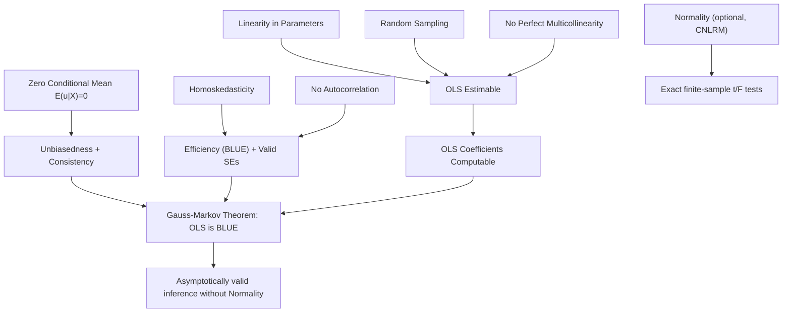

## Gauss-Markov Assumptions

### Overview

The Gauss-Markov assumptions are a set of conditions on the classical linear regression model (CLRM) under which the Ordinary Least Squares (OLS) estimator is the **Best Linear Unbiased Estimator (BLUE)** of the regression coefficients. "Best" here means minimum variance among all linear unbiased estimators. These assumptions form the theoretical foundation of the Gauss-Markov theorem and underpin classical inference (t-tests, F-tests, confidence intervals) in linear regression.

The model under consideration is:

$$y_i = \beta_0 + \beta_1 x_{i1} + \beta_2 x_{i2} + \cdots + \beta_k x_{ik} + u_i$$

or in matrix form:

$$\mathbf{y} = \mathbf{X}\boldsymbol{\beta} + \mathbf{u}$$

where $\mathbf{y}$ is an $n \times 1$ vector of the dependent variable, $\mathbf{X}$ is an $n \times (k+1)$ matrix of regressors (including a constant), $\boldsymbol{\beta}$ is a $(k+1) \times 1$ vector of parameters, and $\mathbf{u}$ is an $n \times 1$ vector of disturbances.

### The Assumptions

#### 1. Linearity in Parameters

The model is linear in the parameters $\boldsymbol{\beta}$, though not necessarily in the variables. This means:

$$y_i = \beta_0 + \beta_1 x_{i1} + \cdots + \beta_k x_{ik} + u_i$$

is valid, and so is a model with $x_{i2} = x_{i1}^2$ (a quadratic term), since the nonlinearity is in the variable, not the coefficient. A model like $y_i = \beta_0 + \beta_1^2 x_i + u_i$ violates this assumption because the parameter enters nonlinearly.

**Key Points**

- This is a restriction on the parameter structure, not on functional form of $x$
- Transformations (logs, polynomials, interactions) of regressors preserve linearity in parameters
- Models nonlinear in parameters (e.g., $y = \beta_0 x^{\beta_1}$) require nonlinear least squares or transformation (e.g., log-linearization)

#### 2. Random Sampling (Independently Sampled Data)

The sample $\{(x_{i1}, \ldots, x_{ik}, y_i)\}_{i=1}^n$ is drawn from a random sample of the underlying population, so that observations are independently and identically distributed (though later relaxations allow non-identical distributions, provided independence holds).

**Key Points**

- Violated by time-series data with autocorrelated structure, or by cluster/panel sampling without correction
- Cross-sectional survey data with simple random sampling typically satisfies this

#### 3. No Perfect Multicollinearity (Full Rank Condition)

None of the regressors is a constant, and there is no exact linear relationship among the regressors. Formally, the matrix $\mathbf{X}$ has full column rank $(k+1)$, meaning $\mathbf{X}^\top \mathbf{X}$ is invertible (nonsingular).

$$\text{rank}(\mathbf{X}) = k + 1$$

**Example**

If a model includes both `income_dollars` and `income_dollars_times_2` as separate regressors, these are perfectly collinear ($x_2 = 2x_1$), so $\mathbf{X}^\top\mathbf{X}$ is singular, and $\hat{\boldsymbol{\beta}} = (\mathbf{X}^\top\mathbf{X})^{-1}\mathbf{X}^\top\mathbf{y}$ cannot be computed. This is distinct from *imperfect* (high but not exact) multicollinearity, which does not violate this assumption but inflates coefficient variance.

#### 4. Zero Conditional Mean (Exogeneity)

The error term has an expected value of zero given any values of the independent variables:

$$E(u_i \mid x_{i1}, x_{i2}, \ldots, x_{ik}) = 0 \quad \text{for all } i$$

This is the most critical and most frequently violated assumption in applied econometrics. It implies:

- The regressors are uncorrelated with the error term: $\text{Cov}(x_{ij}, u_i) = 0$
- No omitted relevant variables that are correlated with included regressors
- No simultaneity (reverse causality between $y$ and any $x_j$)
- No measurement error in regressors correlated with the true value
- The functional form is correctly specified

**Key Points**

- Violation of this assumption causes OLS to be **biased and inconsistent**, not merely inefficient
- Common sources of violation: omitted variable bias, simultaneity bias, measurement error, sample selection bias
- This assumption cannot be tested directly since $u_i$ is unobserved; it is typically argued for on theoretical/institutional grounds or addressed via instrumental variables (IV)

#### 5. Homoskedasticity (Constant Error Variance)

The error term has the same variance given any value of the explanatory variables:

$$\text{Var}(u_i \mid x_{i1}, \ldots, x_{ik}) = \sigma^2 \quad \text{for all } i$$

This is distinct from the zero conditional mean assumption — homoskedasticity concerns the *spread*, not the *center*, of the error distribution.

**Key Points**

- Violation (heteroskedasticity) does not bias OLS coefficient estimates but invalidates the standard OLS variance formula, making conventional standard errors, t-tests, and F-tests unreliable
- Detected via Breusch-Pagan test, White test, or visual inspection of residual plots
- Remedied via heteroskedasticity-robust standard errors (White/Huber-White), weighted least squares (WLS), or Feasible Generalized Least Squares (FGLS)

#### 6. No Autocorrelation (Independence Across Observations)

The error terms for different observations are uncorrelated:

$$\text{Cov}(u_i, u_j \mid \mathbf{X}) = 0 \quad \text{for } i \neq j$$

Combined with assumptions 5 and 6, the error covariance matrix simplifies to:

$$\text{Var}(\mathbf{u} \mid \mathbf{X}) = \sigma^2 \mathbf{I}_n$$

This joint condition (homoskedasticity + no autocorrelation) is often called **spherical errors**.

**Key Points**

- Primarily relevant to time-series data (e.g., serially correlated shocks) but can also arise in panel/clustered data
- Detected via Durbin-Watson test, Breusch-Godfrey test, or residual autocorrelation plots
- Remedied via Newey-West (HAC) standard errors, generalized least squares (GLS), or dynamic model specification (adding lags)

#### 7. Normality of Errors (Classical Normal Linear Regression Model — Optional Extension)

$$u_i \mid \mathbf{X} \sim N(0, \sigma^2)$$

**Key Points**

- This is **not** one of the original Gauss-Markov assumptions; the Gauss-Markov theorem (BLUE property) holds without it
- Normality is required for exact finite-sample inference (t-distributions, F-distributions) rather than for BLUE-ness itself
- In large samples, normality becomes unnecessary for inference because OLS estimators are asymptotically normal by the Central Limit Theorem, regardless of the error distribution [Inference: this asymptotic justification is standard but relies on additional regularity conditions such as finite variance of errors and regressors]

### Summary Table

| # | Assumption | Consequence if Violated |
| --- | --- | --- |
| 1 | Linearity in parameters | Model misspecification; OLS inapplicable directly |
| 2 | Random sampling | Estimates may not generalize; correlated observations |
| 3 | No perfect collinearity | $\hat{\boldsymbol{\beta}}$ undefined (matrix singular) |
| 4 | Zero conditional mean | Bias and inconsistency |
| 5 | Homoskedasticity | Inefficiency; invalid standard errors |
| 6 | No autocorrelation | Inefficiency; invalid standard errors |
| 7 | Normality (optional) | Small-sample inference invalid (large-sample OK) |

### The Gauss-Markov Theorem

Given assumptions 1–6 (normality not required), the OLS estimator $\hat{\boldsymbol{\beta}}_{OLS}$ is BLUE:

$$\hat{\boldsymbol{\beta}}_{OLS} = \arg\min_{\tilde{\boldsymbol{\beta}} \in \mathcal{L}} \text{Var}(\tilde{\boldsymbol{\beta}})$$

where $\mathcal{L}$ is the class of all linear (in $\mathbf{y}$) unbiased estimators of $\boldsymbol{\beta}$. Formally, for any other linear unbiased estimator $\tilde{\boldsymbol{\beta}}$:

$$\text{Var}(\tilde{\boldsymbol{\beta}}) - \text{Var}(\hat{\boldsymbol{\beta}}_{OLS})$$

is a positive semi-definite matrix.

### Diagram: Assumption Dependencies and Consequences

### Practical Diagnostics Workflow

**Example**

A typical applied workflow for checking these assumptions after running OLS:

1. Check VIF (Variance Inflation Factor) for multicollinearity: $\text{VIF}_j = \frac{1}{1 - R_j^2}$, with VIF > 10 often flagged as concerning
2. Plot residuals against fitted values to visually inspect for heteroskedasticity or nonlinearity
3. Run Breusch-Pagan or White test for heteroskedasticity
4. Run Durbin-Watson (for AR(1)) or Breusch-Godfrey (general autocorrelation) test
5. Examine residual Q-Q plot or Jarque-Bera test for normality (relevant to small-sample inference only)
6. Reflect on the research design for zero conditional mean plausibility — this cannot be checked statistically and requires domain reasoning

### Illustrative SVG: Homoskedasticity vs. Heteroskedasticity (svg_diagram)

<svg xmlns="http://www.w3.org/2000/svg" viewBox="0 0 640 300">
<text x="150" y="20" font-size="14" font-weight="bold" text-anchor="middle">Homoskedasticity (svg_diagram)</text>
<line x1="40" y1="150" x2="280" y2="150" stroke="black" stroke-width="1" />
<line x1="40" y1="30" x2="40" y2="270" stroke="black" stroke-width="1" />
<circle cx="60" cy="140" r="3" /><circle cx="60" cy="160" r="3" /><circle cx="60" cy="130" r="3" />
<circle cx="100" cy="145" r="3" /><circle cx="100" cy="155" r="3" /><circle cx="100" cy="135" r="3" />
<circle cx="140" cy="150" r="3" /><circle cx="140" cy="160" r="3" /><circle cx="140" cy="140" r="3" />
<circle cx="180" cy="148" r="3" /><circle cx="180" cy="158" r="3" /><circle cx="180" cy="138" r="3" />
<circle cx="220" cy="152" r="3" /><circle cx="220" cy="162" r="3" /><circle cx="220" cy="142" r="3" />
<circle cx="260" cy="150" r="3" /><circle cx="260" cy="160" r="3" /><circle cx="260" cy="140" r="3" />
<line x1="50" y1="150" x2="270" y2="150" stroke="red" stroke-width="1.5" stroke-dasharray="4,2" />
<text x="160" y="290" font-size="12" text-anchor="middle">Constant spread across fitted values</text>

<text x="480" y="20" font-size="14" font-weight="bold" text-anchor="middle">Heteroskedasticity (svg_diagram)</text>

<line x1="360" y1="150" x2="620" y2="150" stroke="black" stroke-width="1" />

<line x1="360" y1="30" x2="360" y2="270" stroke="black" stroke-width="1" />

<circle cx="380" cy="149" r="2" /><circle cx="380" cy="151" r="2" />

<circle cx="420" cy="145" r="2.5" /><circle cx="420" cy="155" r="2.5" />

<circle cx="460" cy="135" r="3" /><circle cx="460" cy="165" r="3" />

<circle cx="500" cy="120" r="3.5" /><circle cx="500" cy="180" r="3.5" />

<circle cx="540" cy="105" r="4" /><circle cx="540" cy="195" r="4" />

<circle cx="580" cy="90" r="4.5" /><circle cx="580" cy="210" r="4.5" />

<line x1="370" y1="150" x2="600" y2="150" stroke="red" stroke-width="1.5" stroke-dasharray="4,2" />

<text x="490" y="290" font-size="12" text-anchor="middle">Spread widens as fitted values increase</text>

</svg>

### Common Pitfalls

- Confusing "no multicollinearity" with "no correlation among regressors" — some correlation is expected and only *perfect* collinearity is prohibited
- Assuming a high $R^2$ implies the zero conditional mean assumption holds — these are unrelated
- Treating normality as required for OLS to be BLUE — it is only required for exact small-sample hypothesis testing
- Assuming heteroskedasticity or autocorrelation biases coefficients — they only affect efficiency and standard error validity, not the point estimates themselves [Unverified: this holds under assumption 4 remaining satisfied; if exogeneity is also violated, bias arises independently of 5–6]

**Related Topics**

- Ordinary Least Squares (OLS) derivation and matrix algebra
- Omitted Variable Bias
- Heteroskedasticity: detection and robust standard errors
- Autocorrelation and Newey-West standard errors
- Multicollinearity and Variance Inflation Factor (VIF)
- Instrumental Variables (IV) and Two-Stage Least Squares (2SLS)
- Classical Normal Linear Regression Model (CNLRM)
- Generalized Least Squares (GLS) and Feasible GLS
- Asymptotic properties of OLS (consistency, asymptotic normality)