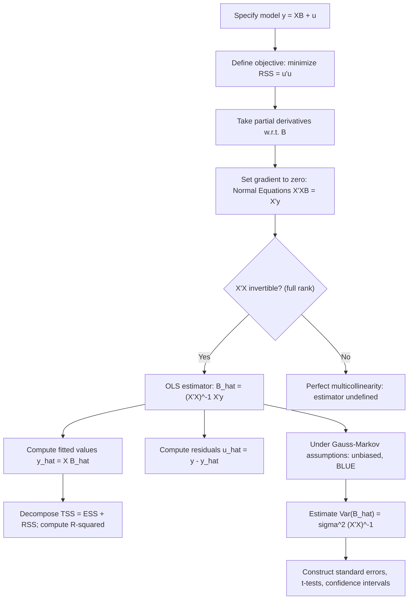

## Ordinary Least Squares Derivation and Properties

### Overview

Ordinary Least Squares (OLS) is the method of estimating the parameters of a linear regression model by minimizing the sum of squared residuals between observed and predicted values of the dependent variable. This section derives the OLS estimator algebraically and via matrix calculus, then establishes its statistical properties (unbiasedness, variance, efficiency, and consistency) under the Gauss-Markov assumptions.

### The Model Setup

The multiple linear regression model in matrix form:

$$\mathbf{y} = \mathbf{X}\boldsymbol{\beta} + \mathbf{u}$$

where:

- $\mathbf{y}$: $n \times 1$ vector of the dependent variable
- $\mathbf{X}$: $n \times (k+1)$ matrix of regressors (first column is a vector of ones for the intercept)
- $\boldsymbol{\beta}$: $(k+1) \times 1$ vector of unknown parameters
- $\mathbf{u}$: $n \times 1$ vector of unobserved errors

The objective is to find $\hat{\boldsymbol{\beta}}$ that minimizes the residual sum of squares (RSS):

$$\text{RSS}(\boldsymbol{\beta}) = \sum_{i=1}^n \hat{u}_i^2 = \hat{\mathbf{u}}^\top \hat{\mathbf{u}} = (\mathbf{y} - \mathbf{X}\boldsymbol{\beta})^\top(\mathbf{y} - \mathbf{X}\boldsymbol{\beta})$$

### Derivation: Simple Linear Regression (Scalar Case)

For the bivariate model $y_i = \beta_0 + \beta_1 x_i + u_i$, minimize:

$$S(\beta_0, \beta_1) = \sum_{i=1}^n (y_i - \beta_0 - \beta_1 x_i)^2$$

Taking partial derivatives and setting them to zero (first-order conditions):

$$\frac{\partial S}{\partial \beta_0} = -2\sum_{i=1}^n (y_i - \beta_0 - \beta_1 x_i) = 0$$

$$\frac{\partial S}{\partial \beta_1} = -2\sum_{i=1}^n x_i(y_i - \beta_0 - \beta_1 x_i) = 0$$

These are the **normal equations**. Solving them simultaneously yields:

$$\hat{\beta}_1 = \frac{\sum_{i=1}^n (x_i - \bar{x})(y_i - \bar{y})}{\sum_{i=1}^n (x_i - \bar{x})^2} = \frac{\text{Cov}(x,y)}{\text{Var}(x)}$$

$$\hat{\beta}_0 = \bar{y} - \hat{\beta}_1 \bar{x}$$

**Key Points**

- The slope estimator $\hat{\beta}_1$ equals the sample covariance of $x$ and $y$ divided by the sample variance of $x$
- The intercept ensures the regression line passes through the point of means $(\bar{x}, \bar{y})$
- This requires $\text{Var}(x) > 0$, i.e., $x$ is not constant across observations (a special case of the no-perfect-collinearity assumption)

### Derivation: Matrix Form (General Case)

Expanding the RSS objective:

$$\text{RSS}(\boldsymbol{\beta}) = \mathbf{y}^\top\mathbf{y} - 2\boldsymbol{\beta}^\top\mathbf{X}^\top\mathbf{y} + \boldsymbol{\beta}^\top\mathbf{X}^\top\mathbf{X}\boldsymbol{\beta}$$

Differentiating with respect to $\boldsymbol{\beta}$ and setting the gradient to zero:

$$\frac{\partial \text{RSS}}{\partial \boldsymbol{\beta}} = -2\mathbf{X}^\top\mathbf{y} + 2\mathbf{X}^\top\mathbf{X}\boldsymbol{\beta} = \mathbf{0}$$

This yields the **normal equations** in matrix form:

$$\mathbf{X}^\top\mathbf{X}\boldsymbol{\beta} = \mathbf{X}^\top\mathbf{y}$$

Provided $\mathbf{X}^\top\mathbf{X}$ is invertible (full rank condition, Gauss-Markov assumption 3), the OLS estimator is:

$$\hat{\boldsymbol{\beta}}_{OLS} = (\mathbf{X}^\top\mathbf{X})^{-1}\mathbf{X}^\top\mathbf{y}$$

**Second-Order Condition**

To confirm this is a minimum (not a maximum or saddle point), the Hessian matrix is:

$$\frac{\partial^2 \text{RSS}}{\partial \boldsymbol{\beta} \partial \boldsymbol{\beta}^\top} = 2\mathbf{X}^\top\mathbf{X}$$

Since $\mathbf{X}^\top\mathbf{X}$ is positive semi-definite (and positive definite under full rank), the Hessian is positive definite, confirming a global minimum.

### Fitted Values, Residuals, and the Projection Matrix

Fitted values: $\hat{\mathbf{y}} = \mathbf{X}\hat{\boldsymbol{\beta}} = \mathbf{X}(\mathbf{X}^\top\mathbf{X})^{-1}\mathbf{X}^\top\mathbf{y} = \mathbf{P}\mathbf{y}$

where $\mathbf{P} = \mathbf{X}(\mathbf{X}^\top\mathbf{X})^{-1}\mathbf{X}^\top$ is the **projection (hat) matrix**, which projects $\mathbf{y}$ onto the column space of $\mathbf{X}$.

Residuals: $\hat{\mathbf{u}} = \mathbf{y} - \hat{\mathbf{y}} = (\mathbf{I}_n - \mathbf{P})\mathbf{y} = \mathbf{M}\mathbf{y}$

where $\mathbf{M} = \mathbf{I}_n - \mathbf{P}$ is the **annihilator matrix**, which projects onto the orthogonal complement of the column space of $\mathbf{X}$.

**Key Points**

- Both $\mathbf{P}$ and $\mathbf{M}$ are symmetric ($\mathbf{P}^\top = \mathbf{P}$) and idempotent ($\mathbf{P}\mathbf{P} = \mathbf{P}$)
- $\mathbf{P}\mathbf{X} = \mathbf{X}$ and $\mathbf{M}\mathbf{X} = \mathbf{0}$, meaning residuals are orthogonal to every column of $\mathbf{X}$
- $\text{tr}(\mathbf{P}) = k+1$ (number of parameters); $\text{tr}(\mathbf{M}) = n - (k+1)$ (residual degrees of freedom)

### Algebraic Properties of OLS Residuals

From the normal equations $\mathbf{X}^\top\hat{\mathbf{u}} = \mathbf{0}$, the following hold exactly (by construction, not by assumption):

1. $\sum_{i=1}^n \hat{u}_i = 0$ (if a constant is included in $\mathbf{X}$)
2. $\sum_{i=1}^n x_{ij}\hat{u}_i = 0$ for every regressor $j$
3. $\sum_{i=1}^n \hat{y}_i \hat{u}_i = 0$ (fitted values are orthogonal to residuals)
4. The regression hyperplane passes through the point of means $(\bar{x}_1, \ldots, \bar{x}_k, \bar{y})$

These are mechanical consequences of the minimization and hold regardless of whether the Gauss-Markov assumptions are true.

### Statistical Properties Under Gauss-Markov Assumptions

#### Unbiasedness

Substituting $\mathbf{y} = \mathbf{X}\boldsymbol{\beta} + \mathbf{u}$ into the estimator:

$$\hat{\boldsymbol{\beta}}_{OLS} = (\mathbf{X}^\top\mathbf{X})^{-1}\mathbf{X}^\top(\mathbf{X}\boldsymbol{\beta} + \mathbf{u}) = \boldsymbol{\beta} + (\mathbf{X}^\top\mathbf{X})^{-1}\mathbf{X}^\top\mathbf{u}$$

Taking expectations conditional on $\mathbf{X}$ and applying the zero conditional mean assumption $E(\mathbf{u} \mid \mathbf{X}) = \mathbf{0}$:

$$E(\hat{\boldsymbol{\beta}}_{OLS} \mid \mathbf{X}) = \boldsymbol{\beta} + (\mathbf{X}^\top\mathbf{X})^{-1}\mathbf{X}^\top E(\mathbf{u} \mid \mathbf{X}) = \boldsymbol{\beta}$$

By the law of iterated expectations, $E(\hat{\boldsymbol{\beta}}_{OLS}) = \boldsymbol{\beta}$ unconditionally as well.

#### Variance-Covariance Matrix

Using $\hat{\boldsymbol{\beta}}_{OLS} - \boldsymbol{\beta} = (\mathbf{X}^\top\mathbf{X})^{-1}\mathbf{X}^\top\mathbf{u}$ and the spherical error assumption $\text{Var}(\mathbf{u} \mid \mathbf{X}) = \sigma^2\mathbf{I}_n$:

$$\text{Var}(\hat{\boldsymbol{\beta}}_{OLS} \mid \mathbf{X}) = (\mathbf{X}^\top\mathbf{X})^{-1}\mathbf{X}^\top \, \text{Var}(\mathbf{u}\mid\mathbf{X}) \, \mathbf{X}(\mathbf{X}^\top\mathbf{X})^{-1} = \sigma^2(\mathbf{X}^\top\mathbf{X})^{-1}$$

The diagonal elements of this matrix give the variances of individual coefficient estimates; off-diagonal elements give covariances between pairs of coefficients.

**Key Points**

- Since $\sigma^2$ is generally unknown, it is estimated by $\hat{\sigma}^2 = \dfrac{\hat{\mathbf{u}}^\top\hat{\mathbf{u}}}{n-k-1}$, using $n-k-1$ degrees of freedom rather than $n$
- $\hat{\sigma}^2$ is an unbiased estimator of $\sigma^2$: $E(\hat{\sigma}^2) = \sigma^2$
- Standard errors of coefficients are the square roots of the diagonal elements of $\hat{\sigma}^2(\mathbf{X}^\top\mathbf{X})^{-1}$

#### Efficiency (Gauss-Markov Theorem / BLUE)

Among all linear unbiased estimators $\tilde{\boldsymbol{\beta}} = \mathbf{C}\mathbf{y}$ of $\boldsymbol{\beta}$ (where $\mathbf{C}$ is any $(k+1) \times n$ matrix satisfying $\mathbf{C}\mathbf{X} = \mathbf{I}_{k+1}$ for unbiasedness), OLS achieves the minimum variance:

$$\text{Var}(\tilde{\boldsymbol{\beta}}) - \text{Var}(\hat{\boldsymbol{\beta}}_{OLS})$$

is positive semi-definite. This is the formal statement of the Gauss-Markov theorem: OLS is BLUE.

**Proof Sketch**

Write $\mathbf{C} = (\mathbf{X}^\top\mathbf{X})^{-1}\mathbf{X}^\top + \mathbf{D}$ for some matrix $\mathbf{D}$. Unbiasedness of $\tilde{\boldsymbol{\beta}}$ requires $\mathbf{D}\mathbf{X} = \mathbf{0}$. Then:

$$\text{Var}(\tilde{\boldsymbol{\beta}}) = \sigma^2\mathbf{C}\mathbf{C}^\top = \sigma^2(\mathbf{X}^\top\mathbf{X})^{-1} + \sigma^2\mathbf{D}\mathbf{D}^\top$$

Since $\mathbf{D}\mathbf{D}^\top$ is positive semi-definite, $\text{Var}(\tilde{\boldsymbol{\beta}}) \geq \text{Var}(\hat{\boldsymbol{\beta}}_{OLS})$ in the matrix sense, with equality iff $\mathbf{D} = \mathbf{0}$.

#### Consistency

As $n \to \infty$, under weaker asymptotic versions of the assumptions (random sampling, no perfect collinearity in the limit, and $E(x_i u_i) = 0$):

$$\hat{\boldsymbol{\beta}}_{OLS} \xrightarrow{p} \boldsymbol{\beta}$$

This follows from the Law of Large Numbers applied to $\frac{1}{n}\mathbf{X}^\top\mathbf{X} \xrightarrow{p} \mathbf{Q}$ (a finite positive definite matrix) and $\frac{1}{n}\mathbf{X}^\top\mathbf{u} \xrightarrow{p} \mathbf{0}$.

**Key Points**

- Consistency requires only $\text{Cov}(x_j, u) = 0$ (contemporaneous exogeneity), a weaker condition than the full zero conditional mean assumption needed for unbiasedness in finite samples
- Consistency does not require homoskedasticity or no autocorrelation — those affect efficiency, not consistency

#### Asymptotic Normality

Under standard regularity conditions (finite fourth moments of regressors and errors), by the Central Limit Theorem:

$$\sqrt{n}(\hat{\boldsymbol{\beta}}_{OLS} - \boldsymbol{\beta}) \xrightarrow{d} N(\mathbf{0}, \sigma^2\mathbf{Q}^{-1})$$

This justifies using normal-based (or t-based, in finite samples) critical values for hypothesis testing even without assuming the errors themselves are normally distributed, provided the sample is reasonably large [Inference: "reasonably large" is context-dependent and not a fixed threshold; adequacy depends on the error distribution's higher moments and the regressors' distribution].

### Goodness of Fit: $R^2$

The total sum of squares decomposes as:

$$\text{TSS} = \text{ESS} + \text{RSS}$$

$$\sum_{i=1}^n (y_i - \bar{y})^2 = \sum_{i=1}^n (\hat{y}_i - \bar{y})^2 + \sum_{i=1}^n \hat{u}_i^2$$

$$R^2 = \frac{\text{ESS}}{\text{TSS}} = 1 - \frac{\text{RSS}}{\text{TSS}}$$

This decomposition holds exactly when the model includes an intercept (a consequence of residual orthogonality property #3 above).

**Key Points**

- $R^2$ never decreases when additional regressors are added, even irrelevant ones, motivating the use of adjusted $R^2$: $\bar{R}^2 = 1 - \dfrac{\text{RSS}/(n-k-1)}{\text{TSS}/(n-1)}$
- $R^2$ measures in-sample explanatory power, not causal validity or out-of-sample predictive accuracy

### Numerical Example

**Example**

Given data: $x = [1, 2, 3, 4, 5]$, $y = [2.1, 3.9, 6.2, 7.8, 10.1]$

Compute $\bar{x} = 3$, $\bar{y} = 6.02$

$$\hat{\beta}_1 = \frac{(1-3)(2.1-6.02) + (2-3)(3.9-6.02) + \cdots + (5-3)(10.1-6.02)}{(1-3)^2 + (2-3)^2 + (3-3)^2 + (4-3)^2 + (5-3)^2} = \frac{20.2}{10} = 2.02$$

$$\hat{\beta}_0 = 6.02 - 2.02(3) = -0.04$$

Fitted line: $\hat{y}_i = -0.04 + 2.02x_i$. Residual at $x=1$: $\hat{u}_1 = 2.1 - (-0.04 + 2.02) = 0.12$.

### Diagram: OLS Estimation Flow

### Illustrative SVG: Geometric Interpretation of OLS as Projection

<svg xmlns="http://www.w3.org/2000/svg" viewBox="0 0 500 320">
<text x="250" y="20" font-size="14" font-weight="bold" text-anchor="middle">OLS as Orthogonal Projection (svg_diagram)</text>
<line x1="60" y1="280" x2="440" y2="90" stroke="#4472C4" stroke-width="2" />
<text x="440" y="80" font-size="12" fill="#4472C4">Column space of X</text>
<line x1="120" y1="260" x2="220" y2="60" stroke="black" stroke-width="1.5" />
<circle cx="220" cy="60" r="3" fill="black" />
<text x="230" y="55" font-size="12">y</text>
<line x1="220" y1="60" x2="300" y2="150" stroke="black" stroke-width="1" stroke-dasharray="3,2" />
<circle cx="300" cy="150" r="3" fill="#C00000" />
<text x="310" y="150" font-size="12" fill="#C00000">y_hat = Py</text>
<line x1="220" y1="60" x2="300" y2="150" stroke="green" stroke-width="1.5" />
<text x="180" y="100" font-size="12" fill="green">u_hat (residual)</text>
<path d="M 290 140 L 300 140 L 300 150" stroke="black" fill="none" stroke-width="1" />
<text x="60" y="300" font-size="11">Residual vector u_hat is orthogonal to the column space of X</text>
</svg>

### Common Pitfalls

- Believing $R^2 = 0$ implies no relationship exists — it only rules out a *linear* relationship in-sample
- Interpreting $\hat{\beta}_j$ causally without verifying the zero conditional mean assumption holds for that regressor
- Using $n$ instead of $n-k-1$ when computing $\hat{\sigma}^2$, which produces a biased (downward) variance estimate
- Assuming BLUE implies "best" in an absolute sense — it is only best among *linear unbiased* estimators; nonlinear or biased estimators (e.g., ridge regression) can have lower mean squared error in some settings

**Related Topics**

- Gauss-Markov Assumptions
- Maximum Likelihood Estimation of the Linear Model
- Multicollinearity and Variance Inflation Factor
- Hypothesis Testing in the Linear Model (t-tests, F-tests)
- Adjusted $R^2$ and Model Selection Criteria (AIC, BIC)
- Instrumental Variables Estimation
- Generalized Least Squares
- Partitioned Regression and the Frisch-Waugh-Lovell Theorem