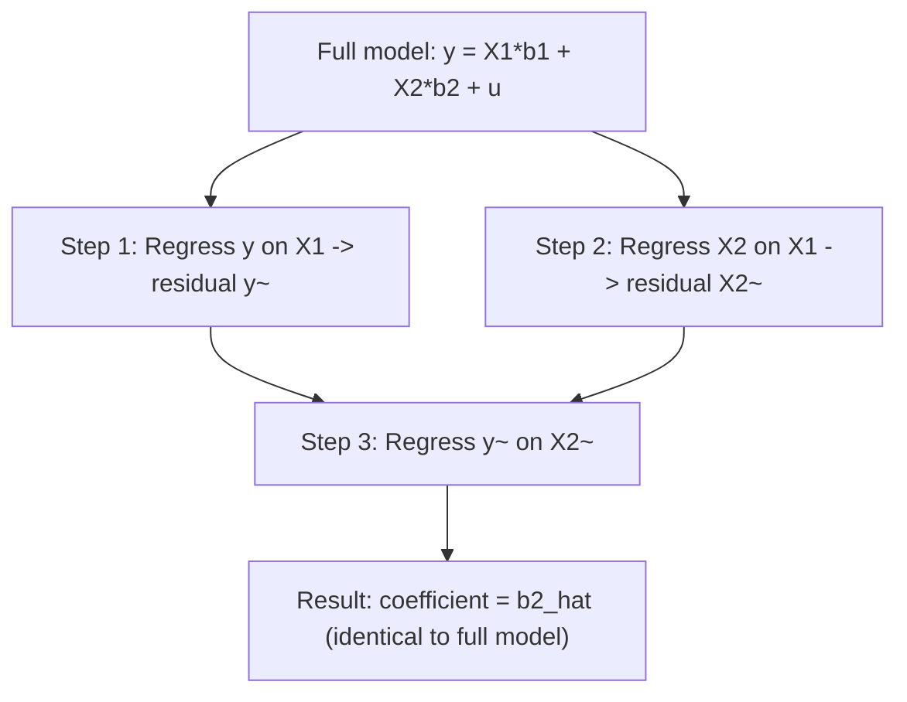

## The Frisch-Waugh-Lovell Theorem

### Overview

The Frisch-Waugh-Lovell (FWL) theorem is a fundamental result in the algebra of ordinary least squares (OLS) regression. It states that the coefficient estimates on a subset of regressors in a multiple regression can be obtained by first "partialling out" (removing the linear influence of) the remaining regressors from both the dependent variable and the regressor of interest, and then regressing the residuals on each other.

The theorem provides deep insight into what a regression coefficient actually measures: the relationship between two variables *after controlling for* all other variables in the model. It underlies interpretations of "ceteris paribus" effects, fixed-effects estimation, detrending, and the mechanics of many econometric procedures.

### Formal Statement

Consider the linear model:

$$y = X_1\beta_1 + X_2\beta_2 + u$$

where $y$ is $n \times 1$, $X_1$ is $n \times k_1$, $X_2$ is $n \times k_2$, and $u$ is the error term.

**Theorem:** The OLS estimate $\hat{\beta}_2$ obtained from the full regression is numerically identical to the OLS estimate obtained from the following two-step procedure:

1. Regress $y$ on $X_1$ alone; obtain residuals $\tilde{y} = M_1 y$
2. Regress $X_2$ on $X_1$ alone; obtain residuals $\tilde{X}_2 = M_1 X_2$
3. Regress $\tilde{y}$ on $\tilde{X}_2$; the resulting coefficient equals $\hat{\beta}_2$

Here, $M_1 = I - X_1(X_1'X_1)^{-1}X_1'$ is the annihilator (residual-maker) matrix that projects onto the orthogonal complement of the column space of $X_1$.

### Proof Sketch

Partition the normal equations for the full regression:

# $$ \begin{bmatrix} X_1'X_1 & X_1'X_2 \ X_2'X_1 & X_2'X_2 \end{bmatrix} \begin{bmatrix} \hat{\beta}_1 \ \hat{\beta}_2 \end{bmatrix}

\begin{bmatrix} X_1'y \ X_2'y \end{bmatrix}

$$

Using block matrix inversion (the Frisch-Waugh-Lovell derivation via partitioned regression), solving this system for $\hat{\beta}_2$ yields:

$$\hat{\beta}_2 = (X_2'M_1X_2)^{-1}(X_2'M_1y)$$

Since $M_1$ is idempotent ($M_1 = M_1'M_1$), this can be rewritten as:

$$\hat{\beta}_2 = (\tilde{X}_2'\tilde{X}_2)^{-1}(\tilde{X}_2'\tilde{y})$$

which is exactly the OLS formula for regressing $\tilde{y}$ on $\tilde{X}_2$. $\blacksquare$

**Key Points**

- The theorem is purely algebraic — it holds by construction of OLS, not as an asymptotic or distributional result
- $M_1$ is symmetric and idempotent: $M_1 = M_1' = M_1^2$
- The residuals $\tilde{y}$ and $\tilde{X}_2$ represent the parts of $y$ and $X_2$ that are linearly unrelated to $X_1$
- Not only the point estimate $\hat{\beta}_2$ but also the residuals from the two-step regression are numerically identical to the residuals from the full regression: $\hat{u} = \tilde{y} - \tilde{X}_2\hat{\beta}_2$

### Geometric Interpretation

OLS estimation can be viewed as an orthogonal projection of $y$ onto the column space spanned by $[X_1, X_2]$. The FWL theorem shows this projection can be decomposed sequentially:

1. First project out the $X_1$ subspace from everything
2. Then project the residualized $y$ onto the residualized $X_2$, which lies in the orthogonal complement of $X_1$'s column space

This is analogous to Gram-Schmidt orthogonalization applied to regressors.



### Standard Errors Under FWL

A refinement of the theorem states that the *standard errors* on $\hat{\beta}_2$ from the partialled-out regression also match those from the full regression, **provided the degrees-of-freedom correction is adjusted**. The residual sum of squares is identical, but the two-step regression has $n - k_2$ degrees of freedom rather than $n - k_1 - k_2$, so the estimated error variance $\hat{\sigma}^2$ must be corrected manually:

$$\hat{\sigma}^2_{\text{correct}} = \frac{\hat{u}'\hat{u}}{n - k_1 - k_2}$$

Most software packages performing a naive two-step manual regression will not apply this correction automatically. [Inference: because the two-step residual regression's default residual d.f. counts only $k_2$ parameters, not $k_1+k_2$]

### Worked Example

Suppose we want to estimate the effect of years of education ($X_2$) on wages ($y$), controlling for a constant and experience ($X_1$):

$$\text{wage}_i = \beta_0 + \beta_1 \text{exper}_i + \beta_2 \text{educ}_i + u_i$$

**Step 1:** Regress wage on a constant and experience; save residuals $\tilde{y}$ (the part of wages unexplained by experience).

**Step 2:** Regress education on a constant and experience; save residuals $\tilde{X}_2$ (the part of education uncorrelated with experience).

**Step 3:** Regress $\tilde{y}$ on \tilde{X}_2}
 (no intercept needed, since both are mean-residualized). The slope coefficient equals the coefficient on education in the original multiple regression.

**Output**



```
Full regression:              educ coefficient = 0.599
Two-step (FWL) regression:    educ coefficient = 0.599   (identical)
```

### Applications

**Key Points**

- **Demeaning / Fixed Effects:** In panel data, the within-transformation (subtracting group means) that produces the fixed-effects estimator is a direct application of FWL, where $X_1$ consists of the group-dummy indicators
- **Detrending:** Regressing a variable on a time trend and using the residuals in a subsequent regression is FWL applied with $X_1$ = trend
- **Partial Correlation / Partial Regression Plots:** The added-variable plot (partial regression plot) used in regression diagnostics plots $\tilde{y}$ against $\tilde{X}_2$ directly, visualizing the marginal contribution of a single regressor after controlling for others
- **Instrumental Variables:** FWL extends to 2SLS, where partialling out exogenous controls before instrumenting for endogenous variables yields identical second-stage coefficients
- **Double/Debiased Machine Learning:** Modern semi-parametric estimators (e.g., Chernozhukov et al.'s DML) generalize FWL by replacing the linear projections $M_1$ with flexible/ML-based nuisance function estimators, orthogonalizing the target regressor and outcome against high-dimensional controls

### Partial Regression (Added-Variable) Plot

The partial regression plot is a diagnostic tool built directly from FWL: plotting $\tilde{y}$ against $\tilde{X}_2$ reveals:

- The true marginal slope $\hat{\beta}_2$ (identical to the multivariate slope)
- Leverage and influence of individual observations on that specific coefficient, isolated from the other regressors
- Nonlinearity or heteroskedasticity specific to that regressor's relationship with $y$

<svg xmlns="http://www.w3.org/2000/svg" viewBox="0 0 500 350">
<text x="250" y="25" text-anchor="middle" font-size="16" font-weight="bold" font-family="sans-serif">Partial Regression Plot (svg_diagram)</text>
<line x1="60" y1="300" x2="460" y2="300" stroke="black" stroke-width="1.5" />
<line x1="60" y1="300" x2="60" y2="40" stroke="black" stroke-width="1.5" />
<text x="260" y="330" text-anchor="middle" font-size="13" font-family="sans-serif">X2 residuals (educ ~ exper)</text>
<text x="25" y="170" text-anchor="middle" font-size="13" font-family="sans-serif" transform="rotate(-90 25,170)">y residuals (wage ~ exper)</text>
<circle cx="120" cy="230" r="4" fill="#2563eb" />
<circle cx="150" cy="210" r="4" fill="#2563eb" />
<circle cx="180" cy="205" r="4" fill="#2563eb" />
<circle cx="210" cy="180" r="4" fill="#2563eb" />
<circle cx="240" cy="170" r="4" fill="#2563eb" />
<circle cx="260" cy="150" r="4" fill="#2563eb" />
<circle cx="290" cy="140" r="4" fill="#2563eb" />
<circle cx="320" cy="120" r="4" fill="#2563eb" />
<circle cx="350" cy="110" r="4" fill="#2563eb" />
<circle cx="380" cy="90" r="4" fill="#2563eb" />
<line x1="90" y1="255" x2="420" y2="75" stroke="#dc2626" stroke-width="2" />
<text x="430" y="70" font-size="12" fill="#dc2626" font-family="sans-serif">slope = beta2_hat</text>
<line x1="60" y1="170" x2="460" y2="170" stroke="gray" stroke-dasharray="4,3" stroke-width="1" />
<line x1="260" y1="40" x2="260" y2="300" stroke="gray" stroke-dasharray="4,3" stroke-width="1" />
</svg>

### Common Pitfalls

**Key Points**

- Forgetting the degrees-of-freedom correction when computing standard errors manually from the two-step regression
- Applying FWL with a non-idempotent or incorrectly specified $M_1$ (e.g., omitting the intercept from $X_1$ when the original model includes one)
- Misinterpreting partialled coefficients as "causal" effects — FWL is an algebraic identity about OLS, not a causal identification result; omitted variable bias in $X_1$ still propagates into $\hat{\beta}_2$
- Using FWL residuals from step 1 or step 2 as if they have zero conditional mean unconditionally — they are orthogonal to $X_1$ by construction, not necessarily independent of it in a distributional sense

### Related Topics

- Partitioned matrix inversion and block regression
- The Gram-Schmidt process and QR decomposition in OLS computation
- Fixed-effects (within) estimator in panel data
- Partial and semi-partial correlation coefficients
- Double/debiased machine learning (Neyman orthogonality)
- Omitted variable bias formula
- Ridge regression and partialling in regularized settings
- Two-stage least squares (2SLS) and control function approaches