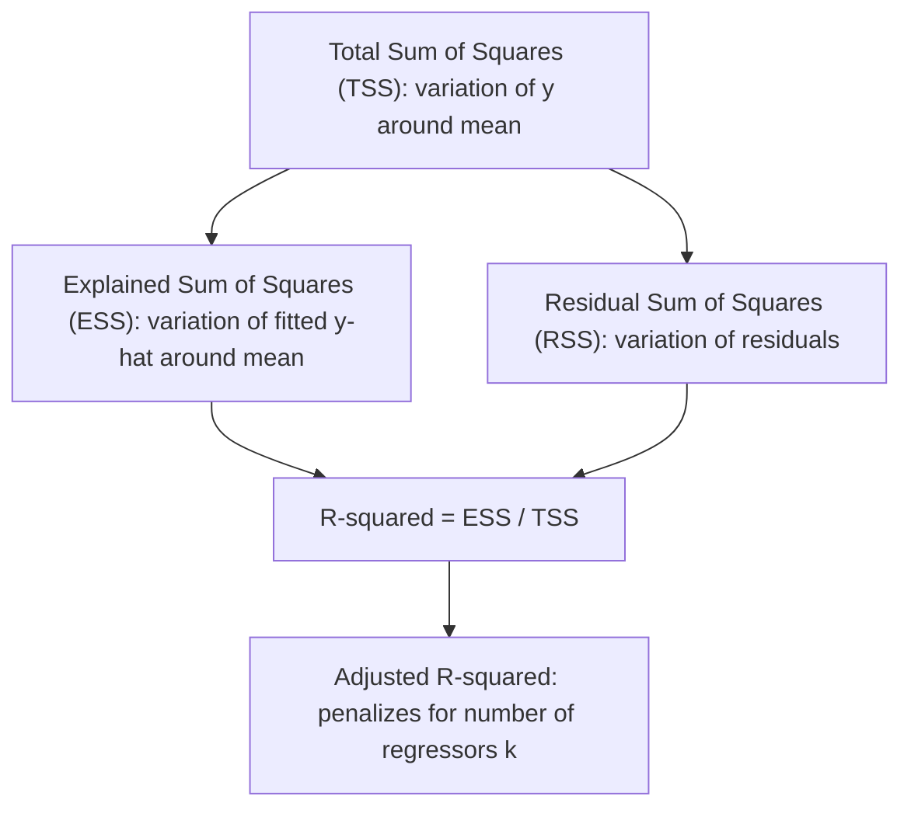

## Goodness of Fit Measures


### Overview

Goodness of fit measures quantify how well a regression model's fitted values approximate the observed data. In the classical linear regression model, these measures are built from the decomposition of variance in the dependent variable into components explained and unexplained by the regressors.

### The Fundamental Decomposition

For a regression with an intercept, the total variation in $y$ can be decomposed as:

$$\sum_{i=1}^n (y_i - \bar{y})^2 = \sum_{i=1}^n (\hat{y}_i - \bar{y})^2 + \sum_{i=1}^n \hat{u}_i^2$$


$$TSS = ESS + RSS$$

where:

- $TSS$ (Total Sum of Squares) measures total variation in $y$ around its mean
- $ESS$ (Explained Sum of Squares) measures variation in the fitted values around the mean
- $RSS$ (Residual Sum of Squares) measures unexplained variation

**Key Points**

- This decomposition holds exactly (not approximately) only when the model includes an intercept term
- $TSS = ESS + RSS$ follows from the orthogonality of $\hat{y} - \bar{y}$ and $\hat{u}$ under OLS with an intercept
- Some texts (particularly European econometrics texts) use $ESS$ to denote the *error* sum of squares (i.e., what is called $RSS$ here) — notation is not universal, so context must be checked

### R-squared ($R^2$)

The coefficient of determination is defined as:

$$R^2 = \frac{ESS}{TSS} = 1 - \frac{RSS}{TSS}$$

**Properties**

- $0 \le R^2 \le 1$ for models estimated with an intercept via OLS
- $R^2$ equals the squared sample correlation between $y_i$ and $\hat{y}_i$
- $R^2$ never decreases when additional regressors are added, even if they are irrelevant, because RSS is non-increasing in the number of regressors under OLS
- In simple bivariate regression, $R^2$ equals the squared Pearson correlation coefficient between $x$ and $y$

**Derivation of the correlation identity**

$$R^2 = \left(\frac{\text{Cov}(y_i, \hat{y}_i)}{\sigma_y \sigma_{\hat{y}}}\right)^2$$

### Adjusted R-squared

Because $R^2$ mechanically rises with additional regressors, the adjusted $R^2$ penalizes for the number of parameters:

$$\bar{R}^2 = 1 - (1 - R^2)\frac{n-1}{n-k}$$

where $n$ is the sample size and $k$ is the number of parameters (including the intercept).

**Key Points**

- $\bar{R}^2$ can decrease when an added regressor has low explanatory power, unlike raw $R^2$
- $\bar{R}^2$ can be negative if the model fits very poorly (unlike $R^2$)
- $\bar{R}^2$ is not itself a probabilistic or hypothesis-testable quantity — it is a descriptive adjustment, not a formal test statistic
- The relationship to the F-statistic: $\bar{R}^2$ increases with the addition of a variable if and only if that variable's t-statistic exceeds 1 in absolute value [Inference: this is a known algebraic property derivable from the adjusted-R² formula, though it is often stated as a rule of thumb]

### Comparison Table

| Measure | Formula | Penalizes for k? | Bounded [0,1]? |
| --- | --- | --- | --- |
| $R^2$ | $1 - RSS/TSS$ | No | Yes (with intercept, OLS) |
| $\bar{R}^2$ | $1-(1-R^2)\frac{n-1}{n-k}$ | Yes | No (can be negative) |
| AIC | $n\ln(RSS/n) + 2k$ | Yes (linear in k) | No |
| BIC/SIC | $n\ln(RSS/n) + k\ln(n)$ | Yes (heavier for large n) | No |

### Information Criteria

For comparing non-nested models or selecting lag lengths/regressor sets, information criteria trade off fit against parsimony:

**Akaike Information Criterion:**

$$AIC = -2\ln(L) + 2k = n\ln\left(\frac{RSS}{n}\right) + 2k + \text{const}$$

**Schwarz/Bayesian Information Criterion:**

$$BIC = -2\ln(L) + k\ln(n)$$

**Key Points**

- Lower values of AIC/BIC indicate a preferred model
- BIC imposes a heavier penalty per parameter than AIC whenever $n > 7$ (since $\ln(n) > 2$), making BIC more conservative and asymptotically consistent for selecting the true model, while AIC is asymptotically efficient for prediction but not consistent for model selection [Inference: this describes standard asymptotic model-selection theory results]
- These criteria are essential for comparing models with different numbers of regressors, since $R^2$ alone cannot penalize complexity

### Standard Error of the Regression (SER)

Also called the root mean squared error of the regression:

$$SER = \hat{\sigma} = \sqrt{\frac{RSS}{n-k}}$$

**Key Points**

- Measured in the same units as the dependent variable, making it more interpretable than $R^2$ in some applied contexts
- Unlike $R^2$, SER can increase or decrease with additional regressors depending on whether they reduce RSS enough to offset the loss of a degree of freedom

### F-statistic for Overall Significance

Tests the joint null hypothesis that all slope coefficients are zero ($H_0: \beta_1 = \beta_2 = \dots = \beta_{k-1} = 0$):

$$F = \frac{ESS/(k-1)}{RSS/(n-k)} = \frac{R^2/(k-1)}{(1-R^2)/(n-k)} \sim F_{k-1, n-k}$$

**Example**

For $n = 100$, $k = 4$ (three slopes plus intercept), $R^2 = 0.35$:

$$F = \frac{0.35/3}{0.65/96} = \frac{0.1167}{0.00677} \approx 17.24$$

Compared against $F_{3,96}$ critical value (~2.70 at 5%), this model is jointly significant.

### Goodness of Fit Without an Intercept

When a regression is estimated without a constant term, the identity $TSS = ESS + RSS$ no longer holds in general, because the orthogonality property between residuals and fitted values breaks down. Software packages often report a different (uncentered) $R^2$ in this case:

$$R^2_{\text{uncentered}} = 1 - \frac{\sum \hat{u}_i^2}{\sum y_i^2}$$

**Key Points**

- Uncentered $R^2$ is not comparable to centered $R^2$ from models with an intercept
- Comparing $R^2$ across models with and without a constant is a common applied-econometrics error

### Visualizing the Decomposition



### Limitations of Goodness of Fit Measures

**Key Points**

- High $R^2$ does not imply correct functional form, absence of omitted variable bias, or causal validity
- $R^2$ is sample-specific and not directly comparable across different dependent variables or different transformations of the same dependent variable (e.g., $y$ vs. $\ln y$)
- Time series regressions with trending variables can exhibit spuriously high $R^2$ even when the variables are unrelated (spurious regression), a phenomenon formalized by Granger and Newbold
- $R^2$ says nothing about whether coefficient estimates are unbiased, efficient, or consistent — these properties depend on the Gauss-Markov and exogeneity assumptions, not on the fit statistic

### Worked Numerical Example

Given: $n = 50$, $TSS = 200$, $RSS = 60$, $k = 5$

$$R^2 = 1 - \frac{60}{200} = 0.70$$


$$\bar{R}^2 = 1 - (1 - 0.70)\frac{49}{45} = 1 - 0.3 \times 1.0889 = 1 - 0.3267 = 0.6733$$


$$SER = \sqrt{\frac{60}{45}} = \sqrt{1.333} \approx 1.1547$$

**Output**



```
R-squared:          0.7000
Adjusted R-squared:  0.6733
SER:                 1.1547
```

### Related Topics

- Analysis of variance (ANOVA) decomposition in regression
- The F-test for linear restrictions
- Model selection via AIC, BIC, and cross-validation
- Spurious regression and non-stationary time series
- Overfitting and the bias-variance tradeoff
- Out-of-sample forecast evaluation metrics (RMSE, MAE)
- Partial R-squared and semi-partial correlations