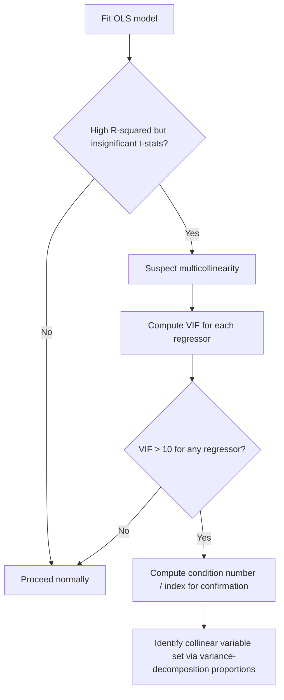

## Multicollinearity Diagnostics


### Overview

Multicollinearity refers to the presence of strong linear relationships among the regressors in a multiple regression model. Perfect multicollinearity (exact linear dependence) violates the classical linear regression assumption of full rank and makes OLS estimation impossible. Imperfect (near) multicollinearity does not violate any Gauss-Markov assumption but inflates the variance of coefficient estimates, making them imprecise and unstable.

### Perfect vs. Imperfect Multicollinearity

**Key Points**

- **Perfect multicollinearity:** One regressor is an exact linear combination of others (e.g., $X_3 = 2X_1 + 5X_2$). The matrix $X'X$ becomes singular (non-invertible), and OLS estimates cannot be computed
- **Imperfect (near) multicollinearity:** Regressors are highly, but not perfectly, correlated. $X'X$ remains invertible, but $(X'X)^{-1}$ has large diagonal elements, inflating coefficient variances
- Perfect multicollinearity commonly arises from the **dummy variable trap** (including all categories of a dummy set plus an intercept), redundant transformations, or identically defined variables measured in different units

### Consequences of Near Multicollinearity

**Key Points**

- OLS estimators remain **unbiased** and **BLUE** (Best Linear Unbiased Estimator) — multicollinearity does not violate the Gauss-Markov assumptions
- Standard errors of affected coefficients become large, leading to wide confidence intervals and low t-statistics even when the joint F-test for those variables is significant
- Coefficient estimates become highly sensitive to small changes in the data or model specification
- Individual coefficients may have counterintuitive signs or implausible magnitudes despite a high overall $R^2$
- Multicollinearity affects only the *precision* of the affected coefficients, not those of variables uncorrelated with the collinear set

### Mathematical Origin

For a single regressor $X_j$ in a multiple regression, the variance of $\hat{\beta}_j$ is:

$$\text{Var}(\hat{\beta}_j) = \frac{\sigma^2}{(1 - R_j^2)\sum_{i}(x_{ij} - \bar{x}_j)^2}$$

where $R_j^2$ is the R-squared from regressing $X_j$ on all other regressors. As $R_j^2 \to 1$, the variance explodes.

### Variance Inflation Factor (VIF)

The VIF formalizes the variance-inflation mechanism directly:

$$VIF_j = \frac{1}{1 - R_j^2}$$

**Key Points**

- $VIF_j = 1$ indicates no correlation between $X_j$ and the other regressors
- Common rule-of-thumb thresholds: $VIF > 10$ (equivalent to $R_j^2 > 0.90$) signals serious multicollinearity; some sources use a more conservative threshold of $VIF > 5$ [Unverified: thresholds are conventions, not derived from formal statistical theory, and vary by source/discipline]
- The related **Tolerance** statistic is simply $1/VIF_j = 1 - R_j^2$
- VIF must be computed for each regressor separately (excluding the intercept)

**Example Calculation**

Suppose regressing $X_2$ (education) on $X_1$ (experience) and $X_3$ (age) yields $R_2^2 = 0.85$:

$$VIF_2 = \frac{1}{1 - 0.85} = \frac{1}{0.15} \approx 6.67$$

This suggests moderate-to-high collinearity involving education.

### Condition Number and Condition Index

The condition number diagnoses multicollinearity via the eigenvalue structure of the (scaled) $X'X$ matrix:

$$\kappa = \sqrt{\frac{\lambda_{\max}}{\lambda_{\min}}}$$

where $\lambda_{\max}$ and $\lambda_{\min}$ are the largest and smallest eigenvalues of the correlation matrix of regressors.

**Key Points**

- $\kappa < 10$: negligible collinearity
- $10 \le \kappa < 30$: moderate to strong collinearity
- $\kappa \ge 30$: severe collinearity [Unverified: these Belsley-Kuh-Welsch thresholds are widely cited conventions rather than universal statistical cutoffs]
- The condition number approach, along with variance-decomposition proportions, was formalized by Belsley, Kuh, and Welsch (1980) and can identify which *specific* linear combinations of variables are involved in near-dependencies, unlike VIF which only flags individual variables

### Correlation Matrix Inspection

A simple preliminary diagnostic is to examine pairwise correlation coefficients among regressors.

**Key Points**

- High pairwise correlations (e.g., $|r| > 0.8$) suggest potential bivariate collinearity
- This method fails to detect **multivariate** collinearity, where no single pair is highly correlated but a linear combination of three or more regressors is nearly collinear with another — VIF and condition indices are needed to catch this

### Diagnostic Comparison Table

| Diagnostic | Detects | Limitation |
| --- | --- | --- |
| Correlation matrix | Pairwise (bivariate) collinearity | Misses multivariate collinearity |
| VIF / Tolerance | Collinearity of each regressor with all others | Doesn't identify which combination is responsible |
| Condition number/index | Overall and specific near-dependencies | Requires eigenvalue decomposition, less intuitive |
| Eigenvalues of $X'X$ | Rank deficiency, near-singularity | Scale-sensitive unless standardized |

### Detecting Collinearity: Diagnostic Flow



### Remedies for Multicollinearity

**Key Points**

- **Drop redundant variables:** Remove one of the highly collinear regressors, though this risks omitted variable bias if the dropped variable is theoretically relevant
- **Increase sample size:** More data reduces the sampling variance of coefficient estimates, partially offsetting the variance-inflation effect
- **Combine variables:** Construct an index or composite variable from the collinear set when they measure a similar underlying construct
- **Centering variables:** Useful primarily for reducing *non-essential* collinearity introduced by including polynomial or interaction terms (e.g., $X$ and $X^2$), not for essential collinearity between distinct economic variables
- **Ridge regression / regularization:** Introduces a small bias in exchange for a substantial reduction in variance, trading MSE-optimality for stability
- **Principal Components Regression (PCR):** Replaces the correlated regressors with a smaller set of orthogonal principal components
- Do **nothing**, if the collinear variables are only control variables and the coefficient of interest (on a non-collinear variable) is unaffected — a common recommendation in applied practice, since remedies can introduce specification errors worse than the imprecision they resolve

### Distinguishing Multicollinearity from Other Issues

**Key Points**

- Multicollinearity should not be confused with **endogeneity** — a regressor correlated with the error term is a fundamentally different (and more serious) problem, unaffected by adding or dropping other regressors
- A low $t$-statistic could result from either true weak partial effects or from multicollinearity — the F-test for joint significance of the suspected collinear set helps disambiguate, since joint significance often survives even when individual t-stats are weak due to shared variance inflation

### Worked Example: VIF in Practice

Suppose a wage regression includes years of schooling, years of schooling squared, and total experience. Regressing schooling on the other two regressors yields $R^2 = 0.92$.

$$VIF_{\text{schooling}} = \frac{1}{1-0.92} = 12.5$$

**Output**



```
Variable          VIF
schooling         12.50
schooling_sq      11.80
experience          1.15
```

This pattern (schooling and its square both flagged, experience unaffected) is characteristic of **non-essential** (structural) multicollinearity from a polynomial term, best addressed by centering schooling before squaring it, rather than dropping either term.

### Related Topics

- The dummy variable trap and reference category selection
- Ridge regression and Lasso as regularization remedies
- Principal Components Analysis and Principal Components Regression
- Eigenvalue decomposition of the design matrix
- Omitted variable bias versus included-variable variance inflation
- Belsley-Kuh-Welsch collinearity diagnostics
- Heteroskedasticity and its interaction with variance estimation