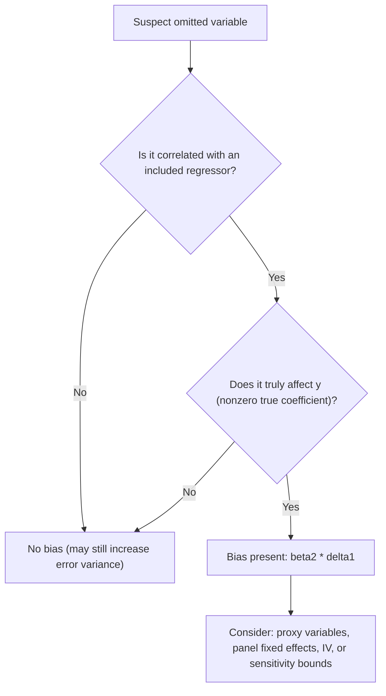

## Omitted Variable Bias

### Overview

Omitted variable bias (OVB) arises when a regression model excludes a relevant explanatory variable that is correlated with one or more included regressors. This omission causes the OLS estimator of the included variables' coefficients to be biased and inconsistent, because the excluded variable's effect gets absorbed into the error term and, through its correlation with included regressors, contaminates their estimated coefficients.

### The Two Conditions for OVB

An omitted variable causes bias if and only if **both** conditions hold:

1. The omitted variable is a genuine determinant of the dependent variable (i.e., it belongs in the true model with a nonzero coefficient)
2. The omitted variable is correlated with at least one included regressor

**Key Points**

- If either condition fails, there is no bias: an omitted variable uncorrelated with included regressors does not bias their coefficients (though it does inflate the error variance and, therefore, standard errors)
- An omitted variable correlated with regressors but with a true coefficient of zero also causes no bias, since it has nothing to bias

### Formal Derivation

Suppose the **true model** is:

$$y = \beta_0 + \beta_1 X_1 + \beta_2 X_2 + \varepsilon$$

but the **estimated (misspecified) model** omits $X_2$:

$$y = \beta_0 + \beta_1 X_1 + u, \quad \text{where } u = \beta_2 X_2 + \varepsilon$$

The OLS estimator from the misspecified model, $\hat{\beta}_1^{\text{short}}$, has expectation:

$$E[\hat{\beta}_1^{\text{short}}] = \beta_1 + \beta_2 \cdot \delta_1$$

where $\delta_1$ is the slope coefficient from an auxiliary regression of the omitted variable $X_2$ on the included variable $X_1$:

$$X_2 = \delta_0 + \delta_1 X_1 + \text{error}$$

**This is the omitted variable bias formula:**

$$\text{Bias}(\hat{\beta}_1^{\text{short}}) = \beta_2 \cdot \delta_1$$

### Direction of Bias

The sign of the bias depends on the signs of $\beta_2$ (the true effect of the omitted variable) and $\delta_1$ (the correlation between omitted and included variable):

| $\beta_2$ sign | $\delta_1$ sign | Bias direction |
| --- | --- | --- |
| + | + | Positive (upward) bias |
| + | − | Negative (downward) bias |
| − | + | Negative (downward) bias |
| − | − | Positive (upward) bias |

**Key Points**

- Positive bias means $\hat{\beta}_1^{\text{short}}$ overstates the true effect of $X_1$ (in expectation)
- The magnitude of bias grows with both the strength of $X_2$'s true effect and the strength of $X_1$-$X_2$ correlation
- If $\delta_1 = 0$ (no correlation), bias vanishes regardless of $\beta_2$

### Connection to the Frisch-Waugh-Lovell Theorem

**Key Points**

- OVB is the mirror image of the FWL partialling-out logic: when $X_2$ is omitted, none of its effect is partialled out of $X_1$, so any part of $X_2$'s influence that overlaps with $X_1$'s variation is misattributed to $X_1$
- Including $X_2$ and applying FWL recovers the "purified" partial effect of $X_1$, free of contamination from $X_2$

### Illustrative Example: Wage Equation

**Example**

True model: $\text{wage} = \beta_0 + \beta_1 \text{educ} + \beta_2 \text{ability} + \varepsilon$

If **ability** is omitted (commonly unobserved in survey data):

- $\beta_2 > 0$ (higher ability raises wages)
- $\delta_1 > 0$ (more able individuals tend to obtain more education — positive correlation between ability and schooling)

$$\text{Bias} = \beta_2 \cdot \delta_1 > 0$$

The estimated return to education, $\hat{\beta}_1^{\text{short}}$, is **biased upward** — part of the wage premium attributed to schooling actually reflects unobserved ability.

**Output**



```
True beta_1 (return to education):       0.070
Bias (beta_2 * delta_1):                +0.023
Estimated beta_1 in short regression:    0.093
```

### Multivariate Generalization

When multiple variables are omitted, or the included regressor set has more than one variable, the bias formula generalizes to matrix form:

$$E[\hat{\beta}_1] = \beta_1 + (X_1'X_1)^{-1}X_1'X_2\beta_2$$

where $X_1$ is the matrix of included regressors and $X_2$ the matrix of omitted regressors. The term $(X_1'X_1)^{-1}X_1'X_2$ is the matrix of coefficients from regressing each omitted variable on all included variables.

**Key Points**

- In this general case, *all* included coefficients can be biased if they are correlated with any omitted variable, not just the variable most directly related to it
- Even a regressor with zero true correlation to the omitted variable may show bias if it's correlated with *another* included regressor that is itself correlated with the omitted variable

### OVB vs. Related Specification Problems

**Key Points**

- **Irrelevant variable inclusion** (the opposite error) does not bias coefficients but reduces efficiency (raises variance) — a much less serious problem than OVB
- **Endogeneity** is a broader category; OVB is one specific *source* of endogeneity (correlation between regressor and error term), alongside measurement error and simultaneity
- **Multicollinearity** is distinct: multicollinearity affects precision (variance) of estimates without introducing bias, whereas OVB affects the expectation (bias) of estimates directly

### Diagnostic and Remedial Strategies

**Key Points**

- **Theory and prior research:** The primary defense against OVB is thoughtful model specification grounded in economic theory, since OVB cannot be directly tested when the omitted variable is unobserved
- **Proxy variables:** Include an observable proxy correlated with the unobservable omitted variable (e.g., IQ test scores as a proxy for ability) to reduce (though not necessarily eliminate) bias
- **Panel data / fixed effects:** If the omitted variable is time-invariant (e.g., innate ability, if assumed constant over the sample period), panel data with individual fixed effects can difference it out entirely
- **Instrumental variables:** Find an instrument correlated with the included regressor but uncorrelated with the omitted variable/error, enabling consistent estimation via 2SLS
- **Sensitivity analysis (e.g., Oster 2019 bounding):** Uses movements in $R^2$ and coefficients across controlled/uncontrolled specifications to bound the degree of omitted variable bias, providing a formal sensitivity metric even when the omitted variable itself is unobservable [Inference: Oster's method is an established but relatively recent (2019) technique; described at a general level since implementation details are estimator-specific]

### Diagnostic Flow



### Worked Numerical Example

Suppose the auxiliary regression of omitted ability on education yields $\delta_1 = 0.15$, and the true effect of ability on wages is $\beta_2 = 0.15$ (in relevant units).

$$\text{Bias} = 0.15 \times 0.15 = 0.0225$$

If the true return to education is $\beta_1 = 0.07$:

$$E[\hat{\beta}_1^{\text{short}}] = 0.07 + 0.0225 = 0.0925$$

An applied researcher estimating only the short regression would report a return to education roughly 32% higher than the true causal effect.

### Related Topics

- The Frisch-Waugh-Lovell theorem and partialling out
- Endogeneity and the general linear IV framework
- Proxy variable methods and measurement error bias
- Panel data fixed-effects and difference-in-differences designs
- Oster's coefficient stability / bounding approach to unobservables
- Instrumental variables and two-stage least squares (2SLS)
- Specification testing (RESET test, Hausman test)