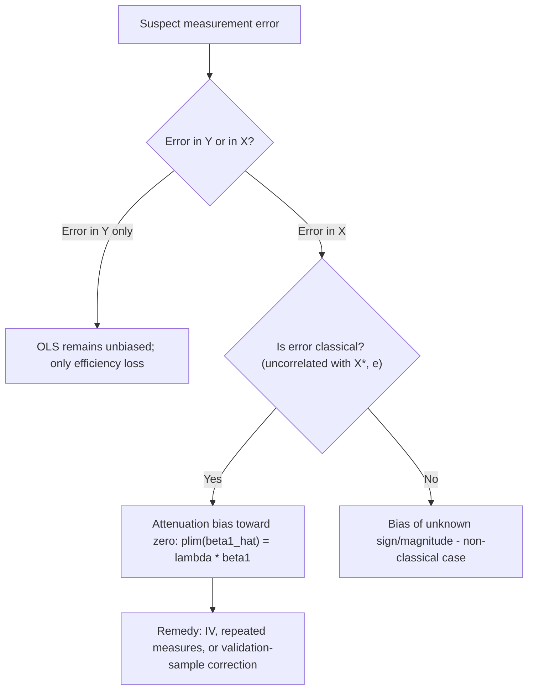

## Measurement Error and Attenuation Bias

### Overview

Measurement error occurs when observed variables differ from their true theoretical counterparts due to imprecise recording, survey misreporting, proxy variable use, or data aggregation. When measurement error afflicts a regressor, OLS estimation is generally biased and inconsistent — most classically toward zero, a phenomenon known as **attenuation bias**. When measurement error afflicts only the dependent variable, the consequences are far less severe.

### Classical Errors-in-Variables (CEV) Model

Consider the true relationship:

$$y_i = \beta_0 + \beta_1 X_i^* + \varepsilon_i$$

where $X_i^*$ is the true, unobserved regressor. Instead, we observe a mismeasured proxy:

$$X_i = X_i^* + w_i$$

where $w_i$ is classical measurement error satisfying:

1. $E[w_i] = 0$
2. $\text{Cov}(w_i, X_i^*) = 0$ (error uncorrelated with the true value)
3. $\text{Cov}(w_i, \varepsilon_i) = 0$ (error uncorrelated with the structural disturbance)
4. $\text{Var}(w_i) = \sigma_w^2$ (constant variance)

**Key Points**

- These four assumptions define **classical** measurement error; violations (e.g., correlated or non-classical error) can produce bias of arbitrary sign and magnitude, not just attenuation
- Classical measurement error in $X$ is fundamentally different from classical measurement error in $y$ in its consequences for OLS

### Derivation of Attenuation Bias

Substituting $X_i^* = X_i - w_i$ into the true model:

$$y_i = \beta_0 + \beta_1(X_i - w_i) + \varepsilon_i = \beta_0 + \beta_1 X_i + (\varepsilon_i - \beta_1 w_i)$$

The composite error term is $u_i = \varepsilon_i - \beta_1 w_i$. Since $X_i = X_i^* + w_i$, and $w_i$ is a component of both $X_i$ and $u_i$, we have:

$$\text{Cov}(X_i, u_i) = \text{Cov}(X_i^* + w_i, \varepsilon_i - \beta_1 w_i) = -\beta_1 \sigma_w^2 \neq 0$$

This violates strict exogeneity, so OLS is biased and inconsistent. The probability limit of the OLS estimator is:

$$\text{plim}(\hat{\beta}_1^{OLS}) = \beta_1 \cdot \frac{\sigma_{X^*}^2}{\sigma_{X^*}^2 + \sigma_w^2} = \beta_1 \cdot \lambda$$

where $\lambda = \frac{\sigma_{X^*}^2}{\sigma_{X^*}^2 + \sigma_w^2}$ is the **reliability ratio**.

**Key Points**

- Since $0 < \lambda < 1$ (assuming $\sigma_w^2 > 0$), the estimated coefficient is attenuated (shrunk) toward zero relative to the true $\beta_1$
- As $\sigma_w^2 \to 0$ (no measurement error), $\lambda \to 1$ and bias vanishes
- As $\sigma_w^2 \to \infty$ (pure noise), $\lambda \to 0$ and the estimated coefficient converges to zero regardless of the true relationship
- Attenuation bias is a **large-sample (asymptotic)** result — it does not vanish with larger samples, unlike sampling variance

### The Reliability Ratio

$$\lambda = \frac{\sigma_{X^*}^2}{\sigma_{X^*}^2 + \sigma_w^2} = \frac{\text{Var(true signal)}}{\text{Var(true signal)} + \text{Var(noise)}}$$

**Example**

If the true variance of years of schooling is $\sigma_{X^*}^2 = 9$ and measurement error variance is $\sigma_w^2 = 1$:

$$\lambda = \frac{9}{9+1} = 0.9$$


$$\text{plim}(\hat{\beta}_1) = 0.9 \times \beta_1$$

A true return to schooling of $\beta_1 = 0.08$ would be estimated, in expectation asymptotically, as $0.072$ — a 10% understatement.

**Output**



```
True beta_1:                0.080
Reliability ratio (lambda): 0.900
Attenuated plim(beta_1_hat): 0.072
```

### Measurement Error in the Dependent Variable

Suppose instead $y_i = y_i^* + v_i$, where $y_i^*$ is the true dependent variable and $v_i$ is classical measurement error uncorrelated with $X_i$ and $\varepsilon_i$.

**Key Points**

- The composite error becomes $\varepsilon_i + v_i$, which remains uncorrelated with $X_i$
- OLS estimates of $\beta_1$ remain **unbiased and consistent**
- The only consequence is increased error variance ($\text{Var}(\varepsilon_i) + \text{Var}(v_i)$), which inflates standard errors and reduces the model's $R^2$, but does not bias coefficients
- This asymmetry — error in $X$ biases, error in $y$ does not — is one of the most important practical takeaways of the CEV framework

### Multivariate Case

**Key Points**

- With multiple regressors, if only one variable is mismeasured, the bias on that variable's coefficient is generally attenuation, but the bias can "spill over" onto the coefficients of the other (correctly measured) regressors, with a sign that depends on the correlation structure among all regressors — no simple, universal direction can be stated
- If two or more regressors are simultaneously mismeasured, especially when the errors are correlated with one another, the bias pattern becomes analytically complex and cannot be signed in general [Inference: this follows from extending the omitted-variable-bias-style algebra to multiple mismeasured regressors, a standard but more involved derivation]

### Non-Classical Measurement Error

**Key Points**

- **Mean reverting error:** Common in self-reported data (e.g., income), where large true values tend to be under-reported and small true values over-reported — this can produce bias of different magnitude or even direction than the classical case
- **Differential/systematic error:** When measurement error correlates with unobserved characteristics of the respondent (e.g., social desirability bias in reporting sensitive behaviors), the classical assumptions fail entirely
- Non-classical measurement error is common in survey-based econometrics and requires validation studies or auxiliary data to characterize

### Remedies for Attenuation Bias

**Key Points**

- **Instrumental variables:** Find an instrument correlated with $X_i^*$ but uncorrelated with $w_i$; a second independent noisy measure of the same underlying variable can serve as an instrument for the first
- **Multiple measurements / repeated measures:** If two or more independent noisy measures of $X^*$ exist, one can be used to instrument for the other, purging attenuation bias asymptotically
- **Validation samples:** A subsample with both the mismeasured proxy and a "gold standard" true measure allows estimation of the reliability ratio $\lambda$, enabling a bias correction: $\hat{\beta}_1^{\text{corrected}} = \hat{\beta}_1^{OLS} / \hat{\lambda}$
- **Structural equation modeling / latent variable methods:** Explicitly models the measurement error process using multiple indicators of the same latent construct
- **Errors-in-variables (EIV) regression / Deming regression:** Estimates the true slope directly using the known or assumed ratio of error variances between $X$ and $y$, rather than treating $X$ as error-free

### Diagnostic Flow



### Worked Bias-Correction Example

Suppose a validation subsample reveals $\hat{\lambda} = 0.75$, and the naive OLS estimate from the full (mismeasured) sample is $\hat{\beta}_1^{OLS} = 0.06$.

$$\hat{\beta}_1^{\text{corrected}} = \frac{0.06}{0.75} = 0.08$$

**Output**



```
Naive OLS estimate:        0.060
Reliability ratio:         0.750
Corrected estimate:        0.080
```

### Comparison Table: Error Location and Consequence

| Error Location | Bias in beta_hat? | Consistent? | Efficiency Effect |
| --- | --- | --- | --- |
| In $y$ only (classical) | No | Yes | Reduced (higher SE, lower $R^2$) |
| In $X$ only (classical) | Yes (attenuation) | No | N/A (bias dominates) |
| In $X$ (non-classical) | Yes (sign/magnitude unknown) | No | N/A |
| In both $X$ and $y$ (independent, classical) | Yes (attenuation on X's effect) | No | N/A |

### Related Topics

- Instrumental variables and two-stage least squares (2SLS)
- Omitted variable bias
- Endogeneity: sources and general treatment
- Structural equation modeling and latent variable methods
- Proxy variables and their limitations
- GMM estimation under general moment conditions
- Survey data validation and non-classical measurement error models