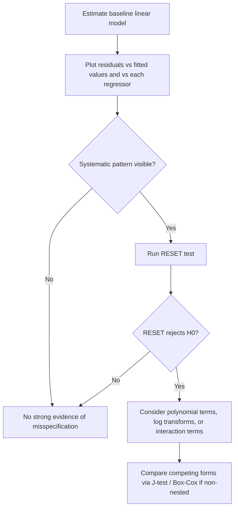

## Functional Form Specification Testing


### Overview

Functional form specification testing addresses whether the assumed mathematical relationship between the dependent variable and regressors — linear, log-linear, quadratic, or otherwise — correctly captures the true data-generating process. Misspecifying functional form is a form of model misspecification distinct from omitted variables, though the two are closely related: a nonlinear true relationship approximated by a linear model behaves, in some respects, like an omitted-variable problem where the "omitted" component is the nonlinear transformation of an included regressor.

### Consequences of Functional Form Misspecification

**Key Points**

- Coefficient estimates become biased and inconsistent for the parameters of interest, since the model no longer correctly represents $E[y|X]$
- Residuals typically display systematic patterns (nonlinearity, heteroskedasticity-like patterns) when plotted against fitted values or regressors
- Forecasts and marginal effect calculations derived from a misspecified functional form can be substantially inaccurate, particularly for out-of-sample or extrapolated values
- $R^2$ and goodness-of-fit statistics may still appear reasonable even under functional form misspecification, making formal tests necessary rather than relying on fit statistics alone

### Common Functional Form Choices

| Form | Model | Interpretation of slope |
| --- | --- | --- |
| Linear-linear | $y = \beta_0 + \beta_1 X$ | Unit change in $X$ → $\beta_1$ unit change in $y$ |
| Log-linear (semi-log) | $\ln y = \beta_0 + \beta_1 X$ | Unit change in $X$ → $100\beta_1\%$ change in $y$ |
| Linear-log | $y = \beta_0 + \beta_1 \ln X$ | 1% change in $X$ → $\beta_1/100$ unit change in $y$ |
| Log-log (double-log) | $\ln y = \beta_0 + \beta_1 \ln X$ | 1% change in $X$ → $\beta_1\%$ change in $y$ (elasticity) |
| Quadratic | $y = \beta_0 + \beta_1 X + \beta_2 X^2$ | Marginal effect: $\beta_1 + 2\beta_2 X$ (varies with $X$) |
| Polynomial (higher order) | $y = \beta_0 + \sum_j \beta_j X^j$ | Flexible but can overfit and behave erratically outside sample range |

### RESET Test (Ramsey Regression Equation Specification Error Test)

The RESET test is the most widely used general test for functional form misspecification. It tests whether nonlinear combinations of the fitted values help explain $y$, which would indicate the linear specification omits necessary nonlinear terms.

**Procedure:**

1. Estimate the original model: $y = X\beta + u$, obtain fitted values $\hat{y}$
2. Estimate the augmented model:


   $$y = X\beta + \gamma_1 \hat{y}^2 + \gamma_2 \hat{y}^3 + \dots + \gamma_{p-1}\hat{y}^p + e$$
3. Test $H_0: \gamma_1 = \gamma_2 = \dots = 0$ using an F-test

**Key Points**

- Powers of $\hat{y}$ (rather than powers of individual regressors) are used because $\hat{y}$ is a linear combination of all regressors, so its higher powers approximate a broad class of nonlinear functional forms compactly
- Typically $p = 2$ or $p = 3$ (squared and cubed fitted values) is sufficient in practice
- Rejection of $H_0$ indicates functional form misspecification, but the test does not indicate *which* specific transformation is needed — it is a general diagnostic, not a corrective procedure
- The RESET test has power against a broad range of misspecifications (omitted nonlinear terms, omitted interaction terms) but is not designed to detect all forms of misspecification (e.g., it has limited power against certain kinds of omitted-variable problems unrelated to functional form)

**Worked Example**

Given: original model RSS $= 150$, restricted model has $k=3$ parameters; augmented model (adding $\hat{y}^2, \hat{y}^3$) RSS $= 130$, $n = 100$.

$$F = \frac{(RSS_r - RSS_u)/q}{RSS_u/(n-k_u)} = \frac{(150-130)/2}{130/95} = \frac{10}{1.368} \approx 7.31$$

Compared to $F_{2,95}$ critical value (~3.09 at 5%), we reject $H_0$ and conclude functional form misspecification is present.

**Output**



```
RESET F-statistic:    7.31
Critical value (5%):  3.09
Conclusion:           Reject H0 - functional form misspecified
```

### Testing Non-Nested Models: The Davidson-MacKinnon J-Test

When comparing two competing, non-nested functional forms (e.g., linear vs. log-linear), the J-test embeds one model's fitted values into the other.

**Procedure:**

Given two competing models:

$$H_0: y = X\beta + u \qquad H_1: y = Z\gamma + v$$

1. Estimate $H_1$, obtain fitted values $\hat{y}_Z$
2. Augment $H_0$'s regression: $y = X\beta + \theta \hat{y}_Z + \text{error}$
3. Test $H_0: \theta = 0$ via a t-test

**Key Points**

- If $\theta$ is significantly different from zero, $H_0$ is rejected in favor of containing information from $H_1$
- The test can be run in both directions; it is possible to reject both models, neither, or one in favor of the other — the test does not force a single winner
- Cannot directly compare $R^2$ across models with differently transformed dependent variables (e.g., $y$ vs. $\ln y$) — the J-test provides a formal, comparable alternative to this invalid practice

### Testing Linear vs. Log-Linear: The PE Test / Box-Cox Approach

**Key Points**

- The **MacKinnon-White-Davidson (PE) test** is a special case of the J-test tailored to comparing linear and log-linear functional forms
- The **Box-Cox transformation** generalizes both linear and log forms into a single parametric family: $y^{(\lambda)} = \frac{y^\lambda - 1}{\lambda}$ for $\lambda \neq 0$, and $\ln y$ for $\lambda = 0$, allowing $\lambda$ to be estimated via maximum likelihood and tested against the boundary values 0 and 1
- Box-Cox models change the scale of the dependent variable itself, so comparing likelihoods/fit across different $\lambda$ requires a Jacobian adjustment to keep the comparison valid [Inference: this is a standard requirement in Box-Cox estimation theory to maintain a consistent probability scale across transformations]

### Testing for Omitted Higher-Order and Interaction Terms

**Key Points**

- Direct **t-tests** or **F-tests** on added polynomial terms (e.g., adding $X^2$ and testing its significance) provide a targeted test when a specific nonlinearity is suspected
- **Interaction terms** ($X_1 \times X_2$) should be tested when theory suggests the effect of one regressor depends on the level of another; omitting a true interaction is itself a functional form misspecification
- Visual diagnostics — plotting residuals against each regressor (not just fitted values) — can reveal which specific variable's relationship is misspecified, complementing the general RESET test

### Diagnostic Workflow



### Practical Considerations

**Key Points**

- Economic theory should guide the choice of functional form ex ante where possible (e.g., Cobb-Douglas production functions imply a log-log specification; diminishing marginal returns suggest quadratic or log terms)
- Overfitting via excessive polynomial terms improves in-sample fit but degrades out-of-sample predictive performance and can produce erratic extrapolated marginal effects (Runge's phenomenon-like behavior at data boundaries)
- Functional form tests generally assume the specification error is the *only* problem; if heteroskedasticity or endogeneity is also present, standard RESET test statistics may lose their nominal size properties, so robust standard errors or accounting for other violations is advisable before concluding misspecification is the sole issue [Inference: general property of specification tests when auxiliary Gauss-Markov assumptions are jointly violated]

### Related Topics

- Omitted variable bias and its relation to functional form
- The Box-Cox transformation family
- Non-nested hypothesis testing (J-test, Cox test)
- Heteroskedasticity testing (Breusch-Pagan, White test)
- Polynomial regression and overfitting
- Semi-parametric and nonparametric regression alternatives
- Interaction effects and marginal effects in nonlinear models