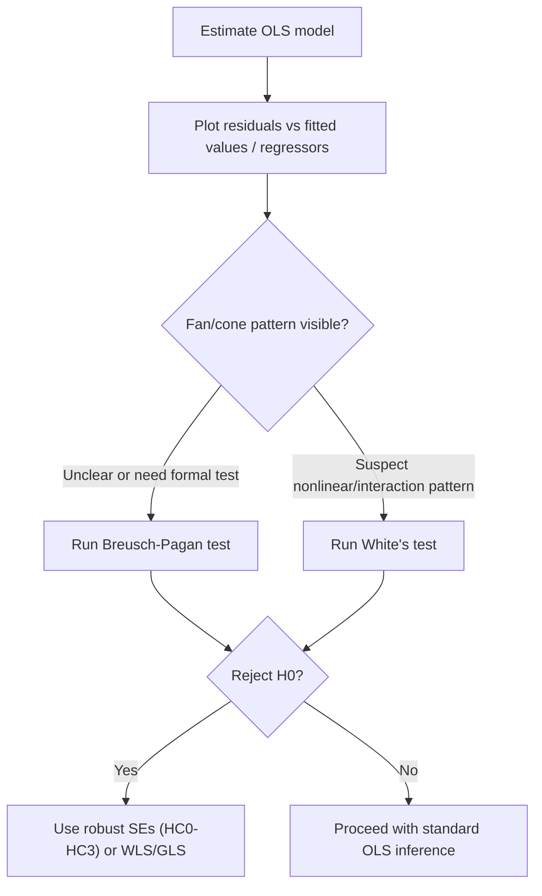

## Heteroskedasticity Detection and Testing


### Overview

Heteroskedasticity refers to a violation of the classical linear regression assumption of constant error variance: $\text{Var}(u_i | X_i) = \sigma^2$ for all $i$. Under heteroskedasticity, $\text{Var}(u_i|X_i) = \sigma_i^2$ varies across observations, typically as a function of one or more regressors. While OLS estimators remain unbiased and consistent under heteroskedasticity alone, they are no longer BLUE (Best Linear Unbiased Estimator), and the conventional OLS standard errors become biased, invalidating standard t-tests, F-tests, and confidence intervals.

### Consequences of Heteroskedasticity

**Key Points**

- $\hat{\beta}_{OLS}$ remains unbiased and consistent, since unbiasedness/consistency depend only on the exogeneity assumption, not homoskedasticity
- OLS is no longer efficient — Generalized Least Squares (GLS) or Weighted Least Squares (WLS), when the variance structure is known or can be modeled, achieves lower variance
- The usual OLS variance-covariance matrix formula, $\hat{\sigma}^2(X'X)^{-1}$, is invalid, and can be biased in either direction, so conventional t- and F-statistics computed from it lose their nominal size properties
- The correct (heteroskedasticity-robust) variance-covariance matrix is the sandwich estimator: $(X'X)^{-1}X'\Omega X(X'X)^{-1}$, where $\Omega = \text{diag}(\sigma_i^2)$

### Visual Diagnostics

**Key Points**

- Plotting residuals ($\hat{u}_i$ or $\hat{u}_i^2$) against fitted values ($\hat{y}_i$) or against individual regressors is the standard first step
- A "fan" or "cone" shape (residual spread increasing or decreasing systematically with fitted values) suggests heteroskedasticity
- Visual inspection is informal and cannot substitute for a formal test, since patterns can be ambiguous or driven by a small number of outliers

<svg xmlns="http://www.w3.org/2000/svg" viewBox="0 0 500 300">
<text x="250" y="22" text-anchor="middle" font-size="15" font-weight="bold" font-family="sans-serif">Residuals vs Fitted: Heteroskedasticity Pattern (svg_diagram)</text>
<line x1="60" y1="260" x2="460" y2="260" stroke="black" stroke-width="1.5" />
<line x1="60" y1="260" x2="60" y2="50" stroke="black" stroke-width="1.5" />
<line x1="60" y1="155" x2="460" y2="155" stroke="gray" stroke-dasharray="4,3" />
<text x="260" y="285" text-anchor="middle" font-size="12" font-family="sans-serif">Fitted values (y-hat)</text>
<text x="25" y="155" text-anchor="middle" font-size="12" font-family="sans-serif" transform="rotate(-90 25,155)">Residuals</text>
<circle cx="90" cy="150" r="3" fill="#2563eb" />
<circle cx="100" cy="160" r="3" fill="#2563eb" />
<circle cx="110" cy="152" r="3" fill="#2563eb" />
<circle cx="150" cy="140" r="3" fill="#2563eb" />
<circle cx="160" cy="170" r="3" fill="#2563eb" />
<circle cx="170" cy="145" r="3" fill="#2563eb" />
<circle cx="220" cy="120" r="3" fill="#2563eb" />
<circle cx="230" cy="190" r="3" fill="#2563eb" />
<circle cx="240" cy="110" r="3" fill="#2563eb" />
<circle cx="290" cy="90" r="3" fill="#2563eb" />
<circle cx="300" cy="220" r="3" fill="#2563eb" />
<circle cx="310" cy="85" r="3" fill="#2563eb" />
<circle cx="360" cy="65" r="3" fill="#2563eb" />
<circle cx="370" cy="245" r="3" fill="#2563eb" />
<circle cx="380" cy="60" r="3" fill="#2563eb" />
<circle cx="430" cy="55" r="3" fill="#2563eb" />
<circle cx="440" cy="255" r="3" fill="#2563eb" />
<path d="M 85 165 L 435 60" stroke="#dc2626" stroke-width="1" stroke-dasharray="3,2" />
<path d="M 85 145 L 435 250" stroke="#dc2626" stroke-width="1" stroke-dasharray="3,2" />
</svg>

### Breusch-Pagan Test

The Breusch-Pagan (BP) test formally tests whether the error variance is a linear function of the regressors (or a chosen subset of variables $Z$).

**Procedure:**

1. Estimate the original model by OLS; obtain residuals $\hat{u}_i$
2. Regress $\hat{u}_i^2$ on the regressors (or on a chosen set $Z_1, \dots, Z_p$):


   $$\hat{u}_i^2 = \alpha_0 + \alpha_1 Z_{1i} + \dots + \alpha_p Z_{pi} + v_i$$
3. Compute the test statistic: $LM = nR^2_{\text{aux}} \sim \chi^2_p$ under $H_0$

$H_0$: $\alpha_1 = \alpha_2 = \dots = \alpha_p = 0$ (homoskedasticity)

**Key Points**

- The original Breusch-Pagan (1979) test assumes normally distributed errors; the **Koenker (1981) studentized** version relaxes this assumption and is more robust, and is the version most commonly implemented in modern software as the default "Breusch-Pagan test"
- The test has power primarily against **linear** forms of heteroskedasticity in the chosen $Z$ variables — if the true variance function is nonlinear in $Z$, power may be low
- Choice of $Z$ variables matters: commonly the original regressors, but can be any variables theoretically linked to the variance structure

**Worked Example**

Given: $n = 120$, auxiliary regression of $\hat{u}_i^2$ on 3 regressors yields $R^2_{\text{aux}} = 0.085$.

$$LM = 120 \times 0.085 = 10.2$$

Compared to $\chi^2_3$ critical value (7.81 at 5%), reject $H_0$: evidence of heteroskedasticity.

**Output**



```
Breusch-Pagan LM statistic: 10.20
Critical value (chi-sq_3, 5%): 7.81
Conclusion: Reject H0 - heteroskedasticity present
```

### White's Test

White's test is a more general test that does not require specifying the functional form of heteroskedasticity in advance, testing against a broad class of alternatives including nonlinearity and specific interaction structures.

**Procedure:**

1. Estimate the original model, obtain residuals $\hat{u}_i$
2. Regress $\hat{u}_i^2$ on all regressors, their squares, and all pairwise cross-products:


   $$\hat{u}_i^2 = \alpha_0 + \sum_j \alpha_j X_j + \sum_j \gamma_j X_j^2 + \sum_{j<k}\delta_{jk}X_jX_k + v_i$$
3. Compute $LM = nR^2_{\text{aux}} \sim \chi^2_q$, where $q$ is the number of regressors (excluding the constant) in the auxiliary regression

**Key Points**

- White's test is a special case of a broader class sometimes described as testing against heteroskedasticity **and** functional form misspecification jointly, since the auxiliary regression's nonlinear terms overlap conceptually with RESET-type terms
- The number of auxiliary regressors grows quickly with the number of original regressors (quadratically, due to cross-products), which can rapidly consume degrees of freedom in small samples
- A simplified version regresses $\hat{u}_i^2$ on $\hat{y}_i$ and $\hat{y}_i^2$ only, which is more parsimonious but restricts the class of heteroskedasticity forms the test can detect

### Goldfeld-Quandt Test

Designed for cases where heteroskedasticity is suspected to depend on a specific ordering variable (often a single regressor), splitting the sample into "low" and "high" subgroups.

**Procedure:**

1. Order/sort observations by the suspected variable driving heteroskedasticity
2. Omit a central fraction of observations (commonly the middle ~20%) to sharpen the contrast between groups
3. Estimate separate regressions on the low and high subsamples, obtaining $RSS_1$ and $RSS_2$
4. Compute: $GQ = \frac{RSS_2/df_2}{RSS_1/df_1} \sim F_{df_2, df_1}$ (larger RSS in numerator)

**Key Points**

- Requires an a priori choice of the variable believed to drive the variance and the split point — a weakness relative to BP/White tests, which do not require this specification
- Most appropriate when heteroskedasticity is believed to be monotonically related to a single known variable (e.g., firm size, income)
- Omitting the middle observations increases the test's power to detect a difference between the two extreme groups, at the cost of discarding data

### Comparison of Tests

| Test | Requires functional form? | Detects | Distribution |
| --- | --- | --- | --- |
| Breusch-Pagan (Koenker) | Yes (linear in chosen Z) | Linear heteroskedasticity | $\chi^2_p$ |
| White's test | No | General (linear, quadratic, interactions) | $\chi^2_q$ |
| Goldfeld-Quandt | Requires ordering variable | Monotonic variance change | $F_{df_2,df_1}$ |
| Park test | Yes (log-linear form) | Specific parametric variance function | t-test |

### Diagnostic Workflow



### Remedies

**Key Points**

- **Heteroskedasticity-robust standard errors (White/Huber-Eicker-White):** Retain OLS point estimates but correct the standard errors using the sandwich estimator; the most common applied remedy since it requires no assumption about the specific variance structure
- **Weighted Least Squares (WLS):** If the form of heteroskedasticity is known or can be modeled (e.g., $\text{Var}(u_i) = \sigma^2 X_i$), transforming the model by dividing through by $\sqrt{X_i}$ restores homoskedasticity and regains efficiency relative to OLS with robust SEs
- **Feasible GLS (FGLS):** When the variance function must be estimated (e.g., via an auxiliary regression of $\ln \hat{u}_i^2$ on regressors), FGLS uses the estimated variances as weights; this is consistent but only asymptotically efficient, and small-sample properties depend on how well the variance function is estimated
- **Log transformation of the dependent variable:** Often stabilizes variance in economic data exhibiting proportional heteroskedasticity, though it changes the model's interpretation (elasticities rather than levels)
- HC0 through HC3 are different small-sample corrections to the robust sandwich estimator; **HC3** is generally recommended for smaller samples as it more heavily down-weights high-leverage points [Unverified: this is a widely cited simulation-based recommendation rather than a universally agreed-upon rule, and relative performance can depend on the specific data configuration]

### Worked Example: Robust vs. Non-Robust Standard Errors



```
Variable      Coef.    OLS SE    Robust SE (HC1)   t (OLS)   t (Robust)
income        0.045    0.012     0.021              3.75      2.14
education     0.082    0.015     0.016              5.47      5.13
```

**Key Points**

- Note that the robust SE for `income` is substantially larger than the OLS SE, reducing its t-statistic — this pattern (SEs increasing under robust correction) is typical but not guaranteed; robust SEs can occasionally be smaller than conventional SEs, depending on the exact covariance structure
- Point estimates (coefficients) are identical between OLS and robust-SE reporting — only the standard errors and resulting inference change

### Related Topics

- Weighted Least Squares (WLS) and Feasible GLS (FGLS) estimation
- The Huber-White sandwich variance estimator
- Autocorrelation testing and HAC (Newey-West) standard errors
- Clustered standard errors in panel and grouped data
- Functional form specification testing (RESET)
- Generalized Least Squares (GLS) theory
- ARCH/GARCH models for conditional heteroskedasticity in time series