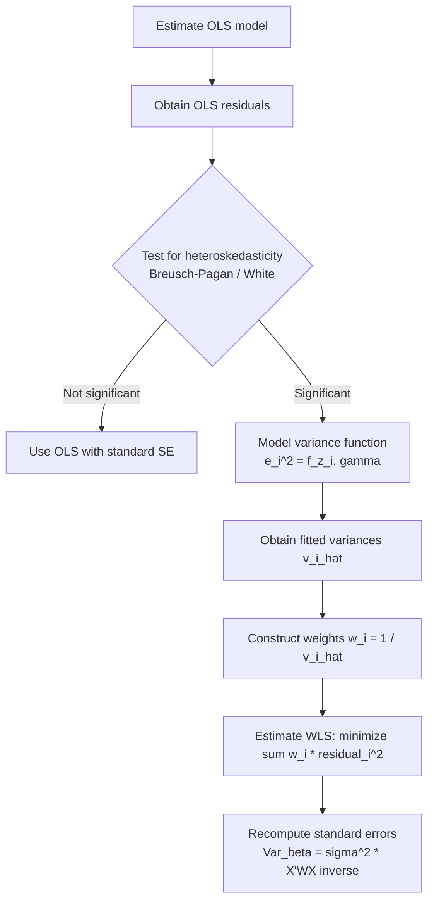

## Weighted Least Squares

### Definition and Motivation

Weighted least squares (WLS) is an estimation method for the linear regression model

$$y_i = x_i'\beta + \varepsilon_i, \quad i = 1, \dots, n$$

used when the error terms exhibit heteroskedasticity, i.e., $\text{Var}(\varepsilon_i \mid x_i) = \sigma_i^2$ differs across observations, rather than the homoskedastic assumption $\text{Var}(\varepsilon_i \mid x_i) = \sigma^2$ required for ordinary least squares (OLS) to be efficient.

Under heteroskedasticity, OLS remains unbiased and consistent, but it is no longer the Best Linear Unbiased Estimator (BLUE). WLS restores efficiency by assigning each observation a weight inversely proportional to its error variance, downweighting noisy observations and upweighting precise ones.

### The Model and Weighting Scheme

Assume:

$$\text{Var}(\varepsilon_i \mid x_i) = \sigma^2 v_i$$

where $v_i > 0$ is a known (or estimable) factor capturing the relative variance of observation $i$, and $\sigma^2$ is a common scale factor. Define weights:

$$w_i = \frac{1}{v_i}$$

The WLS estimator minimizes the weighted sum of squared residuals:

$$\hat{\beta}_{WLS} = \arg\min_{\beta} \sum_{i=1}^n w_i (y_i - x_i'\beta)^2$$

In matrix form, with $W = \text{diag}(w_1, \dots, w_n)$:

$$\hat{\beta}_{WLS} = (X'WX)^{-1} X'Wy$$

### WLS as Transformed OLS

WLS can be implemented as OLS on transformed data. Dividing both sides of the regression equation by $\sqrt{v_i}$:

$$\frac{y_i}{\sqrt{v_i}} = \frac{x_i'}{\sqrt{v_i}}\beta + \frac{\varepsilon_i}{\sqrt{v_i}}$$

The transformed error $\varepsilon_i^* = \varepsilon_i / \sqrt{v_i}$ has variance:

$$\text{Var}(\varepsilon_i^*) = \frac{\sigma^2 v_i}{v_i} = \sigma^2$$

which is homoskedastic. Running OLS on $y_i^* = y_i/\sqrt{v_i}$ against $x_i^* = x_i/\sqrt{v_i}$ (including the transformed intercept, since the constant term is also divided by $\sqrt{v_i}$) yields exactly $\hat{\beta}_{WLS}$. This equivalence is why WLS is a special case of Generalized Least Squares (GLS), where the error covariance matrix $\Omega = \sigma^2 V$ is diagonal (no correlation across observations, only heteroskedasticity).

### Properties of the WLS Estimator

- **Unbiasedness**: $E[\hat{\beta}_{WLS} \mid X] = \beta$, provided $E[\varepsilon_i \mid x_i] = 0$, same as OLS.
- **Efficiency**: By the Gauss-Markov theorem applied to the transformed model, $\hat{\beta}_{WLS}$ is BLUE when the weights $w_i = 1/v_i$ correctly specify the true variance structure. [Confirmed]
- **Variance-covariance matrix**:

$$\text{Var}(\hat{\beta}_{WLS} \mid X) = \sigma^2 (X'WX)^{-1}$$

- **Consistency of weights matters**: If the assumed $v_i$ is misspecified (i.e., does not match the true heteroskedasticity pattern), $\hat{\beta}_{WLS}$ remains unbiased and consistent (since it is still a linear unbiased combination of $y$), but it is no longer efficient, and the reported standard errors from the WLS formula will generally be incorrect. [Confirmed]

### Feasible WLS (FWLS)

In practice, $v_i$ is rarely known and must be estimated from the data, giving **Feasible WLS (FWLS)**. A common procedure:

1. Estimate the model by OLS and obtain residuals $\hat{\varepsilon}_i$.
2. Model the variance structure — common specifications include:
   - $\hat{\varepsilon}_i^2 = z_i'\gamma + u_i$ (linear variance function in some covariates $z_i$)
   - $\ln(\hat{\varepsilon}_i^2) = z_i'\gamma + u_i$ (log-linear, guarantees positive fitted variance)
3. Obtain fitted values $\hat{v}_i$ from this auxiliary regression.
4. Construct weights $\hat{w}_i = 1/\hat{v}_i$ and re-estimate $\beta$ by WLS using $\hat{w}_i$.

FWLS is asymptotically as efficient as WLS with known weights under standard regularity conditions, but this asymptotic equivalence is a large-sample result — in finite samples, estimation error in $\hat{v}_i$ introduces additional noise. [Confirmed]

### Common Weighting Structures

**Known group variances**: If observations fall into $G$ groups with known variance $\sigma_g^2$ per group, set $w_i = 1/\sigma_g^2$ for all $i$ in group $g$.

**Variance proportional to a regressor**: A frequent applied assumption is $\text{Var}(\varepsilon_i) = \sigma^2 x_{ki}$ for some regressor $x_k$ (e.g., variance grows with firm size or population). Then $w_i = 1/x_{ki}$.

**Aggregated/grouped data**: When $y_i$ represents an average of $n_i$ underlying observations, $\text{Var}(\bar{y}_i) = \sigma^2/n_i$, so the natural weight is $w_i = n_i$ — larger groups get more weight since their averages are more precisely estimated. [Confirmed]

**Survey weights**: In survey data, weights may reflect sampling design (inverse probability of selection) rather than variance structure per se; this is a related but conceptually distinct use of "weighted" regression (design-based weighting vs. efficiency-based weighting).

### Worked Example

Suppose a cross-sectional dataset relates household expenditure ($y_i$) to income ($x_i$), and a Breusch-Pagan test indicates $\text{Var}(\varepsilon_i) = \sigma^2 x_i$ (variance increases proportionally with income — a common pattern in expenditure data since higher-income households have more discretionary variability).

Set $w_i = 1/x_i$. The transformed regression becomes:

$$\frac{y_i}{\sqrt{x_i}} = \beta_0 \frac{1}{\sqrt{x_i}} + \beta_1 \sqrt{x_i} + \frac{\varepsilon_i}{\sqrt{x_i}}$$

**Python implementation (statsmodels):**

```python
import numpy as np
import statsmodels.api as sm

# X includes a constant column
X = sm.add_constant(income)
y = expenditure

# Step 1: OLS to get residuals
ols_model = sm.OLS(y, X).fit()
resid_sq = ols_model.resid ** 2

# Step 2: model variance as proportional to income (example specification)
weights = 1.0 / income  # w_i = 1/x_i

# Step 3: WLS
wls_model = sm.WLS(y, X, weights=weights).fit()
print(wls_model.summary())
```

`statsmodels.WLS` expects `weights` as $w_i = 1/v_i$ directly (not $v_i$), consistent with the formula above. [Confirmed]

**R implementation:**

```r
ols_model <- lm(expenditure ~ income, data = df)
df$resid_sq <- resid(ols_model)^2

# weights = 1/variance
wls_model <- lm(expenditure ~ income, data = df, weights = 1/income)
summary(wls_model)
```

### Detecting Heteroskedasticity Before Applying WLS

WLS should be motivated by evidence of heteroskedasticity, typically via:

- **Breusch-Pagan test**: regresses squared OLS residuals on the regressors (or a subset), testing $H_0$: constant variance.
- **White test**: a more general test including squares and cross-products of regressors, robust to unknown functional form of heteroskedasticity.
- **Visual diagnostics**: plotting residuals $\hat{\varepsilon}_i$ or $\hat{\varepsilon}_i^2$ against fitted values or candidate regressors.

### WLS versus Heteroskedasticity-Robust Standard Errors

A key applied distinction:

| Approach | What it fixes | Efficiency gain |
| --- | --- | --- |
| OLS + robust (White/HC) SE | Corrects inference only; coefficients unchanged | None — OLS point estimates remain inefficient |
| WLS (correctly specified weights) | Corrects both estimation and inference | Yes — recovers BLUE efficiency |
| FWLS | Approximately corrects both | Asymptotic, not exact in finite samples |

Many applied econometricians prefer OLS with heteroskedasticity-robust standard errors (Huber-White) over WLS when the variance structure is uncertain, since misspecifying $v_i$ in WLS can *reduce* efficiency relative to OLS and produces standard errors that are wrong if the weighting model itself is wrong. WLS is most attractive when the variance structure is well-motivated by theory or known sampling design (e.g., grouped means, survey weights). [Inference — this is a matter of applied practice/judgment rather than a universal theorem]

### Relationship to Generalized Least Squares (GLS)

WLS is the diagonal special case of the general GLS estimator:

$$\hat{\beta}_{GLS} = (X'\Omega^{-1}X)^{-1}X'\Omega^{-1}y$$

When $\Omega = \sigma^2 V$ with $V$ diagonal (heteroskedasticity, no autocorrelation), GLS reduces exactly to WLS with $w_i = 1/V_{ii}$. When $\Omega$ has off-diagonal terms (e.g., serial correlation or clustering), full GLS (or its feasible counterpart, FGLS) is required instead of WLS alone.

### Diagram: WLS Estimation Workflow



### Common Pitfalls

- **Weight misspecification**: Using an incorrect variance function biases standard errors (though not $\hat{\beta}$ itself) and can reduce, not improve, efficiency relative to OLS. [Confirmed]
- **Weights from estimated (not true) variances**: FWLS standard errors are only asymptotically valid; in small samples they can understate true uncertainty since the estimation of $\hat{v}_i$ is treated as fixed at the second stage.
- **Endogenous weights**: If the variance function depends on $y_i$ itself in a way correlated with $\varepsilon_i$ (rather than only on exogenous $x_i$), the weights can become endogenous, potentially reintroducing bias.
- **Extreme weights**: Very small $v_i$ estimates produce very large $w_i$, letting a handful of observations dominate the objective function — practitioners often winsorize or bound estimated variances before inverting them.

### Related Topics

- Generalized Least Squares (GLS) and Feasible GLS (FGLS)
- Heteroskedasticity-consistent (robust) standard errors: HC0, HC1, HC2, HC3
- Breusch-Pagan and White tests for heteroskedasticity
- Cluster-robust standard errors
- Iteratively Reweighted Least Squares (IRLS) and its role in GLM estimation
- Panel data variance structures (random effects GLS)