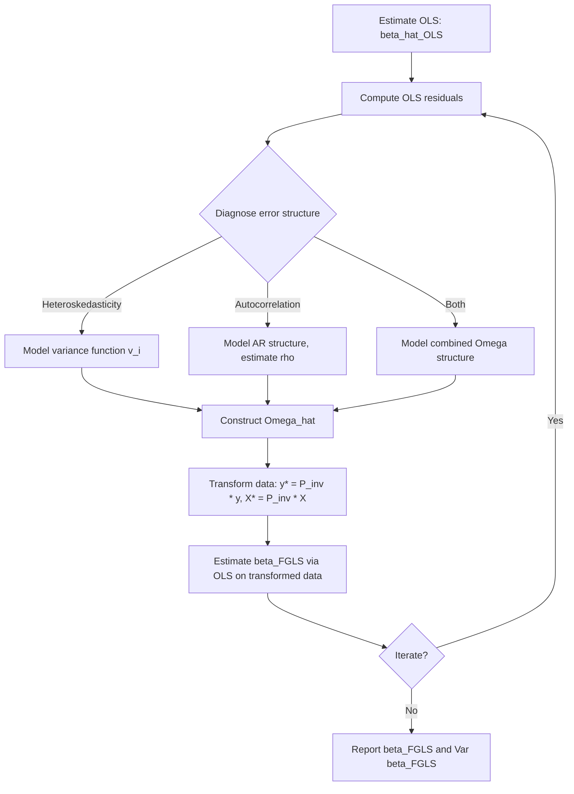

## Feasible Generalized Least Squares

### Definition and Motivation

Feasible Generalized Least Squares (FGLS) is the practical implementation of Generalized Least Squares (GLS) used when the error covariance matrix $\Omega$ is unknown and must be estimated from the data. GLS itself requires knowledge of $\Omega = \text{Var}(\varepsilon \mid X)$ to produce the efficient estimator:

$$\hat{\beta}_{GLS} = (X'\Omega^{-1}X)^{-1}X'\Omega^{-1}y$$

Since $\Omega$ is rarely known in applied work, FGLS substitutes a consistent estimate $\hat{\Omega}$ in its place:

$$\hat{\beta}_{FGLS} = (X'\hat{\Omega}^{-1}X)^{-1}X'\hat{\Omega}^{-1}y$$

FGLS addresses violations of the Gauss-Markov homoskedasticity/no-autocorrelation assumption — heteroskedasticity, autocorrelation, or both — by first modeling the error structure, then re-weighting/transforming the data accordingly.

### General Two-Step Procedure

1. **Estimate the model by OLS** and obtain residuals $\hat{\varepsilon}_i = y_i - x_i'\hat{\beta}_{OLS}$.
2. **Model the error covariance structure** using these residuals (e.g., a variance function for heteroskedasticity, or an autoregressive structure for serial correlation).
3. **Construct $\hat{\Omega}$** from the fitted structure.
4. **Re-estimate $\beta$** via GLS using $\hat{\Omega}$ in place of the true $\Omega$, either directly via the GLS formula or equivalently via OLS on transformed (whitened) data.
5. **Optionally iterate**: re-compute residuals from the FGLS fit, re-estimate $\hat{\Omega}$, and repeat until convergence (iterated FGLS).

### FGLS for Heteroskedasticity

When $\Omega = \sigma^2 V$ with $V = \text{diag}(v_1, \dots, v_n)$ diagonal, FGLS reduces to Feasible Weighted Least Squares:

1. Regress $\hat{\varepsilon}_i^2$ (or $\ln \hat{\varepsilon}_i^2$) on a set of variables $z_i$ believed to drive the variance:

$$\ln \hat{\varepsilon}_i^2 = z_i'\gamma + u_i$$

2. Obtain fitted values $\hat{v}_i = \exp(z_i'\hat{\gamma})$ (log form guarantees positivity).
3. Set weights $w_i = 1/\hat{v}_i$ and estimate by WLS.

This is identical in mechanics to the FWLS procedure covered under Weighted Least Squares; FGLS is the general label, with WLS as its diagonal-$\Omega$ special case.

### FGLS for Autocorrelation

When errors follow, e.g., an AR(1) process $\varepsilon_t = \rho \varepsilon_{t-1} + u_t$, $\Omega$ has a banded, non-diagonal structure. The classical approach is the **Cochrane-Orcutt procedure**:

1. Estimate $\beta$ by OLS; obtain residuals $\hat{\varepsilon}_t$.
2. Estimate $\hat{\rho}$ from $\hat{\varepsilon}_t = \rho \hat{\varepsilon}_{t-1} + u_t$ (auxiliary regression, or via the Durbin-Watson statistic as an approximation).
3. Quasi-difference the data:

$$y_t^* = y_t - \hat{\rho}y_{t-1}, \qquad x_t^* = x_t - \hat{\rho}x_{t-1}$$

4. Estimate $\beta$ by OLS on the transformed data $(y_t^*, x_t^*)$.
5. Iterate steps 2-4 using updated residuals until $\hat{\rho}$ converges.

A related method, the **Prais-Winsten transformation**, retains the first observation (transformed differently, using $\sqrt{1-\hat{\rho}^2}$ scaling) rather than discarding it as Cochrane-Orcutt does, preserving a degree of freedom. [Confirmed]

### FGLS via Whitening Transformation

Any FGLS problem can be written as OLS on transformed variables. If $\hat{\Omega} = \hat{P}\hat{P}'$ (e.g., via Cholesky decomposition), define:

$$y^* = \hat{P}^{-1}y, \qquad X^* = \hat{P}^{-1}X$$

Then:

$$\hat{\beta}_{FGLS} = (X^{*\prime}X^*)^{-1}X^{*\prime}y^*$$

This "whitening" view unifies WLS (diagonal $\hat{P}$) and AR-structure corrections (banded $\hat{P}$) under one computational framework.

### Asymptotic Properties

- **Consistency**: $\hat{\beta}_{FGLS} \xrightarrow{p} \beta$ under standard regularity conditions, provided $\hat{\Omega}$ is a consistent estimator of (a matrix proportional to) $\Omega$. [Confirmed]
- **Asymptotic efficiency**: Under correct specification of the error structure, $\hat{\beta}_{FGLS}$ is asymptotically equivalent to the infeasible $\hat{\beta}_{GLS}$ — i.e., they share the same asymptotic distribution. [Confirmed]
- **Finite-sample properties**: FGLS is *not* generally unbiased in finite samples, because $\hat{\Omega}$ is estimated using the same data used to estimate $\beta$, introducing a feedback loop between the two stages. Small-sample bias and non-normal sampling distributions are possible, particularly with small $n$ or many parameters in the variance/covariance model. [Confirmed]
- FGLS can, in finite samples, perform worse than OLS with robust standard errors if the auxiliary model for $\Omega$ is poorly estimated or misspecified. [Inference — a matter of finite-sample simulation evidence and applied judgment rather than a general theorem]

### Worked Example: FGLS for Heteroskedastic Panel-like Cross-Section

**Setup**: Firm-level data where $\text{Var}(\varepsilon_i)$ is believed to increase with firm size (`assets`).

**Python (statsmodels):**

```python
import numpy as np
import statsmodels.api as sm

X = sm.add_constant(df[['assets', 'leverage']])
y = df['roa']

# Step 1: OLS
ols_fit = sm.OLS(y, X).fit()
log_resid_sq = np.log(ols_fit.resid ** 2)

# Step 2: model variance as function of assets
aux_X = sm.add_constant(df[['assets']])
aux_fit = sm.OLS(log_resid_sq, aux_X).fit()
v_hat = np.exp(aux_fit.fittedvalues)

# Step 3: FGLS (implemented as WLS with estimated weights)
fgls_fit = sm.WLS(y, X, weights=1.0 / v_hat).fit()
print(fgls_fit.summary())
```

**R (nlme / AR(1) example):**

```r
library(nlme)

# FGLS with AR(1) errors via generalized least squares
fgls_model <- gls(roa ~ assets + leverage,
                   data = df,
                   correlation = corAR1(form = ~ time | firm_id))
summary(fgls_model)
```

`nlme::gls()` estimates the variance/correlation structure and the regression coefficients jointly via (restricted) maximum likelihood, which is a likelihood-based alternative to the classical two-step FGLS recipe above but targets the same asymptotic estimator. [Confirmed]

### FGLS versus Alternatives

| Approach | Handles | Efficiency | Robustness to misspecification |
| --- | --- | --- | --- |
| OLS + robust SE (HC/HAC) | Inference only | OLS-level (inefficient under heteroskedasticity/autocorrelation) | High — consistent SEs even if variance model unknown |
| FGLS | Estimation + inference | Asymptotically efficient if $\Omega$ correctly modeled | Low — misspecified $\hat{\Omega}$ can distort both $\hat\beta$'s finite-sample behavior and inference |
| Maximum Likelihood (joint) | Estimation + inference | Asymptotically efficient under correct distributional assumption | Depends on likelihood correctness |

A standard applied recommendation is to report FGLS point estimates alongside heteroskedasticity- and autocorrelation-consistent (HAC) standard errors when there is uncertainty about the correctness of the assumed $\Omega$ structure, since this guards inference against misspecification of the variance model while still gaining efficiency in the point estimate. [Inference]

### Diagram: FGLS General Procedure



### Common Pitfalls

- **Underestimating small-sample bias**: FGLS's efficiency advantage is asymptotic; with small $n$, the two-step estimation of $\hat{\Omega}$ can introduce meaningful finite-sample distortion. [Confirmed]
- **Overfitting the variance/correlation model**: Including too many parameters in the auxiliary model for $\Omega$ increases estimation noise in $\hat{\Omega}$, which propagates into $\hat{\beta}_{FGLS}$.
- **Treating $\hat{\Omega}$ as known when computing standard errors**: Standard FGLS formulas for $\text{Var}(\hat{\beta}_{FGLS})$ typically do not account for the estimation uncertainty in $\hat{\Omega}$ itself, understating true variability, particularly in small samples. [Confirmed]
- **Ignoring model misspecification diagnostics**: Applying FGLS without first testing for the presence and functional form of heteroskedasticity/autocorrelation (e.g., via Breusch-Pagan, White, or Breusch-Godfrey tests) risks imposing an incorrect $\Omega$ structure.
- **Confusing FGLS with random-effects panel GLS**: Random-effects panel estimators are a specific application of FGLS to the panel error-components structure, not a distinct estimation principle.

### Related Topics

- Weighted Least Squares (WLS) as the diagonal special case
- Cochrane-Orcutt and Prais-Winsten procedures for AR(1) errors
- Newey-West (HAC) standard errors
- Breusch-Godfrey test for serial correlation
- Random effects estimation in panel data (GLS-based)
- Maximum likelihood estimation of variance components
- Iteratively Reweighted Least Squares (IRLS)