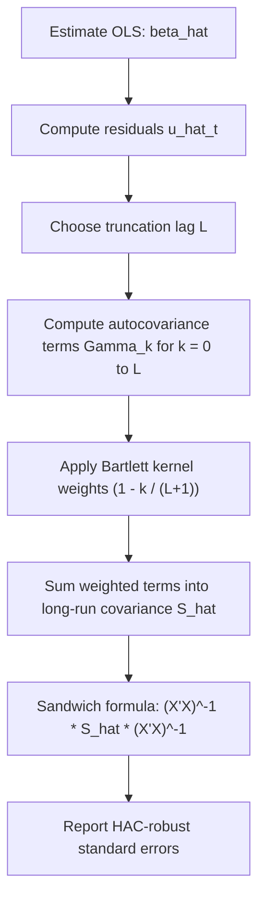

### Autocorrelation: Definition and Consequences

Autocorrelation (serial correlation) occurs when error terms in a regression are correlated across observations, typically in time-series or ordered panel data:

$$\text{Cov}(\varepsilon_t, \varepsilon_s) \neq 0 \text{ for some } t \neq s$$

This violates the Gauss-Markov assumption of spherical errors $\text{Var}(\varepsilon \mid X) = \sigma^2 I$. Under autocorrelation:

- **OLS point estimates remain unbiased and consistent**, provided $E[\varepsilon_t \mid X] = 0$ still holds. [Confirmed]
- **OLS is no longer BLUE** — GLS/FGLS estimators exploiting the correlation structure are more efficient.
- **Conventional OLS standard errors are biased**, typically downward when errors are positively autocorrelated (the common case in economic time series), leading to overstated $t$-statistics and spurious significance. [Confirmed]

### Common Autocorrelation Structures

**AR(1) process:**

$$\varepsilon_t = \rho \varepsilon_{t-1} + u_t, \qquad u_t \sim \text{i.i.d.}(0, \sigma_u^2), \quad |\rho| < 1$$

This implies:

$$\text{Cov}(\varepsilon_t, \varepsilon_{t-k}) = \rho^{|k|}\frac{\sigma_u^2}{1-\rho^2}$$

so the correlation decays geometrically with lag length $k$.

**Higher-order AR(p) and MA(q) processes**: more general structures where correlation may persist over multiple lags with more complex decay patterns, common in macroeconomic and financial time series.

### Detecting Autocorrelation

- **Durbin-Watson (DW) test**: tests for first-order autocorrelation specifically; statistic ranges from 0 to 4, with values near 2 indicating no autocorrelation, near 0 indicating strong positive autocorrelation, near 4 indicating strong negative autocorrelation. Limitation: invalid in the presence of lagged dependent variables as regressors.
- **Breusch-Godfrey (LM) test**: more general, tests for autocorrelation up to a specified lag order $p$, valid even with lagged dependent variables among the regressors. [Confirmed]
- **Visual diagnostics**: autocorrelation function (ACF) and partial autocorrelation function (PACF) plots of residuals.

### The Newey-West (HAC) Estimator

Rather than modeling the autocorrelation structure explicitly (as FGLS/Cochrane-Orcutt does), the **Newey-West estimator** produces standard errors that remain valid (consistent) under both heteroskedasticity and autocorrelation of unknown form, without needing to specify $\Omega$ correctly. This class of estimator is called **Heteroskedasticity and Autocorrelation Consistent (HAC)**.

The Newey-West variance estimator for $\hat{\beta}_{OLS}$ is:

$$\hat{V}_{NW}(\hat{\beta}) = (X'X)^{-1}\hat{S}(X'X)^{-1}$$

where $\hat{S}$ is a long-run covariance estimator:

$$\hat{S} = \hat{\Gamma}_0 + \sum_{k=1}^{L}\left(1 - \frac{k}{L+1}\right)(\hat{\Gamma}_k + \hat{\Gamma}_k')$$

with:

$$\hat{\Gamma}_k = \frac{1}{n}\sum_{t=k+1}^{n} \hat{u}_t \hat{u}_{t-k}\, x_t x_{t-k}'$$

Here $\hat{u}_t$ are OLS residuals, and $L$ is the **truncation lag (bandwidth)** — the maximum lag length over which autocorrelation is assumed to matter. The term $\left(1 - \frac{k}{L+1}\right)$ is the **Bartlett kernel**, which linearly downweights higher-order lag terms, ensuring $\hat{S}$ is positive semi-definite by construction. [Confirmed]

### Choosing the Truncation Lag

Newey and West's original rule of thumb sets:

$$L = \lfloor 4(n/100)^{2/9} \rfloor$$

though the appropriate choice depends on the persistence of the autocorrelation and the sample size; too small an $L$ fails to capture longer-range correlation, while too large an $L$ increases estimator variance (fewer effective terms contribute reliably to each $\hat{\Gamma}_k$). Data-driven bandwidth selection procedures (e.g., Newey-West's own automatic bandwidth selection, or Andrews' 1991 method) are also used in practice. [Confirmed]

### Key Properties

- Newey-West standard errors are **consistent** for the true asymptotic variance of $\hat{\beta}_{OLS}$ under general forms of heteroskedasticity and autocorrelation, as $n \to \infty$ with $L \to \infty$ at an appropriate rate relative to $n$. [Confirmed]
- They do **not change the point estimates** — $\hat{\beta}_{OLS}$ itself is unaffected; only the standard errors (and therefore $t$-statistics, confidence intervals, and hypothesis tests) are corrected.
- They sacrifice efficiency relative to a correctly specified FGLS model, but gain robustness: no explicit model of the autocorrelation/heteroskedasticity structure needs to be correctly specified. [Confirmed]
- Finite-sample performance can be poor with highly persistent series or small $n$ relative to $L$; the estimator can be biased downward in some finite-sample configurations, and coverage of confidence intervals based on it is not exact in finite samples. [Inference — this is an established concern from simulation studies rather than an exact finite-sample theorem, since exact finite-sample properties depend on the specific data-generating process]

### Worked Example

**Python (statsmodels):**

```python
import statsmodels.api as sm

X = sm.add_constant(df[['gdp_growth', 'inflation']])
y = df['bond_yield']

ols_fit = sm.OLS(y, X).fit()

# Newey-West HAC standard errors, maxlags = truncation lag L
nw_fit = ols_fit.get_robustcov_results(cov_type='HAC', maxlags=4)
print(nw_fit.summary())
```

**R (sandwich + lmtest):**

```r
library(sandwich)
library(lmtest)

ols_model <- lm(bond_yield ~ gdp_growth + inflation, data = df)

# NeweyWest() computes the HAC covariance matrix; lag chosen via Newey-West rule by default
nw_vcov <- NeweyWest(ols_model, lag = 4, prewhite = FALSE)
coeftest(ols_model, vcov = nw_vcov)
```

`sandwich::NeweyWest()` defaults to the Newey-West automatic lag-selection rule when `lag` is left unspecified, and supports an optional VAR(1) "prewhitening" step (`prewhite = TRUE`) intended to reduce bias from residual autocorrelation before applying the kernel estimator. [Confirmed]

### Newey-West versus Alternative Approaches

| Approach | Corrects | Requires correct model of $\Omega$? | Efficiency |
| --- | --- | --- | --- |
| OLS (uncorrected) | Neither | No | Efficient only under classical assumptions |
| Newey-West (HAC) SE | Inference only | No | OLS-level (unchanged point estimates) |
| Cochrane-Orcutt / Prais-Winsten (FGLS) | Estimation + inference | Yes (AR(1) form) | Asymptotically more efficient if correctly specified |
| GLS with known $\Omega$ | Estimation + inference | N/A (assumed known) | Fully efficient (BLUE) |

### Diagram: HAC Standard Error Construction



### Extension: Heteroskedasticity Alone (HC) versus HAC

- **HC (White) standard errors**: robust to heteroskedasticity only, assume $\text{Cov}(\varepsilon_t, \varepsilon_s) = 0$ for $t \neq s$.
- **HAC (Newey-West) standard errors**: robust to both heteroskedasticity and autocorrelation up to lag $L$; nest HC as the special case $L = 0$.

Because HAC estimators are strictly more general (reducing to HC when no autocorrelation is present but costing some efficiency in finite samples due to the extra terms being estimated), the choice between HC and HAC in practice depends on whether the data structure (e.g., time-ordered vs. purely cross-sectional) makes serial correlation plausible. [Confirmed]

### Common Pitfalls

- **Applying Newey-West to cross-sectional (non-time-ordered) data** without a meaningful ordering variable makes the lag structure uninterpretable — HAC corrections assume a natural temporal (or spatial) ordering.
- **Ignoring panel structure**: in panel data, clustered standard errors (by entity) or panel-specific HAC variants (e.g., Driscoll-Kraay) are typically more appropriate than a plain time-series Newey-West correction.
- **Treating HAC as a fix for misspecification**: Newey-West corrects standard errors for a given (correctly specified) mean model; it does not correct for omitted variables, non-linearity, or other functional-form misspecification.
- **Arbitrary lag choice without justification**: reporting results without documenting or justifying the truncation lag $L$ undermines replicability, since results can be sensitive to this choice, particularly in small samples.

### Related Topics

- Feasible Generalized Least Squares (FGLS) and Cochrane-Orcutt/Prais-Winsten
- Durbin-Watson and Breusch-Godfrey tests for serial correlation
- Heteroskedasticity-robust (White/HC) standard errors
- Cluster-robust standard errors for panel data
- Driscoll-Kraay standard errors (panel HAC)
- Prewhitening in HAC estimation
- Long-run variance estimation in time-series econometrics