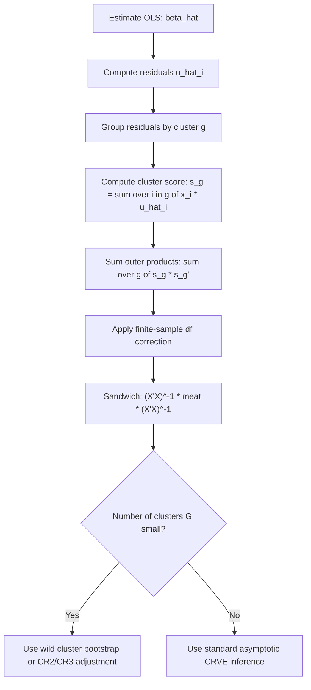

## Clustered Standard Errors

### Definition and Motivation

Clustered standard errors address a specific form of dependence in the error structure: observations are assumed to be correlated *within* pre-defined groups (clusters) but independent *across* clusters. This arises naturally in:

- Panel data (repeated observations of the same entity over time — correlation within entity)
- Grouped cross-sections (students within schools, employees within firms, individuals within villages)
- Any design where a treatment or shock is applied at the group level rather than the individual level

Formally, if observations are indexed by cluster $g = 1, \dots, G$ and unit $i$ within cluster $g$:

$$\text{Cov}(\varepsilon_{ig}, \varepsilon_{jg}) \neq 0 \text{ for } i \neq j \text{ within the same cluster } g$$


$$\text{Cov}(\varepsilon_{ig}, \varepsilon_{jh}) = 0 \text{ for } g \neq h \text{ (different clusters)}$$

OLS point estimates remain unbiased and consistent under this structure, but conventional (and even heteroskedasticity-robust HC) standard errors are generally biased — typically downward — because they ignore the positive within-cluster correlation common in most applications, leading to overstated precision and inflated $t$-statistics. [Confirmed]

### The Cluster-Robust Sandwich Estimator

The cluster-robust covariance matrix estimator (CRVE) takes the same sandwich form as HC/HAC estimators, but aggregates score contributions within each cluster before squaring:

$$\hat{V}_{CR}(\hat{\beta}) = (X'X)^{-1}\left(\sum_{g=1}^{G} X_g'\hat{u}_g\hat{u}_g'X_g\right)(X'X)^{-1}$$

where $X_g$ is the matrix of regressors for cluster $g$ and $\hat{u}_g$ is the vector of OLS residuals for that cluster. This is often written using cluster-level score vectors $s_g = X_g'\hat{u}_g$:

$$\hat{V}_{CR}(\hat{\beta}) = (X'X)^{-1}\left(\sum_{g=1}^G s_g s_g'\right)(X'X)^{-1}$$

Crucially, this construction allows **arbitrary correlation and heteroskedasticity within a cluster** — no functional form for $\text{Cov}(\varepsilon_{ig}, \varepsilon_{jg})$ needs to be specified — while assuming clusters are independent of one another. [Confirmed]

### Finite-Sample (Degrees-of-Freedom) Correction

A common small-sample correction (analogous to HC1) scales the CRVE by:

$$c = \frac{G}{G-1}\cdot\frac{n-1}{n-k}$$

where $G$ is the number of clusters, $n$ the total sample size, and $k$ the number of regressors. This is the default correction in Stata's `vce(cluster)` and most implementations of `sandwich::vcovCL()` in R. [Confirmed]

### The "Few Clusters" Problem

CRVE asymptotics rely on $G \to \infty$ (the number of clusters growing), *not* on the number of observations within each cluster growing. When $G$ is small (a common rule of thumb cited in applied work is fewer than 30-50 clusters), the cluster-robust estimator can be severely biased downward, and Wald tests based on it over-reject the null hypothesis. [Confirmed — this is a well-documented finite-sample concern; the specific numeric threshold varies across simulation studies and is not a universal cutoff, so treat any single number as a rough guide rather than an exact rule] [Inference for the specific threshold]

**Remedies for few clusters:**

- **Wild cluster bootstrap** (Cameron, Gelbach, and Miller, 2008): resamples cluster-level residuals with random sign flips (typically Rademacher weights), re-estimating the model many times to build an empirical distribution for test statistics; widely recommended as more reliable than asymptotic CRVE with few clusters. [Confirmed]
- **Bias-reduced linearization (BRL)** / CR2, CR3 variants (analogous to HC2/HC3): adjust residuals using cluster-level leverage before squaring, improving finite-sample behavior.
- **Satterthwaite or CR2-based degrees-of-freedom adjustments**: modify the reference $t$-distribution's degrees of freedom rather than assuming the usual $n-k$.

### One-Way versus Multi-Way Clustering

**One-way clustering**: correlation assumed within a single grouping dimension (e.g., by firm, or by state).

**Multi-way clustering** (Cameron, Gelbach, and Miller, 2011): allows for correlation along two or more non-nested dimensions simultaneously — e.g., by firm *and* by year, when both firm-specific persistent shocks and year-specific common shocks (such as macroeconomic conditions) may induce correlation. The two-way CRVE is computed as:

$$\hat{V}_{2way} = \hat{V}_{firm} + \hat{V}_{year} - \hat{V}_{firm \times year}$$

i.e., sum the one-way cluster estimators for each dimension and subtract the estimator clustered on the intersection, analogous to inclusion-exclusion, to avoid double-counting the overlapping variation. [Confirmed]

### Choosing the Clustering Dimension

The choice of clustering variable should reflect the level at which the *treatment or shock* varies, or the natural unit of correlated unobservables — not simply the level with the most natural "grouping" in the data. Key considerations:

- If treatment is assigned at the group level (e.g., a policy applied to entire states), cluster at that level even if outcome data is individual-level, since the source of correlated shocks is the group-level assignment. [Confirmed]
- Clustering at too fine a level (e.g., not clustering at all when correlation exists) understates standard errors; clustering at an unnecessarily coarse level can overstate them and reduce effective degrees of freedom, but conservatively clustering at a plausible higher level is generally viewed as safer than under-clustering. [Inference — this reflects prevailing applied econometric guidance rather than a strict mathematical result]

### Worked Example

**Setup**: Individual-level wage data, with a state-level minimum wage policy variable. Correlation is expected within state (common local labor market shocks) and possibly within year (national business cycle effects).

**Python (statsmodels), one-way clustering:**

```python
import statsmodels.api as sm
import statsmodels.formula.api as smf

model = smf.ols('log_wage ~ min_wage + education + experience', data=df)
cluster_fit = model.fit(cov_type='cluster', cov_kwds={'groups': df['state']})
print(cluster_fit.summary())
```

**R (fixest), one-way and multi-way clustering:**

```r
library(fixest)

# One-way clustering by state
model1 <- feols(log_wage ~ min_wage + education + experience, data = df,
                 cluster = ~ state)

# Two-way clustering by state and year
model2 <- feols(log_wage ~ min_wage + education + experience, data = df,
                 cluster = ~ state + year)

summary(model1)
summary(model2)
```

**R (fwildclusterboot), wild cluster bootstrap for few clusters:**

```r
library(fwildclusterboot)
library(fixest)

model <- feols(log_wage ~ min_wage + education + experience, data = df,
               cluster = ~ state)

boot_test <- boottest(model, param = "min_wage", clustid = "state", B = 9999)
summary(boot_test)
```

`fixest::feols()` defaults to a CR1-type finite-sample correction for clustered standard errors, and its `cluster` argument accepts formula syntax for both one-way and multi-way clustering. [Confirmed]

### Comparison with Related Approaches

| Approach | Assumes | Best suited for |
| --- | --- | --- |
| HC (White) robust SE | Independent errors, unknown heteroskedasticity | Cross-sectional data, no group structure |
| Newey-West (HAC) | Autocorrelation over time within a single series | Single time series |
| Cluster-robust SE | Arbitrary within-group correlation, independence across groups | Panel/grouped data with $G$ moderately large |
| Driscoll-Kraay | Cross-sectional and serial dependence in panels | Panels with common shocks across many entities |
| Wild cluster bootstrap | Same as cluster-robust, but improves finite-sample inference | Panel/grouped data with few clusters |

### Diagram: Cluster-Robust Variance Construction



### Common Pitfalls

- **Clustering on a variable with very few groups** (e.g., 3-5 regions) without applying a small-sample correction or bootstrap — standard asymptotic CRVE inference is unreliable in this regime. [Confirmed]
- **Failing to cluster when treatment varies at a coarser level than the unit of observation** — a very common source of overstated significance in applied microeconometrics.
- **Confusing fixed effects with clustering**: including cluster-level fixed effects controls for the average outcome level in each cluster but does not, by itself, correct standard errors for within-cluster correlation in the remaining error term — these are complementary, not substitute, corrections.
- **Ignoring multi-way dependence** when both cross-sectional (e.g., firm) and temporal (e.g., year) correlation are plausible, leading to standard errors that are valid for only one dimension of dependence.
- **Assuming clustering always shrinks standard errors compared to heteroskedasticity-robust SEs**: while common with positive within-cluster correlation, this is not guaranteed in all data configurations, particularly with negative within-cluster correlation.

### Related Topics

- Heteroskedasticity- and autocorrelation-consistent (HAC) covariance estimators
- Driscoll-Kraay standard errors
- Wild cluster bootstrap inference
- Fixed effects estimation in panel data
- Difference-in-differences designs and standard error clustering
- Multi-way fixed effects models