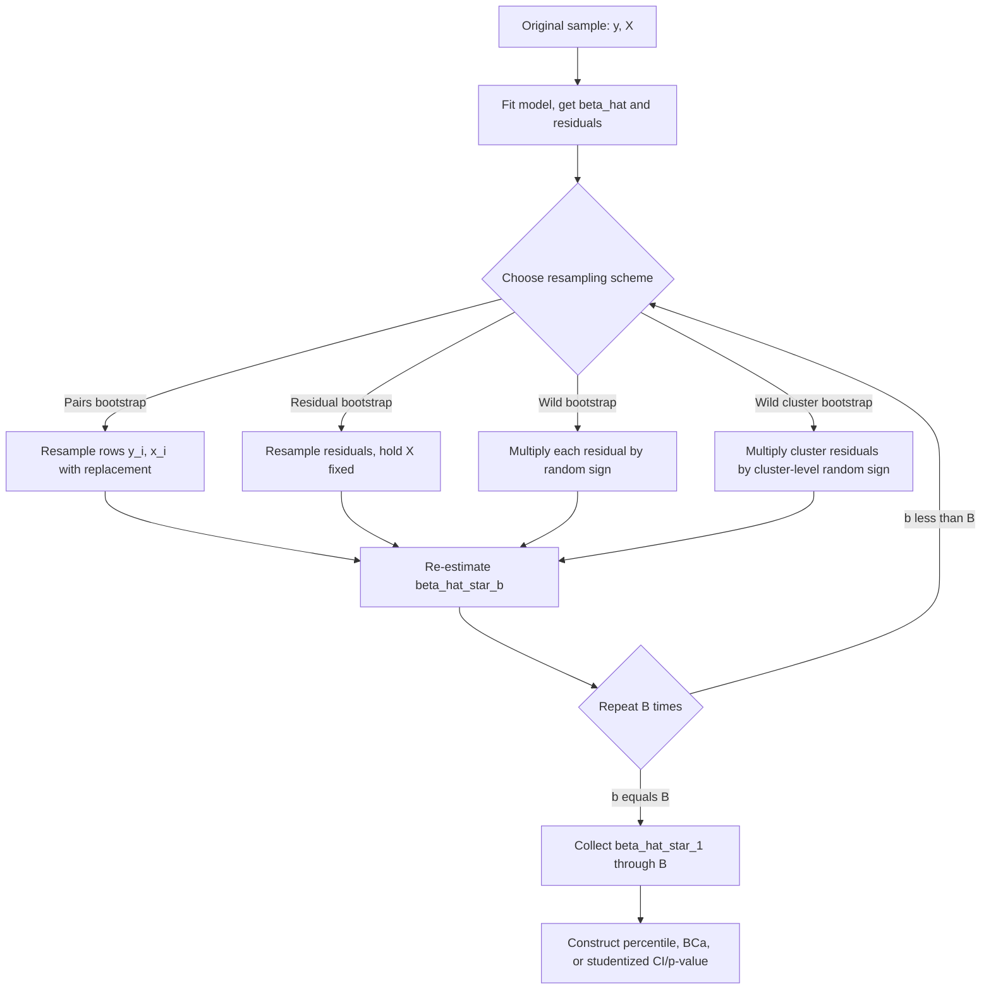

### Overview and Motivation

Bootstrap inference is a resampling-based approach to estimating the sampling distribution of a statistic (e.g., $\hat{\beta}$, a $t$-statistic, or an $F$-statistic) without relying on closed-form asymptotic formulas. In regression contexts, it serves as an alternative or complement to analytical standard errors (classical, HC, HAC, or cluster-robust) — particularly valuable when:

- Analytical standard error formulas are unreliable in finite samples (e.g., few clusters).
- The sampling distribution of a statistic is complex, non-normal, or has no simple closed form (e.g., ratios of estimated parameters, quantile treatment effects).
- Higher-order asymptotic refinements can improve finite-sample coverage relative to first-order asymptotic approximations.

The general principle: treat the observed sample as a stand-in for the population, repeatedly resample from it to generate many "pseudo-samples," recompute the statistic of interest on each, and use the empirical distribution of these recomputed statistics to approximate the true sampling distribution.

### Types of Bootstrap for Regression

**Pairs (case) bootstrap**: Resample entire observations $(y_i, x_i)$ with replacement, $n$ at a time, from the original data. Re-estimate $\hat{\beta}^{*b}$ on each resample $b = 1, \dots, B$. This is the most common and robust default, valid under heteroskedasticity of unknown form since it does not assume a fixed regressor design. [Confirmed]

**Residual bootstrap**: Fit the model once to get $\hat{\beta}$ and residuals $\hat{\varepsilon}_i$. Resample residuals with replacement to form $\varepsilon_i^{*b}$, construct pseudo-outcomes $y_i^{*b} = x_i'\hat{\beta} + \varepsilon_i^{*b}$ (holding $X$ fixed), and re-estimate $\hat{\beta}^{*b}$ on $(y^{*b}, X)$. This assumes errors are i.i.d. (or at least exchangeable) and is invalid under heteroskedasticity, since resampling residuals imposes an identical distribution across all observations regardless of their true conditional variance. [Confirmed]

**Wild bootstrap**: Designed to preserve heteroskedasticity of unknown form. Rather than resampling residuals, multiply each observation's residual by a random weight $\eta_i$ (commonly a Rademacher variable, $\eta_i \in \{-1, +1\}$ with equal probability):

$$y_i^{*b} = x_i'\hat{\beta} + \hat{\varepsilon}_i \eta_i^{b}$$

This preserves each observation's own residual magnitude (hence its estimated variance) while randomizing its sign, making it valid under heteroskedasticity without needing to specify its form. [Confirmed]

**Wild cluster bootstrap**: Extends the wild bootstrap to clustered/grouped data by applying a single random sign flip $\eta_g^b$ to all residuals within cluster $g$ (rather than independently per observation), preserving within-cluster correlation structure. This is the standard recommended approach for inference with few clusters (see Clustered Standard Errors). [Confirmed]

**Block bootstrap**: For time-series data, resampling individual observations breaks serial dependence. The block bootstrap instead resamples contiguous blocks of consecutive observations (fixed-length or, in the **stationary bootstrap** variant, random-length blocks), preserving short-range time dependence within each block.

### Bootstrap Confidence Interval Construction

Given $B$ bootstrap replications yielding $\hat{\beta}^{*1}, \dots, \hat{\beta}^{*B}$:

**Normal-approximation interval**: use the bootstrap standard deviation as a plug-in standard error in the usual $\hat{\beta} \pm z_{\alpha/2}\cdot\hat{se}_{boot}$ formula. Simple but relies on asymptotic normality.

**Percentile interval**: take the $\alpha/2$ and $1-\alpha/2$ empirical quantiles of $\{\hat{\beta}^{*b}\}$ directly as the interval bounds. Does not assume normality but can be biased in finite samples if the bootstrap distribution is itself skewed relative to the true sampling distribution.

**Basic (reflection) interval**:

$$\left[2\hat{\beta} - q_{1-\alpha/2}^*,\; 2\hat{\beta} - q_{\alpha/2}^*\right]$$

where $q^*$ denotes bootstrap quantiles; corrects for some asymmetry the plain percentile method misses.

**Bias-corrected and accelerated (BCa) interval**: adjusts both for median bias and for skewness (acceleration) in the bootstrap distribution, generally providing more accurate coverage than the plain percentile method, particularly in smaller samples or with skewed statistics. [Confirmed]

### The Bootstrap-t (Studentized Bootstrap)

Rather than bootstrapping $\hat{\beta}$ directly, the bootstrap-t method bootstraps the **studentized statistic**:

$$t^{*b} = \frac{\hat{\beta}^{*b} - \hat{\beta}}{\hat{se}(\hat{\beta}^{*b})}$$

recomputing both the coefficient and its standard error (e.g., via HC or cluster-robust formulas) within each bootstrap replication. The empirical quantiles of $t^{*b}$ are then used to construct the interval:

$$\left[\hat{\beta} - q^*_{1-\alpha/2}\cdot\hat{se}(\hat{\beta}),\; \hat{\beta} - q^*_{\alpha/2}\cdot\hat{se}(\hat{\beta})\right]$$

This approach often achieves better **asymptotic refinement** (faster convergence to correct coverage as $n$ grows) than percentile-based methods, because studentizing accounts for the estimated variability of $\hat{\beta}^{*b}$ itself rather than relying on the unconditional spread of $\hat{\beta}^{*b}$ across replications. [Confirmed]

### The Wild Cluster Bootstrap in Detail (Worked Example Context)

For hypothesis testing with few clusters (see Clustered Standard Errors), the wild cluster bootstrap procedure (Cameron, Gelbach, and Miller, 2008) for testing $H_0: \beta_k = \beta_k^0$:

1. Estimate the restricted model (imposing $H_0$) to get restricted residuals $\tilde{\varepsilon}_{ig}$.
2. For each bootstrap replication $b$, draw one Rademacher weight $\eta_g^b$ per cluster $g$.
3. Construct $y_{ig}^{*b} = x_{ig}'\tilde{\beta} + \tilde{\varepsilon}_{ig}\eta_g^b$.
4. Re-estimate the unrestricted model on $(y^{*b}, X)$, clustering standard errors as usual, and compute the bootstrap $t$-statistic $t^{*b}$.
5. Repeat for $B$ replications (commonly $B = 999$ or $9999$); compute the bootstrap $p$-value as the proportion of $|t^{*b}|$ exceeding the observed $|t|$.

### Worked Example

**Python (pairs bootstrap via scikit-learn/numpy, manual implementation):**

```python
import numpy as np
import statsmodels.api as sm

X = sm.add_constant(df[['x1', 'x2']])
y = df['y']
n = len(y)
B = 2000
boot_coefs = np.zeros((B, X.shape[1]))

rng = np.random.default_rng(42)
for b in range(B):
    idx = rng.integers(0, n, size=n)  # resample with replacement
    X_b, y_b = X.iloc[idx], y.iloc[idx]
    boot_coefs[b, :] = sm.OLS(y_b, X_b).fit().params

# Percentile confidence interval for x1 coefficient
ci_lower, ci_upper = np.percentile(boot_coefs[:, 1], [2.5, 97.5])
print(f"95% bootstrap CI for x1: [{ci_lower:.4f}, {ci_upper:.4f}]")
```

**R (wild cluster bootstrap via fwildclusterboot):**

```r
library(fixest)
library(fwildclusterboot)

model <- feols(y ~ x1 + x2, data = df, cluster = ~ cluster_id)

boot_result <- boottest(model, param = "x1", clustid = "cluster_id",
                         B = 9999, type = "rademacher")
summary(boot_result)
plot(boot_result)
```

**R (generic pairs bootstrap via boot package):**

```r
library(boot)

boot_fn <- function(data, indices) {
  d <- data[indices, ]
  fit <- lm(y ~ x1 + x2, data = d)
  coef(fit)
}

boot_out <- boot(data = df, statistic = boot_fn, R = 2000)
boot.ci(boot_out, type = c("perc", "bca"), index = 2)  # for x1 coefficient
```

### Bootstrap versus Analytical Robust Standard Errors

| Approach | Strengths | Limitations |
| --- | --- | --- |
| Analytical HC/HAC/cluster SE | Fast, well-understood, no simulation | Asymptotic approximation; can be poor in small samples or few clusters |
| Pairs bootstrap | Robust to heteroskedasticity; simple | Can be unstable with small $n$ or rare covariate patterns |
| Wild bootstrap | Preserves heteroskedasticity structure without resampling covariates | Requires choice of weight distribution (Rademacher vs. Mammen) |
| Wild cluster bootstrap | Best-performing option for few clusters | Computationally more intensive; requires care in restricted vs. unrestricted implementation |
| Bootstrap-t | Asymptotic refinement, often best coverage | Computationally expensive (nested resampling if SE also bootstrapped) |

### Diagram: General Bootstrap Procedure for Regression Inference



### Properties and Limitations

- **Asymptotic validity**: bootstrap methods are asymptotically justified — they are not automatically valid in every finite sample, and their performance depends on the resampling scheme matching the true dependence structure (e.g., using pairs/wild bootstrap under heteroskedasticity, block/wild-cluster bootstrap under within-group dependence). [Confirmed]
- **Not a universal fix for small samples**: with very small $n$ or very few clusters, even bootstrap methods can perform poorly, though generally better than naive asymptotic formulas in the few-cluster case specifically. [Confirmed for the few-cluster case; general small-$n$ performance is context-dependent] [Inference for the general small-sample claim]
- **Computational cost**: requires many re-estimations ($B$ typically 999-9999+), which can be substantial for computationally intensive models (e.g., nonlinear MLE, high-dimensional fixed effects).
- **Choice of weight distribution in wild bootstrap**: Rademacher weights are standard, but **Mammen weights** (a two-point asymmetric distribution) are sometimes preferred for their theoretical third-moment matching properties, particularly with very few clusters. [Confirmed]

### Common Pitfalls

- **Using the residual bootstrap under heteroskedasticity**: this resampling scheme implicitly assumes i.i.d. errors and will misrepresent the true sampling variability when variance differs across observations.
- **Bootstrapping without respecting dependence structure**: applying the plain pairs bootstrap to clustered or time-series data ignores the within-group/within-series correlation, understating true variability just as unclustered analytical SEs would.
- **Too few bootstrap replications**: using $B$ that is too small (e.g., under 200) produces unstable, imprecise estimates of tail quantiles needed for confidence intervals, especially at conventional 95%/99% levels.
- **Confusing the bootstrap distribution's center with a bias estimate incorrectly**: some naive uses miscompute bias-correction terms; established packages (e.g., `boot` in R) implement these corrections properly and should generally be preferred over hand-rolled versions for interval construction.

### Related Topics

- Clustered standard errors and the few-clusters problem
- Heteroskedasticity- and autocorrelation-consistent covariance estimators
- Permutation and randomization inference
- Jackknife variance estimation
- Monte Carlo simulation methods in econometrics
- Finite-sample inference in instrumental variables models