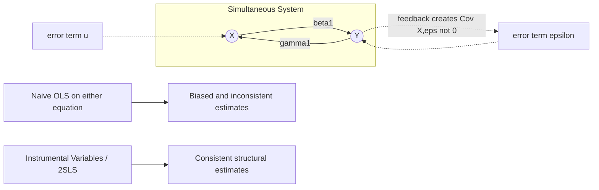

## Simultaneity and Reverse Causality

### Definition

Simultaneity (also called simultaneous equations bias) occurs when the dependent variable $Y$ and one or more explanatory variables $X$ are **jointly and mutually determined** — $X$ influences $Y$, and $Y$ in turn influences $X$, within the same system, typically at the same point in time or over the sample period being analyzed. Reverse causality is the more general term describing the directional component of this problem: the causal arrow runs, at least partly, from the outcome back to the presumed cause.

Formally, in a system:

$$Y = \beta_0 + \beta_1 X + \varepsilon$$

$$X = \gamma_0 + \gamma_1 Y + u$$

Solving this system shows that $X$ depends on $\varepsilon$ (through $Y$), so:

$$\text{Cov}(X, \varepsilon) \neq 0$$

This violates strict exogeneity, and OLS applied to either equation in isolation produces biased, inconsistent estimates of the structural parameters.

### Deriving the Bias: The Classic Supply-and-Demand Case

Consider a market with linear demand and supply:

$$Q_d = \alpha_0 + \alpha_1 P + \varepsilon_d \quad \text{(demand: } \alpha_1 < 0\text{)}$$

$$Q_s = \beta_0 + \beta_1 P + \varepsilon_s \quad \text{(supply: } \beta_1 > 0\text{)}$$

In equilibrium, $Q_d = Q_s = Q$. Solving the system for the **reduced form** of $P$:

$$P = \frac{\beta_0 - \alpha_0}{\alpha_1 - \beta_1} + \frac{\varepsilon_d - \varepsilon_s}{\alpha_1 - \beta_1}$$

Since $P$ is an explicit function of both $\varepsilon_d$ and $\varepsilon_s$, we have $\text{Cov}(P, \varepsilon_d) \neq 0$ and $\text{Cov}(P, \varepsilon_s) \neq 0$. Regressing $Q$ on $P$ using OLS — whether attempting to recover the demand or supply curve — yields a coefficient that is a **mixture of both slopes**, not a consistent estimate of either. This is the identification problem: observed $(P,Q)$ pairs trace out the *intersection points* of shifting curves, not either curve itself.

### Why This Differs from Omitted Variable Bias

| Aspect | Omitted Variable Bias | Simultaneity |
| --- | --- | --- |
| Root cause | Missing confounder correlated with $X$ | $Y$ feeds back into $X$ within the system |
| Fixable by adding a variable? | Yes, if the omitted variable is observable | No — the problem is structural, not a missing regressor |
| Direction of bias | Determined by sign of omitted variable's effects | Generally ambiguous, depends on relative variances of structural errors |
| Typical remedy | Control for confounder | Instrumental variables / structural (simultaneous) equation estimation |

[Inference: In practice these sources often co-occur, and distinguishing them empirically usually relies on institutional or theoretical knowledge about the data-generating process rather than the data alone.]

### Common Real-World Examples

- **Police and crime**: More police presence may reduce crime, but higher crime rates lead cities to hire more police. A cross-sectional regression of crime on police staffing conflates both effects, often producing a counterintuitive positive coefficient.
- **Advertising and sales**: Advertising spend influences sales, but firms often set advertising budgets as a percentage of past or expected sales — creating feedback.
- **Wages and productivity (firm-level)**: Higher wages may induce higher worker effort/productivity (efficiency wage theory), while higher productivity firms can also afford to pay higher wages.
- **Government spending and GDP**: Fiscal stimulus is intended to raise GDP, but spending decisions themselves respond to the state of the economy (countercyclical policy).
- **Health and income**: Higher income can improve health outcomes (better healthcare access), while poor health can reduce earning capacity (reverse pathway).

### Formal Identification: Order and Rank Conditions

For a simultaneous equations model to be estimable, individual structural equations must be **identified**, meaning enough valid exclusion restrictions exist to isolate one equation's parameters from the system.

**Order condition (necessary, not sufficient):**

$$K - k \geq m - 1$$

where $K$ = total exogenous variables in the system, $k$ = exogenous variables included in the given equation, and $m$ = total endogenous variables in that equation.

- If $K - k = m - 1$: the equation is **exactly identified**
- If $K - k > m - 1$: the equation is **overidentified**
- If $K - k < m - 1$: the equation is **underidentified** (not estimable via IV methods)

**Rank condition** (necessary and sufficient): the matrix of coefficients on the variables excluded from the equation in question, but included elsewhere in the system, must have full rank $m - 1$. The order condition alone can be misleading; the rank condition confirms the excluded instruments are not collinear or otherwise degenerate.

### Estimation Approaches

#### 1. Two-Stage Least Squares (2SLS)

For each endogenous regressor, use instruments (exogenous variables excluded from the structural equation but present elsewhere in the system) to isolate exogenous variation:

**Stage 1**: Regress $X$ (endogenous) on all exogenous variables in the system (including instruments $Z$):

$$X = \pi_0 + \pi_1 Z + \pi_2 W + v, \quad \hat{X} = \hat{\pi}_0 + \hat{\pi}_1 Z + \hat{\pi}_2 W$$

**Stage 2**: Regress $Y$ on the fitted values $\hat{X}$:

$$Y = \beta_0 + \beta_1 \hat{X} + \varepsilon$$

Because $\hat{X}$ is a linear combination of exogenous variables only, $\text{Cov}(\hat{X}, \varepsilon) = 0$, restoring consistency.

**Example instrument for the supply-demand system**: a supply shifter uncorrelated with demand shocks (e.g., input cost or weather affecting production) identifies the demand curve, and vice versa for a demand shifter to identify supply.

#### 2. Three-Stage Least Squares (3SLS)

Extends 2SLS by additionally exploiting cross-equation correlation in error terms (via a generalized least squares step, similar to Seemingly Unrelated Regressions), gaining efficiency when structural errors across equations are correlated. [Inference: the efficiency gain is only realized when such cross-equation correlation is actually present and correctly modeled; otherwise 3SLS offers no advantage over equation-by-equation 2SLS.]

#### 3. Limited Information Maximum Likelihood (LIMLE) / Full Information Maximum Likelihood (FIML)

Likelihood-based alternatives to 2SLS/3SLS; FIML estimates all structural equations jointly and is asymptotically efficient if the entire system is correctly specified, but is more sensitive to specification error than 2SLS.

### Detecting Simultaneity: The Hausman Test

$H_0$: $X$ is exogenous (OLS and 2SLS both consistent, OLS more efficient)

$H_1$: $X$ is endogenous (only 2SLS consistent)

**Procedure:**

1. Estimate the reduced form of $X$ on all instruments $Z$ and exogenous controls; save residuals $\hat{v}$
2. Add $\hat{v}$ to the structural equation:

$$Y = \beta_0 + \beta_1 X + \beta_2 \hat{v} + \varepsilon$$

3. A statistically significant $\hat{\beta}_2$ (t-test) rejects $H_0$, indicating $X$ is endogenous and 2SLS/IV estimation should be preferred over OLS.

### System Diagram

### Illustrative Diagram — Feedback Loop Structure (svg_diagram)

<svg xmlns="http://www.w3.org/2000/svg" viewBox="0 0 600 300">
<text x="300" y="24" text-anchor="middle" font-size="16" font-weight="bold" fill="#1a1a1a">Simultaneity Feedback Loop (svg_diagram)</text>
<circle cx="180" cy="160" r="50" fill="#e8f0fe" stroke="#3355aa" stroke-width="2" />
<text x="180" y="166" text-anchor="middle" font-size="18" fill="#1a1a1a">X</text>
<circle cx="420" cy="160" r="50" fill="#fff3e0" stroke="#cc7a00" stroke-width="2" />
<text x="420" y="166" text-anchor="middle" font-size="18" fill="#1a1a1a">Y</text>
<path d="M 230 145 Q 300 110 370 145" fill="none" stroke="#333" stroke-width="2" marker-end="url(#arrow2)" />
<text x="300" y="105" text-anchor="middle" font-size="13" fill="#333">$\beta_1$</text>
<path d="M 370 180 Q 300 220 230 180" fill="none" stroke="#aa3333" stroke-width="2" marker-end="url(#arrow2)" />
<text x="300" y="238" text-anchor="middle" font-size="13" fill="#aa3333">$\gamma_1$ (reverse path)</text>

<text x="180" y="240" text-anchor="middle" font-size="12" fill="#555">Cov(X, ε) ≠ 0</text>

</svg>

**Related Topics**

- Instrumental variable relevance and exclusion restrictions in system contexts
- Order and rank conditions for identification (worked numerical examples)
- Two-Stage Least Squares (2SLS) mechanics and standard error correction
- Three-Stage Least Squares (3SLS) and Seemingly Unrelated Regressions (SUR)
- Vector Autoregression (VAR) as an alternative to structural simultaneous equations for dynamic feedback
- Granger causality testing for temporal precedence in feedback systems
- Full Information Maximum Likelihood (FIML) estimation
- Dynamic panel models (Arellano-Bond) for feedback with lagged endogenous regressors