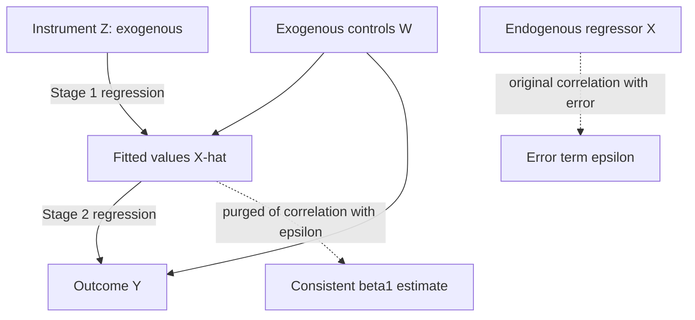

## Instrumental Variables Estimation

### Definition

Instrumental variables (IV) estimation is a method for obtaining consistent parameter estimates when one or more regressors are endogenous — that is, correlated with the error term due to omitted variables, simultaneity, or measurement error. IV exploits an auxiliary variable $Z$, called an **instrument**, that induces exogenous variation in the endogenous regressor without directly affecting the outcome.

Consider the structural equation:

$$Y = \beta_0 + \beta_1 X + \varepsilon, \quad \text{Cov}(X, \varepsilon) \neq 0$$

A valid instrument $Z$ must satisfy two core conditions.

### The Two Core Conditions for Instrument Validity

#### 1. Relevance (Instrument Strength)

$$\text{Cov}(Z, X) \neq 0$$

The instrument must be correlated with the endogenous regressor. This is empirically testable — typically via the first-stage F-statistic.

#### 2. Exclusion Restriction (Exogeneity of the Instrument)

$$\text{Cov}(Z, \varepsilon) = 0$$

The instrument must affect $Y$ **only through** its effect on $X$, with no direct channel to $Y$ and no correlation with any omitted determinant of $Y$. This condition is **not directly testable** in the just-identified case — it must be justified on institutional or theoretical grounds. [Inference: this untestability is the primary source of controversy in applied IV work, since a plausible-looking instrument can still violate exclusion through an unobserved channel.]

### The IV Estimator (Single Instrument, Single Endogenous Regressor)

For the simple bivariate case:

$$\hat{\beta}_1^{IV} = \frac{\text{Cov}(Z, Y)}{\text{Cov}(Z, X)} = \frac{\sum (Z_i - \bar{Z})(Y_i - \bar{Y})}{\sum (Z_i - \bar{Z})(X_i - \bar{X})}$$

This is the **Wald estimator**. Substituting the structural equation shows why it recovers $\beta_1$ consistently:

$$\hat{\beta}_1^{IV} = \beta_1 + \frac{\text{Cov}(Z, \varepsilon)}{\text{Cov}(Z, X)}$$

Since $\text{Cov}(Z, \varepsilon) = 0$ by the exclusion restriction, $\text{plim}(\hat{\beta}_1^{IV}) = \beta_1$.

### Two-Stage Least Squares (2SLS) — The General Case

With multiple instruments or multiple endogenous regressors, 2SLS generalizes the Wald estimator.

**Stage 1** — regress each endogenous regressor on all exogenous variables (included controls $W$ plus excluded instruments $Z$):

$$X = \pi_0 + \pi_1 Z + \pi_2 W + v$$

Obtain fitted values $\hat{X}$. This isolates the portion of variation in $X$ explained by exogenous sources.

**Stage 2** — regress $Y$ on the fitted values and controls:

$$Y = \beta_0 + \beta_1 \hat{X} + \beta_2 W + u$$

Since $\hat{X}$ is a linear function of exogenous variables only, $\text{Cov}(\hat{X}, \varepsilon) = 0$, restoring consistency.

**Matrix form:**

$$\hat{\beta}_{2SLS} = (\hat{X}'\hat{X})^{-1}\hat{X}'Y = [X'Z(Z'Z)^{-1}Z'X]^{-1}X'Z(Z'Z)^{-1}Z'Y$$

**Important practical note**: manually running two separate OLS regressions and using the second-stage output directly produces correct point estimates but **incorrect standard errors** (they fail to account for the estimation uncertainty introduced by $\hat{X}$). Dedicated 2SLS routines (e.g., `ivreg2` in Stata, `IV2SLS` in `linearmodels` for Python) compute the correct asymptotic variance-covariance matrix directly.

### Identification Status

| Condition | Description | Estimable? |
| --- | --- | --- |
| Underidentified | Fewer instruments than endogenous regressors | No |
| Exactly identified | Instruments = endogenous regressors | Yes (point-identified, no overidentification test possible) |
| Overidentified | More instruments than endogenous regressors | Yes (overidentification tests available) |

### Overidentification Testing: Sargan/Hansen J-Test

When overidentified, the validity of the *extra* instruments (beyond the minimum needed) can be partially tested.

$$J = n R^2_{\hat{u}} \sim \chi^2(q)$$

where $\hat{u}$ are 2SLS residuals regressed on all exogenous variables (including instruments), $q$ = number of overidentifying restrictions (excess instruments), and $R^2_{\hat{u}}$ comes from that auxiliary regression. Rejection of $H_0$ (joint validity of instruments) suggests at least one instrument fails the exclusion restriction — though the test cannot identify *which* one, and cannot validate instruments in the exactly-identified case at all.

### Weak Instruments Problem

When $\text{Cov}(Z,X)$ is close to zero, 2SLS estimates become severely biased in finite samples (toward the OLS estimate) and inference becomes unreliable, even though the estimator remains consistent asymptotically.

**Diagnostic — first-stage F-statistic:**

$$F = \frac{(\text{RSS}_r - \text{RSS}_u)/q}{\text{RSS}_u/(n-k)}$$

**Stock-Yogo rule of thumb**: $F < 10$ signals a weak instrument problem requiring caution. [Unverified: this threshold is a widely used heuristic rather than a universally applicable cutoff — the appropriate critical value formally depends on the number of instruments and the researcher's tolerance for relative bias, as derived in the original Stock-Yogo tables.]

**Remedies for weak instruments:**

- Limited Information Maximum Likelihood (LIML) — less biased than 2SLS under weak instruments, though with a fatter-tailed sampling distribution
- Anderson-Rubin test — provides valid inference robust to weak instruments (does not rely on the first-stage F-statistic)
- Jackknife IV (JIVE) — reduces finite-sample bias from many/weak instruments

### Detecting the Need for IV: Durbin-Wu-Hausman Test

$H_0$: $X$ is exogenous (OLS and IV both consistent; OLS more efficient)

$H_1$: $X$ is endogenous (only IV consistent)

**Procedure:**

1. Estimate first-stage regression of $X$ on instruments and controls, save residuals $\hat{v}$
2. Include $\hat{v}$ in the structural equation and test its significance:

$$Y = \beta_0 + \beta_1 X + \beta_2 \hat{v} + \varepsilon$$

A significant $\hat{\beta}_2$ rejects $H_0$, favoring IV over OLS.

### Worked Example

**Research question**: Does years of schooling ($X$) causally affect log wages ($Y$)?

**Endogeneity concern**: unobserved ability affects both schooling and wages (omitted variable bias), biasing OLS.

**Classic instrument (Angrist & Krueger, 1991)**: quarter of birth ($Z$), exploiting compulsory schooling laws that create variation in years of schooling based on birth timing relative to school entry cutoffs, independent of ability.

- **Relevance**: quarter of birth is correlated with completed schooling due to compulsory attendance laws — but the correlation is weak, making this a canonical weak-instrument case in the applied econometrics literature
- **Exclusion**: quarter of birth plausibly affects wages *only* through its effect on schooling, not through any direct channel — [Speculation: this has been disputed on grounds that birth timing may correlate with other factors like age-at-school-entry effects on cognitive development]

**Stage 1**: $\text{Schooling}_i = \pi_0 + \pi_1 (\text{Quarter of Birth})_i + v_i$

**Stage 2**: $\log(\text{Wage})_i = \beta_0 + \beta_1 \widehat{\text{Schooling}}_i + u_i$

### Diagrammatic Summary of the 2SLS Mechanism

### Illustrative Diagram — Valid vs Invalid Instrument Paths (svg_diagram)

<svg xmlns="http://www.w3.org/2000/svg" viewBox="0 0 640 320">
<text x="320" y="24" text-anchor="middle" font-size="16" font-weight="bold" fill="#1a1a1a">Valid vs Invalid Instrument Paths (svg_diagram)</text>

<text x="160" y="55" text-anchor="middle" font-size="14" font-weight="bold" fill="`#2a7a2a`">Valid Instrument</text>

<circle cx="80" cy="120" r="38" fill="`#e8f8e8`" stroke="`#2a7a2a`" stroke-width="2" />

<text x="80" y="125" text-anchor="middle" font-size="15">Z</text>

<circle cx="240" cy="120" r="38" fill="`#e8f0fe`" stroke="`#3355aa`" stroke-width="2" />

<text x="240" y="125" text-anchor="middle" font-size="15">X</text>

<circle cx="400" cy="120" r="38" fill="`#fff3e0`" stroke="`#cc7a00`" stroke-width="2" />

<text x="400" y="125" text-anchor="middle" font-size="15">Y</text>

<line x1="118" y1="120" x2="202" y2="120" stroke="`#2a7a2a`" stroke-width="2" marker-end="url(#arrowg)" />

<line x1="278" y1="120" x2="362" y2="120" stroke="#333" stroke-width="2" marker-end="url(#arrowg)" />

<line x1="80" y1="158" x2="400" y2="158" stroke="`#cc3333`" stroke-width="2" stroke-dasharray="6,4" />

<text x="240" y="178" text-anchor="middle" font-size="11" fill="`#cc3333`">no direct path (excluded)</text>

<text x="560" y="55" text-anchor="middle" font-size="14" font-weight="bold" fill="`#aa3333`">Invalid Instrument</text>

<circle cx="480" cy="240" r="36" fill="`#fde8e8`" stroke="`#aa3333`" stroke-width="2" />

<text x="480" y="245" text-anchor="middle" font-size="14">Z</text>

<circle cx="580" cy="180" r="36" fill="`#e8f0fe`" stroke="`#3355aa`" stroke-width="2" />

<text x="580" y="185" text-anchor="middle" font-size="14">X</text>

<line x1="510" y1="225" x2="555" y2="195" stroke="#333" stroke-width="2" marker-end="url(#arrowg)" />

</svg>

### Common Applied Instrument Categories

- **Natural/legal thresholds**: birth timing and compulsory schooling laws, eligibility cutoffs
- **Geographic/historical variation**: distance to resources, historical settlement patterns
- **Policy-induced variation**: draft lottery numbers (labor market outcomes), judge assignment (sentencing effects)
- **Weather/environmental shocks**: rainfall as an instrument for agricultural income
- **Lagged values**: in dynamic panel contexts (Arellano-Bond GMM), though validity requires no serial correlation in errors

### Related but Distinct Estimators

- **GMM (Generalized Method of Moments)**: generalizes IV/2SLS, efficient under heteroskedasticity via optimal weighting matrix
- **LIML**: alternative to 2SLS, more robust under weak instruments
- **Control function approach**: algebraically equivalent to 2SLS in linear models, but generalizes more naturally to nonlinear models (e.g., probit/logit with endogenous regressors)

**Related Topics**

- Weak instrument diagnostics and the Stock-Yogo critical values in depth
- Control function approach for nonlinear endogenous regressor models
- GMM estimation and the optimal weighting matrix
- Local Average Treatment Effect (LATE) interpretation of IV under heterogeneous treatment effects
- Judge/examiner fixed-effects designs as a modern instrument class
- Difference-in-differences and regression discontinuity as alternatives when valid instruments are unavailable
- Testing and correcting for weak-instrument bias with LIML and Anderson-Rubin confidence sets
- Arellano-Bond GMM for dynamic panel data with endogenous lagged regressors