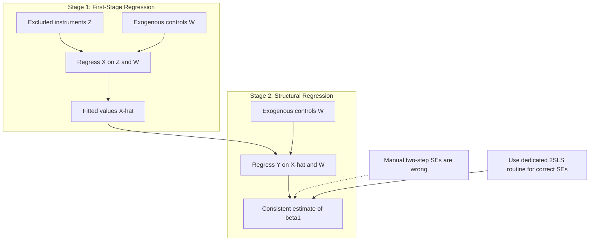

## Two-Stage Least Squares

### Definition

Two-Stage Least Squares (2SLS) is the standard estimation procedure for instrumental variables models with one or more endogenous regressors and one or more instruments. It produces consistent estimates of structural parameters by replacing endogenous regressors with their predicted values from a first-stage regression on all exogenous variables, then estimating the structural equation using those predicted values in place of the originals.

### The Two Stages Formally

**Structural equation** (equation of interest):

$$Y = \beta_0 + \beta_1 X + \beta_2 W + \varepsilon$$

where $X$ is endogenous ($\text{Cov}(X,\varepsilon) \neq 0$) and $W$ is a vector of exogenous controls.

**Stage 1 — First-stage (reduced-form) regression:**

$$X = \pi_0 + \pi_1 Z + \pi_2 W + v$$

Regress the endogenous variable $X$ on **all** exogenous variables in the system: the excluded instrument(s) $Z$ and the included exogenous controls $W$. Obtain fitted values:

$$\hat{X} = \hat{\pi}_0 + \hat{\pi}_1 Z + \hat{\pi}_2 W$$

$\hat{X}$ represents the portion of variation in $X$ that is explained purely by exogenous sources — the "clean" variation.

**Stage 2 — Second-stage (structural) regression:**

$$Y = \beta_0 + \beta_1 \hat{X} + \beta_2 W + u$$

Replace $X$ with $\hat{X}$ and estimate by OLS. Because $\hat{X}$ is a linear function of exogenous variables only:

$$\text{Cov}(\hat{X}, \varepsilon) = 0$$

so $\hat{\beta}_1$ is consistent for the structural parameter $\beta_1$.

### Matrix Formulation

Let $X$ denote the full regressor matrix (endogenous + exogenous controls) and $Z$ the full instrument matrix (excluded instruments + exogenous controls). The 2SLS estimator is:

$$\hat{\beta}_{2SLS} = \left[X'Z(Z'Z)^{-1}Z'X\right]^{-1}X'Z(Z'Z)^{-1}Z'Y$$

Equivalently, defining the projection matrix $P_Z = Z(Z'Z)^{-1}Z'$:

$$\hat{\beta}_{2SLS} = (X'P_Z X)^{-1}X'P_Z Y = (\hat{X}'\hat{X})^{-1}\hat{X}'Y$$

where $\hat{X} = P_Z X$. This confirms the two-step intuition: $P_Z X$ is exactly the fitted-value projection performed in Stage 1.

### Critical Standard Error Warning

Manually running two separate OLS regressions ("by hand" 2SLS) and reading standard errors off the second-stage output produces **correct point estimates but incorrect standard errors**. The second-stage OLS routine treats $\hat{X}$ as if it were observed with certainty, ignoring the sampling variability introduced by estimating $\hat{\pi}$ in Stage 1. This understates the true standard errors.

**Correct approach**: use a dedicated 2SLS/IV routine that computes the proper asymptotic variance-covariance matrix in one step:

$$\widehat{\text{Var}}(\hat{\beta}_{2SLS}) = \hat{\sigma}^2 (X'P_Z X)^{-1}$$

with $\hat{\sigma}^2$ computed from **structural residuals** ($Y - X\hat{\beta}_{2SLS}$, using the *original* $X$, not $\hat{X}$).

**Software implementations:**

- Stata: `ivregress 2sls` or `ivreg2` (community-contributed, includes weak-instrument and overidentification diagnostics)
- R: `ivreg()` from the `AER` package, or `feols(..., instruments)` from `fixest`
- Python: `IV2SLS` from the `linearmodels` package

### Assumptions Required for Consistency

| Assumption | Statement | Consequence if violated |
| --- | --- | --- |
| Instrument relevance | $\text{Cov}(Z, X) \neq 0$ | Underidentification / weak instrument bias |
| Exclusion restriction | $\text{Cov}(Z, \varepsilon) = 0$ | Estimator inconsistent, same as OLS problem it was meant to fix |
| Rank condition | Instrument coefficient matrix has full rank | Non-identification in multi-equation systems |
| Homoskedasticity (for classical 2SLS efficiency) | $\text{Var}(\varepsilon \mid Z, W)$ constant | Standard 2SLS SEs incorrect (though still consistent); use robust SEs |

### Efficiency Considerations

2SLS is consistent but not necessarily efficient among IV-type estimators when instruments are overidentified and errors are heteroskedastic. **Generalized Method of Moments (GMM)** with an optimal weighting matrix is asymptotically at least as efficient as 2SLS in that setting, since 2SLS is a special case of GMM under a specific (non-optimal, under heteroskedasticity) weighting choice.

### Identification and Degrees of Freedom

| Case | Condition | Implication |
| --- | --- | --- |
| Exactly identified | # instruments = # endogenous regressors | 2SLS = simple IV (Wald) estimator; no overidentification test possible |
| Overidentified | # instruments > # endogenous regressors | Overidentifying restrictions testable (Sargan/Hansen J-test) |
| Underidentified | # instruments < # endogenous regressors | Not estimable |

### Overidentification Test (Sargan/Hansen J-Test)

$$J = n \cdot R^2_{\hat{u}} \sim \chi^2(q)$$

Regress the 2SLS residuals $\hat{u}$ on all exogenous variables (instruments and controls); $q$ is the number of overidentifying restrictions. Rejecting $H_0$ suggests at least one instrument is invalid, though the test cannot identify which specific instrument fails, and provides no information in the exactly-identified case.

### Weak Instrument Diagnostics

The first-stage F-statistic (testing joint significance of excluded instruments in Stage 1) is the standard diagnostic:

$$F = \frac{(\text{RSS}_{\text{restricted}} - \text{RSS}_{\text{unrestricted}})/q}{\text{RSS}_{\text{unrestricted}}/(n-k)}$$

**Rule of thumb**: $F < 10$ signals weak instruments, causing finite-sample bias toward the OLS estimate and unreliable standard inference (t-tests, confidence intervals), even though 2SLS remains consistent asymptotically. [Unverified: the precise critical F-value depends on the number of instruments and acceptable bias tolerance per Stock-Yogo tables — the "10" threshold is a widely used simplification, not a universal cutoff.]

**Remedies**:

- Limited Information Maximum Likelihood (LIML) — median-unbiased under weak instruments in the just-identified case, though with heavier-tailed sampling distribution
- Anderson-Rubin confidence sets — valid inference robust to weak instruments
- Adding stronger instruments if theoretically justified

### Worked Numerical Example

**Setting**: Estimating the effect of class size ($X$) on standardized test scores ($Y$), where class size is endogenous (e.g., schools may assign smaller classes to struggling students — reverse causality/selection).

**Instrument**: A funding-formula discontinuity ($Z$) that mechanically forces smaller class sizes above certain enrollment thresholds (e.g., Angrist & Lavy's Maimonides' Rule design), unrelated to student ability.

**Stage 1**: $\text{ClassSize}_i = \pi_0 + \pi_1 (\text{PredictedClassSize from rule})_i + \pi_2 W_i + v_i$

Obtain $\widehat{\text{ClassSize}}_i$.

**Stage 2**: $\text{TestScore}_i = \beta_0 + \beta_1 \widehat{\text{ClassSize}}_i + \beta_2 W_i + u_i$

$\hat{\beta}_1$ is interpreted as the causal effect of class size on test scores, purged of the endogenous sorting that would bias a naive OLS regression of test scores on class size.

### Extension: Multiple Endogenous Regressors

With $m$ endogenous regressors, Stage 1 requires a **separate first-stage regression for each** endogenous variable, each regressed on the full set of instruments and exogenous controls:

$$X_1 = \pi_{10} + \pi_{11}Z_1 + \pi_{12}Z_2 + \pi_{13}W + v_1$$

$$X_2 = \pi_{20} + \pi_{21}Z_1 + \pi_{22}Z_2 + \pi_{23}W + v_2$$

The order condition requires at least as many excluded instruments as endogenous regressors ($q \geq m$), and the rank condition must hold jointly across the system for identification.

### Mechanism Diagram

### Illustrative Diagram — Projection Interpretation of 2SLS (svg_diagram)

<svg xmlns="http://www.w3.org/2000/svg" viewBox="0 0 620 300">
<text x="310" y="24" text-anchor="middle" font-size="16" font-weight="bold" fill="#1a1a1a">2SLS as Projection onto Instrument Space (svg_diagram)</text>
<ellipse cx="310" cy="180" rx="260" ry="90" fill="#eef4ff" stroke="#3355aa" stroke-width="2" />
<text x="310" y="100" text-anchor="middle" font-size="13" fill="#3355aa">Column space of Z (instruments + controls)</text>
<line x1="80" y1="230" x2="540" y2="230" stroke="#333" stroke-width="1.5" />
<circle cx="150" cy="90" r="6" fill="#aa3333" />
<text x="150" y="75" text-anchor="middle" font-size="12" fill="#aa3333">X (endogenous, outside span)</text>
<circle cx="290" cy="200" r="6" fill="#2a7a2a" />
<text x="290" y="220" text-anchor="middle" font-size="12" fill="#2a7a2a">X-hat = P_Z X (projection)</text>
<line x1="150" y1="90" x2="290" y2="200" stroke="#aa3333" stroke-width="2" stroke-dasharray="5,4" marker-end="url(#arrow3)" />
<text x="200" y="140" text-anchor="middle" font-size="11" fill="#aa3333">orthogonal residual v</text>
</svg>

### Common Practical Pitfalls

- **Including invalid "instruments"** that are actually correlated with $\varepsilon$, which biases 2SLS just as OLS was biased, but now hidden behind a seemingly rigorous procedure
- **Weak instrument bias masquerading as a small standard error** — weak instruments tend to produce estimates close to OLS with deceptively tight-looking confidence intervals in some finite samples
- **Manual two-stage OLS instead of a proper IV routine**, yielding incorrect inference
- **Forbidden regression fallacy**: manually computing 2SLS via separate OLS steps in nonlinear models (e.g., first-stage OLS then second-stage probit) does not generally produce consistent estimates the way it does in the linear case — nonlinear settings typically require a control function approach instead

**Related Topics**

- Control function approach as an alternative to 2SLS for nonlinear models
- GMM estimation and its relationship to 2SLS as a special case
- LIML and weak-instrument-robust estimation
- Local Average Treatment Effect (LATE) interpretation under heterogeneous treatment effects
- Overidentification testing in depth (Sargan vs. Hansen J-test under heteroskedasticity)
- Judge/examiner design instruments and modern quasi-random instrument construction
- Dynamic panel GMM (Arellano-Bond, Blundell-Bond) as an extension of IV logic to lagged endogenous regressors