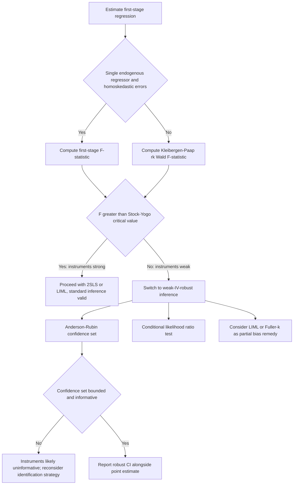

## Weak Instrument Diagnostics

### Overview

Weak instrument diagnostics refers to the set of statistical tools used to detect situations where instrumental variables (IVs) are only weakly correlated with the endogenous regressor(s) they are meant to instrument for. When instruments are weak, standard asymptotic theory for two-stage least squares (2SLS) and related estimators breaks down, leading to biased point estimates, incorrect standard errors, and unreliable hypothesis tests, even in large samples.

### The Weak Instrument Problem

In the standard IV setup with a single endogenous regressor $x$, instrument(s) $z$, and exogenous controls $w$, the first-stage regression is:

$$x_i = \pi_0 + \pi_1 z_i + \gamma' w_i + v_i$$

The instrument is "weak" when $\pi_1$ is close to zero relative to its sampling variability, i.e., the instrument explains little variation in $x$ after partialling out $w$.

**Consequences of weak instruments:**

- **Bias amplification**: 2SLS bias toward the OLS (biased) estimate grows as instrument strength falls, even asymptotically. In the just-identified case, 2SLS is exactly as biased as OLS in the limit as $\pi_1 \to 0$.
- **Non-normal sampling distributions**: The finite-sample and even asymptotic distribution of the 2SLS estimator is non-normal and often bimodal under weak identification, invalidating standard $t$-tests and confidence intervals.
- **Size distortions**: Nominal 5% tests can have true rejection rates far higher (sometimes 20–50%+), because standard errors are systematically too small.
- **Weak instrument asymptotics**: Formal theory (Staiger and Stock, 1997) models $\pi_1 = C/\sqrt{n}$ shrinking with sample size, showing that standard first-order asymptotics (consistency, asymptotic normality) do not apply in this local-to-zero framework.

### Diagnostic 1: First-Stage F-Statistic

The most widely used diagnostic is the F-statistic from the first-stage regression testing $H_0: \pi_1 = 0$ (or the joint significance of all excluded instruments in the over-identified case).

**Procedure:**

1. Estimate the first-stage regression of $x$ on $z$ and $w$.
2. Compute the F-statistic for the excluded instrument(s) $z$.
3. Compare against benchmark thresholds.

**Staiger-Stock rule of thumb**: An F-statistic below 10 is traditionally treated as indicating a weak instrument problem, particularly in the single-endogenous-regressor, homoskedastic case.

[Inference] The "F > 10" threshold is a widely cited rule of thumb but is not a formal statistical test with a fixed rejection region; it originates from simulation evidence in Staiger and Stock (1997) about the bias of 2SLS relative to OLS under specific calibrations, and its applicability degrades with heteroskedasticity, clustering, or multiple endogenous regressors.

**Limitations of the F-test approach:**

- The classical F > 10 rule assumes homoskedastic, non-clustered errors and a single endogenous regressor. Under heteroskedasticity or clustering, the conventional F-statistic is not a reliable guide, and robust or clustering-adjusted first-stage F-statistics can behave very differently.
- With multiple endogenous regressors, a single first-stage F per equation is insufficient; joint weak identification across equations requires multivariate diagnostics (see Diagnostic 2).
- The F-statistic says nothing about how weak identification affects downstream inference on the coefficient of interest — it only screens for a symptom.

### Diagnostic 2: Cragg-Donald and Kleibergen-Paap Statistics

**Cragg-Donald Wald F-statistic**: Generalizes the first-stage F to settings with multiple endogenous regressors. It is the minimum eigenvalue of a matrix analog of the first-stage F-statistic, computed under the assumption of i.i.d. errors.

$$CD = \text{minimum eigenvalue of } \hat{\Sigma}_{VV}^{-1/2} \hat{\Pi}' Z' Z \hat{\Pi} \hat{\Sigma}_{VV}^{-1/2} \, / \, K$$

where $\hat{\Pi}$ collects the first-stage coefficients across all endogenous regressors, $\hat{\Sigma}_{VV}$ is the first-stage residual covariance matrix, and $K$ is the number of excluded instruments (informal representation; exact matrix construction varies by source).

**Kleibergen-Paap rk Wald F-statistic**: The robust analog of the Cragg-Donald statistic, valid under heteroskedasticity, autocorrelation, and clustering. This is the standard diagnostic reported in modern applied work (e.g., via `ivreg2` in Stata or `ivmodel`/`fixest` in R) whenever robust or clustered standard errors are used.

**Practical guidance:**

- Always report the Kleibergen-Paap F-statistic (not Cragg-Donald) when using heteroskedasticity-robust or cluster-robust standard errors, since Cragg-Donald assumes homoskedasticity and can be misleading otherwise.
- With multiple endogenous regressors, weak identification can occur even when each individual first-stage F-statistic looks acceptable, because the excluded instruments may not jointly identify all endogenous regressors' distinct sources of variation. The Cragg-Donald/Kleibergen-Paap statistics are designed to catch this.

### Diagnostic 3: Stock-Yogo Critical Values

Because the "F > 10" threshold is only a rule of thumb, Stock and Yogo (2005) derived formal critical values calibrated to two specific inferential goals:

1. **Maximal bias criterion**: Critical values such that the bias of 2SLS relative to OLS does not exceed a chosen fraction (e.g., 10%) of the OLS bias.
2. **Maximal size criterion**: Critical values such that a nominal 5% Wald test does not have a true rejection rate exceeding a chosen threshold (e.g., 10% or 15%).

These critical values depend on the number of instruments and the number of endogenous regressors, and are typically looked up from tabulated values (e.g., in Stock and Yogo's original paper or reproduced in econometrics software output) rather than computed analytically.

[Inference] Stock-Yogo critical values are strictly valid only under i.i.d. errors and for 2SLS/LIML in the linear IV model; extensions to GMM, robust/clustered errors, and nonlinear IV settings are approximate and less standardized in practice.

### Diagnostic 4: Anderson-Rubin Test and Weak-Instrument-Robust Inference

Rather than only diagnosing weakness, an alternative strategy is to use inference methods that remain valid regardless of instrument strength.

**Anderson-Rubin (AR) test**: Tests $H_0: \beta = \beta_0$ by testing whether the residuals $y - \beta_0 x$ are uncorrelated with the instruments $z$, using an F-test (or chi-squared test) in the regression of $y - \beta_0 x$ on $z$ and $w$.

$$AR(\beta_0) = \frac{(y - \beta_0 x)' P_Z (y - \beta_0 x) / K}{(y - \beta_0 x)' M_Z (y - \beta_0 x) / (n - K - \dim(w))}$$

where $P_Z$ is the projection matrix onto $[z, w]$, $M_Z = I - P_Z$, and $K$ is the number of excluded instruments.

**Key property**: The AR test's asymptotic distribution does not depend on instrument strength, so confidence sets constructed by inverting the AR test (collecting all $\beta_0$ not rejected) have correct coverage even under weak or fully irrelevant instruments.

**Trade-offs:**

- AR confidence sets can be unbounded (or even the entire real line) when instruments are very weak — this is a feature, not a bug, since it correctly signals that the data are uninformative about $\beta$.
- AR loses power relative to 2SLS-based Wald tests when instruments are actually strong and over-identifying restrictions hold, and power degrades further as the number of instruments grows relative to the informative content of the model.
- Related robust procedures include the **Kleibergen (K) test / Lagrange multiplier variant** and the **conditional likelihood ratio (CLR) test** (Moreira, 2003), which improve power over AR while retaining robustness to weak instruments.

### Diagnostic 5: LIML as a Partial Remedy

Limited Information Maximum Likelihood (LIML) is sometimes preferred over 2SLS under weak identification because its bias properties are generally more favorable in over-identified models, though it is not immune to weak-instrument problems.

**Comparison:**

| Property | 2SLS | LIML |
| --- | --- | --- |
| Bias under weak IV (over-identified) | Larger, biased toward OLS | Smaller median bias |
| Behavior when exactly identified | Numerically identical to LIML | Numerically identical to 2SLS |
| Distributional robustness | Poor under weak IV | Better, but still non-normal under weak IV |
| Standard error validity | Unreliable under weak IV | Still unreliable under weak IV |

[Inference] LIML's superior bias properties are an asymptotic and simulation-based result under specific error structures (Fuller, 1977; Stock, Wright, and Yogo, 2002); it does not restore standard-error validity or guarantee good finite-sample performance in every application, and Fuller's modified LIML (Fuller-k) is often preferred in practice for further bias reduction.

### Worked Example

Suppose a researcher estimates the effect of years of schooling ($x$) on log wages ($y$), instrumenting schooling with quarter-of-birth dummies ($z$), controlling for year and state-of-birth fixed effects ($w$) — a design resembling Angrist and Krueger (1991).

**Step 1 — First stage:**

$$\text{schooling}_i = \pi_0 + \pi_1 (\text{QOB1}_i) + \pi_2 (\text{QOB2}_i) + \pi_3(\text{QOB3}_i) + \gamma' w_i + v_i$$

**Step 2 — Compute the F-statistic** on $H_0: \pi_1 = \pi_2 = \pi_3 = 0$.

**Step 3 — Evaluate:**

- If $F \approx 30$, and errors are homoskedastic → instruments are likely strong enough by the Staiger-Stock rule of thumb; proceed with standard 2SLS inference, ideally cross-checked with Stock-Yogo critical values for the relevant bias/size tolerance.
- If $F \approx 2$–$3$ (as some re-analyses of quarter-of-birth instruments have found when interacted with many state/year controls), this signals weak instruments. [Unverified] The specific numerical F-statistic in any given specification depends on sample, control set, and time period, and should be computed directly rather than assumed.

**Step 4 — Robust remedy:** Report Anderson-Rubin confidence intervals for the returns-to-schooling coefficient alongside (or instead of) the standard 2SLS confidence interval, and note if the AR interval is much wider or unbounded — this would confirm that the point estimate from 2SLS is not reliably identified.

### Decision Workflow (Diagram)

### Software Implementation Notes

- **Stata**: `ivreg2` reports Kleibergen-Paap rk Wald F-statistic automatically with robust/cluster options; `weakiv` computes Anderson-Rubin and conditional likelihood ratio confidence sets.
- **R**: The `ivmodel` package computes AR tests, Kleibergen tests, and CLR confidence sets; `fixest::feols` with `iv` syntax reports first-stage F-statistics; `AER::ivreg` provides basic 2SLS with diagnostic summaries via `summary(..., diagnostics = TRUE)`.
- **Python**: `linearmodels.iv.IV2SLS` reports first-stage diagnostics including partial F-statistics; robust weak-IV inference (AR, CLR) has less mature native support and often requires manual implementation or interfacing with R.

[Inference] Exact function names, default options, and output formatting are version-dependent and may change between package releases; consult current documentation before relying on specific syntax.

### Common Pitfalls

- **Reporting only the non-robust F-statistic** when using heteroskedasticity-robust or clustered standard errors elsewhere in the analysis — this is an internal inconsistency, since the diagnostic and the inference should share the same error assumptions.
- **Treating F > 10 as a guarantee of validity** rather than a rough screening heuristic; it does not certify that 2SLS bias or size distortion is acceptably small for the specific application.
- **Ignoring weak identification with multiple endogenous regressors** by checking only individual first-stage F-statistics rather than the joint Cragg-Donald/Kleibergen-Paap statistic.
- **Using many weak instruments** (e.g., numerous interaction terms as excluded instruments) to try to "boost" the F-statistic, which can paradoxically increase bias (many-instruments bias) even as the naive F-statistic rises.

**Related Topics**

- Many-instrument and many-weak-instruments asymptotics (Bekker, 1994; Chao and Swanson)
- Anderson-Rubin and conditional likelihood ratio test construction in detail
- LIML and Fuller-k estimation mechanics
- Over-identification tests (Sargan/Hansen J-test) and their interaction with weak identification
- Local average treatment effects (LATE) and instrument monotonicity
- Heteroskedasticity-robust and cluster-robust IV inference
- GMM estimation under weak identification