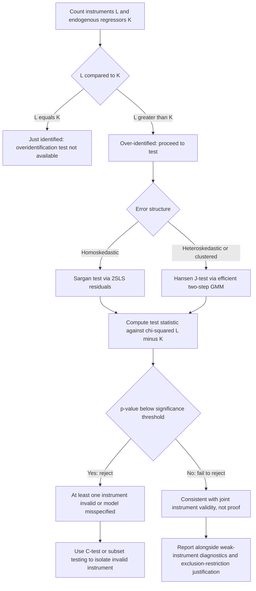

## Overidentification Testing

### Overview

Overidentification testing refers to a class of specification tests applied when the number of instruments exceeds the number of endogenous regressors, providing more moment conditions than are strictly necessary for identification. These tests assess whether the "extra" instruments are valid — i.e., whether they are uncorrelated with the structural error term — by checking whether the different instruments produce mutually consistent estimates.

### Identification Terminology

In an IV model with $L$ instruments and $K$ endogenous regressors:

- **Under-identified**: $L < K$ — the model cannot be estimated.
- **Just-identified (exactly identified)**: $L = K$ — a unique IV estimator exists, and overidentification tests are not available (there are no surplus moment conditions to test).
- **Over-identified**: $L > K$ — there are $L - K$ overidentifying restrictions, which can be tested.

**Critical caveat**: Overidentification tests only detect whether the *surplus* instruments are inconsistent with each other and with the maintained model; they cannot test the validity of instruments in a just-identified model, and they cannot prove that all instruments are valid even in the over-identified case — only that the over-identifying restrictions are not statistically rejected.

### Intuition

If a model is over-identified, each subset of instruments large enough to achieve exact identification generates its own IV estimate of the structural coefficients. If all instruments are valid (uncorrelated with the error term) and the model is correctly specified, these different estimates should be similar up to sampling variation. Overidentification tests formalize this by checking whether the residuals from the 2SLS/IV fit are correlated with the instruments — if a valid instrument set is used, the fitted residuals should be (asymptotically) orthogonal to all instruments, not just the ones needed for identification.

### Sargan Test

**Setup**: Applies to 2SLS estimation under the assumption of homoskedastic errors.

**Procedure:**

1. Estimate the structural equation by 2SLS, obtaining residuals $\hat{u}_i = y_i - \hat{\beta}' x_i$.
2. Regress $\hat{u}_i$ on the full set of instruments $z_i$ (all exogenous variables, included and excluded).
3. Compute $n R^2$ from this auxiliary regression.

**Test statistic:**

$$S = n R^2_{\hat{u} \text{ on } z} \sim \chi^2(L - K)$$

under the null hypothesis that all instruments are valid (uncorrelated with the error term), where $L - K$ is the degree of overidentification.

**Limitation**: The Sargan test is only valid under homoskedasticity. Under heteroskedasticity or clustering, the test's asymptotic $\chi^2$ distribution does not hold, and the test can be severely oversized or undersized.

### Hansen J-Test (GMM Overidentification Test)

**Setup**: The generalization of the Sargan test to the GMM framework, valid under heteroskedasticity and (with appropriate clustering) within-cluster correlation.

**Procedure:**

1. Estimate the model via two-step efficient GMM, using an estimated optimal weighting matrix $\hat{W} = \hat{S}^{-1}$, where $\hat{S}$ is a (heteroskedasticity- or cluster-) robust estimate of the variance of the moment conditions.
2. Form the GMM objective function at the efficient estimator $\hat{\beta}_{GMM}$:

$$J = n \, \bar{g}(\hat{\beta}_{GMM})' \hat{S}^{-1} \bar{g}(\hat{\beta}_{GMM})$$

where $\bar{g}(\beta) = \frac{1}{n}\sum_i z_i (y_i - x_i'\beta)$ is the sample average of the moment conditions.

**Distribution:**

$$J \sim \chi^2(L - K)$$

under the null that all overidentifying restrictions hold (all instruments are valid), asymptotically, when $\hat{\beta}$ is the efficient two-step GMM estimator using the same weighting matrix used to construct $J$.

**Key requirement**: The J-statistic is only asymptotically $\chi^2$ when computed using the *efficient* GMM estimator with a correctly specified robust weighting matrix. Using J with 2SLS-estimated coefficients and a non-optimal weighting matrix (a common but technically inconsistent practice) is sometimes still reported in software, but strictly speaking this is a variant of the Sargan test's logic and its exact finite-sample properties depend on the weighting scheme used.

[Inference] Practitioners sometimes label the two-step GMM-based overidentification statistic reported by software as "Sargan-Hansen" or use the terms "Sargan" and "Hansen J" loosely interchangeably; the precise validity conditions (efficient GMM estimator, correctly specified robust $\hat{S}$) should be checked against the specific software's documentation rather than assumed from naming alone.

### Comparison: Sargan vs. Hansen J

| Property | Sargan Test | Hansen J-Test |
| --- | --- | --- |
| Estimator required | 2SLS | Efficient two-step GMM |
| Error assumption | Homoskedastic | Robust to heteroskedasticity/clustering (with appropriate $\hat{S}$) |
| Distribution | $\chi^2(L-K)$ | $\chi^2(L-K)$ |
| Sensitivity | Can reject due to heteroskedasticity even when instruments are valid | Designed to be robust to the error structure used in $\hat{S}$ |
| Common software | Reported by default in many IV routines | `ivreg2`, `gmm` in Stata; `gmm` package in R |

### Interpreting the Test

**Null hypothesis**: All instruments are valid (jointly, the overidentifying restrictions hold).

**Failing to reject** ($p > 0.05$, conventionally): Consistent with instrument validity, but this is *not proof* of validity — it only means the data do not provide strong evidence against the joint restriction. A test with low power (e.g., few effective observations, weak instruments) may fail to reject even when instruments are invalid.

**Rejecting** ($p < 0.05$): Indicates that at least one instrument is likely invalid, or that the structural model itself is misspecified (e.g., wrong functional form, omitted interactions, or heterogeneous treatment effects that violate the overidentifying restriction even if all instruments individually satisfy exclusion). The test cannot identify *which* instrument is at fault without further investigation (e.g., testing subsets of instruments, or a C-test / GMM distance test).

**Difference-in-Sargan / C-test (incremental overidentification test)**: To identify which subset of instruments may be invalid, researchers can compare the J-statistic from the full instrument set against the J-statistic from a restricted subset assumed valid; the difference is asymptotically $\chi^2$ with degrees of freedom equal to the number of instruments dropped. This is sometimes called the C-statistic or GMM distance test.

### Worked Example

Consider estimating the returns to education using two instruments: proximity to college ($z_1$) and quarter of birth ($z_2$), for a single endogenous regressor (years of schooling).

**Step 1**: Since $L = 2 > K = 1$, the model is over-identified with 1 degree of overidentification.

**Step 2 (Sargan/Hansen)**: Estimate via 2SLS or GMM, obtain residuals, regress on $\{z_1, z_2, w\}$ (full instrument and control set), and compute the test statistic.

**Step 3**: Suppose the resulting Hansen J-statistic is $J = 0.85$ with 1 degree of freedom, giving $p \approx 0.36$. This fails to reject the null — the data are consistent with both proximity-to-college and quarter-of-birth being valid instruments (conditional on the maintained exclusion restrictions and functional form).

**Step 4 (caveat)**: [Inference] A non-rejection here does not rule out the possibility that both instruments share a common correlation with unobserved ability or family background that biases both in the same direction — a scenario the overidentification test has no power to detect, since the test only checks mutual consistency among instruments, not consistency with the true causal effect.

### Diagram: Overidentification Testing Logic

### Software Implementation Notes

- **Stata**: `ivreg2` reports the Hansen J-statistic automatically when using GMM estimation (`gmm2s` option) and the Sargan statistic under standard 2SLS; `estat overid` after `ivregress` provides the Sargan/Basmann test.
- **R**: `AER::ivreg` combined with `summary(..., diagnostics = TRUE)` reports the Sargan test; the `gmm` package reports the J-statistic directly from GMM output; `ivmodel` provides additional overidentification diagnostics.
- **Python**: `linearmodels.iv.IVGMM` reports the J-statistic as part of its summary output for overidentified GMM models.

[Inference] Exact option names, default reporting behavior, and which variant (Sargan vs. Hansen J vs. Basmann) is reported by default vary across software versions; consult current package documentation before relying on specific syntax or defaults.

### Common Pitfalls

- **Treating a non-rejection as confirmation of instrument validity** — the test lacks power against many forms of invalidity, especially when instruments are weak or share a common confound.
- **Applying the Sargan test with robust/clustered standard errors elsewhere in the analysis** without switching to the Hansen J-test, creating an inconsistency between the estimation and testing frameworks.
- **Interpreting a rejection as identifying a specific bad instrument** without follow-up subset (C-test) analysis — the aggregate test statistic alone does not localize the problem.
- **Ignoring weak identification when interpreting overidentification tests** — under weak instruments, both the power and size of overidentification tests can be distorted, so weak-instrument diagnostics should generally be checked jointly with (and ideally before) overidentification tests.
- **Assuming the test validates the exclusion restriction economically** — the test is a purely statistical check of moment consistency, not a substitute for a theoretical or institutional argument for why an instrument affects the outcome only through the endogenous regressor.

**Related Topics**

- Weak instrument diagnostics and their interaction with overidentification test power
- GMM estimation: one-step vs. two-step efficient GMM
- C-test / difference-in-Sargan test for isolating invalid instrument subsets
- Exclusion restriction and instrument exogeneity: theoretical justification
- Control function approaches as an alternative to standard IV
- Local average treatment effects (LATE) under instrument heterogeneity