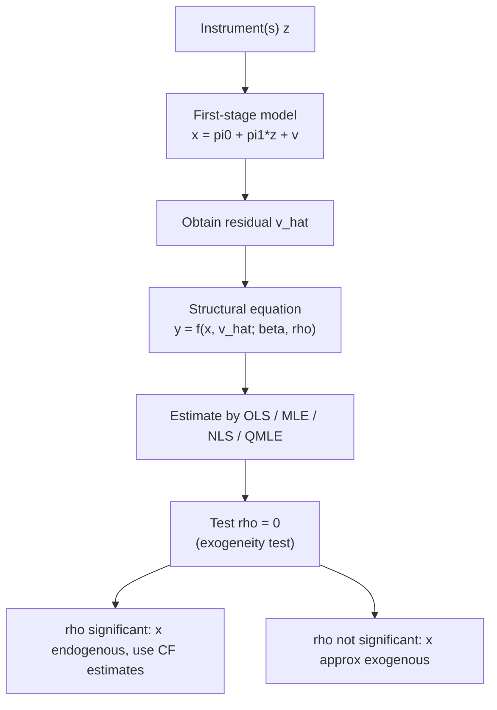

## Control Function Approaches

### Overview

Control function (CF) methods address endogeneity by explicitly modeling the source of correlation between a regressor and the structural error term, then including a generated "control" term in the outcome equation to purge that correlation. Unlike two-stage least squares (2SLS), which projects the endogenous regressor onto instruments and substitutes the fitted value, CF approaches retain the original regressor and add a term capturing the *residual variation* correlated with the error. This distinction becomes important in nonlinear models, where 2SLS-style "plug-in" approaches are generally inconsistent.

### Motivation

Consider the structural equation:

$$y = \beta_0 + \beta_1 x + u$$

where $x$ is endogenous: $\text{Cov}(x, u) \neq 0$. Suppose $x$ is determined by a first-stage (reduced-form) equation using instrument $z$:

$$x = \pi_0 + \pi_1 z + v$$

If $u$ and $v$ are correlated, $x$'s endogeneity stems entirely from its correlation with $v$. The control function insight: conditioning on $v$ (or an estimate of it) renders $x$ exogenous in the conditional model.

Formally, if $E[u \mid z, v] = E[u \mid v] = \rho v$ (linearity in $v$, a standard bivariate normality or linear-projection assumption), then:

$$E[y \mid x, z] = \beta_0 + \beta_1 x + \rho v$$

Since $v$ is unobserved, it is replaced by the first-stage residual $\hat{v} = x - \hat{\pi}_0 - \hat{\pi}_1 z$.

### The Linear Case: Equivalence to 2SLS

**Procedure (2SLS via control function):**

1. Estimate the first stage by OLS: $x_i = \pi_0 + \pi_1 z_i + v_i$, obtain residuals $\hat{v}_i$.
2. Estimate the second stage by OLS: $y_i = \beta_0 + \beta_1 x_i + \rho \hat{v}_i + \varepsilon_i$.

**Key Points**

- In the exactly-identified and linear model, the CF estimator of $\beta_1$ is numerically identical to 2SLS.
- The coefficient $\hat{\rho}$ on $\hat{v}$ provides a direct **test of exogeneity**: a significant $\hat{\rho}$ signals that $x$ is endogenous (this is the basis of the Hausman-Wu test).
- Standard errors from the second stage must be corrected (bootstrap or analytical) because $\hat{v}$ is a generated regressor, introducing estimation uncertainty from stage one. Failing to adjust understates the standard errors.

### Why Control Functions Matter Beyond the Linear Model

The linear equivalence with 2SLS makes CF seem redundant there, but CF methods become essential — rather than merely convenient — in nonlinear settings: probit/logit with endogenous regressors, Tobit models, sample selection, count data (Poisson), and nonparametric/semiparametric models. In these cases, plugging fitted values $\hat{x}$ into a nonlinear function (naive "forbidden regression") does not deliver consistent estimates, because $E[g(x,u)] \neq g(E[x \mid z], u)$ for nonlinear $g$. CF instead models the joint dependence structure explicitly.

### Control Function for Binary Outcome Models (Probit)

Suppose:

$$y^* = \beta_0 + \beta_1 x + u, \quad y = \mathbb{1}[y^* > 0]$$

$$x = \pi_0 + \pi_1 z + v$$

with $(u, v)$ bivariate normal, $u = \rho v + e$, $e \perp v$, $e \sim N(0, \sigma_e^2)$.

**Procedure (Rivers-Vuong 1988 two-step CF estimator):**

1. OLS first stage: regress $x$ on $z$ (and exogenous controls), obtain $\hat{v}$.
2. Probit of $y$ on $x$, $\hat{v}$ (and controls). The coefficient on $\hat{v}$ tests exogeneity; if significant, $x$ is endogenous.
3. Marginal effects require integrating out remaining uncertainty or evaluating at $\hat{v} = 0$, adjusted appropriately.

**[Inference]** Bootstrapped standard errors are typically recommended over analytical corrections in applied work, due to the complexity of the two-step variance formula, though closed-form (Murphy-Topel type) corrections exist.

### Control Function in the Tobit / Corner Solution Model

For censored outcomes $y = \max(0, y^*)$ with $y^* = \beta_0 + \beta_1 x + u$ and $x$ endogenous as above, the same two-step logic applies: obtain $\hat{v}$ from the first stage, include it as an additional regressor in the Tobit MLE. This is sometimes called the **Smith-Blundell (1986)** approach, developed contemporaneously with Rivers-Vuong for the Tobit case.

### General Two-Step CF Estimator (Wooldridge Framework)

For a broad class of nonlinear models, Wooldridge (2015) formalizes the two-step CF procedure:

**Step 1 — First Stage:**

Estimate the reduced form for each endogenous variable $x_j$ (by OLS if $x_j$ continuous, or by an appropriate nonlinear model if discrete), obtaining generalized residuals $\hat{v}_j$.

**Step 2 — Structural Equation:**

Estimate the structural model of interest (probit, Tobit, Poisson, fractional response, etc.) via MLE or NLS, including $\hat{v}_j$ (and often its square, if allowing nonlinearity/heteroskedasticity in the control) as additional regressors.

**Key Points**

- Requires **correct specification** of both the first-stage reduced form and the joint error distribution (e.g., joint normality of $u,v$) — a stronger requirement than 2SLS, which is largely distribution-free.
- The method generalizes naturally to **multiple endogenous regressors**, each requiring its own first-stage equation and residual.
- Standard errors must account for two-step estimation; the delta method, or a joint one-step GMM formulation, or a nonparametric bootstrap (clustered when appropriate) are standard remedies.

### Poisson / Count Data with Endogenous Regressors

For $E[y \mid x, u] = \exp(\beta_0 + \beta_1 x + u)$ with $x$ endogenous, a common CF approach specifies:

$$E[y \mid x, z] = \exp(\beta_0 + \beta_1 x + \rho \hat{v} )$$

estimated by Poisson quasi-MLE (QMLE) with $\hat{v}$, the first-stage OLS residual, included as a regressor. This is robust to certain distributional misspecification because Poisson QMLE only requires correct conditional mean specification, though the linear-CF assumption on $E[u\mid v]$ still requires justification.

### Control Function vs. 2SLS vs. GMM: Comparison

| Feature | 2SLS | Control Function | GMM |
| --- | --- | --- | --- |
| Linear model consistency | Yes | Yes (numerically identical) | Yes |
| Nonlinear model consistency | Generally No (forbidden regression) | Yes, under correct specification | Yes, with correct moment conditions |
| Distributional assumptions | Minimal | Often requires joint normality/linearity in residual | Minimal (moment-based) |
| Provides direct exogeneity test | Via auxiliary regression (Hausman) | Yes, built-in ($\hat\rho$ coefficient) | Via overidentification tests |
| Standard error complexity | Standard (or robust) | Requires generated-regressor correction | Standard GMM sandwich |

### Diagrammatic Summary of the Two-Step CF Logic

### Testing for Endogeneity via the Control Function

Because $\hat{v}$ is included directly as a regressor, a simple $t$-test (or Wald test for multiple endogenous variables) on its coefficient(s) $\hat{\rho}$ serves as a **regression-based Hausman test**:

$$H_0: \rho = 0 \quad \text{(x is exogenous)}$$

Rejection implies $x$ is endogenous and the CF-adjusted (or 2SLS, in the linear case) estimates should be used rather than plain OLS/MLE.

### Practical Implementation Notes

**Example**

Suppose estimating returns to schooling with wage as a Tobit-censored outcome (e.g., censored at a minimum wage floor) and schooling instrumented by distance to college:

1. Regress schooling on distance to college and exogenous controls (experience, region) via OLS; save residuals $\hat{v}$.
2. Estimate Tobit of wage on schooling, experience, region, and $\hat{v}$.
3. Bootstrap the entire two-step procedure (resampling and re-running both stages) to obtain valid standard errors.

**Key Points**

- Weak instruments degrade CF estimates just as they degrade 2SLS — weak-instrument diagnostics (e.g., first-stage $F$-statistic) remain essential.
- CF methods extend naturally to **panel data** with fixed effects, though care is needed regarding how the control function interacts with within-transformation.
- Software: Stata's `etregress`, `ivprobit`, `ivtobit` implement CF/MLE-based estimators; R implementations exist via custom two-step code or packages such as `ivtools` and `REndo`; Python lacks a mature dedicated package, often requiring manual two-step implementation with `statsmodels`.

### Limitations

- Sensitive to correct specification of the first-stage functional form and the joint error distribution (commonly joint normality); misspecification biases estimates, unlike the comparatively robust 2SLS in the linear case.
- Requires valid, relevant instruments — the same exclusion restriction and relevance conditions as any IV approach.
- With multiple endogenous regressors, the dimensionality and estimation burden of joint first-stage residuals grows, and independence/normality assumptions across residuals become harder to justify.

**Related Topics**

- Two-Stage Least Squares (2SLS) estimation
- Generalized Method of Moments (GMM) for endogenous regressors
- Heckman selection model and the control function connection
- Weak instrument diagnostics (Stock-Yogo critical values)
- Regression-based Hausman-Wu exogeneity tests
- Nonlinear panel data models with endogenous regressors
- Semiparametric and nonparametric control function estimators