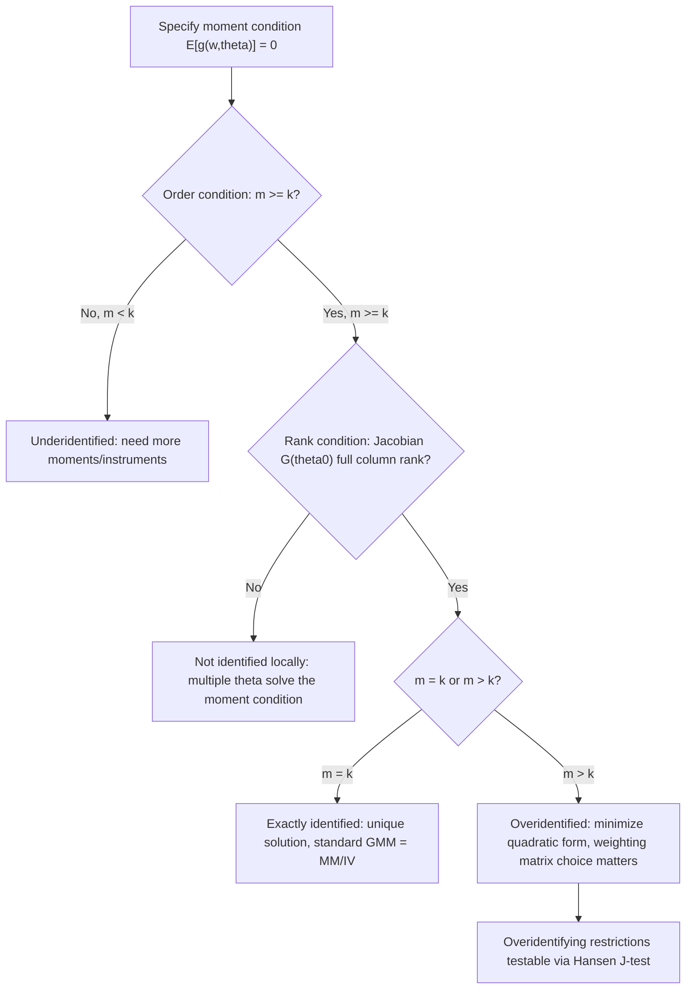

## Moment Conditions and Identification

### Definition of a Moment Condition

A moment condition (or moment restriction) is a population-level equation of the form:

$$E[g(w_i, \theta_0)] = 0$$

where $w_i$ denotes observed data for unit $i$, $\theta_0 \in \mathbb{R}^k$ is the true parameter vector, and $g(\cdot)$ is a known vector-valued function mapping data and parameters to $\mathbb{R}^m$. This equation holds only at the true parameter value $\theta_0$; the entire logic of GMM estimation is to find the value of $\theta$ that makes the *sample analog* of this condition as close to zero as possible.

Moment conditions are the foundational building block of the generalized method of moments (GMM) framework, generalizing classical method-of-moments estimation, OLS normal equations, and IV orthogonality conditions into a single unified structure.

### Sources of Moment Conditions

**Key Points**

- **Orthogonality conditions from instruments**: $E[Z_i'(Y_i - X_i\beta)] = 0$, where $Z_i$ is a vector of instruments uncorrelated with the structural error.
- **First-order conditions of optimization problems**: Any M-estimator (MLE, nonlinear least squares) has an associated moment condition given by the score/gradient of its objective function set to zero: $E[\nabla_\theta \ell(w_i,\theta_0)] = 0$.
- **Economic theory restrictions**: Euler equations from dynamic optimization (e.g., consumption-based asset pricing models), where $E\left[\beta \frac{u'(c_{t+1})}{u'(c_t)} R_{t+1} - 1 \mid \mathcal{I}_t\right] = 0$ implies unconditional moment conditions once instrumented with elements of the information set $\mathcal{I}_t$.
- **Distributional moments**: Raw or central moments (mean, variance, skewness) equated to their theoretical counterparts, as in classical method-of-moments estimation.
- **Conditional moment restrictions**: $E[u_i(\theta_0) \mid X_i] = 0$, which can be converted into an infinite (or large finite) set of unconditional moment conditions by interacting with any function of $X_i$: $E[u_i(\theta_0) h(X_i)] = 0$ for any measurable $h(\cdot)$.

### From Conditional to Unconditional Moments

Conditional moment restrictions are theoretically stronger than unconditional ones because $E[u_i \mid X_i] = 0$ implies $E[u_i h(X_i)] = 0$ for *any* function $h$, but the converse does not hold. In practice, econometricians select a finite set of instrument functions $h(X_i)$ (e.g., $X_i$, $X_i^2$, polynomial terms, or optimal instruments derived from the conditional variance structure) to construct the workable finite-dimensional unconditional system used in estimation. The choice of $h(\cdot)$ directly affects estimator efficiency — this motivates the theory of **optimal instruments** (Chamberlain, 1987), which shows that the efficient choice of $h(X_i)$ is proportional to $E[\partial u_i/\partial \theta \mid X_i] \cdot \text{Var}(u_i \mid X_i)^{-1}$.

### The Order Condition for Identification

Let $m$ denote the number of moment conditions (dimension of $g$) and $k$ the number of parameters (dimension of $\theta$). The **order condition** — a necessary but not sufficient condition for identification — requires:

$$m \geq k$$

Three cases arise:

| Case | Condition | Terminology |
| --- | --- | --- |
| Exactly identified | $m = k$ | Method of moments / classical IV; unique solution sets sample moments to exactly zero |
| Overidentified | $m > k$ | GMM proper; no $\theta$ generally sets all sample moments exactly to zero, so a weighted quadratic form is minimized instead |
| Underidentified | $m < k$ | Parameters not identified by these moments; additional restrictions or instruments required |

**Key Points**

- The order condition counts equations against unknowns — it is the moment-based analogue of the rank condition for linear systems, but it is only necessary.
- Overidentification is generally *desirable* econometrically because it allows efficiency gains (via optimal weighting) and provides testable overidentifying restrictions (the Hansen J-test), at the cost of estimator complexity and greater sensitivity to any single invalid moment.

### The Rank Condition for Identification

The order condition alone does not guarantee identification. The **rank condition** requires that the Jacobian of the population moment function have full column rank at $\theta_0$:

$$\text{rank}\left(\frac{\partial E[g(w_i,\theta)]}{\partial \theta'}\right)\bigg|_{\theta=\theta_0} = k$$

If this Jacobian, often denoted $G(\theta_0) = E[\partial g(w_i,\theta_0)/\partial \theta']$, has rank less than $k$, then $\theta_0$ is not (locally) identified — multiple values of $\theta$ can satisfy the population moment condition, and no amount of data resolves the ambiguity. This is the moment-based generalization of the requirement that $E[Z_i'X_i]$ be full rank and nonsingular in linear IV/2SLS.

**Global vs. local identification**: The rank condition as stated guarantees only *local* identification (uniqueness in a neighborhood of $\theta_0$). Global identification additionally requires that $E[g(w_i,\theta)] = 0$ has a *unique* solution over the entire parameter space $\Theta$, which typically must be verified separately (often via convexity, monotonicity, or model-specific structural arguments) since it is not implied by a full-rank Jacobian alone.

### Formal Identification Statement

$\theta_0$ is (globally) identified by the moment condition $E[g(w_i,\theta)] = 0$ if and only if:

$$E[g(w_i,\theta)] = 0 \iff \theta = \theta_0$$

for all $\theta \in \Theta$. This is the population-level identification requirement that GMM estimation presumes holds *before* any estimation is attempted — identification is a property of the model and the population, not of the estimator or the sample.

### Illustrative Example: Linear IV as a Moment Condition

Consider the linear model $Y_i = X_i'\beta_0 + u_i$ with instrument vector $Z_i$ satisfying $E[Z_i u_i] = 0$. This is a moment condition with:

$$g(w_i,\beta) = Z_i(Y_i - X_i'\beta)$$

- If $\dim(Z_i) = \dim(X_i) = k$ (as many instruments as regressors), the model is **exactly identified**, the order condition holds with equality, and setting the sample moment $\frac{1}{n}\sum_i Z_i(Y_i - X_i'\hat\beta) = 0$ yields the standard IV estimator $\hat\beta_{IV} = (Z'X)^{-1}Z'Y$.
- The **rank condition** here requires $E[Z_i X_i']$ to be nonsingular — this is precisely the "relevance" condition from standard IV theory, restated in moment-condition language. A rank-deficient $E[Z_i X_i']$ corresponds to weak or irrelevant instruments.
- If $\dim(Z_i) > \dim(X_i)$, the system is **overidentified**: more moment equations than unknowns, and GMM minimizes $g_n(\beta)' W_n\, g_n(\beta)$ over $\beta$ for some positive semi-definite weighting matrix $W_n$, rather than solving the (generally infeasible) exact system.

**Example**

Suppose a wage equation $\log(wage_i) = \beta_0 + \beta_1 educ_i + u_i$ is instrumented using two instruments — mother's education ($Z_{1i}$) and distance to nearest college ($Z_{2i}$) — for the single endogenous regressor $educ_i$. Here $m = 2$ moment conditions (plus the constant's moment, typically $m=3$ counting the intercept's own instrument, usually itself), $k = 2$ parameters ($\beta_0, \beta_1$), giving an overidentified system with one overidentifying restriction testable via the Hansen J-statistic.

### Weighting Matrices and Their Role in Identification vs. Efficiency

It is important to distinguish **identification** (a population-level, weighting-matrix-independent property) from **efficiency** (which depends on the choice of weighting matrix $W_n$ in the overidentified case). Any positive-definite $W_n$ yields a consistent GMM estimator provided the model is identified; the choice of $W_n$ affects only the asymptotic variance, not consistency. The efficient (two-step or iterated) GMM estimator uses $W_n = \hat{S}^{-1}$, where $\hat S$ is a consistent estimate of $\text{Var}(g(w_i,\theta_0)) = E[g(w_i,\theta_0)g(w_i,\theta_0)']$, per Hansen's (1982) efficiency result.

**Key Points**

- Identification failure cannot be repaired by reweighting; it requires additional or different moment conditions.
- Weak identification (a Jacobian that is full rank but nearly singular, or moments that are only weakly informative about $\theta_0$) causes poor finite-sample behavior even when the rank condition formally holds — this is the moment-based analogue of the weak-instrument problem and motivates weak-identification-robust inference (e.g., Stock–Wright S-statistic, Anderson–Rubin tests).

### Diagnosing Identification in Practice

**Key Points**

- **Order condition check**: Simple count of moments vs. parameters — necessary but never sufficient; always verify.
- **Rank condition check**: In linear/IV contexts, examine the first-stage $F$-statistic or the rank of $E[Z_i X_i']$; in nonlinear GMM, evaluate the Jacobian of the moment function numerically at candidate parameter values and confirm nonsingularity.
- **Weak identification diagnostics**: Concentration parameters, the Stock-Yogo weak-instrument critical values, or (in nonlinear settings) examining whether the GMM objective function is very flat near its minimum (a flat criterion surface signals weak/local non-identification even under formal full rank).
- **Simulation-based checks**: [Inference] Researchers often simulate the moment function across a grid of the parameter space to visually confirm a unique, well-defined minimum, especially in structural/nonlinear models where analytical identification proofs are intractable.

### Common Pitfalls

**Key Points**

- Confusing the order condition (necessary) with sufficiency for identification — models can satisfy $m \geq k$ and still fail the rank condition.
- Treating overidentification as automatically desirable without considering that invalid additional instruments can bias all parameter estimates, not just introduce inefficiency — a single invalid moment condition contaminates the entire overidentified system.
- Ignoring that identification is a *population* concept; no amount of additional sample data can identify a model whose population moment conditions are rank-deficient.
- Failing to distinguish local from global identification — a model can be locally identified (unique solution nearby) yet have multiple, distant global solutions to the moment equations, an issue especially relevant in nonlinear/structural GMM.
- Assuming that including more instruments always improves efficiency; weak or nearly-redundant additional instruments can worsen finite-sample bias despite formally satisfying the rank condition (many-weak-instruments problem).

### Related Topics

- Generalized method of moments (GMM) estimator and asymptotic theory
- Optimal weighting matrix and efficient two-step/iterated GMM
- Hansen's J-test for overidentifying restrictions
- Weak instrument diagnostics (Stock-Yogo critical values, concentration parameter)
- Continuous updating GMM (CU-GMM) estimator
- Conditional moment restrictions and optimal instrument construction (Chamberlain 1987)
- Generalized empirical likelihood (GEL) as an alternative to GMM weighting