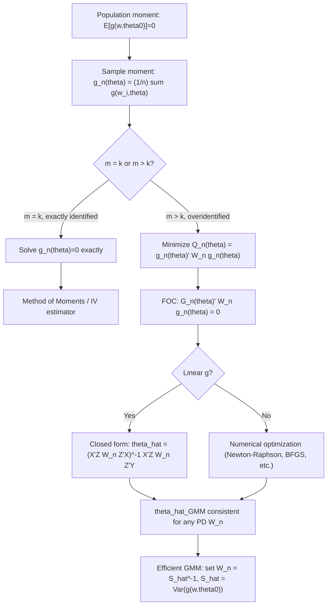

## GMM Estimator Derivation

### Setup and Population Moment Conditions

The generalized method of moments (GMM) estimator is built from a population moment condition:

$$E[g(w_i, \theta_0)] = 0$$

where $w_i$ is the observed data for unit $i = 1, \dots, n$, $\theta_0 \in \Theta \subset \mathbb{R}^k$ is the true parameter, and $g(\cdot): \mathcal{W} \times \Theta \to \mathbb{R}^m$ is a known vector function with $m \geq k$. The derivation proceeds by replacing the unobservable population expectation with its sample analog and choosing $\theta$ to make this sample analog as close to zero as possible.

### Step 1: Sample Moment Function

Define the sample average of the moment function:

$$g_n(\theta) = \frac{1}{n}\sum_{i=1}^n g(w_i, \theta)$$

By the law of large numbers, $g_n(\theta_0) \xrightarrow{p} E[g(w_i,\theta_0)] = 0$, so for large $n$, $g_n(\theta_0)$ should be close to zero. The GMM strategy is to choose $\hat\theta$ so that $g_n(\hat\theta)$ is as close to the zero vector as possible, according to some distance metric.

### Step 2: The Exactly Identified Case ($m = k$)

When the number of moment conditions equals the number of parameters, it is generically possible to solve the sample moment equations exactly:

$$g_n(\hat\theta) = 0$$

This system of $k$ equations in $k$ unknowns typically has a unique solution (under the rank condition), and the resulting $\hat\theta$ is the **method of moments** or, in the linear IV case, the standard IV estimator. No weighting matrix is needed because the system is exactly solvable — every choice of positive-definite weighting matrix leads to the identical solution in the just-identified case.

**Example**: For linear IV with $g(w_i,\beta) = Z_i(Y_i - X_i'\beta)$ and $\dim(Z_i)=\dim(X_i)=k$:

$$\frac{1}{n}\sum_i Z_i(Y_i - X_i'\hat\beta) = 0 \implies \hat\beta = (Z'X)^{-1}Z'Y$$

### Step 3: The Overidentified Case ($m > k$)

When there are more moment conditions than parameters, $g_n(\theta) = 0$ generally has **no exact solution** — $k$ unknowns cannot simultaneously satisfy $m$ independent equations except by coincidence. Instead, GMM minimizes a quadratic form that measures the "distance" of $g_n(\theta)$ from zero:

$$\hat\theta_{GMM} = \arg\min_{\theta \in \Theta} \; Q_n(\theta) = \arg\min_{\theta \in \Theta} \; g_n(\theta)' \, W_n \, g_n(\theta)$$

where $W_n$ is an $m \times m$ symmetric, positive semi-definite **weighting matrix** (possibly data-dependent, converging in probability to a fixed positive-definite matrix $W$). Different choices of $W_n$ produce different, but all consistent, GMM estimators.

### Step 4: First-Order Conditions

Assuming $g_n(\theta)$ is differentiable, the first-order condition for the minimization problem is obtained by differentiating $Q_n(\theta)$ with respect to $\theta$ and setting the gradient to zero:

$$\frac{\partial Q_n(\theta)}{\partial \theta} = 2\left[\frac{\partial g_n(\theta)}{\partial \theta'}\right]' W_n \, g_n(\theta) = 0$$

Define $G_n(\theta) = \partial g_n(\theta)/\partial \theta'$, the $m \times k$ Jacobian of the sample moment function. The first-order condition is:

$$G_n(\hat\theta)' W_n \, g_n(\hat\theta) = 0$$

This is a system of $k$ equations (since $G_n'W_n$ is $k \times m$ and $g_n$ is $m \times 1$) in $k$ unknowns, generically solvable even though the original $m$-equation system is not. In the **linear** case, this yields a closed-form solution; in nonlinear GMM, $\hat\theta$ is found via numerical optimization.

### Step 5: Closed-Form Solution in the Linear Case

For linear moment conditions $g(w_i,\theta) = Z_i(Y_i - X_i'\theta)$, so that $g_n(\theta) = \frac{1}{n}Z'(Y - X\theta)$, the objective function becomes:

$$Q_n(\theta) = \frac{1}{n^2}(Y-X\theta)'Z \, W_n \, Z'(Y-X\theta)$$

Minimizing over $\theta$ gives the closed-form GMM estimator:

$$\hat\theta_{GMM} = (X'Z \, W_n \, Z'X)^{-1} \, X'Z \, W_n \, Z'Y$$

This nests **2SLS** as the special case $W_n = (Z'Z)^{-1}$, and nests **OLS** as the special case $Z = X$.

### Step 6: Two-Step Efficient GMM

Hansen (1982) shows that the asymptotically efficient choice of weighting matrix is the inverse of the long-run covariance matrix of the moment conditions:

$$W^* = S^{-1}, \qquad S = E[g(w_i,\theta_0)g(w_i,\theta_0)']$$

(with a Newey-West/HAC-type correction if $g(w_i,\theta_0)$ is serially correlated, as in time-series applications). Since $S$ depends on the unknown $\theta_0$, efficient GMM proceeds in two steps:

1. **Step 1**: Choose an initial consistent (but inefficient) estimator using an arbitrary positive-definite weighting matrix, commonly $W_n^{(1)} = I_m$ (identity matrix) or $W_n^{(1)} = (Z'Z)^{-1}$ in the IV context. Obtain $\hat\theta^{(1)}$.
2. **Step 2**: Construct $\hat S = \frac{1}{n}\sum_i g(w_i,\hat\theta^{(1)})g(w_i,\hat\theta^{(1)})'$ (or its HAC-robust analogue), set $W_n^{(2)} = \hat S^{-1}$, and re-minimize $Q_n(\theta)$ to obtain the efficient two-step estimator $\hat\theta^{(2)}_{GMM}$.

This can be **iterated**: re-estimate $S$ using $\hat\theta^{(2)}$, re-minimize, and repeat until convergence (iterated GMM), or estimated jointly via **continuous updating GMM (CU-GMM)**, where $W_n(\theta) = \hat S(\theta)^{-1}$ is allowed to vary with $\theta$ within a single minimization:

$$\hat\theta_{CUE} = \arg\min_\theta \; g_n(\theta)'\hat S(\theta)^{-1} g_n(\theta)$$

**Key Points**

- Two-step GMM is consistent and asymptotically efficient within the class of GMM estimators using this moment set, but finite-sample performance can differ meaningfully from iterated or CU-GMM, particularly with many overidentifying restrictions.
- [Inference] CU-GMM is often reported to have better finite-sample bias properties than two-step GMM in simulation studies, though it is computationally more demanding since $S$ must be re-evaluated at every trial $\theta$ during optimization.

### Asymptotic Properties of the GMM Estimator

Under standard regularity conditions (identification, differentiability, appropriate moment existence, and a law of large numbers/central limit theorem applying to $g(w_i,\theta_0)$), the GMM estimator is:

**Consistent**: $\hat\theta_{GMM} \xrightarrow{p} \theta_0$ for any fixed positive-definite $W$.

**Asymptotically normal**:

$$\sqrt{n}(\hat\theta_{GMM} - \theta_0) \xrightarrow{d} N(0, V)$$

where the asymptotic variance is:

$$V = (G'WG)^{-1} G'WSWG(G'WG)^{-1}$$

with $G = E[\partial g(w_i,\theta_0)/\partial\theta']$ (the population Jacobian) and $S$ as defined above. When the **efficient weighting matrix** $W = S^{-1}$ is used, this expression simplifies to the efficiency bound within the GMM class:

$$V_{eff} = (G'S^{-1}G)^{-1}$$

This is the standard formula used to construct standard errors, Wald tests, and confidence intervals for GMM-estimated parameters.

### Special Cases Nested Within the GMM Framework

| Estimator | Moment condition $g(w_i,\theta)$ | Notes |
| --- | --- | --- |
| OLS | $X_i(Y_i - X_i'\beta)$ | Exactly identified; $W_n$ irrelevant |
| IV / 2SLS | $Z_i(Y_i - X_i'\beta)$ | Exactly or overidentified depending on $\dim(Z_i)$ |
| MLE | $\partial \ell(w_i,\theta)/\partial\theta$ (score) | Exactly identified; efficient $W$ relates to the information matrix |
| Nonlinear LS | $\partial m(X_i,\theta)/\partial\theta \cdot (Y_i - m(X_i,\theta))$ | Nonlinear in $\theta$; requires numerical optimization |
| Classical Method of Moments | $X_i^j - \mu_j(\theta)$ for raw/central moments $j$ | Historical precursor to modern GMM |

### Worked Example: Overidentified Linear IV

Suppose $Y_i = \beta_0 + \beta_1 X_i + u_i$ with two instruments $Z_{1i}, Z_{2i}$ ($m=2$ instruments plus the constant's own instrument, giving $m=3$ moments against $k=2$ parameters — a single overidentifying restriction). The moment vector is:

$$g(w_i,\beta) = \begin{pmatrix} 1 \\ Z_{1i} \\ Z_{2i}\end{pmatrix}(Y_i - \beta_0 - \beta_1 X_i)$$

**Step 1**: Compute first-step estimate using $W_n^{(1)} = (Z'Z)^{-1}$ (equivalent to 2SLS).

**Step 2**: Compute residuals $\hat u_i^{(1)} = Y_i - \hat\beta_0^{(1)} - \hat\beta_1^{(1)}X_i$, form $\hat S = \frac{1}{n}\sum_i \hat u_i^{(1)2}\, z_i z_i'$ where $z_i = (1, Z_{1i}, Z_{2i})'$ (heteroskedasticity-robust version), and set $W_n^{(2)} = \hat S^{-1}$.

**Step 3**: Re-minimize $Q_n(\beta) = g_n(\beta)'\hat S^{-1}g_n(\beta)$ to obtain the efficient two-step GMM estimate $\hat\beta^{(2)}$, which is asymptotically more efficient than 2SLS under heteroskedasticity (2SLS is efficient only under homoskedasticity; efficient GMM recovers efficiency gains under general heteroskedastic error structures).

**Output**

The resulting $\hat\beta^{(2)}_{GMM}$ minimizes the quadratic form using the heteroskedasticity-robust optimal weighting matrix, and the associated $J$-statistic $n \cdot Q_n(\hat\beta^{(2)})$ can be compared to a $\chi^2_{m-k} = \chi^2_1$ distribution to test the single overidentifying restriction.

### Numerical Optimization in Nonlinear GMM

When $g(w_i,\theta)$ is nonlinear in $\theta$, no closed form exists for $\hat\theta_{GMM}$, and $Q_n(\theta)$ must be minimized numerically:

**Key Points**

- Common algorithms: Newton-Raphson (requires analytical or numerical Hessian), BFGS/quasi-Newton (approximates the Hessian), Nelder-Mead simplex (derivative-free, useful when $g$ is non-smooth).
- Multiple starting values are recommended to guard against convergence to local minima, since $Q_n(\theta)$ is not guaranteed to be globally convex outside the linear case.
- [Inference] Poorly scaled parameters or moments (differing orders of magnitude across elements of $g$) frequently cause numerical instability in practice; standardizing moment conditions before optimization is a common applied remedy, though effectiveness varies by model.
- Gradient-based methods require the Jacobian $G_n(\theta)$, obtainable analytically or via numerical differentiation; analytical gradients are preferred where available for stability and speed.

### Common Pitfalls

**Key Points**

- Using an inconsistent or poorly estimated first-step weighting matrix (e.g., insufficient bandwidth in HAC estimation of $S$) can produce large finite-sample bias in two-step GMM, even though the estimator remains asymptotically efficient.
- Forgetting that GMM standard errors from the "naive" formula $(G'WG)^{-1}$ are only correct asymptotically when $W$ is the actual weighting matrix used, not the efficient one — always use the correct sandwich-form variance unless $W = S^{-1}$ exactly.
- Failing to check convergence diagnostics in nonlinear GMM optimization — reporting results from an optimizer that has not actually converged.
- Confusing the **order condition** ($m \geq k$, necessary for the FOC system to be solvable) with the **rank condition** (needed for the solution to be a well-defined, identified minimum) — a singular $G_n(\theta)$ Jacobian at the solution indicates a poorly identified or misspecified model.

### Related Topics

- Moment conditions and identification (order and rank conditions)
- Hansen's J-test for overidentifying restrictions
- Optimal weighting matrix and HAC covariance estimation (Newey-West)
- Continuous updating GMM (CU-GMM) and its finite-sample properties
- Generalized empirical likelihood (GEL) and empirical likelihood estimators
- Weak identification and many-instrument asymptotics in GMM
- GMM estimation of dynamic panel data models (Arellano-Bond)