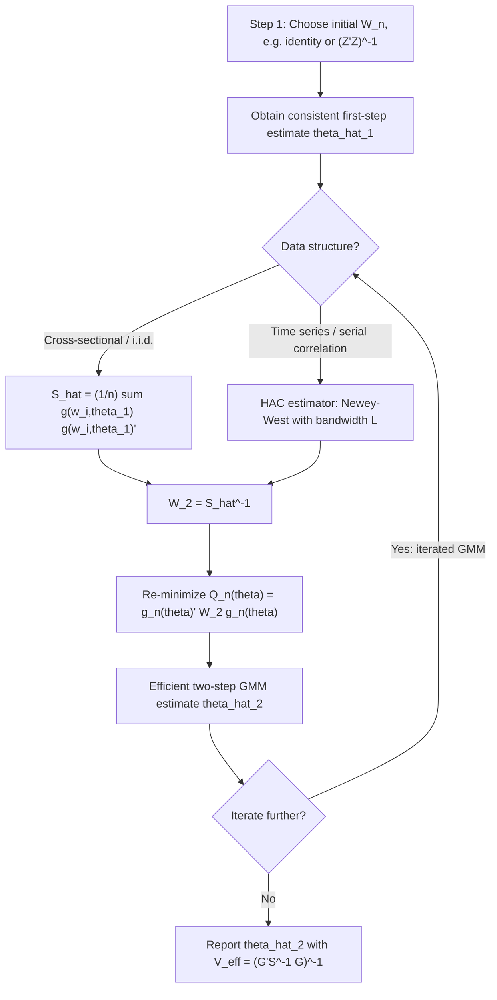

## Efficient GMM and Optimal Weighting Matrices

### The Efficiency Problem in GMM

For any fixed positive-definite weighting matrix $W$, the GMM estimator

$$\hat\theta_{GMM}(W) = \arg\min_\theta \; g_n(\theta)' W g_n(\theta)$$

is consistent and asymptotically normal. However, different choices of $W$ produce estimators with different asymptotic variances, all valid but not equally precise. The efficiency question asks: **within the class of GMM estimators using a fixed moment vector $g(w_i,\theta)$, which weighting matrix $W$ minimizes the asymptotic variance of $\hat\theta$?**

This is a meaningfully different question from choosing *which* moment conditions to use — efficient GMM takes the moment set as given and optimizes only over $W$. A separate, harder problem (optimal instrument selection) addresses which moments/instruments to use in the first place.

### Hansen's Efficiency Result

Hansen (1982) establishes that the asymptotic variance of the GMM estimator using weighting matrix $W$ is:

$$V(W) = (G'WG)^{-1}G'WSWG(G'WG)^{-1}$$

where $G = E[\partial g(w_i,\theta_0)/\partial\theta']$ is the population Jacobian (an $m \times k$ matrix) and $S = E[g(w_i,\theta_0)g(w_i,\theta_0)']$ is the $m \times m$ long-run covariance matrix of the moment function.

**Hansen's theorem**: The asymptotic variance $V(W)$ is minimized (in the matrix positive-semidefinite ordering sense — $V(W) - V(S^{-1})$ is positive semidefinite for any $W$) when:

$$W^* = S^{-1}$$

Substituting $W = S^{-1}$ into the variance formula, the cross terms simplify:

$$V(S^{-1}) = (G'S^{-1}G)^{-1}$$

This is the **efficient GMM asymptotic variance**, often called the GMM efficiency bound for the given moment set. No choice of weighting matrix can achieve a smaller asymptotic variance while using the same moment function $g(w_i,\theta)$.

**Key Points**

- The intuition: $S^{-1}$ downweights moment conditions that are noisy (high variance) or highly correlated with other moments, and upweights precise, informative moments — analogous to GLS downweighting high-variance observations relative to OLS.
- If the moment conditions are exactly identified ($m=k$), $W$ is irrelevant — the sample moment equations can be solved exactly regardless of weighting, so $V(W) = G^{-1}SG'^{-1}$ for any nonsingular $W$, and efficient weighting adds nothing.
- Efficiency gains from optimal weighting arise *only* in the overidentified case ($m>k$), where the choice of how to combine competing/redundant moment information matters.

### Structure of $S$ and Estimation Challenges

Because $S$ depends on the unknown $\theta_0$, it cannot be used directly and must be estimated. The correct construction of $\hat S$ depends critically on the data structure:

**Cross-sectional, i.i.d. data**: If $g(w_i,\theta_0)$ is serially uncorrelated across $i$ (reasonable under random sampling), $S$ is estimated by the sample covariance:

$$\hat S = \frac{1}{n}\sum_{i=1}^n g(w_i,\hat\theta)g(w_i,\hat\theta)'$$

This is directly analogous to White's heteroskedasticity-robust covariance estimator, and indeed reduces to it in the linear IV/OLS special case.

**Time-series or panel data with serial correlation**: If $g(w_t,\theta_0)$ exhibits autocorrelation (common in Euler-equation and dynamic panel applications), the simple sample covariance is inconsistent for the *long-run* variance, which must also account for cross-time covariances:

$$S = \Gamma_0 + \sum_{j=1}^{\infty}(\Gamma_j + \Gamma_j')$$

where $\Gamma_j = E[g(w_t,\theta_0)g(w_{t-j},\theta_0)']$. This requires a **heteroskedasticity and autocorrelation consistent (HAC)** estimator, most commonly the Newey-West (1987) kernel estimator:

$$\hat S_{NW} = \hat\Gamma_0 + \sum_{j=1}^{L}\left(1 - \frac{j}{L+1}\right)(\hat\Gamma_j + \hat\Gamma_j')$$

where $L$ is the bandwidth/truncation lag, chosen to grow with $n$ at an appropriate rate (e.g., $L = O(n^{1/3})$) to ensure consistency while controlling finite-sample noise. Other kernels (Bartlett, Parzen, quadratic spectral) trade off bias and variance differently; Andrews (1991) provides data-dependent bandwidth selection procedures.



### Two-Step, Iterated, and Continuously Updated GMM

**Two-step efficient GMM** (the standard default):

1. Obtain a consistent first-step estimate $\hat\theta^{(1)}$ using an arbitrary positive-definite $W_n^{(1)}$ (commonly $I_m$ or $(Z'Z)^{-1}$).
2. Construct $\hat S = \hat S(\hat\theta^{(1)})$ and set $W_n^{(2)} = \hat S^{-1}$.
3. Re-minimize to obtain $\hat\theta^{(2)}_{GMM}$, which achieves the efficiency bound asymptotically.

**Iterated GMM**: Repeat steps 2–3, re-estimating $S$ at each new $\hat\theta$, until $\hat\theta$ converges. [Inference] Iteration does not improve first-order asymptotic efficiency relative to the two-step estimator, but is often found in simulation studies to reduce finite-sample bias and sensitivity to the arbitrary first-step weighting choice.

**Continuous updating estimator (CU-GMM)** (Hansen, Heaton, and Yaron, 1996):

$$\hat\theta_{CUE} = \arg\min_\theta \; g_n(\theta)'\hat S(\theta)^{-1}g_n(\theta)$$

Here $\hat S$ is re-evaluated as a function of $\theta$ *within* the optimization itself, rather than held fixed from a prior step. CU-GMM is numerically more demanding (each trial $\theta$ during optimization requires recomputing $\hat S(\theta)$) but has the same first-order asymptotic distribution as two-step efficient GMM while often exhibiting superior finite-sample properties, particularly reduced bias in models with many or highly nonlinear moment conditions.

| Estimator | $S$ evaluated at | Efficiency (1st order) | Typical finite-sample behavior |
| --- | --- | --- | --- |
| Two-step GMM | $\hat\theta^{(1)}$ (fixed) | Efficient | Sensitive to first-step weighting choice |
| Iterated GMM | Updated each round until convergence | Efficient | [Inference] Often less first-step-sensitive |
| CU-GMM | $\theta$ (varies within optimization) | Efficient | [Inference] Often lower bias, especially with many instruments |

### Efficient GMM vs. 2SLS Under Heteroskedasticity

A canonical application: in linear IV, 2SLS uses the fixed weighting matrix $W_n = (Z'Z/n)^{-1}$, which is efficient **only under conditional homoskedasticity** ($E[u_i^2 \mid Z_i] = \sigma^2$). Under heteroskedasticity, 2SLS remains consistent but is no longer efficient. Efficient (two-step) GMM, using $\hat S = \frac{1}{n}\sum_i \hat u_i^2 z_i z_i'$ (the heteroskedasticity-robust covariance of the moments), achieves a strictly smaller asymptotic variance than 2SLS whenever heteroskedasticity is present and the model is overidentified.

**Example**

For $Y_i = X_i'\beta + u_i$ with instruments $Z_i$, $\dim(Z_i) > \dim(X_i)$:

- **2SLS**: $\hat\beta_{2SLS} = (X'Z(Z'Z)^{-1}Z'X)^{-1}X'Z(Z'Z)^{-1}Z'Y$
- **Efficient GMM**: $\hat\beta_{GMM} = (X'Z\hat S^{-1}Z'X)^{-1}X'Z\hat S^{-1}Z'Y$, with $\hat S = \frac{1}{n}\sum_i \hat u_i^2 z_iz_i'$ using first-step (2SLS) residuals $\hat u_i$.

Under homoskedasticity, $\hat S \to \sigma^2 E[Z_iZ_i']$, and the GMM estimator reduces to (asymptotically equivalent to) 2SLS, since $S^{-1} \propto (Z'Z)^{-1}$ exactly recovers the 2SLS weighting.

### Optimal Instruments (Distinguished from Optimal Weighting)

A related but distinct efficiency question arises under **conditional** moment restrictions $E[u_i(\theta_0)\mid X_i]=0$. Chamberlain (1987) shows that the semiparametric efficiency bound is achieved not merely by optimal weighting of a *given* instrument set, but by choosing the **optimal instrument function**:

$$h^*(X_i) = E\left[\frac{\partial u_i(\theta_0)}{\partial\theta} \,\bigg|\, X_i\right]' \; \text{Var}(u_i(\theta_0)\mid X_i)^{-1}$$

Using $h^*(X_i)$ as the instrument (rather than a finite, ad hoc set like $X_i, X_i^2, \ldots$) attains the efficiency bound over *all* valid instrument choices, not just over weighting matrices for a fixed instrument set. In practice, $h^*(X_i)$ must itself be estimated (often via nonparametric or flexible parametric regression of the conditional Jacobian and conditional variance on $X_i$), introducing a first-stage nonparametric estimation problem. [Unverified] The practical efficiency gains from implementing optimal instruments versus using a rich but finite polynomial/spline basis for $h(X_i)$ vary substantially by application and are sensitive to the quality of the first-stage nonparametric fit.

### Finite-Sample Concerns with Efficient Weighting

**Key Points**

- **Estimation noise in $\hat S$**: With many overidentifying restrictions (large $m$) relative to sample size $n$, $\hat S$ is estimated imprecisely, and this noise propagates into $\hat W = \hat S^{-1}$, degrading finite-sample performance of two-step GMM even though it is asymptotically efficient — a manifestation of the broader "many moments/many instruments" problem.
- **HAC bandwidth sensitivity**: The choice of $L$ in Newey-West estimation trades off bias (too small $L$: fails to capture long-run autocovariance) against variance (too large $L$: overly noisy $\hat S$); results can be sensitive to this choice, and robustness checks across bandwidths are standard practice.
- **Near-singularity of $\hat S$**: When moment conditions are highly collinear (common with many, closely related instruments), $\hat S$ can be near-singular, making $\hat S^{-1}$ numerically unstable; regularization or moment-reduction techniques are sometimes applied as a remedy.
- **CU-GMM computational cost**: Because $\hat S(\theta)$ must be recomputed at every evaluation during optimization, CU-GMM is substantially more computationally expensive than two-step GMM, which can matter for large-scale or bootstrap-based inference.

### Standard Error Construction

When the efficient weighting matrix is used ($W_n = \hat S^{-1}$), the asymptotic variance estimator simplifies to:

$$\hat V_{eff} = \frac{1}{n}(\hat G'\hat S^{-1}\hat G)^{-1}$$

where $\hat G = G_n(\hat\theta) = \frac{1}{n}\sum_i \partial g(w_i,\hat\theta)/\partial\theta'$. If a **non-efficient** weighting matrix is used (e.g., reporting results under a fixed $W_n \neq \hat S^{-1}$, as sometimes done for robustness comparison to 2SLS), the full "sandwich" formula must be used instead:

$$\hat V(W) = \frac{1}{n}(\hat G'W\hat G)^{-1}\hat G'W\hat S W\hat G(\hat G'W\hat G)^{-1}$$

**Key Points**

- A common applied error is reporting standard errors from the simplified $(\hat G'\hat S^{-1}\hat G)^{-1}$ formula while using $W_n \neq \hat S^{-1}$ (e.g., when reporting 2SLS estimates but efficient-GMM-style standard errors) — this produces invalid inference.

### Software Implementation

**Example**

In Stata:

```stata
* Two-step efficient GMM with heteroskedasticity-robust weighting
ivregress gmm Y X (Endog = Z1 Z2), wmatrix(robust) 

* HAC weighting for time-series data
ivregress gmm Y X (Endog = Z1 Z2), wmatrix(hac nwest 4)
```

In R, using `gmm`:

```r
library(gmm)
# g is a function returning the moment matrix (n x m)
res <- gmm(g, x = data, t0 = start_values, 
           vcov = "HAC", wmatrix = "optimal")
summary(res)
```

[Unverified] Exact argument names and default kernel/bandwidth choices vary across `gmm` package versions; consult current package documentation before use.

### Common Pitfalls

**Key Points**

- Using a first-step weighting matrix that is nearly uninformative (e.g., identity matrix with badly scaled moments) can produce a poor first-step $\hat\theta^{(1)}$, which then propagates into a poorly estimated $\hat S$ and degraded second-step efficiency — scaling/normalizing moments before two-step GMM is a common applied safeguard.
- Applying i.i.d.-style $\hat S$ estimation to serially correlated (time-series/panel) data without HAC correction, leading to inconsistent efficient weighting and invalid standard errors.
- Treating "efficient GMM" as universally superior to simpler estimators (like 2SLS) in finite samples — asymptotic efficiency does not guarantee finite-sample efficiency, and simulation evidence often favors simpler or iterated/CUE estimators in realistic sample sizes, especially with many moments.
- Forgetting that efficient weighting addresses *how to combine* a fixed moment set, not *whether the moment set itself is valid* — an efficiently weighted GMM estimator built on invalid instruments remains inconsistent.

### Related Topics

- GMM estimator derivation and asymptotic theory
- Hansen's J-test for overidentifying restrictions
- HAC covariance estimation (Newey-West, Andrews bandwidth selection)
- Chamberlain's optimal instruments and semiparametric efficiency bounds
- Continuous updating GMM (CU-GMM) and many-weak-moments asymptotics
- Generalized empirical likelihood (GEL) as an alternative efficient estimation framework
- Weak identification-robust inference in GMM (Stock-Wright S-statistic)