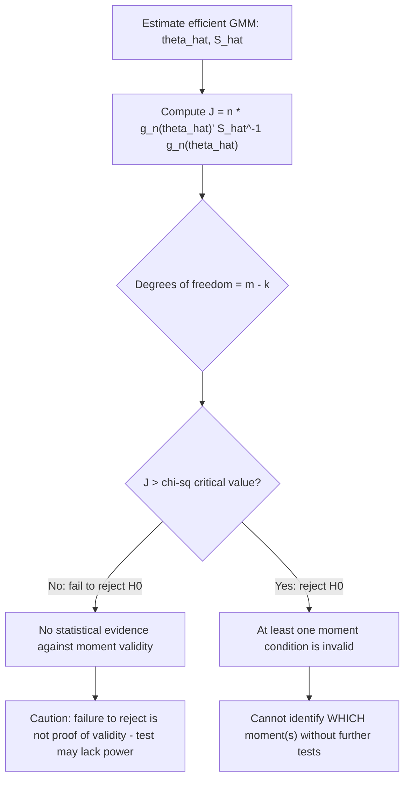

## Overidentifying Restrictions Testing

### Conceptual Basis

When a GMM model is overidentified ($m > k$: more moment conditions than parameters), no parameter value $\theta$ can generally set all $m$ sample moments exactly to zero simultaneously. The GMM objective function evaluated at the estimated parameter, $Q_n(\hat\theta) = g_n(\hat\theta)'W_n g_n(\hat\theta)$, is therefore generally strictly positive rather than exactly zero. If the model is correctly specified and all moment conditions are valid, this residual objective value should be small — attributable only to sampling variation. If some moment conditions are invalid (e.g., an instrument is actually correlated with the structural error), the residual value tends to be systematically large. This logic underlies the **test of overidentifying restrictions**, most commonly implemented as **Hansen's J-test** (Hansen, 1982), generalizing Sargan's (1958) test from single-equation IV to the full GMM framework.

### The J-Statistic

Using the efficient weighting matrix $W_n = \hat S^{-1}$, define the **J-statistic**:

$$J = n \cdot Q_n(\hat\theta_{GMM}) = n \cdot g_n(\hat\theta_{GMM})' \, \hat S^{-1} \, g_n(\hat\theta_{GMM})$$

Under the null hypothesis that **all** moment conditions are correctly specified (i.e., $E[g(w_i,\theta_0)]=0$ holds for the true $\theta_0$), Hansen (1982) shows:

$$J \xrightarrow{d} \chi^2_{m-k}$$

The degrees of freedom, $m-k$, equal the number of **overidentifying restrictions** — the excess of moment conditions over parameters. This is intuitive: $k$ degrees of freedom are "used up" fitting the $k$ parameters exactly (in expectation), leaving $m-k$ independent directions in which the sample moments can deviate from zero purely due to misspecification rather than estimation.

**Key Points**

- The J-test requires the **efficient** weighting matrix ($W_n = \hat S^{-1}$); using an arbitrary or suboptimal $W_n$ invalidates the stated asymptotic $\chi^2$ distribution.
- If $m = k$ (exactly identified), $J \equiv 0$ by construction — there are no overidentifying restrictions to test, and the test is uninformative/undefined (0 degrees of freedom).
- A large, statistically significant $J$-statistic leads to **rejection of the joint null** that all moment conditions are valid — but the test cannot identify *which* specific moment condition(s) are at fault.

### Hypothesis and Decision Rule

$$H_0: E[g(w_i,\theta_0)] = 0 \text{ (all moment conditions valid)}$$


$$H_1: E[g(w_i,\theta_0)] \neq 0 \text{ for at least one moment condition}$$

Reject $H_0$ at significance level $\alpha$ if $J > \chi^2_{m-k,1-\alpha}$ (the $(1-\alpha)$ critical value of the chi-squared distribution with $m-k$ degrees of freedom). Equivalently, compute the $p$-value $P(\chi^2_{m-k} > J)$ and reject if $p < \alpha$.



### Interpretation and Limitations

**Key Points**

- **Rejection does not localize the problem**: A significant J-statistic indicates *some* moment condition is misspecified, but not which one. Applied researchers commonly use subset tests — re-estimating with different instrument subsets (a "C-statistic" or difference-in-J approach, see below) — to isolate suspect instruments.
- **Failure to reject is weak evidence of validity, not proof**: The J-test has power only against certain forms of misspecification. It cannot detect invalidity that happens to leave sample moments close to zero by coincidence, nor can it validate assumptions untestable by construction (e.g., an *exactly identified* subset of instruments is never subjected to any test — if there are no "extra" instruments beyond the minimum needed, the exclusion restriction for those instruments is maintained by assumption alone, never tested).
- **Power depends on sample size and effect size of invalidity**: In small samples, or when instrument invalidity is "mild" (moment violation is small relative to sampling noise), the test can fail to reject even when a moment condition is technically false — this is analogous to any hypothesis test's power limitations.
- **All-or-nothing joint test**: If a model has, say, four overidentifying restrictions and only one instrument is invalid, the joint J-test may or may not reject depending on how the single bad moment's contribution compares to sampling noise across all four dimensions combined; a "diluted" violation in a large moment set can escape detection.

### The C-Statistic (Difference-in-Sargan/GMM Distance Test)

To test the validity of a **subset** of instruments/moments (rather than the joint set), the **C-statistic** (also called the GMM distance statistic, or difference-in-Hansen test) compares the J-statistic from the full model to the J-statistic from a restricted model that excludes the suspect subset:

$$C = J_{full} - J_{restricted}$$

where $J_{restricted}$ is computed by treating the suspect instruments as excluded (using only the maintained, presumed-valid subset). Under the null that the suspect subset is also valid:

$$C \xrightarrow{d} \chi^2_{q}$$

where $q$ is the number of moment conditions being tested for exclusion. This procedure requires that the *maintained* (non-tested) subset be sufficient to identify $\theta$ on its own (i.e., the restricted model must itself be at least exactly identified) and that both $J$ statistics be computed using the **same** weighting matrix construction for consistency. This is the standard applied approach when a researcher has a "core" set of instruments they are confident in and wants to test whether additional, more debatable instruments can be validly added.

**Example**

Suppose a wage regression uses three instruments for education: distance-to-college, local unemployment rate at age 17, and parental education. A researcher trusts distance-to-college and parental education as valid on institutional grounds but is uncertain about local unemployment rate (which could directly affect wages through labor market conditions, violating exclusion).

- Estimate the **full model** (all three instruments): $J_{full}$ with $m-k = 2$ overidentifying restrictions (3 instruments, 1 endogenous regressor).
- Estimate the **restricted model** (only distance and parental education): $J_{restricted}$ with $m-k=1$.
- Compute $C = J_{full} - J_{restricted} \sim \chi^2_1$ under the null that local unemployment rate is a valid additional instrument.

A significant $C$-statistic suggests local unemployment rate should be excluded from the instrument set.

### Relationship to the Sargan Test

The **Sargan test** (Sargan, 1958) is the historical precursor to Hansen's J-test, developed specifically for the **linear IV/2SLS** context under the **homoskedasticity** assumption. The Sargan statistic:

$$Sargan = n \cdot \frac{\hat u' Z(Z'Z)^{-1}Z'\hat u}{\hat\sigma^2}$$

where $\hat u$ are 2SLS residuals and $\hat\sigma^2 = \hat u'\hat u/n$, is numerically and asymptotically equivalent to the GMM J-statistic **only when errors are conditionally homoskedastic** and 2SLS weighting ($W_n = (Z'Z)^{-1}$) coincides with the efficient GMM weighting matrix. Under heteroskedasticity, the Sargan test is invalid (its reference $\chi^2$ distribution no longer applies), and the heteroskedasticity-robust Hansen J-test must be used instead. In modern applied practice, "Sargan test" and "Hansen J-test" are sometimes used loosely interchangeably, but this equivalence should not be assumed without verifying the homoskedasticity condition.

| Test | Weighting matrix | Valid under heteroskedasticity? | Context |
| --- | --- | --- | --- |
| Sargan | $(Z'Z)^{-1}$ (2SLS-implied) | No | Linear IV, homoskedastic errors |
| Hansen J | $\hat S^{-1}$ (efficient) | Yes | General GMM, any moment structure |
| C-statistic (difference-in-Hansen) | Efficient, computed twice | Yes | Testing instrument subsets |

### Small-Sample and Many-Instrument Concerns

**Key Points**

- **Overrejection with many instruments**: With a large number of overidentifying restrictions relative to sample size, the J-test is known to over-reject the null (reject valid models too often) because $\hat S$ becomes imprecisely estimated with many moments, distorting the finite-sample distribution away from the asymptotic $\chi^2_{m-k}$ reference. [Inference] This is a well-documented concern in the "many instruments" GMM literature and motivates caution when $m$ is large relative to $n$.
- **Bootstrap-based J-tests**: To address finite-sample distortions, researchers sometimes bootstrap the J-statistic's null distribution rather than relying on the asymptotic $\chi^2$ approximation, particularly in small samples or with many moments.
- **CU-GMM alternative**: Because the continuous updating estimator re-optimizes $\hat S(\theta)$ jointly with $\theta$, its associated J-statistic can exhibit different (sometimes improved) finite-sample size properties relative to the two-step J-test, though at higher computational cost.

### Worked Numerical Example

**Example**

Suppose a model has $k=2$ parameters and $m=5$ moment conditions (3 overidentifying restrictions). Efficient two-step GMM estimation yields $Q_n(\hat\theta) = 0.0184$ with $n = 500$ observations.

$$J = n \cdot Q_n(\hat\theta) = 500 \times 0.0184 = 9.2$$

Degrees of freedom: $m - k = 5 - 2 = 3$. The $\chi^2_3$ critical value at $\alpha=0.05$ is approximately 7.81; since $J = 9.2 > 7.81$, the null of joint moment validity is rejected at the 5% level ($p \approx 0.027$).

**Output**

This result signals that at least one of the five moment conditions is likely misspecified, prompting the researcher to conduct C-statistic subset tests to identify which instrument(s) are the likely source before proceeding with substantive interpretation of $\hat\theta$.

### Software Implementation

**Example**

In Stata:

```stata
ivregress gmm Y X (Endog = Z1 Z2 Z3), wmatrix(robust)
estat overid   
* Reports Hansen's J-statistic, df, and p-value
```

In R, using `gmm`:

```r
library(gmm)
res <- gmm(g, x = data, t0 = start_values, vcov = "HAC")
specTest(res)  
# Returns J-statistic, df = m - k, and p-value
```

[Unverified] Exact function/command names for subset (C-statistic/difference-in-Hansen) tests vary by software package and version; consult current documentation (e.g., Stata's `ivreg2` with the `orthog()` option, or manual computation via nested `gmm` calls) before implementation.

### Common Pitfalls

**Key Points**

- Applying the J-test when the model is exactly identified ($m=k$) — the test is mechanically uninformative (zero degrees of freedom) and should not be reported as a specification check in this case.
- Using the classical Sargan test formula under heteroskedastic errors, producing an invalid test statistic and unreliable p-values — the heteroskedasticity-robust Hansen J-test should be used instead whenever homoskedasticity is not confidently assumed.
- Interpreting a **failure to reject** as strong confirmation that all instruments are valid — the test's power against subtle or well-hidden violations can be limited, especially in small samples.
- Treating a J-test rejection as automatically indicating a specific, identifiable instrument is invalid — the joint test requires supplementary C-statistic or theory-based reasoning to localize the violation.
- Ignoring many-instrument overrejection distortions when the researcher has included a large number of moment conditions relative to sample size, potentially leading to false rejections of a correctly specified model.

### Related Topics

- GMM estimator derivation and the role of the objective function $Q_n(\theta)$
- Efficient GMM and optimal weighting matrices (prerequisite for a valid J-test)
- Moment conditions and identification (order/rank conditions determine $m-k$)
- Weak identification-robust inference (Anderson-Rubin, Stock-Wright S-statistic)
- Many-instrument asymptotics and regularized/shrinkage GMM estimators
- Specification testing in structural econometric models more broadly (Hausman tests, RESET)