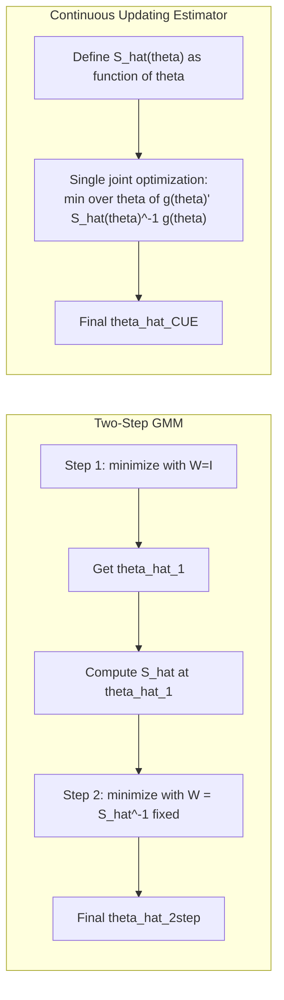

## The Continuous Updating Estimator

### Overview

The continuous updating estimator (CUE), introduced by Hansen, Heaton, and Yaron (1996), is a variant of GMM in which the weighting matrix is not fixed in a separate first step but is allowed to vary as a function of the parameter vector *within* the same objective function being minimized. This removes the two-step (or iterated) asymmetry of conventional GMM and yields an estimator with improved finite-sample properties in several respects, particularly bias reduction, at the cost of a more difficult numerical optimization problem.

### Standard GMM Recap

Given moment conditions $E[g(w_i, \theta_0)] = 0$ for a $q$-dimensional vector of moments and $k$-dimensional parameter $\theta$ ($q \geq k$), the two-step efficient GMM estimator minimizes:

$$Q_T(\theta) = \bar{g}(\theta)' \hat{W} \bar{g}(\theta)$$

where $\bar{g}(\theta) = \frac{1}{T}\sum_i g(w_i, \theta)$ and $\hat{W}$ is a weighting matrix — typically the inverse of a consistent estimate of the long-run variance $S = \text{Var}(\sqrt{T}\bar{g}(\theta_0))$, computed by:

1. First-step: minimize with $\hat{W} = I$ (or another arbitrary positive-definite matrix) to get a consistent but inefficient $\hat{\theta}^{(1)}$.
2. Compute $\hat{S}(\hat{\theta}^{(1)})$, invert it to form $\hat{W}^{(2)} = \hat{S}(\hat{\theta}^{(1)})^{-1}$.
3. Second-step: minimize $Q_T(\theta) = \bar{g}(\theta)'\hat{W}^{(2)}\bar{g}(\theta)$.

This can be iterated further (**iterated GMM**), re-estimating $\hat{S}$ at each new $\hat{\theta}$ until convergence, but the weighting matrix is still held fixed *within* each minimization step.

### The CUE Objective Function

The CUE instead defines the weighting matrix as an explicit function of $\theta$ **inside** the objective:

$$Q_T^{CUE}(\theta) = \bar{g}(\theta)' \, \hat{S}(\theta)^{-1} \, \bar{g}(\theta)$$

$$\hat{\theta}_{CUE} = \arg\min_\theta \; \bar{g}(\theta)' \hat{S}(\theta)^{-1} \bar{g}(\theta)$$

where $\hat{S}(\theta)$ is typically:

$$\hat{S}(\theta) = \frac{1}{T}\sum_{i=1}^T g(w_i,\theta) g(w_i,\theta)'$$

(for i.i.d. data; a HAC/Newey-West form is used under serial dependence). Because $\hat{S}(\theta)$ is re-evaluated at every candidate $\theta$ during optimization — not just at a preliminary estimate — the weighting matrix is "continuously updated" as the optimizer searches the parameter space.

### Key Points

- CUE, two-step GMM, and iterated GMM are all **first-order asymptotically equivalent**: they share the same asymptotic variance $(\Gamma' S^{-1} \Gamma)^{-1}$, where $\Gamma = E[\partial g/\partial \theta']$.
- They differ in **higher-order (finite-sample) properties**. CUE is generally found to have smaller asymptotic bias to higher order than two-step GMM, particularly in instrumental-variables settings with many or weak instruments.
- CUE is **numerically invariant to the choice of normalization** of the moment conditions (e.g., rescaling instruments), a property two-step GMM does not share exactly, since two-step GMM's first-stage weighting choice can affect the final estimate in finite samples.
- CUE is **algebraically identical to the Continuously Updated GMM estimator used to derive the GMM-based analog of the Likelihood Ratio statistic** (the LM and criterion-based tests built on CUE inherit convenient asymptotic chi-squared distributions).

### Relationship to Empirical Likelihood and GEL

CUE belongs to a broader class called **Generalized Empirical Likelihood (GEL)** estimators, which nests:

- Empirical Likelihood (EL)
- Exponential Tilting (ET)
- Continuous Updating Estimator (CUE)

All GEL estimators solve a saddle-point problem of the form:

$$\hat{\theta} = \arg\min_\theta \max_\lambda \; \frac{1}{T}\sum_i \rho(\lambda' g(w_i,\theta))$$

for some concave function $\rho(\cdot)$ specific to each member (CUE corresponds to a particular quadratic choice of $\rho$). This connects CUE to the information-theoretic literature and explains its favorable higher-order bias properties relative to two-step GMM, which lacks this saddle-point/implicit-weighting structure.

### Estimation Procedure

**Step 1 — Specify moments:** Define $g(w_i, \theta)$, the $q \times 1$ vector of sample moment functions (e.g., for linear IV, $g(w_i,\theta) = z_i(y_i - x_i'\theta)$).

**Step 2 — Construct $\hat{S}(\theta)$ as a function of $\theta$:**

$$\hat{S}(\theta) = \frac{1}{T}\sum_{i=1}^{T} g(w_i,\theta)g(w_i,\theta)'$$

or a HAC-robust version if moments are serially correlated:

$$\hat{S}(\theta) = \hat{\Gamma}_0(\theta) + \sum_{j=1}^{L} k(j,L)\left[\hat{\Gamma}_j(\theta) + \hat{\Gamma}_j(\theta)'\right]$$

**Step 3 — Joint numerical minimization:**

$$\hat{\theta}_{CUE} = \arg\min_\theta \; \bar{g}(\theta)'\hat{S}(\theta)^{-1}\bar{g}(\theta)$$

This is a **nonlinear, non-convex optimization problem in general**, even when the moment conditions are linear in $\theta$ (as in linear IV), because $\hat{S}(\theta)^{-1}$ introduces nonlinearity through $\theta$.

### Example: Linear Instrumental Variables

For the linear model $y_i = x_i'\theta + u_i$ with instruments $z_i$ ($q \geq k$), the moment function is $g(w_i,\theta) = z_i(y_i - x_i'\theta)$. Two-step GMM (efficient GMM/2SLS-type) has a closed-form solution given a fixed $\hat{W}$. CUE, by contrast, requires minimizing:

$$Q_T^{CUE}(\theta) = \left[\frac{1}{T}\sum_i z_i(y_i - x_i'\theta)\right]' \left[\frac{1}{T}\sum_i z_i z_i'(y_i-x_i'\theta)^2\right]^{-1} \left[\frac{1}{T}\sum_i z_i(y_i-x_i'\theta)\right]$$

which is a **ratio of quadratic forms in $\theta$** — generally requiring numerical (grid search or gradient-based) minimization even in this linear-in-variables setting, since $\theta$ enters both the numerator and the denominator (via $\hat{S}(\theta)$).

**[Inference]** In just-identified models ($q = k$), CUE, two-step GMM, and the corresponding IV/GMM estimator all coincide, since the moment conditions can be set exactly to zero regardless of weighting.

### Comparison Table: GMM Variants

| Property | One-Step GMM | Two-Step GMM | Iterated GMM | CUE |
| --- | --- | --- | --- | --- |
| Weighting matrix | Arbitrary (e.g., $I$) | Fixed at $\hat{S}(\hat\theta^{(1)})^{-1}$ | Fixed per iteration, updated across iterations | Function of $\theta$, updated within optimization |
| Asymptotic efficiency | No (unless $W=S^{-1}$) | Yes | Yes | Yes |
| Higher-order bias | N/A (inefficient) | Present, can be substantial with many instruments | Smaller than two-step, not eliminated | Generally smallest among these |
| Invariance to instrument scaling | No | No (approximately, in finite samples) | Approximately | Yes |
| Computational cost | Low | Low-moderate | Moderate | High (nested optimization) |
| Numerical stability | High | High | Moderate | Can be poor; weak identification causes flat/multimodal objective |

### Numerical and Practical Issues

**Key Points**

- The CUE objective surface can be **flat or multimodal**, especially under weak identification, making gradient-based optimizers sensitive to starting values; multiple starting points or grid search are standard recommendations.
- $\hat{S}(\theta)^{-1}$ can become **ill-conditioned** near parameter values where moments are highly collinear, and near-singularity of $\hat S(\theta)$ can cause the objective to blow up or exhibit spurious minima far from $\theta_0$.
- With **many instruments** (large $q$ relative to $T$), CUE (and other GEL estimators) tend to be more robust to bias than two-step GMM, which is a primary practical motivation for using CUE in dynamic panel and IV settings with many moment conditions.
- Software implementations: Stata's `gmm` command supports the `onestep`, `twostep`, and CUE weighting options directly; R's `gmm` package (function `gmm(..., type="cue")`) and Python's `linearmodels` package provide CUE estimation.

### Asymptotic Distribution

Under standard regularity conditions (moment existence, identification, smoothness), CUE is asymptotically normal:

$$\sqrt{T}(\hat{\theta}_{CUE} - \theta_0) \xrightarrow{d} N\left(0,\; (\Gamma_0' S_0^{-1} \Gamma_0)^{-1}\right)$$

identical in form to the asymptotic variance of efficient two-step GMM, where $\Gamma_0 = E[\partial g(w,\theta_0)/\partial \theta']$ and $S_0 = \text{Var}(g(w,\theta_0))$ (or the long-run variance under dependence).

### CUE-Based Inference and Testing

Because the CUE objective at its minimum is asymptotically chi-squared distributed under correct specification:

$$T \cdot Q_T^{CUE}(\hat\theta_{CUE}) \xrightarrow{d} \chi^2_{q-k}$$

this provides a **J-test for overidentifying restrictions**, structurally analogous to the Hansen J-test under two-step GMM, but computed at the CUE minimum. CUE-based J-statistics and LM-type statistics derived from the GEL framework are often preferred in the weak-instrument literature because they retain better size properties than their two-step GMM analogs.

### Diagram: Two-Step GMM vs. CUE Estimation Flow

### Limitations

- Substantially higher computational burden than two-step GMM due to nested re-evaluation of $\hat{S}(\theta)$ at every trial parameter value during optimization.
- Optimization can fail to converge or converge to local minima under weak identification or high-dimensional $\theta$; robustness checks (multiple starting values) are essential in applied work.
- **[Inference]** Some Monte Carlo evidence suggests CUE's variance can be larger in very small samples despite lower bias, implying a bias-variance tradeoff relative to two-step GMM that is context-dependent rather than universal.
- Requires the same underlying identification and moment-validity assumptions as any GMM estimator; CUE does not relax the requirement that $E[g(w,\theta_0)]=0$ hold at the true parameter.

**Related Topics**

- Two-step and iterated GMM estimation
- Generalized Empirical Likelihood (GEL) and Empirical Likelihood estimators
- Hansen's J-test for overidentifying restrictions
- Weak identification and many-instrument bias in GMM
- HAC (Newey-West) variance estimation for moment conditions
- GMM-based inference: Wald, LM, and distance-metric tests