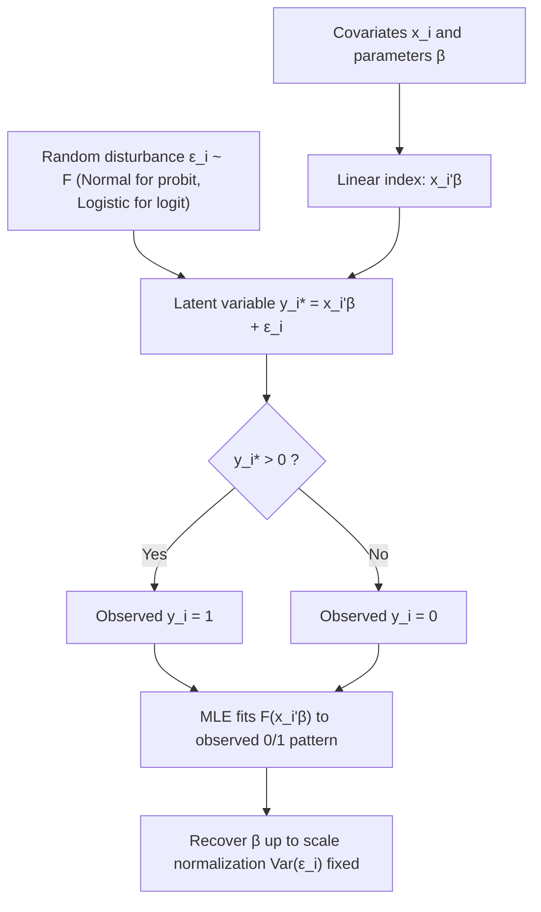

## Latent Variable Framework for Binary Choice

### Overview

The latent variable framework provides the theoretical foundation for binary choice models (probit, logit) by reconceptualizing a discrete observed outcome as the manifestation of an unobserved (latent) continuous process crossing a threshold. This framework unifies logit, probit, and their extensions under a single generative structure, clarifies identification restrictions, and explains why coefficients are only identified up to scale.

### The Basic Latent Variable Model

**Setup**

Suppose there exists an unobserved continuous variable $y_i^*$ (the "latent index" or "latent propensity") that is linearly related to observed covariates:

$$y_i^* = x_i'\beta + \varepsilon_i$$

The observed binary outcome $y_i \in \{0, 1\}$ is generated by a threshold-crossing rule:

$$y_i = \begin{cases} 1 & \text{if } y_i^* > 0 \\ 0 & \text{if } y_i^* \leq 0 \end{cases}$$

**Economic interpretation**: $y_i^*$ often represents an underlying economic quantity — net utility from choosing an alternative, willingness to pay minus price, propensity to default, latent health status — that is not directly measurable, while $y_i$ records only whether the threshold was crossed (e.g., whether a consumer purchased, a borrower defaulted, a patient tested positive).

### Deriving Choice Probabilities

Given the threshold rule:

$$P(y_i = 1 \mid x_i) = P(y_i^* > 0 \mid x_i) = P(x_i'\beta + \varepsilon_i > 0) = P(\varepsilon_i > -x_i'\beta)$$

If $\varepsilon_i$ has a distribution function $F$ that is symmetric around zero, $P(\varepsilon_i > -x_i'\beta) = P(\varepsilon_i < x_i'\beta) = F(x_i'\beta)$, giving:

$$P(y_i = 1 \mid x_i) = F(x_i'\beta)$$

This is the general single-index binary choice model. The specific model (probit vs. logit) is determined entirely by the assumed distribution of $\varepsilon_i$:

| Model | Distribution of $\varepsilon_i$ | $F(x_i'\beta)$ |
| --- | --- | --- |
| **Probit** | $\varepsilon_i \sim N(0,1)$ | $\Phi(x_i'\beta)$ |
| **Logit** | $\varepsilon_i \sim$ Standard Logistic | $\dfrac{\exp(x_i'\beta)}{1+\exp(x_i'\beta)} = \Lambda(x_i'\beta)$ |
| **Linear Probability Model** | (no distributional restriction; $F$ = identity) | $x_i'\beta$ directly (can violate $[0,1]$ bounds) |

**[Inference]** The logistic distribution is often chosen for computational convenience (its CDF has a closed form, unlike the normal CDF, which requires numerical integration or approximation) and because it closely approximates the normal distribution over its central range — the two models typically produce very similar fitted probabilities despite the different tail behavior, though this similarity is an empirical regularity across many applied datasets, not a mathematical identity.

### The Scale Normalization Problem

**Key identification issue**: Both $\beta$ and $\sigma$ (the scale of $\varepsilon_i$) cannot be separately identified from binary outcome data alone. If we rescale $y_i^* = x_i'\beta + \varepsilon_i$ by any positive constant $c$:

$$c \cdot y_i^* = x_i'(c\beta) + c\varepsilon_i$$

the threshold-crossing event $\{y_i^* > 0\}$ is **identical** to $\{c \cdot y_i^* > 0\}$ for any $c > 0$. The observed binary outcome cannot distinguish between $(\beta, \sigma)$ and $(c\beta, c\sigma)$ for any $c > 0$.

**Resolution**: Normalize $\text{Var}(\varepsilon_i) = 1$ for probit, or set the logistic scale parameter such that $\text{Var}(\varepsilon_i) = \pi^2/3$ for logit (the standard logistic variance). This is why:

- Probit and logit coefficients are **not directly comparable** in magnitude — they are estimated under different variance normalizations
- A common rule-of-thumb rescaling for comparison: $\beta_{logit} \approx 1.6 \times \beta_{probit}$, reflecting the ratio $\sqrt{\pi^2/3} / 1 \approx 1.814$, though the empirically observed ratio (closer to 1.6–1.7) reflects the logistic and normal CDFs' relative shapes over the empirically relevant range rather than an exact theoretical constant

**[Inference]** This scale-invariance is frequently a source of confusion for those new to discrete choice modeling — the *sign* and *relative* magnitudes of coefficients within one model are meaningful and comparable, but raw magnitudes are not comparable *across* probit and logit specifications, nor do they have a direct "marginal effect" interpretation without further transformation (see Marginal Effects below).

### Location Normalization: The Threshold

Similarly, the threshold value (here set to 0) and the presence/absence of an intercept in $x_i'\beta$ jointly determine the location. If the model has an intercept $\beta_0$, the threshold can be normalized to zero without loss of generality, since:

$$P(y_i^* > \tau) = P(x_i'\beta - \tau > 0)$$

absorbs any nonzero threshold $\tau$ into the intercept term. This is why binary choice models conventionally fix the threshold at zero and estimate the intercept freely.

### Relationship to McFadden's Random Utility Framework

The latent variable model is the binary special case of **Random Utility Maximization (RUM)**. Consider a decision-maker choosing between two alternatives (0 and 1) with utilities:

$$U_{i0} = x_{i0}'\beta + \varepsilon_{i0}, \qquad U_{i1} = x_{i1}'\beta + \varepsilon_{i1}$$

The individual chooses alternative 1 if $U_{i1} > U_{i0}$, i.e.:

$$y_i = \mathbb{1}[U_{i1} - U_{i0} > 0] = \mathbb{1}[(x_{i1}-x_{i0})'\beta + (\varepsilon_{i1}-\varepsilon_{i0}) > 0]$$

Setting $x_i = x_{i1} - x_{i0}$ and $\varepsilon_i = \varepsilon_{i1} - \varepsilon_{i0}$ recovers the single-index latent variable model exactly. This connects binary choice directly to consumer/producer theory: $y_i^*$ is interpreted as the **utility differential** between alternatives, and the model estimates how observed characteristics shift that differential.

**[Inference]** This RUM interpretation is the standard economic microfoundation taught alongside binary choice models, though it is worth noting the latent-variable/threshold-crossing formulation is mathematically sufficient on its own — the utility-differencing story is an economically motivated *interpretation* layered onto the same statistical object, and the model is estimable and useful even without invoking utility maximization explicitly (e.g., in biostatistics, where $y_i^*$ represents latent disease severity rather than utility).

### Estimation: Maximum Likelihood

Since $y_i^*$ is unobserved, direct OLS on the latent equation is infeasible. Estimation instead proceeds via maximum likelihood on the observed binary outcomes. The likelihood contribution of observation $i$ is:

$$L_i(\beta) = F(x_i'\beta)^{y_i} \left[1 - F(x_i'\beta)\right]^{1-y_i}$$

giving the log-likelihood:

$$\ln L(\beta) = \sum_{i=1}^{n} \Big\{ y_i \ln F(x_i'\beta) + (1-y_i)\ln[1-F(x_i'\beta)] \Big\}$$

This is maximized numerically (Newton-Raphson, BFGS) since no closed-form solution exists for either probit or logit. The log-likelihood is globally concave for both standard probit and logit specifications under standard regularity conditions, which ensures reliable numerical convergence to the unique maximum.

### Marginal Effects: Translating Latent-Scale Coefficients

Because $\beta$ operates on the latent index (not directly on the probability), the **marginal effect** of a continuous regressor $x_k$ on the choice probability is:

$$\frac{\partial P(y_i=1\mid x_i)}{\partial x_{ik}} = f(x_i'\beta)\cdot \beta_k$$

where $f = F'$ is the density function ($\phi$ for probit, $\lambda(z) = \Lambda(z)[1-\Lambda(z)]$ for logit). This is why raw coefficients cannot be read as marginal probability effects directly — the multiplicative term $f(x_i'\beta)$ varies with $x_i$, meaning marginal effects are **not constant** across observations (unlike in linear regression).

**Average Marginal Effect (AME)** vs. **Marginal Effect at the Mean (MEM)**:

$$\text{AME}_k = \frac{1}{n}\sum_{i=1}^n f(x_i'\hat\beta)\hat\beta_k \qquad \text{MEM}_k = f(\bar{x}'\hat\beta)\hat\beta_k$$

**[Inference]** AME is generally preferred in applied econometric practice over MEM, since averaging marginal effects over the actual sample distribution avoids evaluating the nonlinear function at a potentially unrepresentative "average" individual (particularly problematic with dummy regressors, where $\bar{x}_k$ is a probability rather than a realized value) — but this is a methodological convention rather than a universally settled matter, and MEM remains common in fields with a strong "representative agent" tradition.

### Diagram: Latent Variable Threshold-Crossing Mechanism (svg_diagram)

<svg xmlns="http://www.w3.org/2000/svg" viewBox="0 0 800 420" font-family="Helvetica, Arial, sans-serif">
<text x="400" y="28" font-size="18" font-weight="bold" text-anchor="middle">Latent Variable Threshold-Crossing (svg_diagram)</text>
<line x1="80" y1="360" x2="750" y2="360" stroke="#333" stroke-width="1.5" />
<text x="760" y="365" font-size="12">y* scale</text>
<line x1="400" y1="80" x2="400" y2="360" stroke="#aa2222" stroke-width="2" stroke-dasharray="6,4" />
<text x="400" y="70" font-size="13" fill="#aa2222" text-anchor="middle">Threshold: y* = 0</text>
<path d="M 90 340 Q 250 340 400 200 Q 550 60 740 55" stroke="#2255aa" stroke-width="2.5" fill="none" />
<text x="150" y="330" font-size="12" fill="#2255aa">Distribution of ε_i</text>
<rect x="90" y="380" width="300" height="30" fill="#fde8e8" stroke="#aa2222" />
<text x="240" y="400" font-size="13" text-anchor="middle">y* ≤ 0 → observed y = 0</text>
<rect x="410" y="380" width="330" height="30" fill="#e8f8ec" stroke="#227744" />
<text x="575" y="400" font-size="13" text-anchor="middle">y* &gt; 0 → observed y = 1</text>

<text x="400" y="120" font-size="13" text-anchor="middle" font-weight="bold">y_i* = x_i'β + ε_i</text>

<text x="400" y="140" font-size="12" text-anchor="middle" font-style="italic">(unobserved continuous index)</text>

<line x1="220" y1="260" x2="220" y2="360" stroke="#666" stroke-width="1" stroke-dasharray="2,2" />
<text x="220" y="255" font-size="11" text-anchor="middle">x_i'β (individual A)</text>
<circle cx="220" cy="360" r="4" fill="#aa2222" />
<line x1="580" y1="150" x2="580" y2="360" stroke="#666" stroke-width="1" stroke-dasharray="2,2" />
<text x="580" y="145" font-size="11" text-anchor="middle">x_i'β (individual B)</text>
<circle cx="580" cy="360" r="4" fill="#227744" />
</svg>

### Mermaid Diagram: Generative Process Flow

### Extensions Rooted in the Same Framework

- **Bivariate probit**: two correlated latent variables $y_{1i}^*, y_{2i}^*$ with jointly normal errors, used for correlated binary outcomes or endogenous binary regressors
- **Ordered probit/logit**: a single latent variable with **multiple** thresholds $\tau_1 < \tau_2 < \ldots$, generating ordinal (not just binary) categories
- **Heteroskedastic probit**: relaxes $\text{Var}(\varepsilon_i) = 1$ to $\text{Var}(\varepsilon_i) = \exp(z_i'\gamma)$, allowing the latent variance to depend on covariates — addresses the fact that standard probit/logit are inconsistent under heteroskedasticity (unlike OLS, which remains consistent, just inefficient)
- **Random coefficients / mixed logit**: allows $\beta$ to vary across individuals, still generated from an underlying latent-utility structure

**[Inference]** The heteroskedasticity sensitivity noted above is a well-established theoretical result (unlike OLS's robustness to heteroskedasticity, probit/logit coefficient *consistency* genuinely breaks down when the error variance is a function of covariates) — this is not merely an efficiency loss and is a standard justification for using heteroskedasticity-robust variants or checking sensitivity in applied binary-choice work.

**Related Topics**

- Full derivation and estimation of ordered probit/logit
- Bivariate and multivariate probit for correlated binary outcomes
- Endogenous binary regressors: control function and two-stage residual inclusion approaches
- Semiparametric and nonparametric binary choice (Klein-Spady, Manski's maximum score estimator) that avoid the parametric $F$ assumption entirely
- Goodness-of-fit measures for binary choice models (McFadden's pseudo-$R^2$, Hosmer-Lemeshow test, ROC/AUC)
- Panel binary choice models (random effects probit, conditional fixed-effects logit) and the incidental parameters problem