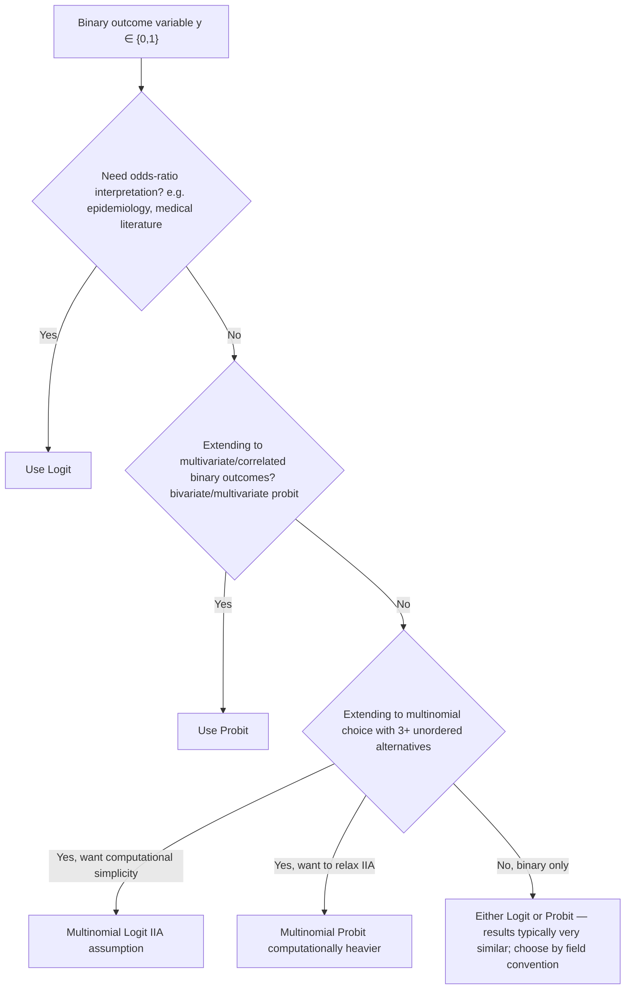

## Logit and Probit Models

### Overview

Logit and probit are the two workhorse parametric models for binary dependent variables in econometrics, both derived from the latent variable / threshold-crossing framework but differing in the assumed distribution of the unobserved error term. This chapter covers model specification, estimation, inference, marginal effects, model fit, and practical comparison between the two.

### Model Specification

Both models share the general single-index form:

$$P(y_i = 1 \mid x_i) = F(x_i'\beta)$$

**Logit**: $\varepsilon_i$ follows a standard logistic distribution, giving

$$P(y_i=1\mid x_i) = \Lambda(x_i'\beta) = \frac{\exp(x_i'\beta)}{1+\exp(x_i'\beta)} = \frac{1}{1+\exp(-x_i'\beta)}$$

**Probit**: $\varepsilon_i \sim N(0,1)$, giving

$$P(y_i=1\mid x_i) = \Phi(x_i'\beta) = \int_{-\infty}^{x_i'\beta} \frac{1}{\sqrt{2\pi}} e^{-t^2/2}\,dt$$

Both $\Lambda(\cdot)$ and $\Phi(\cdot)$ are strictly increasing CDFs mapping $\mathbb{R} \to (0,1)$, ensuring predicted probabilities always lie in the unit interval — the central practical advantage over the linear probability model (OLS on the binary outcome), which can produce fitted values outside $[0,1]$.

### The Odds-Ratio Interpretation (Logit-Specific)

A distinguishing analytical convenience of logit is the closed-form **odds ratio**. Define the odds of $y_i=1$ as:

$$\text{Odds}_i = \frac{P(y_i=1\mid x_i)}{P(y_i=0\mid x_i)} = \frac{\Lambda(x_i'\beta)}{1-\Lambda(x_i'\beta)} = \exp(x_i'\beta)$$

Taking logs gives the **log-odds (logit) linear form**:

$$\ln\left(\frac{P(y_i=1\mid x_i)}{1-P(y_i=1\mid x_i)}\right) = x_i'\beta$$

This is the origin of the model's name: the *logit* (log-odds) transformation is exactly linear in $x_i$. A one-unit increase in $x_k$ multiplies the odds by $\exp(\beta_k)$ (holding other covariates fixed):

$$\frac{\text{Odds}_i(x_k+1)}{\text{Odds}_i(x_k)} = \exp(\beta_k)$$

**No probit analog exists** for this closed-form multiplicative interpretation, since $\Phi^{-1}$ has no algebraic simplification analogous to the logit transform — this is a primary practical reason logit remains preferred in fields (biostatistics, epidemiology) where odds-ratio interpretation is the domain-standard reporting convention.

### Maximum Likelihood Estimation

Both models are estimated by maximizing:

$$\ln L(\beta) = \sum_{i=1}^{n}\Big\{y_i\ln F(x_i'\beta) + (1-y_i)\ln[1-F(x_i'\beta)]\Big\}$$

**First-order conditions** (score equations), obtained by differentiating with respect to $\beta$:

$$\frac{\partial \ln L}{\partial \beta} = \sum_{i=1}^n \frac{f(x_i'\beta)\big[y_i - F(x_i'\beta)\big]}{F(x_i'\beta)[1-F(x_i'\beta)]}\, x_i = 0$$

For **logit** specifically, $f = \Lambda(1-\Lambda)$ simplifies the score equation dramatically:

$$\frac{\partial \ln L}{\partial \beta} = \sum_{i=1}^n \big[y_i - \Lambda(x_i'\beta)\big]x_i = 0$$

This is why logit's score has a clean "residual times regressor" interpretation directly analogous to OLS normal equations, while probit's score retains the more complex $\phi/[\Phi(1-\Phi)]$ ratio (the inverse Mills-ratio-like term), making probit computation marginally more expensive per iteration, though this is not a practically significant difference on modern hardware for typical sample sizes.

**Global concavity**: The log-likelihood function is globally concave in $\beta$ for both standard logit and standard probit, guaranteeing that Newton-Raphson / iteratively reweighted least squares (IRLS) converges to the unique global maximum from typical starting values.

**Asymptotic distribution**: Under standard regularity conditions,

$$\sqrt{n}(\hat\beta - \beta_0) \xrightarrow{d} N\big(0,\, I(\beta_0)^{-1}\big)$$

where $I(\beta_0)$ is the Fisher information matrix, consistently estimated by the negative Hessian or the outer-product-of-gradients (BHHH) estimator evaluated at $\hat\beta$.

### Marginal Effects Comparison

Marginal effects require multiplying the coefficient by the density at the linear index:

$$\frac{\partial P(y_i=1\mid x_i)}{\partial x_{ik}} = f(x_i'\beta)\,\beta_k$$

|  | Logit | Probit |
| --- | --- | --- |
| Density $f(z)$ | $\Lambda(z)[1-\Lambda(z)]$ | $\phi(z) = \frac{1}{\sqrt{2\pi}}e^{-z^2/2}$ |
| Max density value | $0.25$ (at $z=0$) | $\approx 0.399$ (at $z=0$) |
| Marginal effect at $\bar x'\beta \approx 0$ | $\approx 0.25\beta_k$ | $\approx 0.40\beta_k$ |

**[Inference]** Despite the differing coefficient scales, fitted probabilities and average marginal effects from logit and probit are typically very close across the bulk of the covariate distribution in applied cross-sectional work — divergence tends to appear mainly in the tails (extreme predicted probabilities near 0 or 1), where the logistic distribution's heavier tails versus the normal's thinner tails produce meaningfully different extrapolated probabilities. This is an empirical pattern documented across many applied comparisons rather than a proven universal bound.

### Model Comparison Table

| Criterion | Logit | Probit |
| --- | --- | --- |
| Error distribution | Standard logistic | Standard normal |
| Closed-form CDF | Yes | No (requires numerical approximation) |
| Odds-ratio interpretation | Yes, natural | No direct analog |
| Extension to multinomial (IIA-based) | Multinomial logit — computationally simple, closed-form choice probabilities | Multinomial probit — requires multivariate normal integration, no closed form beyond 2–3 alternatives |
| Natural extension to correlated multi-equation systems | Awkward (no natural multivariate logistic with flexible correlation) | Natural (bivariate/multivariate probit via multivariate normal correlation structure) |
| Tail behavior | Heavier tails (slower probability decay near 0/1) | Thinner tails |
| Historical computational cost | Lower (closed-form CDF) | Historically higher; now negligible with modern numerical integration |

**[Inference]** The relative computational-cost distinction is largely a legacy consideration from earlier computing eras; on modern hardware, the difference in estimation time between probit and logit for standard binary choice applications is negligible for typical sample sizes and covariate dimensions.

### Goodness of Fit

Since binary choice models have no direct $R^2$ analog (the outcome is discrete), several pseudo-$R^2$ measures are used:

**McFadden's pseudo-$R^2$**:

$$R^2_{McFadden} = 1 - \frac{\ln L_{full}}{\ln L_{null}}$$

where $\ln L_{null}$ is the log-likelihood of the intercept-only model. **[Inference]** Values of McFadden's pseudo-$R^2$ in the 0.2–0.4 range are often described in applied literature as indicating a good fit — but this rule of thumb should be treated cautiously since McFadden's measure is not scaled the same way as OLS $R^2$ and direct numerical comparison across the two is not meaningful.

**Percent correctly predicted**: Classify $\hat y_i = 1$ if $\hat P(y_i=1) > 0.5$ (or another chosen cutoff), then compare to observed $y_i$. This can be misleading with highly imbalanced outcome data (e.g., rare events), where a naive "always predict the majority class" rule can achieve high percent-correct despite zero discriminative value.

**ROC curve and AUC**: Plots true positive rate against false positive rate across all possible classification thresholds; the Area Under the Curve (AUC) summarizes discriminative power independent of a specific cutoff choice, and is generally preferred over a single percent-correctly-predicted statistic, particularly under class imbalance.

**Likelihood Ratio (LR) test**: For nested models, $LR = -2(\ln L_{restricted} - \ln L_{unrestricted}) \sim \chi^2_{q}$, where $q$ is the number of restrictions — used for testing joint significance of subsets of regressors (analogous to the F-test in OLS).

### Diagram: CDF Comparison (svg_diagram)

<svg xmlns="http://www.w3.org/2000/svg" viewBox="0 0 800 420" font-family="Helvetica, Arial, sans-serif">
<text x="400" y="28" font-size="18" font-weight="bold" text-anchor="middle">Logit vs. Probit CDF Comparison (svg_diagram)</text>
<line x1="70" y1="360" x2="740" y2="360" stroke="#333" stroke-width="1.5" />
<line x1="70" y1="360" x2="70" y2="60" stroke="#333" stroke-width="1.5" />
<text x="750" y="365" font-size="12">x'β</text>
<text x="45" y="65" font-size="12">P(y=1)</text>
<line x1="70" y1="210" x2="740" y2="210" stroke="#ccc" stroke-width="1" stroke-dasharray="3,3" />
<text x="55" y="214" font-size="11">0.5</text>
<line x1="405" y1="360" x2="405" y2="60" stroke="#ccc" stroke-width="1" stroke-dasharray="3,3" />
<text x="400" y="375" font-size="11">0</text>

<path d="M 90 350 C 250 350, 350 220, 405 210 C 460 200, 560 70, 720 65" stroke="`#2255aa`" stroke-width="2.5" fill="none" />

<text x="560" y="100" font-size="12" fill="`#2255aa`">Probit Φ(z) — thinner tails</text>

<path d="M 90 340 C 250 330, 360 230, 405 210 C 450 190, 560 90, 720 75" stroke="`#aa2222`" stroke-width="2.5" fill="none" stroke-dasharray="6,3" />

<text x="500" y="140" font-size="12" fill="`#aa2222`">Logit Λ(z) — heavier tails</text>

<text x="400" y="395" font-size="12" text-anchor="middle" font-style="italic">Both cross P=0.5 at x'β=0; curves diverge most in the tails</text>

</svg>

### Mermaid Diagram: Model Selection Decision Flow

### Practical Estimation Notes

- **Separation problem**: If a covariate (or linear combination of covariates) perfectly or quasi-perfectly predicts the outcome, MLE for both logit and probit fails to converge (coefficients diverge to $\pm\infty$). Standard remedies include Firth's penalized likelihood (bias-reduced logistic regression) or exact logistic regression for small samples.
- **Robust/clustered standard errors**: Both models commonly use sandwich (Huber-White) standard errors and cluster-robust variants when observations are grouped (e.g., repeated individuals, geographic clusters) — the underlying MLE point estimates are unaffected, but reported standard errors and inference change.
- **Software defaults**: R's `glm(family = binomial(link = "logit"))` / `glm(family = binomial(link = "probit"))`; Stata's `logit` / `probit`; Python's `statsmodels.Logit` / `statsmodels.Probit` — all implement standard Newton-Raphson or IRLS optimization by default.

**Related Topics**

- Latent variable derivation underlying both models (threshold-crossing mechanism)
- Marginal effects computation and delta-method standard errors for nonlinear index models
- Multinomial logit, nested logit, and multinomial probit for unordered multi-category choice
- Ordered logit/probit for ordinal outcomes
- Panel data extensions: random-effects probit, conditional fixed-effects logit, and the incidental parameters problem
- Separation and rare-events bias correction (Firth logistic regression, King-Zeng rare events logit)