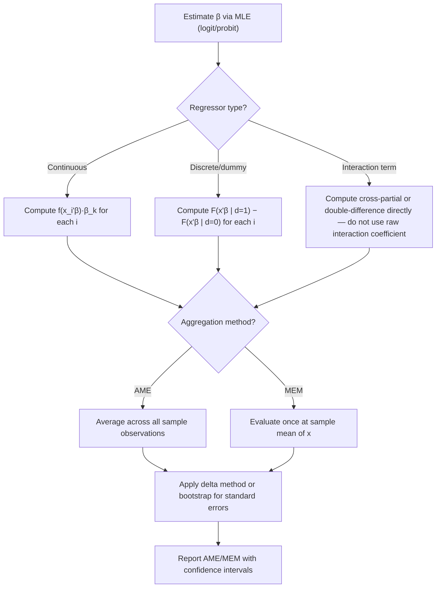

## Marginal Effects and Interpretation

### Overview

Marginal effects translate the latent-index coefficients of nonlinear discrete choice models (logit, probit, and their extensions) into interpretable quantities on the probability scale. Because these models are nonlinear in $x_i$, raw coefficients cannot be read as "the effect of a one-unit change in $x_k$ on the probability of $y=1$" the way OLS coefficients can — this chapter covers the mathematics of computing marginal effects for continuous and discrete regressors, the major aggregation conventions, and the standard-error machinery required for valid inference.

### Why Coefficients Are Not Marginal Effects

In the single-index binary choice model:

$$P(y_i=1\mid x_i) = F(x_i'\beta)$$

the coefficient $\beta_k$ measures the effect of $x_k$ on the **latent index** $x_i'\beta$, not directly on the probability $P(y_i=1\mid x_i)$. Applying the chain rule:

$$\frac{\partial P(y_i=1\mid x_i)}{\partial x_{ik}} = \frac{\partial F(x_i'\beta)}{\partial (x_i'\beta)}\cdot \frac{\partial (x_i'\beta)}{\partial x_{ik}} = f(x_i'\beta)\cdot \beta_k$$

where $f = F'$ is the probability density function corresponding to $F$ (standard normal density $\phi$ for probit; logistic density $\Lambda(1-\Lambda)$ for logit).

**Key implication**: The marginal effect is the product of $\beta_k$ and a scaling factor $f(x_i'\beta)$ that **depends on the covariate values $x_i$ of the specific observation**. This means:

1. Marginal effects are **not constant** across individuals (unlike linear regression, where $\partial y/\partial x_k = \beta_k$ for everyone)
2. The *sign* of $\beta_k$ always matches the sign of the marginal effect (since $f(\cdot) > 0$ everywhere), but the *magnitude* varies
3. Marginal effects are largest when $x_i'\beta \approx 0$ (predicted probability near 0.5) and shrink toward zero as $x_i'\beta \to \pm\infty$ (predicted probability near 0 or 1) — reflecting the S-shape of the CDF flattening in the tails

### Marginal Effects for Continuous Regressors

For a continuous variable $x_k$, the **partial effect** at a given covariate vector $x_i$ is:

$$PE_k(x_i) = f(x_i'\hat\beta)\,\hat\beta_k$$

Since this varies by individual, applied work reports one of two aggregate summaries:

**Marginal Effect at the Mean (MEM)**: Evaluate the partial effect at the sample mean of covariates:

$$MEM_k = f(\bar x'\hat\beta)\,\hat\beta_k$$

**Average Marginal Effect (AME)**: Average the partial effect across all sample observations:

$$AME_k = \frac{1}{n}\sum_{i=1}^n f(x_i'\hat\beta)\,\hat\beta_k$$

**[Inference]** AME is now generally regarded as the preferred default in applied econometric practice, for two main reasons: (1) it does not require evaluating the model at a hypothetical "average individual" who may not resemble any actual observation, and (2) it is well-defined even when some regressors are inherently discrete (e.g., a dummy variable's sample mean is a proportion, not a meaningful covariate value at which to evaluate $f(\cdot)$). This is a methodological convention documented across current textbook treatments and default software behavior (e.g., Stata's `margins, dydx(*)` defaults to AME-style computation), not a universally mandated rule — MEM remains reported in some traditions, particularly where a specific representative-agent interpretation is intended.

### Marginal Effects for Discrete Regressors

For a binary/dummy regressor $d_i \in \{0,1\}$, the derivative-based formula above is **not appropriate**, since $d_i$ does not change continuously. Instead, use the **discrete difference** in predicted probability:

$$ME_d(x_i) = F(x_i'\beta \mid d_i=1) - F(x_i'\beta \mid d_i=0)$$

holding all other covariates in $x_i$ fixed at their observed values, and averaging (or evaluating at means) across the sample as with continuous variables:

$$AME_d = \frac{1}{n}\sum_{i=1}^n \Big[F(x_{i,-d}'\beta + \beta_d) - F(x_{i,-d}'\beta)\Big]$$

**[Inference]** Using the continuous-derivative formula ($f(x_i'\beta)\beta_d$) as an approximation for a dummy variable's effect is a common shortcut in some software defaults and older textbooks, but it can diverge meaningfully from the correct discrete-difference calculation when $\beta_d$ is large — modern best practice (and most current statistical software, when properly specified) computes the discrete difference directly rather than the continuous approximation for factor/dummy variables.

### Interaction Terms: A Well-Known Pitfall

**[Inference]** A widely cited methodological point (originating with Ai and Norton, 2003) is that in nonlinear models like logit/probit, the marginal effect of an *interaction term* $x_1 \cdot x_2$ on the probability is **not** simply the coefficient on the interaction term, and can even have a different sign than that coefficient across different regions of the covariate space. This is because:

$$\frac{\partial^2 P(y=1\mid x)}{\partial x_1 \partial x_2} = \beta_{12} f(x'\beta) + \beta_1\beta_2 f'(x'\beta)$$

The second term (absent in linear models) arises purely from the nonlinearity of $F$, and its sign depends on $f'(x'\beta)$, which changes sign at the inflection point of the CDF. Correct practice is to compute the **cross-partial derivative directly** (or the discrete double-difference for two dummy interactions) at each observation and average, rather than interpreting $\hat\beta_{12}$ as if the model were linear.

### Standard Errors for Marginal Effects: The Delta Method

Since $AME_k$ (or $MEM_k$) is a nonlinear function of the estimated parameter vector $\hat\beta$, its variance cannot be read directly from the variance-covariance matrix of $\hat\beta$. The standard approach is the **delta method**:

$$\text{Var}(\widehat{ME}_k) \approx \left(\frac{\partial ME_k}{\partial\beta}\right)' \text{Var}(\hat\beta) \left(\frac{\partial ME_k}{\partial\beta}\right)$$

where $\partial ME_k/\partial\beta$ is the gradient of the marginal-effect formula with respect to the full parameter vector, evaluated at $\hat\beta$. For the AME specifically, this gradient must additionally account for the fact that $AME_k$ is itself an average over $n$ observation-specific partial effects, each of which depends on the full $\hat\beta$ vector (not just $\hat\beta_k$), since $f(x_i'\hat\beta)$ depends on all covariates.

**Bootstrap alternative**: Resampling the data (with replacement), re-estimating $\hat\beta^{(b)}$ and recomputing $AME_k^{(b)}$ for each bootstrap replicate $b = 1,\ldots,B$, then using the empirical distribution of $\{AME_k^{(b)}\}$ for standard errors or confidence intervals. **[Inference]** The bootstrap is generally more computationally expensive but can be more robust in finite samples or with complex marginal-effect functionals (e.g., interaction or nonlinear transformation terms) where the delta-method gradient is cumbersome to derive analytically; the two methods typically converge in large samples under standard regularity conditions.

### Elasticities and Semi-Elasticities

For applications where percentage-change interpretation is more natural than level-change (e.g., price effects, income effects), marginal effects can be converted:

**Elasticity** (percentage change in $P$ for a percentage change in $x_k$):

$$\eta_k = \frac{\partial P}{\partial x_k}\cdot\frac{x_k}{P} = f(x'\beta)\beta_k \cdot \frac{x_k}{F(x'\beta)}$$

**Semi-elasticity** (percentage change in $P$ for a unit change in $x_k$, or vice versa depending on convention):

$$\text{Semi-elasticity} = f(x'\beta)\beta_k \cdot \frac{1}{F(x'\beta)} \quad \text{(unit change} \to \text{\% change in } P\text{)}$$

These are especially common in labor economics and demand estimation contexts, where log-linear elasticity interpretation aligns with theoretical constructs (e.g., labor supply elasticities, demand elasticities).

### Worked Numerical Example

Consider a probit model of loan default: $P(\text{default}_i = 1) = \Phi(\beta_0 + \beta_1 \cdot \text{income}_i + \beta_2 \cdot \text{debt\_ratio}_i)$, with estimated $\hat\beta_1 = -0.05$ (income in $000s) and $\hat\beta_2 = 1.2$ (debt-to-income ratio).

Suppose for a given individual $x_i'\hat\beta = 0.3$, so $\phi(0.3) \approx 0.3814$.

- Marginal effect of income: $\phi(0.3)\times(-0.05) \approx -0.0191$ → a $1,000 increase in income is associated with roughly a 1.91 percentage-point **decrease** in default probability for this individual
- Marginal effect of debt ratio: $\phi(0.3)\times 1.2 \approx 0.4577$ → a one-unit increase in debt-to-income ratio is associated with roughly a 45.8 percentage-point **increase** in default probability at this point

**[Inference]** Note this marginal effect is evaluated at one specific $x_i'\hat\beta$; for an individual further in the tail (e.g., $x_i'\hat\beta = 2.5$, $\phi(2.5)\approx 0.0175$), the same coefficients would imply a much smaller marginal effect (income: $\approx -0.0009$), illustrating the covariate-dependence discussed above — this is a mechanical consequence of the model's functional form, not a claim about the specific application's true underlying economics.

### Diagram: Marginal Effect Varies with the Index (svg_diagram)

<svg xmlns="http://www.w3.org/2000/svg" viewBox="0 0 800 420" font-family="Helvetica, Arial, sans-serif">
<text x="400" y="28" font-size="18" font-weight="bold" text-anchor="middle">Marginal Effect = Slope of F(x'β) (svg_diagram)</text>
<line x1="70" y1="360" x2="740" y2="360" stroke="#333" stroke-width="1.5" />
<line x1="70" y1="360" x2="70" y2="60" stroke="#333" stroke-width="1.5" />
<text x="750" y="365" font-size="12">x'β</text>
<text x="30" y="65" font-size="12">P(y=1)</text>

<path d="M 90 350 C 250 345, 350 220, 405 210 C 460 200, 560 70, 720 65" stroke="`#2255aa`" stroke-width="2.5" fill="none" />

<line x1="180" y1="345" x2="260" y2="330" stroke="#aa2222" stroke-width="3" />
<text x="140" y="320" font-size="11" fill="#aa2222">Small slope</text>
<text x="140" y="335" font-size="11" fill="#aa2222">(tail region)</text>
<line x1="365" y1="245" x2="445" y2="175" stroke="#227744" stroke-width="3" />
<text x="440" y="200" font-size="11" fill="#227744">Steep slope</text>
<text x="440" y="215" font-size="11" fill="#227744">(near P=0.5)</text>
<line x1="600" y1="80" x2="680" y2="70" stroke="#aa2222" stroke-width="3" />
<text x="590" y="60" font-size="11" fill="#aa2222">Small slope</text>
<text x="590" y="45" font-size="11" fill="#aa2222">(tail region)</text>

<text x="400" y="395" font-size="12" text-anchor="middle" font-style="italic">Marginal effect = f(x'β)·β — largest near P=0.5, vanishes in the tails</text>

</svg>

### Mermaid Diagram: Marginal Effects Computation Workflow

### Practical Software Notes

- **Stata**: `margins, dydx(*)` computes AME by default with delta-method standard errors; `margins, atmeans` computes MEM; `margins, dydx(*) at(...)` allows evaluation at arbitrary covariate profiles
- **R**: `margins` package (mirrors Stata's `margins` syntax); `marginaleffects` package (more actively maintained as of recent versions, supports a broader range of model classes) **[Unverified — confirm current package status and defaults against up-to-date documentation]**
- **Python**: `statsmodels` provides `.get_margeff()` method on fitted `Logit`/`Probit` results objects, supporting both `dydx` (AME-style) and `eyex`/`dyex` (elasticity) options

**Next Steps**

- Ai-Norton correction and general treatment of nonlinear interaction effects in index models
- Marginal effects in ordered and multinomial choice models (effects on *each* category's probability, which must sum to zero across categories)
- Marginal effects in panel/random-effects binary choice models, and complications from integrating out individual heterogeneity
- Counterfactual probability simulation as an alternative to marginal effects for large or discrete policy changes
- Confidence intervals for marginal effects via simulation (Krinsky-Robb method) as an alternative to the delta method