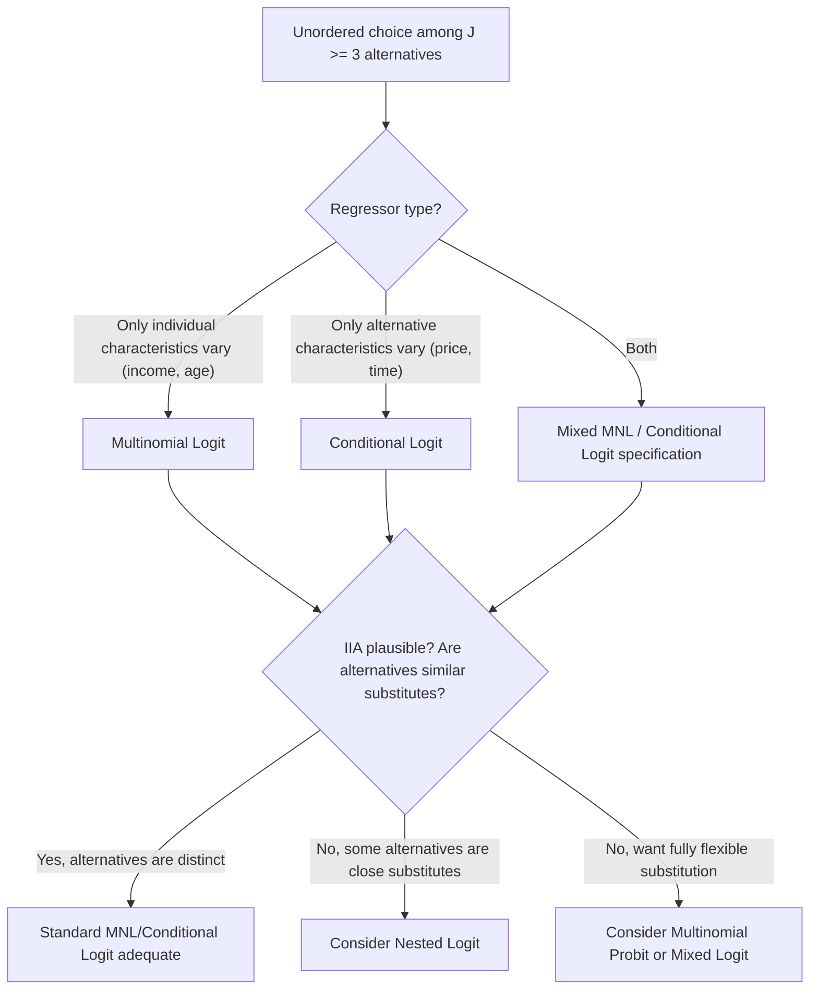

## Multinomial and Conditional Logit Models

### Overview

Multinomial and conditional logit models extend binary logit to settings with three or more unordered discrete alternatives. The two models are often confused because they share the same underlying logistic-form choice probability, but they differ fundamentally in what varies across alternatives: multinomial logit uses individual-specific characteristics with alternative-specific coefficients, while conditional logit uses alternative-specific characteristics with a single coefficient vector common across alternatives. This chapter covers both specifications, their random utility foundations, the IIA assumption, estimation, and model diagnostics.

### Random Utility Foundation

Consider an individual $i$ choosing among $J$ mutually exclusive, exhaustive alternatives $j = 1, \ldots, J$. The individual derives latent utility from each alternative:

$$U_{ij} = V_{ij} + \varepsilon_{ij}$$

where $V_{ij}$ is the deterministic (systematic) utility component and $\varepsilon_{ij}$ is an unobserved random component. The individual chooses alternative $j$ if and only if $U_{ij} > U_{ik}$ for all $k \neq j$.

**McFadden's key result**: If the $\varepsilon_{ij}$ are independently and identically distributed **Type I Extreme Value (Gumbel)** across alternatives, the choice probabilities have the closed-form **multinomial logit (MNL) formula**:

$$P(y_i = j) = \frac{\exp(V_{ij})}{\sum_{k=1}^{J}\exp(V_{ik})}$$

This closed-form result — avoiding the multivariate integration required under joint-normal errors (multinomial probit) — is the primary reason MNL/conditional logit became the dominant applied discrete choice framework following McFadden's (1974) work.

### Multinomial Logit (MNL): Individual-Specific Regressors

In the **multinomial logit** specification, regressors $x_i$ vary across individuals but **not** across alternatives (e.g., individual income, education, age — characteristics that don't change depending on which alternative is being evaluated). To identify the model, one alternative (say $j=0$) is designated the **base/reference category**, and alternative-specific coefficient vectors $\beta_j$ are estimated for all $j \neq 0$:

$$P(y_i = j) = \frac{\exp(x_i'\beta_j)}{1 + \sum_{k=1}^{J-1}\exp(x_i'\beta_k)}, \qquad P(y_i=0) = \frac{1}{1+\sum_{k=1}^{J-1}\exp(x_i'\beta_k)}$$

**Normalization requirement**: $\beta_0 \equiv 0$ for the base category is necessary for identification — without fixing one alternative's coefficients to zero, the model is not identified, since adding a constant vector to all $\beta_j$ simultaneously leaves all choice probabilities unchanged (the same over-parameterization issue as in logistic regression's intercept, generalized to the multi-alternative case).

**Interpretation**: $\beta_j$ measures how $x_i$ shifts the (log) odds of choosing alternative $j$ **relative to the base alternative**:

$$\ln\left(\frac{P(y_i=j)}{P(y_i=0)}\right) = x_i'\beta_j$$

This is why MNL coefficients are always interpreted **relative to the reference category** — a positive $\beta_{jk}$ means higher $x_k$ increases the likelihood of choosing $j$ over the base, but says nothing directly about $j$ versus any other non-base alternative without further calculation.

### Conditional Logit: Alternative-Specific Regressors

In the **conditional logit** specification (McFadden, 1974), regressors $z_{ij}$ vary across **alternatives** (and possibly individuals) — e.g., the price, travel time, or quality of each transportation mode, product, or job option available to individual $i$. A **single** coefficient vector $\gamma$ is estimated, common across all alternatives:

$$P(y_i=j) = \frac{\exp(z_{ij}'\gamma)}{\sum_{k=1}^J \exp(z_{ik}'\gamma)}$$

**No base-category normalization of coefficients is needed here** (since there is only one $\gamma$, not alternative-specific $\beta_j$'s), though **alternative-specific constants (ASCs)** are typically included and one must still be normalized to zero (or omitted) for identification, analogous to the intercept restriction in MNL.

**Interpretation**: $\gamma_k$ measures how a change in attribute $z_k$ **for a specific alternative** shifts that alternative's choice probability relative to others — e.g., if $z_{ij}$ includes price, $\gamma_{price} < 0$ implies raising alternative $j$'s price lowers $P(y_i=j)$.

### The Mixed / Hybrid Specification

In practice, most applied "multinomial logit" implementations (e.g., Stata's `asclogit`, R's `mlogit`) allow a **mixed model** combining both regressor types:

$$P(y_i=j) = \frac{\exp(x_i'\beta_j + z_{ij}'\gamma)}{\sum_{k=1}^J \exp(x_i'\beta_k + z_{ik}'\gamma)}$$

This nests both pure MNL ($\gamma = 0$) and pure conditional logit ($\beta_j = 0$ for all $j$) as special cases, and is the specification typically meant by "multinomial logit" in modern applied transportation/marketing/labor economics work, even though the terminology in older textbooks sometimes reserves "multinomial logit" strictly for the individual-characteristics-only case.

### The Independence of Irrelevant Alternatives (IIA) Assumption

**Definition**: The ratio of choice probabilities between any two alternatives $j$ and $k$ depends **only** on the attributes of $j$ and $k$, not on the attributes or even the existence of any other alternative $m$:

$$\frac{P(y_i=j)}{P(y_i=k)} = \frac{\exp(V_{ij})}{\exp(V_{ik})} = \exp(V_{ij} - V_{ik})$$

This ratio is **independent of all other alternatives in the choice set** — a direct mathematical consequence of the i.i.d. Gumbel error assumption underlying the MNL/conditional logit derivation.

**The classic "Red Bus/Blue Bus" problem**: If a new alternative that is a near-perfect substitute for an existing one is added to the choice set (e.g., a blue bus added alongside an existing red bus and car option, where the two buses are functionally identical except color), IIA implies the new alternative draws share proportionally from *all* existing alternatives according to their existing probability shares — but the theoretically correct substitution pattern would draw share disproportionately from the close substitute (the existing bus), not proportionally from the car. This illustrates that IIA is a strong and often **empirically implausible** assumption whenever some alternatives are closer substitutes for each other than others.

**IIA testing**:

- **Hausman-McFadden test**: Compares coefficient estimates from the full choice set against estimates from a restricted choice set (with one or more alternatives removed); under IIA, the coefficients should not change (asymptotically) beyond sampling variation. **[Inference]** This test is widely used in applied practice, but it has documented behavior issues (small-sample instability, and even producing negative test statistics in some finite samples due to the estimated covariance-matrix difference not being guaranteed positive semi-definite), so its results are often treated as suggestive rather than definitive.
- **Small-Hsiao test**: An alternative IIA test, generally considered to have somewhat better finite-sample properties, though **[Unverified — consult current literature]** for its relative performance across specific applied settings.

**Remedies when IIA is violated**: Nested logit (groups similar alternatives into "nests" allowing correlated errors within a nest), multinomial probit (allows a general error correlation structure via joint normality, at the cost of losing the closed-form probability expression), or mixed/random-parameters logit (allows coefficients to vary randomly across individuals, which relaxes IIA at the individual level even while nesting standard logit as an aggregate special case).

### Estimation via Maximum Likelihood

The log-likelihood for $n$ independent choices is:

$$\ln L(\theta) = \sum_{i=1}^n \sum_{j=1}^J d_{ij} \ln P(y_i=j)$$

where $d_{ij} = 1$ if individual $i$ chose alternative $j$, else 0, and $\theta$ collects all $\beta_j$'s and/or $\gamma$. This is maximized numerically; the log-likelihood is globally concave in $\theta$ under the standard MNL/conditional logit specification, again ensuring reliable convergence.

### Marginal Effects in Multinomial Models

Marginal effects are more involved than in binary choice, since a change in $x_k$ affects the probabilities of **all** $J$ alternatives simultaneously, and these effects must sum to zero across alternatives (since probabilities sum to one):

$$\frac{\partial P(y_i=j)}{\partial x_{ik}} = P(y_i=j)\left[\beta_{jk} - \sum_{m=1}^J P(y_i=m)\beta_{mk}\right]$$

**Key implication**: The sign of the marginal effect on $P(y_i=j)$ is **not necessarily the same** as the sign of $\beta_{jk}$, because the marginal effect involves a probability-weighted average of *all* alternatives' coefficients, not just $j$'s. A common source of applied confusion is interpreting $\beta_{jk} > 0$ as implying $x_k$ necessarily raises $P(y_i=j)$ — this holds only in relative-to-base-category odds terms, not necessarily in raw probability terms once all alternatives are accounted for.

### Diagram: MNL vs. Conditional Logit Structure (svg_diagram)

<svg xmlns="http://www.w3.org/2000/svg" viewBox="0 0 850 460" font-family="Helvetica, Arial, sans-serif">
<text x="425" y="28" font-size="18" font-weight="bold" text-anchor="middle">MNL vs. Conditional Logit: What Varies (svg_diagram)</text>
<rect x="40" y="60" width="360" height="180" rx="8" fill="#e8f0fe" stroke="#2255aa" stroke-width="1.5" />
<text x="220" y="85" font-size="14" font-weight="bold" text-anchor="middle">Multinomial Logit</text>
<text x="220" y="108" font-size="12" text-anchor="middle">Regressors x_i: individual-specific</text>
<text x="220" y="126" font-size="12" text-anchor="middle">(income, age, education)</text>
<text x="220" y="150" font-size="12" text-anchor="middle" font-weight="bold">Coefficients β_j vary by alternative</text>
<text x="220" y="175" font-size="11" text-anchor="middle" font-style="italic">P(y=j) = exp(x'β_j) / Σ exp(x'β_k)</text>
<text x="220" y="200" font-size="11" text-anchor="middle">Base category: β₀ ≡ 0</text>
<text x="220" y="222" font-size="11" text-anchor="middle">Interpretation: relative to base alt.</text>
<rect x="450" y="60" width="360" height="180" rx="8" fill="#eee8fa" stroke="#5522aa" stroke-width="1.5" />
<text x="630" y="85" font-size="14" font-weight="bold" text-anchor="middle">Conditional Logit</text>
<text x="630" y="108" font-size="12" text-anchor="middle">Regressors z_ij: alternative-specific</text>
<text x="630" y="126" font-size="12" text-anchor="middle">(price, travel time, quality)</text>
<text x="630" y="150" font-size="12" text-anchor="middle" font-weight="bold">Single coefficient γ, common across j</text>
<text x="630" y="175" font-size="11" text-anchor="middle" font-style="italic">P(y=j) = exp(z_j'γ) / Σ exp(z_k'γ)</text>
<text x="630" y="200" font-size="11" text-anchor="middle">ASC normalization for one alt.</text>
<text x="630" y="222" font-size="11" text-anchor="middle">Interpretation: attribute effect on own alt.</text>
<rect x="220" y="270" width="410" height="80" rx="8" fill="#fdf3d9" stroke="#a67c00" stroke-width="1.5" />
<text x="425" y="295" font-size="13" font-weight="bold" text-anchor="middle">Shared Foundation</text>
<text x="425" y="315" font-size="12" text-anchor="middle">Random Utility Model + i.i.d. Gumbel errors</text>
<text x="425" y="333" font-size="12" text-anchor="middle">⇒ closed-form logistic choice probabilities</text>
<line x1="220" y1="240" x2="330" y2="270" stroke="#333" stroke-width="1.5" />
<line x1="630" y1="240" x2="520" y2="270" stroke="#333" stroke-width="1.5" />
<rect x="150" y="375" width="550" height="65" rx="8" fill="#fde8e8" stroke="#aa2222" stroke-width="1.5" />
<text x="425" y="398" font-size="13" font-weight="bold" text-anchor="middle">Shared Vulnerability: IIA</text>
<text x="425" y="418" font-size="12" text-anchor="middle">Odds ratios independent of other alternatives — fails under close substitutes</text>
</svg>

### Mermaid Diagram: Model Selection for Unordered Multi-Category Choice

### Worked Example: Commute Mode Choice

Suppose individuals choose among {Car, Bus, Train} for commuting. A conditional logit specification might include:

$$V_{ij} = \gamma_1 \cdot \text{cost}_{ij} + \gamma_2 \cdot \text{travel\_time}_{ij} + \delta_j$$

where $\delta_j$ are alternative-specific constants (with $\delta_{Car} \equiv 0$ as the normalized base). If $\hat\gamma_1 = -0.08$ (per dollar) and $\hat\gamma_2 = -0.05$ (per minute), a policy increasing bus fare by $2 changes the bus utility index by $-0.16$, shifting probability mass toward Car and Train according to the logistic formula — with the *proportional* reallocation to Car versus Train dictated entirely by their existing relative probabilities (the IIA property), a pattern that would be problematic if, say, Train were a much closer substitute for Bus than Car is.

**Related Topics**

- Nested logit models and the two-level substitution structure that relaxes IIA within nests
- Multinomial probit: full covariance-structure alternative that avoids IIA but loses closed-form probabilities
- Mixed logit (random parameters logit) and simulation-based estimation (maximum simulated likelihood)
- Ordered logit/probit for ordinal (not unordered) multi-category outcomes
- Discrete choice experiments and stated-preference data design for conditional logit estimation
- Panel/repeated-choice extensions and the conditional (fixed-effects) logit estimator for panel binary/multinomial data