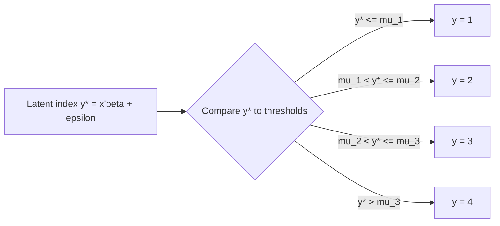

## Ordered Logit and Probit Models

### Overview

Ordered logit and probit models are used when the dependent variable is categorical with a **natural ordering** but no cardinal meaning attached to the gap between categories — e.g., Likert-scale responses (strongly disagree to strongly agree), bond ratings, or self-reported health status (poor, fair, good, excellent). These models extend the binary logit/probit framework to $J > 2$ ordered outcomes via a single latent-variable index and a set of estimated threshold (cutpoint) parameters.

### The Latent Variable Framework

Assume an unobserved continuous latent variable $y^*$ generated by:

$$y_i^* = x_i'\beta + \varepsilon_i$$

The observed ordinal outcome $y_i \in \{1, 2, \dots, J\}$ is determined by where $y_i^*$ falls relative to a set of unknown threshold parameters $\mu_1 < \mu_2 < \dots < \mu_{J-1}$:

$$y_i = \begin{cases}

1 & \text{if } y_i^* \leq \mu_1 \

2 & \text{if } \mu_1 < y_i^* \leq \mu_2 \

\vdots \

J & \text{if } y_i^* > \mu_{J-1}

\end{cases}$$

- **Ordered probit:** $\varepsilon_i \sim N(0,1)$
- **Ordered logit:** $\varepsilon_i \sim \text{Logistic}(0,1)$, with variance $\pi^2/3$

### Probability Structure

The probability of observing category $j$ is the probability that $y^*$ falls in the corresponding interval:

$$P(y_i = j \mid x_i) = F(\mu_j - x_i'\beta) - F(\mu_{j-1} - x_i'\beta)$$

where $F(\cdot)$ is the standard normal CDF $\Phi(\cdot)$ (probit) or the logistic CDF $\Lambda(\cdot) = \frac{e^{(\cdot)}}{1+e^{(\cdot)}}$ (logit), with the conventions $\mu_0 = -\infty$ and $\mu_J = +\infty$.

**Key Points**

- No intercept is separately identified alongside the full set of thresholds $\{\mu_1, \dots, \mu_{J-1}\}$ — either the intercept is dropped from $x_i'\beta$ or one threshold is normalized (implementations typically drop the intercept and freely estimate all $J-1$ thresholds).
- The scale of $\beta$ and the thresholds is identified only relative to the (arbitrarily normalized) variance of $\varepsilon$ — $\text{Var}(\varepsilon)=1$ for probit, $\pi^2/3$ for logit — so raw coefficients are **not comparable in magnitude** across logit and probit specifications, though sign and (with rescaling) approximate marginal effects are comparable.

### The Parallel Regression (Proportional Odds) Assumption

The single-index structure imposes the **parallel regression assumption**: the effect of $x$ on the latent index $y^*$ is the same regardless of which threshold is being crossed. Equivalently, in the ordered logit case, this is the **proportional odds assumption**:

$$\ln\left(\frac{P(y \leq j \mid x)}{P(y > j \mid x)}\right) = \mu_j - x'\beta$$

The odds ratio comparing $P(y\leq j)$ to $P(y>j)$ for a one-unit change in $x_k$ is $\exp(-\beta_k)$ for **every** cutpoint $j$ — hence "proportional." This is a strong, testable, and frequently violated assumption.

### Likelihood Function

For a sample of $i=1,\dots,n$ with observed category $y_i$, define indicator $d_{ij} = 1$ if $y_i = j$. The log-likelihood is:

$$\ln L(\beta,\mu) = \sum_{i=1}^n \sum_{j=1}^J d_{ij} \ln\left[F(\mu_j - x_i'\beta) - F(\mu_{j-1}-x_i'\beta)\right]$$

Estimation is by maximum likelihood; the log-likelihood is globally concave in $(\beta,\mu)$ under standard regularity conditions for both the probit and logit links, so Newton-Raphson/BHHH-type optimizers converge reliably from reasonable starting values.

### Marginal Effects

Unlike binary models, marginal effects in ordered models are **category-specific** and can be non-monotonic in sign across categories. For a continuous regressor $x_k$:

$$\frac{\partial P(y=1\mid x)}{\partial x_k} = -f(\mu_1 - x'\beta)\,\beta_k$$

$$\frac{\partial P(y=j\mid x)}{\partial x_k} = \left[f(\mu_{j-1}-x'\beta) - f(\mu_j - x'\beta)\right]\beta_k, \quad 1<j<J$$

$$\frac{\partial P(y=J\mid x)}{\partial x_k} = f(\mu_{J-1}-x'\beta)\,\beta_k$$

where $f(\cdot)$ is the density ($\phi$ for probit, logistic density for logit).

**Key Points**

- The marginal effect on the **lowest** category always has the **opposite sign** of $\beta_k$, and the marginal effect on the **highest** category always has the **same sign** as $\beta_k$.
- Marginal effects on **intermediate** categories can have either sign and are **not guaranteed to be monotonic** — a positive $\beta_k$ does not imply the probability of every higher category increases; it typically means probability mass shifts from lower to higher categories, with intermediate categories potentially gaining or losing depending on where the thresholds sit relative to $x'\beta$.
- Because of this, reporting only the sign/significance of $\hat\beta_k$ is insufficient for describing effects on any specific category; full marginal effect tables (often evaluated at means or averaged over the sample — "average marginal effects") are standard practice.

### Testing the Parallel Lines Assumption

**Brant test** (most common for ordered logit): decomposes the model into $J-1$ separate binary logits (category $\leq j$ vs. $> j$ for each $j$) and tests whether the $\beta$ coefficients are equal across these binary splits via a Wald-type chi-squared test.

**Alternative diagnostics:**

- Compare the fitted ordered model against a **generalized ordered logit / partial proportional odds model**, which allows $\beta$ to vary by threshold for some or all regressors, and conduct a likelihood-ratio test.
- Score/LM tests for proportional odds, available in some software implementations (e.g., Stata's `omodel`, R's `brant` package).

If the parallel-lines assumption fails, alternatives include the **generalized ordered logit** (Williams 2006, `gologit2` in Stata), **multinomial logit** (discarding ordinal structure), or a **sequential/continuation-ratio logit** model.

### Ordered Logit vs. Ordered Probit: Comparison

| Feature | Ordered Probit | Ordered Logit |
| --- | --- | --- |
| Error distribution | $N(0,1)$ | Logistic(0,1), variance $\pi^2/3$ |
| Link function | $\Phi(\cdot)$ | $\Lambda(\cdot)$ |
| Coefficient interpretation | No closed-form odds ratio | $\exp(\beta)$ interpretable via proportional odds |
| Computational tractability | Requires numerical integration for multivariate extensions | Closed-form CDF, simpler for extensions (e.g., mixed logit analogs) |
| Typical empirical differences | Very similar fitted probabilities to logit after rescaling | Very similar fitted probabilities to probit after rescaling |
| Extension to random effects/panel | Multivariate normal integration (simulation-based) | Less natural extension; probit often preferred for panel/multilevel ordered models |

**[Inference]** In most applied settings the two models produce very similar predicted probabilities and marginal effects once accounting for the scale difference; model choice is frequently driven by convention within a field (economics historically favors probit; other social sciences often use logit) or by the tractability of extensions (e.g., random-effects ordered probit is more standard in panel applications) rather than by strong evidence that one fits systematically better.

### Goodness of Fit

- **Pseudo-$R^2$ measures:** McFadden's $R^2 = 1 - \frac{\ln L_{full}}{\ln L_{null}}$, generalizations analogous to the binary case.
- **Predicted probability tables:** compare predicted category frequencies to observed.
- **Rank correlation measures:** since the outcome is ordinal, measures like Somers' D or the generalized $R^2$ for ordinal data are sometimes reported alongside standard pseudo-$R^2$.

### Example: Self-Reported Health Status

Suppose modeling self-rated health ($y \in \{1=\text{poor}, 2=\text{fair}, 3=\text{good}, 4=\text{excellent}\}$) as a function of income, age, and exercise frequency using ordered probit:

$$y_i^* = \beta_1 \text{income}_i + \beta_2 \text{age}_i + \beta_3 \text{exercise}_i + \varepsilon_i$$

A positive $\hat\beta_3$ implies more exercise shifts the latent health index upward — increasing the probability of reporting "excellent" and decreasing the probability of reporting "poor," with the effect on "fair" and "good" depending on where those individuals' latent indices sit relative to the estimated thresholds $\hat\mu_1,\hat\mu_2,\hat\mu_3$.

**Output** (illustrative interpretation, not fitted values):

- Threshold estimates $\hat\mu_1 < \hat\mu_2 < \hat\mu_3$ partition the latent health scale into the four observed categories.
- Average marginal effect of exercise on $P(y=4)$: positive and significant.
- Average marginal effect of exercise on $P(y=1)$: negative and significant.
- Average marginal effect on $P(y=2)$, $P(y=3)$: sign depends on threshold spacing; requires direct computation rather than inference from $\hat\beta_3$'s sign alone.

### Diagram: Latent Variable and Threshold Mapping

### Extensions

- **Generalized ordered logit / partial proportional odds:** relaxes the parallel-lines assumption for some or all covariates.
- **Random-effects ordered probit/logit:** for panel data, adds an individual-specific random intercept, typically requiring simulated or Gauss-Hermite quadrature-based likelihood evaluation.
- **Heteroskedastic ordered probit:** allows $\text{Var}(\varepsilon_i)$ to depend on covariates, relaxing the implicit homoskedasticity assumption that underlies the standard parallel-lines structure.
- **Sequential (continuation-ratio) models:** an alternative to the standard ordered model when the ordinal process is more naturally thought of as a sequence of binary decisions (e.g., educational attainment as sequential "continue vs. stop" decisions).

### Limitations

- Parallel regression/proportional odds assumption is restrictive and often rejected in practice; failing to test it risks misleading coefficient interpretation.
- Coefficients are not directly comparable across different samples or specifications due to the arbitrary error-variance normalization — comparing $\hat\beta$ magnitudes across models with different covariates is invalid without adjusting for implied residual variance changes.
- Treating an ordinal outcome as cardinal (e.g., applying OLS directly to the category codes) is a common misspecification these models are designed to avoid, but ordered models themselves assume a single underlying continuous latent scale, which may not perfectly reflect the true data-generating process for all ordinal phenomena.

**Related Topics**

- Binary logit and probit models
- Multinomial logit models
- Generalized ordered logit / partial proportional odds models
- Random-effects and panel ordered choice models
- Brant test for proportional odds
- Marginal effects computation in nonlinear index models